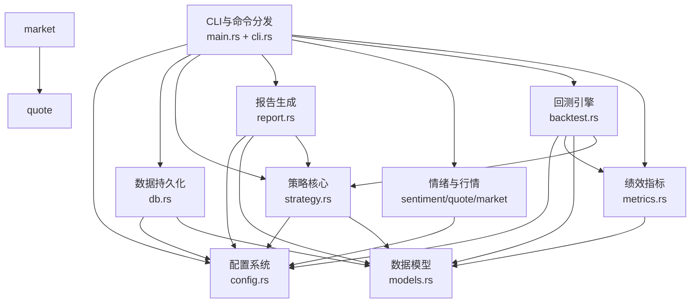

## 领域模块报告

### 识别到的领域模块（完整列表，不得遗漏）

MNS 源码为 `src/` 下 11 个平铺 `.rs` 文件（无子目录）。按 DDD 语义分组为 9 个领域模块，覆盖全部 11 个文件：

| 模块名称 | 路径 | 核心职责 | 类型 | 重要性 | 复杂度 |
|---------|------|---------|------|------|------|
| 策略核心 | `src/strategy.rs` | 目标仓位调仓计划、风险警告、逆向加权分摊 | 核心域 | 10 | 8 |
| 回测引擎 | `src/backtest.rs` | 4 种策略引擎的历史模拟、信号锚点、FIFO 成本 | 核心域 | 8 | 9 |
| 报告生成 | `src/report.rs` | 每日策略报告渲染与落盘 | 核心域 | 8 | 5 |
| 情绪与行情 | `src/sentiment.rs` + `src/quote.rs` + `src/market.rs` | 恐贪指数、资产价格、市场指数获取 | 核心域 | 7 | 5 |
| 数据持久化 | `src/db.rs` | SQLite 存取现金/持仓/交易/价格历史/情绪快照 | 支撑域 | 7 | 5 |
| 绩效指标 | `src/metrics.rs` | XIRR/最大回撤/Sharpe/Sortino/Calmar/bootstrap | 支撑域 | 6 | 4 |
| 配置系统 | `src/config.rs` | 策略参数声明、目标仓位曲线、成本模型、校验 | 支撑域 | 7 | 6 |
| CLI与命令分发 | `src/cli.rs` + `src/main.rs` | clap 定义 + 17 个命令的处理器 | 通用域 | 6 | 5 |
| 数据模型 | `src/models.rs` | Position/Transaction/FearGreedSnapshot 纯数据 | 通用域 | 5 | 2 |

### 领域间关系

### 业务流程（Business Flows）

| 流程名称 | 描述 | 涉及领域 | 入口点 | 重要性 |
|---------|------|---------|-------|-------|
| 每日报告生成 | 拉取恐贪指数→保存快照→计算调仓计划→渲染报告 | 情绪与行情、数据持久化、策略核心、报告生成、配置系统 | `cmd_report`（main.rs:348） | 10 |
| 价格批量更新 | 遍历持仓→按代码类型选数据源→写回价格与历史 | 情绪与行情、数据持久化 | `cmd_update_prices`（main.rs:772） | 8 |
| 交易记录 | 买入/卖出→更新持仓+现金+交易流水（事务） | 数据持久化、数据模型 | `cmd_buy`/`cmd_sell`（main.rs:270/281） | 9 |
| 策略回测 | 嵌入数据→平滑情绪→计算目标权重→逐月模拟→指标 | 回测引擎、绩效指标、策略核心、配置系统 | `cmd_backtest`（main.rs:437） | 8 |
| 样本外验证 | walk-forward 调参 + bootstrap 分布 + holdout | 回测引擎、绩效指标、配置系统 | `cmd_backtest_validate`（main.rs:533） | 7 |
| 初始化 | 创建配置 + 数据库 + 报告目录 | 配置系统、数据持久化 | `cmd_init`（main.rs:69） | 8 |
| 市场概况 | 拉取全球指数 + 恐贪指数展示 | 情绪与行情 | `cmd_market`（main.rs:827） | 5 |

### 各模块详情

#### 策略核心
- **路径**：`src/strategy.rs`
- **职责**：逆向策略的决策大脑。输入（恐贪指数 + 持仓 + 现金）→ 输出调仓计划。核心是"目标仓位 + 偏离带"框架：先算目标权重（情绪→仓位），再比较实际权重，偏离超带宽才动作
- **核心抽象**：`RebalancePlan`、`LegPlan`、`LegItem`、`RiskWarning`、`RiskAdvice`、`BuySuggestion`（旧框架保留）
- **子模块**：
  - 目标仓位框架（strategy.rs:323-599）：`calculate_rebalance_plan`、`split_within_leg`、`is_broad_index`
  - 旧框架（strategy.rs:79-288）：`calculate_buy_suggestions`、`calculate_sell_suggestions`、`distribute_amount_contrarian`（仅供 `Engine::Legacy` 对照回测）
  - 风险警告（strategy.rs:292-321）：`check_risk_warnings`
- **依赖的模块**：配置系统（AppConfig）、数据模型（Position）
- **被依赖的模块**：报告生成、回测引擎、CLI与命令分发
- **重要性评分**：10

#### 回测引擎
- **路径**：`src/backtest.rs`
- **职责**：把策略放到 2016-2025 真实全收益数据上模拟，产出可比较的表现指标。数据通过 `include_str!` 编译期嵌入（backtest.rs:24-29）
- **核心抽象**：`Engine`（TargetWeight/Legacy/BuyHold/BuyHoldRebalanced）、`Anchor`（SentimentOnly/TrendTilt）、`SignalConfig`、`BacktestConfig`、`MonthRow`、`BacktestResult`、`Trade`、`Monthly`
- **子模块**：
  - 数据加载（backtest.rs:37-91）：`parse_dataset`、`load_main`、`load_holdout`
  - FIFO 分批持仓（backtest.rs:95-195）：`Lot`、`Leg`（`sell_fifo` 按批次持有天数计阶梯赎回费）
  - 引擎主循环（backtest.rs:557-683）：`run`、`rebalance_to_weights`、`step_legacy`、`finalize`
  - 信号处理（backtest.rs:258-370）：`smooth_fgi`、`compute_target_risk_weights`
  - 输出（backtest.rs:864-1051）：`print_report`、`print_yearly`、`print_key_trades`、`print_comparison`
- **依赖的模块**：配置系统、绩效指标、数据模型、策略核心
- **被依赖的模块**：CLI与命令分发
- **重要性评分**：8

#### 报告生成
- **路径**：`src/report.rs`
- **职责**：把策略计算结果渲染成面向人的可读报告（终端 + 落盘 `reports/{date}.txt`），含市场情绪、账户概览、持仓明细、调仓计划、净操作指引、风险警告、目标仓位预案、信号口径说明
- **核心抽象**：`generate_report`、`save_report`、`pad_display`（中文宽度对齐）
- **依赖的模块**：配置系统、数据模型、策略核心
- **被依赖的模块**：CLI与命令分发
- **重要性评分**：8

#### 情绪与行情
- **路径**：`src/sentiment.rs` + `src/quote.rs` + `src/market.rs`
- **职责**：系统与外部世界的接口——拉取 CNN 恐贪指数（策略输入信号）、资产价格（东方财富/天天基金/Yahoo）、市场指数
- **核心抽象**：`FearGreedData`、`PriceUpdate`、`StockQuote`、`MarketQuote`、`fetch_fear_greed_data`、`fetch_price`、`update_all_prices`、`fetch_full_quote`、`fetch_market_indices`
- **子模块**：
  - sentiment.rs：CNN API 客户端（重试 3 次、JSON 解析、反爬 418 处理）
  - quote.rs：三类数据源适配 + 代码特征路由（6 位纯数字→天天基金；字母→Yahoo）
  - market.rs：9 个全球指数固定清单 + 指数/个股报价表格
- **依赖的模块**：配置系统（API URL）、数据模型（Position）
- **被依赖的模块**：CLI与命令分发
- **重要性评分**：7

#### 数据持久化
- **路径**：`src/db.rs`
- **职责**：SQLite 存取全部本地状态。5 张表：cash/positions/transactions/price_history/fear_greed_snapshots。schema 由 `init_tables`（db.rs:24）内联管理
- **核心抽象**：`Database`（open/init_tables/get_cash_balance/buy_position/sell_position/update_price/record_price/save_fear_greed_snapshot 等）
- **子模块**：现金、持仓、交易、价格历史、情绪快照五组操作
- **依赖的模块**：配置系统（DB 路径）、数据模型
- **被依赖的模块**：CLI与命令分发
- **重要性评分**：7

#### 绩效指标
- **路径**：`src/metrics.rs`
- **职责**：回测结果的量化口径。核心洞察：分批注资下简单年化失真，必须用 XIRR（现金流加权）
- **核心抽象**：`CashFlow`、`RiskMetrics`、`Rng`、`xirr`、`max_drawdown`、`risk_metrics`、`block_bootstrap`、`percentile`、`stddev`、`downside_dev`
- **依赖的模块**：数据模型（chrono NaiveDate）
- **被依赖的模块**：回测引擎
- **重要性评分**：6

#### 配置系统
- **路径**：`src/config.rs`
- **职责**：全部策略参数的单一事实来源。含旧框架参数（buy_ratio/sell_ratio/settings）与新框架参数（target_weight/rebalance/costs），带合法性校验（`validate`，config.rs:255）与 dot-path 读写（`get_value`/`set_value`）
- **核心抽象**：`AppConfig`、`TargetWeight`、`Rebalance`、`Costs`、`Settings`、`Allocation`、`Thresholds`、`BuyRatio`、`SellRatio`、`ApiConfig`
- **依赖的模块**：无（纯数据 + 校验逻辑）
- **被依赖的模块**：几乎全部模块
- **重要性评分**：7

#### CLI与命令分发
- **路径**：`src/cli.rs` + `src/main.rs`
- **职责**：clap 定义 17 个命令（含子命令），main.rs 的 `#[tokio::main] main()`（main.rs:19）分发到各命令处理器，并负责终端表格渲染（comfy-table）
- **核心抽象**：`Cli`、`Commands`、`CashAction`、`BacktestAction`、`cmd_*` 系列（17 个）
- **依赖的模块**：全部业务模块
- **被依赖的模块**：无（顶层）
- **重要性评分**：6

#### 数据模型
- **路径**：`src/models.rs`
- **职责**：纯数据结构定义，无逻辑（除收益计算辅助方法）
- **核心抽象**：`Position`（含 `annualized_return_with_min_days` 收益计算）、`Transaction`、`FearGreedSnapshot`
- **依赖的模块**：无
- **被依赖的模块**：数据持久化、策略核心、报告生成、回测引擎
- **重要性评分**：5
