## 数据库概览报告

### 触发依据

- 使用 rusqlite（SQLite）作为本地持久化，路径 `~/.mns/mns.db`（config.rs:236-238）
- schema 由 `Database::init_tables`（db.rs:24-73）内联 SQL 管理，无独立迁移文件
- 共 5 张表，均为单用户本地库，无视图、无存储过程、无索引声明（除隐含的 PK 与 UNIQUE）

### 统计摘要

| 类型 | 数量 |
|------|------|
| 数据表 | 5 |
| 视图 | 0 |
| 存储过程 | 0 |
| 显式索引 | 0（含 2 个 UNIQUE 约束隐式索引） |

### 核心数据表

#### `cash`
单行表（`id = 1` 约束），存储账户现金余额。

| 字段 | 类型 | 约束 | 说明 |
|------|------|------|------|
| id | INTEGER | PK, CHECK(id=1) | 固定单行主键 |
| balance | REAL | NOT NULL | 现金余额 |
| updated_at | TEXT | NOT NULL | 更新时间（datetime('now')） |

说明：设计成单行表而非单值存储，便于与 SQLite 语义对齐并保留更新时间。

#### `positions`
持仓池——资产注册表 + 当前持仓状态。

| 字段 | 类型 | 约束 | 说明 |
|------|------|------|------|
| id | INTEGER | PK AUTOINCREMENT | 主键 |
| asset_code | TEXT | NOT NULL UNIQUE | 资产代码（如 QQQ、510880） |
| asset_name | TEXT | NOT NULL | 资产名称 |
| category | TEXT | NOT NULL | 类别：us_stocks/cn_stocks/counter_cyclical |
| shares | REAL | NOT NULL | 当前份额 |
| cost_price | REAL | NOT NULL | 加权平均成本价 |
| current_price | REAL | - | 现价（可空，未更新时用成本价估算） |
| first_buy_date | TEXT | NOT NULL | 首次买入日（决定持有天数/赎回费档） |
| updated_at | TEXT | NOT NULL | 更新时间 |

说明：`first_buy_date` 是策略的关键输入——持有天数决定"是否可卖"（规避惩罚性赎回费）与年化收益计算；`current_price` 可空，空值时所有估算降级到成本价（models.rs:25-29）。

#### `transactions`
交易流水账（买入/卖出历史）。

| 字段 | 类型 | 约束 | 说明 |
|------|------|------|------|
| id | INTEGER | PK AUTOINCREMENT | 主键 |
| type | TEXT | NOT NULL, CHECK IN ('buy','sell') | 交易类型 |
| asset_code | TEXT | NOT NULL | 资产代码 |
| shares | REAL | NOT NULL | 份额 |
| price | REAL | NOT NULL | 成交价 |
| amount | REAL | NOT NULL | 金额 = shares × price |
| tx_date | TEXT | NOT NULL | 交易日 |
| note | TEXT | - | 备注 |

#### `price_history`
逐日价格快照——为趋势锚（价格 vs 12 月均线）提供历史序列。

| 字段 | 类型 | 约束 | 说明 |
|------|------|------|------|
| id | INTEGER | PK AUTOINCREMENT | 主键 |
| asset_code | TEXT | NOT NULL | 资产代码 |
| price | REAL | NOT NULL | 价格 |
| price_date | TEXT | NOT NULL | 价格日期 |
| 唯一约束 | - | UNIQUE(asset_code, price_date) | 同一天同资产只保留一条（最新覆盖） |

说明：db.rs:300-314 注释明确了设计动机——旧表只存 current_price 无法回溯，趋势锚需要历史序列故单独累积；同一天重复调用用 `ON CONFLICT ... DO UPDATE` 保留最新值。

#### `fear_greed_snapshots`
恐贪指数历史快照。

| 字段 | 类型 | 约束 | 说明 |
|------|------|------|------|
| id | INTEGER | PK AUTOINCREMENT | 主键 |
| score | REAL | NOT NULL | 恐贪指数（0-100） |
| rating | TEXT | NOT NULL | 情绪区间（极度恐慌/恐慌/...） |
| snapshot_date | TEXT | NOT NULL | 快照日期 |
| previous_close | REAL | - | 前日收盘值 |
| previous_1_week | REAL | - | 一周前值 |
| previous_1_month | REAL | - | 一月前值 |
| previous_1_year | REAL | - | 一年前值 |
| fetched_at | TEXT | NOT NULL | 抓取时间 |

说明：同一天只保留最新快照——`save_fear_greed_snapshot`（db.rs:373-395）先 DELETE 当天已有记录再 INSERT。

### 表关系

本库是"记账式"结构，表间通过**业务主键**关联而非严格外键（SQLite 未声明 FOREIGN KEY 约束）：

- `positions.asset_code` ↔ `transactions.asset_code`：资产与交易流水的 1:N 关系（一个资产多条交易）
- `positions.asset_code` ↔ `price_history.asset_code`：资产与价格历史的 1:N 关系（一个资产多条逐日价格）
- `cash`：孤立的单行账户余额，不与其他表关联
- `fear_greed_snapshots`：独立的情绪快照序列，不与持仓关联（市场级数据）

```mermaid
erDiagram
    POSITIONS {
        int id PK
        string asset_code UK
        string asset_name
        string category
        real shares
        real cost_price
        real current_price
        string first_buy_date
        string updated_at
    }
    TRANSACTIONS {
        int id PK
        string type
        string asset_code
        real shares
        real price
        real amount
        string tx_date
        string note
    }
    PRICE_HISTORY {
        int id PK
        string asset_code
        real price
        string price_date
    }
    CASH {
        int id PK
        real balance
        string updated_at
    }
    FEAR_GREED_SNAPSHOTS {
        int id PK
        real score
        string rating
        string snapshot_date
        real previous_close
        real previous_1_week
        real previous_1_month
        real previous_1_year
        string fetched_at
    }
    POSITIONS ||--o{ TRANSACTIONS : "按 asset_code 关联"
    POSITIONS ||--o{ PRICE_HISTORY : "按 asset_code 关联"
```

