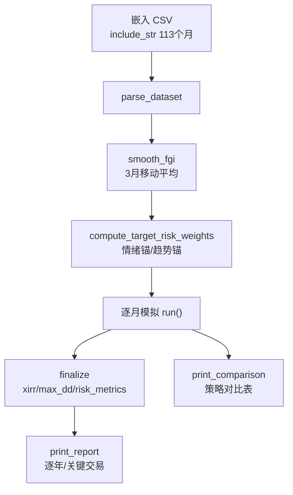

## 回测引擎模块深度报告

### 模块概述

回测引擎是 MNS 的"审计部门"（importance 8）——它不产生建议，而是用 2016-2025 的真实市场数据检验建议逻辑过去表现如何。没有它，"逆向策略有效"就只是一句口号。它解决的核心问题是：**在我把钱投进去之前，先告诉我这套规则过去十年会赚多少、亏多少、抗不抗揍**。

模块最关键的设计是与实盘策略**共用决策代码**（backtest.rs:18 直接 `use crate::strategy`），保证回测与实盘口径一致。数据通过 `include_str!` 编译期嵌入（backtest.rs:24-29），意味着回测结果对同一二进制是确定可复现的。

### 核心功能点

1. **四引擎统一模拟**（`Engine`，backtest.rs:232）——TargetWeight（新框架）/Legacy（旧框架）/BuyHold（买入持有）/BuyHoldRebalanced（买入持有+年度再平衡）。旧版三者实现各自独立、基准还硬编码了不同配置（70/15/15 vs 55/25/20），导致对比不公平；新版本全部走同一数据与同一成本模型（backtest.rs:3-8）。
2. **真实成本模型**——买入费 + FIFO 分批阶梯赎回费（每批次按各自持有天数计费）+ 闲置现金货币基金收益。回测把"扣掉真实费用后还剩多少"诚实呈现（backtest.rs:9-12）。
3. **双信号锚点**（`Anchor`，backtest.rs:259）——SentimentOnly（纯情绪）与 TrendTilt（趋势主锚 + 情绪倾斜）。设计动机（backtest.rs:255-257 注释）：FGI 均值回归周期是数周，而组合决策周期是数月到数年，存在时间尺度错配，故用趋势做主锚、情绪降级为 ±tilt 倾斜。
4. **FIFO 分批持仓管理**（`Leg`/`Lot`/`sell_fifo`，backtest.rs:95-195）——买入逐笔登记批次，卖出按先进先出，各批次按持有天数独立计算赎回费。
5. **数据完整性自检**——内置测试逐月校验单月跳变 <35%（防拼接断点）、整数行过少（防人工估填），backtest.rs:1062-1087。

### 关键组件

| 组件/类型 | 文件路径 | 一句话职责 |
|---------|---------|----------|
| `run` | src/backtest.rs:557 | 引擎主循环：现金计息→年度注资→调仓→记账，逐月推进 |
| `Engine` | src/backtest.rs:232 | 4 种策略引擎类型化枚举 |
| `SignalConfig` | src/backtest.rs:268 | 信号处理配置：平滑窗口/锚点/趋势参数/情绪倾斜 |
| `MonthRow` | src/backtest.rs:38 | 单月数据行：月末日期+FGI+三腿价格 |
| `Leg::sell_fifo` | src/backtest.rs:138 | FIFO 分批卖出，按批次持有天数计阶梯赎回费 |
| `rebalance_to_weights` | src/backtest.rs:687 | 目标仓位引擎的月度调仓（先卖后买、带宽过滤） |
| `finalize` | src/backtest.rs:799 | 汇总指标：XIRR、回撤、风险指标、交易统计 |

### 内部数据流

关键步骤：
1. `smooth_fgi`（backtest.rs:360）把逐月 FGI 平滑，避免周级噪声驱动年级组合
2. `compute_target_risk_weights`（backtest.rs:322）产出目标权重序列：情绪锚直接查配置曲线；趋势锚用价格 vs 12 月均线分腿判断升降趋势，再叠加情绪倾斜
3. `run` 主循环（backtest.rs:585-680）每月的四步：现金按 `cash_growth` 计息 → 年度 3 月后注资 → 按引擎调仓 → 记账（`Monthly` 记录风险权重/目标权重/期间收益）

### 关键接口与扩展点

- **新增引擎**：在 `Engine` enum 加变体（backtest.rs:232）+ `run` 的 match 分支加实现（backtest.rs:610-650）+ `label()` 加名称。设计刻意让引擎实现集中在一个函数内，便于对照
- **新增锚点**：在 `Anchor` enum 加变体 + `compute_target_risk_weights` 加分支（backtest.rs:328-356）
- **信号可配置**：`SignalConfig` 提供 `trend_tilt()`（backtest.rs:296）工厂方法，扩展信号模式只需新增工厂
- **自定义数据**：更换 `DATASET` 常量（backtest.rs:24-29）指向新 CSV 即可回测不同时期/不同资产

### 与其他模块的交互

| 交互模块 | 方向 | 接口/协议 | 说明 |
|---------|------|---------|------|
| 策略核心 | 依赖 | `calculate_buy_suggestions` 等 | Legacy 引擎复用实盘买卖建议函数 |
| 绩效指标 | 依赖 | `xirr`/`risk_metrics`/`max_drawdown` | 结果量化口径 |
| 配置系统 | 依赖 | `AppConfig`/`Costs` | 参数与成本模型 |
| 数据模型 | 依赖 | `Position` | 持仓抽象 |

### 跨模块协作场景

**在策略回测流程中**：引擎是执行者。具体参与：
- 调仓决策：`rebalance_to_weights`（backtest.rs:687）复用与实盘相同的目标权重映射 `config.target_weight_for`（config.rs:350），确保回测与实盘建议同源
- 结果量化：`finalize`（backtest.rs:799）调用 `metrics::xirr` 与 `metrics::risk_metrics` 产出可比较指标

**在样本外验证流程中**：引擎是实验台。`cmd_backtest_validate`（main.rs:533）对同一引擎喂不同参数组合，用 Calmar 选优并在独立数据段验证。

### 性能考量

回测是数值密集型但数据量极小（113 个月 × 3 腿），单次 run 毫秒级。刻意使用**确定性算法**（无随机数依赖的确定性 xorshift RNG 用于 bootstrap，metrics.rs:161-178），保证同种子可复现——这对"验证策略有效"至关重要：如果回测结果每次跑都不一样，就无法审计。bootstrap 的 2000 次重采样在主线程串行完成，对 CLI 工具可接受。

### 实现亮点

- **口径一致性**：统一引擎 + 统一成本模型 + 统一数据（backtest.rs:3-8），从根上消除"回测好看、实盘拉胯"的系统性失真
- **诚实披露内建于引擎**：`print_report` 同时输出 XIRR 与简单年化（backtest.rs:874-877）、逐年表现与关键交易（backtest.rs:917-1006），让用户能自己核对策略在关键时点做了什么
- **反过拟合内置**：bootstrap 分布与 holdout 区块（main.rs:690-718）把"单条历史路径的偶然性"可视化，用户能直接看到"年化差异若落在分布宽度之内就不具统计显著性"
