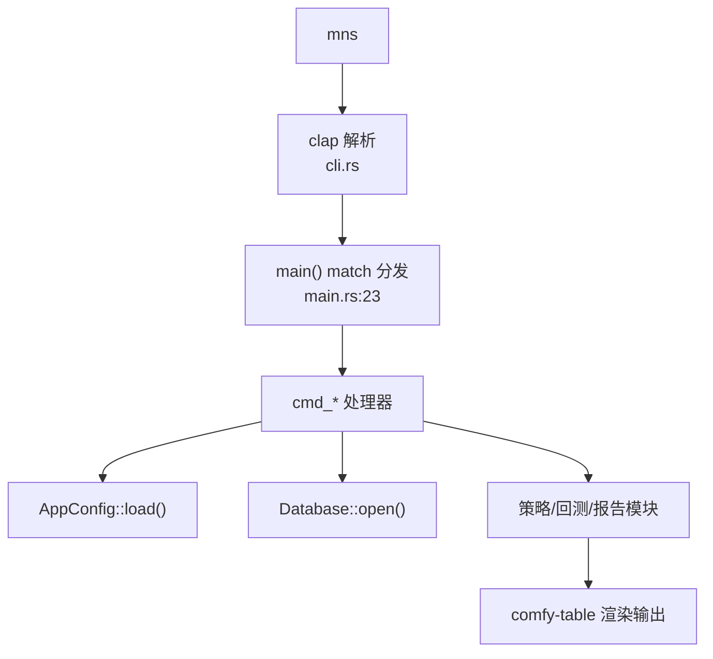

## CLI与命令分发模块深度报告

### 模块概述

CLI 与命令分发是 MNS 的"前台"（importance 6）——用户与系统的唯一接触点。它由两部分组成：`cli.rs` 用 clap derive 声明式定义全部命令与参数（自动生成 `--help` 文档），`main.rs` 的 `#[tokio::main] async fn main()`（main.rs:19）把 17 个命令分发到对应的 `cmd_*` 处理器。

它解决的核心问题是**入口的清晰与可发现性**：用户 `mns --help` 就能看到全部能力，每个命令的处理器都是独立的同步/异步函数，职责单一、无共享状态。main.rs 虽然 943 行，但结构极其规整——每个 `cmd_*` 函数 = 一个命令的完整生命周期（加载配置→操作数据→渲染输出）。

### 核心功能点

1. **CLI 声明**（`Cli`/`Commands`/`CashAction`/`BacktestAction`，cli.rs:3-156）——clap derive 把命令/参数/帮助文本声明为类型系统的一部分，`--help` 与参数校验自动生成。
2. **异步分发**（main.rs:19-67）——`#[tokio::main]` 为网络类命令（sentiment/report/update-prices/market/analyze）提供异步运行时，同步命令（portfolio/buy/sell 等）在同一个 async fn 内直接执行。
3. **终端表格渲染**——持仓（main.rs:188-247）、交易历史（main.rs:411-435）、市场指数（main.rs:835-902）、回测对比（backtest.rs:1024-1051）均用 comfy-table 渲染，中文类别映射（main.rs:221-226）。
4. **初始化引导**（`cmd_init`，main.rs:69）——首次使用引导：创建配置、数据库、报告目录；已有数据时交互确认（`--force` 跳过）。
5. **参数调优辅助**（`cmd_backtest_params`，main.rs:730）——`mns backtest params` 列出全部可调参数及默认值、含义、使用示例，是"面向人的参数文档"。

### 关键组件

| 组件/类型 | 文件路径 | 一句话职责 |
|---------|---------|----------|
| `Cli` | src/cli.rs:9 | clap 根结构：命令分发入口 |
| `Commands` | src/cli.rs:15 | 17 个顶层命令枚举 |
| `BacktestAction` | src/cli.rs:135 | 回测子命令（run/validate/params） |
| `main()` | src/main.rs:19 | 分发枢纽：match 到各 cmd_* |
| `cmd_report` | src/main.rs:348 | 每日报告（最复杂的命令：拉数据+策略+渲染） |
| `cmd_backtest_validate` | src/main.rs:533 | 样本外验证（walk-forward+bootstrap+holdout） |
| `cmd_init` | src/main.rs:69 | 初始化引导 |

### 内部数据流

### 与其他模块的交互

| 交互模块 | 方向 | 接口/协议 | 说明 |
|---------|------|---------|------|
| 配置系统 | 依赖 | `AppConfig::load`/`save`/`get_value`/`set_value` | 每个命令都加载配置 |
| 数据持久化 | 依赖 | `Database::open` + 各操作 | 数据读写 |
| 策略核心 | 依赖 | `calculate_rebalance_plan`/`check_risk_warnings` | 报告命令 |
| 回测引擎 | 依赖 | `run`/`load_main`/`print_report`/`print_comparison` | 回测命令 |
| 情绪与行情 | 依赖 | `fetch_fear_greed_data`/`update_all_prices`/`fetch_market_indices` | 网络命令 |

### 跨模块协作场景

**在每日报告生成流程中**：本模块是编排者——`cmd_report`（main.rs:348）串起"拉情绪→存快照→算策略→渲染报告"五步，是理解整个系统的最佳入口。**在回测验证流程中**：本模块是实验调度者——`cmd_backtest_validate`（main.rs:533）编排 walk-forward 网格搜索、bootstrap、holdout 三步验证。

### 性能考量

Tokio 异步运行时仅在命令需要网络时使用（`#[tokio::main]` 常驻，main.rs:19）。命令间无状态共享——每次 `Database::open()` 都是新连接，对 SQLite 个人库无性能代价，但换来了进程级隔离（一条命令崩溃不影响其他）。表格渲染用 unicode-width 处理中文宽度（main.rs:805-808）。

### 实现亮点

- **一个命令一个函数的正交结构**：17 个命令 17 个处理器，没有共享可变状态、没有全局上下文——新加命令只需在 `Commands` 枚举加变体 + 加一个 `cmd_*` + 在 match 加一行（main.rs:23-64），模式高度统一
- **网络与同步命令的无缝混合**：async fn 中直接调同步的 rusqlite/配置操作不会阻塞——因为整个 CLI 是单线程流水线，await 只在网络点发生
- **"面向人的帮助"**：`cmd_backtest_params`（main.rs:730-770）不只是参数列表，而是把"这个参数影响什么、默认值、怎么用"写成可读文档——CLI 自己就是使用手册
