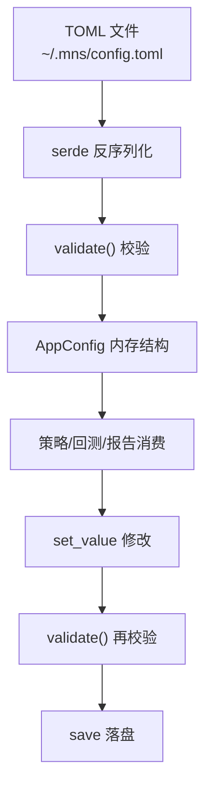

## 配置系统模块深度报告

### 模块概述

配置系统是 MNS 的"仪表盘"（importance 7）——所有策略参数、成本假设、API 端点都集中在这里。它解决的核心问题是：**如何让一个不懂代码的用户安全地调整策略行为**。用户改一个 `rebalance.band_pp 6`，交易频率就变了；改 `target_weight.extreme_fear 90`，恐慌时仓位就更激进。配置是策略的"可编程接口"。

模块承载了新旧两套策略框架的参数（旧：buy_ratio/sell_ratio/settings；新：target_weight/rebalance/costs），并靠 `validate()`（config.rs:255）在加载和写入时双向把关——**非法配置永远进不了系统**。

### 核心功能点

1. **声明式配置结构**（`AppConfig`，config.rs:7）——9 个子结构 + serde 反序列化，TOML 文件 ↔ 内存结构双向映射。
2. **合法性校验**（`validate`，config.rs:255）——五大类校验：三腿配置之和必须=100%、阈值必须单调递增、目标权重必须随情绪单调不增（逆向策略核心约束）、仓位缩放 0-100、带宽与现金收益非负。
3. **dot-path 读写**（`get_value`/`set_value`，config.rs:434-551）——`mns config thresholds.fear 40` 这类命令直接映射到嵌套结构字段，并"校验通过才落盘"（main.rs:141-143 防止写出无法加载的配置）。
4. **旧配置向后兼容**——`target_weight`/`rebalance`/`costs` 带 `#[serde(default)]`（config.rs:15-22），旧配置文件缺新字段自动回落默认值（config.rs:636-674 测试验证）。
5. **目标权重曲线默认值**（`TargetWeight::default_curve`，config.rs:40）——85/75/60/45/35，注释明确解释"这是仓位管理的锚"（config.rs:25-29）。

### 关键组件

| 组件/类型 | 文件路径 | 一句话职责 |
|---------|---------|----------|
| `AppConfig` | src/config.rs:7 | 配置根结构：9 个子节承载全部参数 |
| `TargetWeight` | src/config.rs:31 | 情绪→目标权重五档曲线（逆向策略锚） |
| `Rebalance` | src/config.rs:58 | 偏离带/最小交易额/最短持有期 |
| `Costs` | src/config.rs:79 | 买卖费率/现金收益/阶梯赎回费 |
| `validate` | src/config.rs:255 | 配置合法性校验（加载与写盘双向） |
| `sentiment_zone` | src/config.rs:332 | 分数→情绪区间映射 |
| `target_weight_for` | src/config.rs:350 | 分数→风险资产目标权重 |

### 内部数据流

### 与其他模块的交互

| 交互模块 | 方向 | 接口/协议 | 说明 |
|---------|------|---------|------|
| 策略核心 | 被依赖 | `asset_target_weights`/`target_weight_for` | 目标权重是决策的锚 |
| 回测引擎 | 被依赖 | `AppConfig`/`Costs` | 参数与成本模型 |
| 数据持久化 | 被依赖 | `db_path`/`config_path` | 数据文件位置 |
| CLI与命令分发 | 被依赖 | `load`/`save`/`get_value`/`set_value` | 命令层读写入口 |

### 跨模块协作场景

**在每日报告生成流程中**：本模块提供全部决策参数——`cmd_report` 加载 `AppConfig`（main.rs:349），策略模块从中读取目标权重曲线、带宽、阈值。**在回测流程中**：本模块是实验变量——`mns backtest run --config my.toml` 加载自定义配置（main.rs:489-492），`--compare a.toml,b.toml` 加载多个配置做公平对比（main.rs:467-487）。

### 性能考量

无性能问题——配置在命令开始时加载一次，全程只读（除 `mns config` 修改命令）。纯内存结构，所有计算都在策略层完成。

### 实现亮点

- **"校验在加载和写入两端都执行"**（main.rs:142 + config.rs:250）：用户手改 TOML 后加载会校验，`mns config` 命令修改也会先校验再落盘——两条修改路径都有护栏
- **新框架对旧框架的参数分层**（config.rs:14-22）：`target_weight`/`rebalance`/`costs` 与旧参数并列但职责清晰，配合 `#[serde(default)]` 实现无痛升级
- **逆向约束编码为校验规则**（config.rs:300-308）："目标权重必须随情绪升高单调不增"不是文档建议而是强制校验——逆向策略的数学约束直接写进了系统
