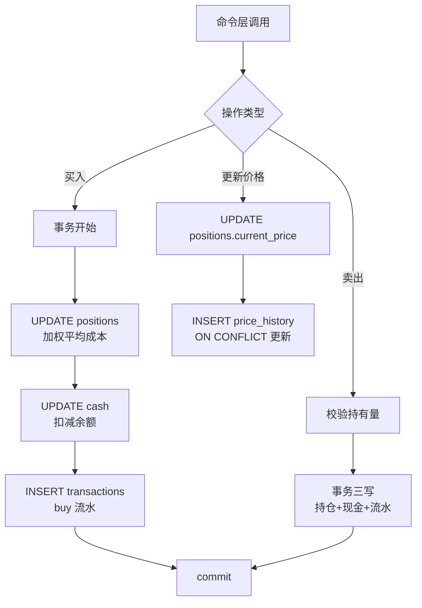

## 数据持久化模块深度报告

### 模块概述

数据持久化模块是 MNS 的"档案室"（importance 7）——所有状态都在 SQLite 单文件里：现金余额、持仓、交易流水、逐日价格历史、恐贪指数快照。它解决的核心问题是：**如何让"一次命令的输入"变成"长期可追溯、可再计算的状态"**。

设计上刻意保持极简：无 ORM、无迁移框架，schema 直接内联在 `init_tables` 的 `CREATE TABLE IF NOT EXISTS` 里（db.rs:24-73），每次打开数据库自动建表/补表。这意味着旧版本的数据库文件在新版本下打开时能自动补齐新表——schema 演进靠"幂等建表"而非迁移脚本。

### 核心功能点

1. **现金管理**（`get_cash_balance`/`set_cash_balance`/`add_cash`，db.rs:77-106）——单行表（id=1），校验负数拒绝。
2. **持仓管理**（`add_position`/`list_positions`/`buy_position`/`sell_position`/`update_price`/`remove_position`，db.rs:110-343）——买/卖在**单个 SQLite 事务**内完成"更新持仓 + 变更现金 + 写交易流水"三写（db.rs:208-231, 261-283），保证账目原子一致。
3. **价格历史累积**（`record_price`/`monthly_price_history`，db.rs:303-332）——逐日快照 `ON CONFLICT DO UPDATE` 幂等，为趋势锚（价格 vs 12 月均线）积累序列；同一天保留最新值。
4. **情绪快照**（`save_fear_greed_snapshot`/`get_latest_snapshot`，db.rs:373-420）——先删当天再插入，保证每天一条最新记录。
5. **加权平均成本**——买入时按 `(旧总额+新金额)/(旧份额+新份额)` 更新成本价（db.rs:193-199），首买记录 `first_buy_date`。

### 关键组件

| 组件/类型 | 文件路径 | 一句话职责 |
|---------|---------|----------|
| `Database` | src/db.rs:7 | SQLite 门面：打开/初始化 + 全部分组操作 |
| `init_tables` | src/db.rs:24 | 幂等建表（CREATE TABLE IF NOT EXISTS） |
| `buy_position` | src/db.rs:170 | 买入事务：持仓+现金+流水三写 |
| `sell_position` | src/db.rs:233 | 卖出事务：校验持有量 + 三写 |
| `record_price` | src/db.rs:303 | 逐日价格快照（幂等 upsert） |
| `save_fear_greed_snapshot` | src/db.rs:373 | 情绪快照（当天去重） |

### 内部数据流

### 与其他模块的交互

| 交互模块 | 方向 | 接口/协议 | 说明 |
|---------|------|---------|------|
| 配置系统 | 依赖 | `AppConfig::db_path` | 数据库位置 `~/.mns/mns.db` |
| 数据模型 | 依赖 | `Position`/`Transaction`/`FearGreedSnapshot` | 行映射到领域结构 |
| CLI与命令分发 | 被依赖 | 命令处理器 | 所有命令都通过 `Database::open()` 访问数据 |

### 跨模块协作场景

**在每日报告生成流程中**：本模块提供数据底座——`cmd_report` 先保存情绪快照（db.rs:361-368），再读取现金与持仓（main.rs:372-373）供策略计算。**在交易记录流程中**：本模块是核心执行者——`cmd_buy`/`cmd_sell` 直接调用事务操作，保证用户记录的每一笔买卖都账目一致。

### 性能考量

SQLite 单文件对个人工具完全够用（数据量 KB-MB 级）。rusqlite 同步 API 与 Tokio 异步共存——命令在 await 网络后回到同步 DB 调用，无并发写入场景，不存在锁竞争问题。所有写操作走事务，保证崩溃时不会出现半完成状态。

### 实现亮点

- **幂等 schema**：`CREATE TABLE IF NOT EXISTS` + `INSERT OR IGNORE INTO cash`（db.rs:70）让"打开即初始化"，旧库自动兼容（config.rs:636 测试验证旧配置缺新字段仍可加载）
- **业务校验前置**：买入前查现金余额（db.rs:187-190）、卖出前查超持（db.rs:245-250）、金额负数拒绝——把"脏数据进不了库"落实在数据层，而非只靠命令层
- **面向趋势锚的累积式设计**：`price_history` 的存在（db.rs:300-302 注释）体现了"现在存的数据是未来功能的燃料"——逐日价格累积满 12 个月即可启用趋势锚信号
