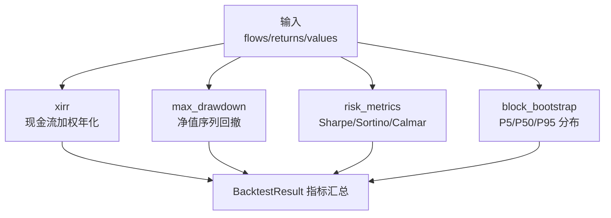

## 绩效指标模块深度报告

### 模块概述

绩效指标模块是 MNS 回测结果的"度量衡"（importance 6）——它决定"策略到底好不好"用哪把尺子量。这个模块很小（353 行），但承载了一个关键的方法论判断：**分批注资下，简单年化是失真的，必须用 XIRR**。

它解决的核心问题：投资者往账户里不同时间投钱（期初 10 万、第二年末又投 10 万），`(期末/总投入)^(1/年数)` 会把晚到的资金误当作全程投入，系统性低估真实年化。XIRR（现金流加权收益率）通过求解净现值方程得到准确值——模块注释（metrics.rs:1-4）把这个"为什么"写得非常清楚。

### 核心功能点

1. **XIRR 现金流加权年化**（`xirr`，metrics.rs:18）——牛顿法求解，失败退回二分法。用 `(365 天 / 年)` 惯例，对齐金融行业标准。
2. **最大回撤**（`max_drawdown`，metrics.rs:87）——峰值到谷底的最大跌幅（返回正小数），衡量"最坏情况下亏多少"。
3. **风险调整指标**（`risk_metrics`，metrics.rs:140）——Sharpe（超额收益/波动）、Sortino（超额收益/下行偏差）、Calmar（年化/最大回撤）、年化波动。
4. **分块 bootstrap**（`block_bootstrap`，metrics.rs:183）——重采样收益序列保留短期自相关，给出年化/回撤的分布而非单点，用于评估结果的统计显著性。
5. **确定性 RNG**（`Rng`，metrics.rs:161）——自实现 xorshift64* 伪随机数，避免引入 rand 依赖且保证回测可复现。

### 关键组件

| 组件/类型 | 文件路径 | 一句话职责 |
|---------|---------|----------|
| `CashFlow` | src/metrics.rs:10 | 单笔现金流（流入为负、流出为正） |
| `xirr` | src/metrics.rs:18 | 现金流加权年化（牛顿法+二分法兜底） |
| `max_drawdown` | src/metrics.rs:87 | 峰值-谷底最大回撤 |
| `risk_metrics` | src/metrics.rs:140 | Sharpe/Sortino/Calmar/波动 计算 |
| `block_bootstrap` | src/metrics.rs:183 | 分块重采样收益分布 |
| `Rng` | src/metrics.rs:161 | 确定性 xorshift64* 伪随机数 |

### 内部数据流

### 与其他模块的交互

| 交互模块 | 方向 | 接口/协议 | 说明 |
|---------|------|---------|------|
| 回测引擎 | 被依赖 | `xirr`/`risk_metrics`/`max_drawdown`/`block_bootstrap` | 回测结果量化与显著性检验 |
| 数据模型 | 依赖 | `chrono::NaiveDate` | 现金流日期 |

### 跨模块协作场景

**在策略回测流程中**：本模块是量化器——`finalize`（backtest.rs:799）调用 `metrics::xirr` 与 `metrics::risk_metrics` 把月度序列变成可比较指标。**在样本外验证流程中**：本模块提供显著性工具——`cmd_backtest_validate` 调用 `metrics::block_bootstrap`（main.rs:670）与 `metrics::percentile`（main.rs:676-684）产出收益分布，回答"回测结果的差异是真实的还是偶然的"。

### 性能考量

数值算法均设计为快速收敛与数值稳定：XIRR 用牛顿法（100 次迭代上限）配合二分法兜底（300 次）保证不震荡不发散（metrics.rs:42-83）；bootstrap 2000 次 × 路径长度 113 在 CLI 主线程毫秒级完成。刻意无并行——确定性优先于速度。

### 实现亮点

- **XIRR 双算法兜底**：牛顿法快但不稳（导数为零/越界会崩），二分法稳但慢——两个配合保证任意现金流都能收敛到解（metrics.rs:18-84）
- **正负收益区分年化公式**（models.rs:41-64）：正收益用复利 `(current/cost)^(1/years)`，负收益用简单年化，避免亏损被复利公式过度放大（`0.95^12-1 ≈ -46%` 的失真）
- **诚实口径的文化渗透**：README、报告"信号口径"、回测"口径与局限"块（main.rs:721-726）都主动披露 XIRR 与简单年化的区别、数据未覆盖长期熊市的局限——这是整个项目价值观的体现
