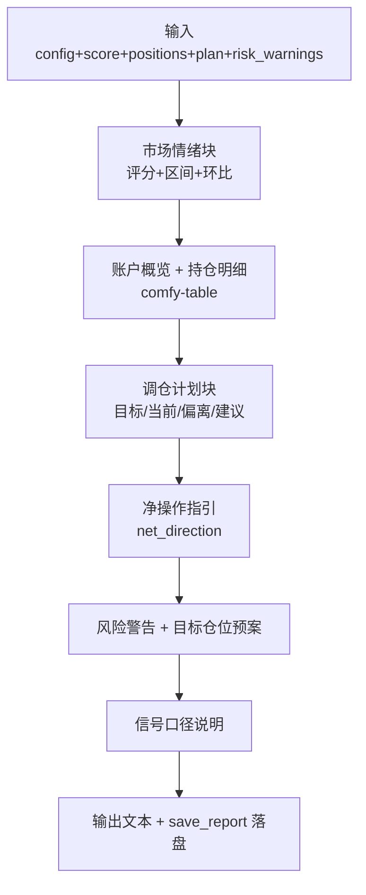

## 报告生成模块深度报告

### 模块概述

报告生成模块是 MNS 的"秘书"（importance 8）——它不产生决策，但把策略的决策翻译成人能秒懂的格式。再好的建议，如果以一堆结构体字段的形式丢给用户，就失去了价值。它解决的核心问题是：**如何把"该买多少、该卖多少、该警惕什么"讲得清楚、讲得诚实、讲得可追溯**。

报告覆盖 8 个信息块：市场情绪、账户概览、持仓明细、调仓计划、净操作指引、风险警告、目标仓位预案、信号口径。其中"信号口径"块（report.rs:282-291）是亮点——它明确告知用户当前建议由什么信号驱动、该信号经回测检验的效果如何，以及趋势锚何时可切换。

### 核心功能点

1. **结构化报告渲染**（`generate_report`，report.rs:23）——纯函数：配置+情绪+持仓+调仓计划 → 文本报告。不读库、不调 API，只做渲染，天然可测。
2. **终端表格对齐处理**（`pad_display`，report.rs:12-19）——中文字符在终端占 2 列，`{:<n}` 按字符数补齐会导致错位，用 `unicode-width` 按显示宽度补齐。
3. **分级着色**——年化收益 ≥ 目标高阈值标绿、为负标红（report.rs:119-127）；偏离超带宽的类别标红/绿（report.rs:180-183）。颜色不是装饰，是让用户 1 秒识别"该关注哪一栏"。
4. **落盘存档**（`save_report`，report.rs:298）——`reports/{date}.txt`，形成每日决策日志。

### 关键组件

| 组件/类型 | 文件路径 | 一句话职责 |
|---------|---------|----------|
| `generate_report` | src/report.rs:23 | 主渲染函数：8 个信息块拼装为文本报告 |
| `save_report` | src/report.rs:298 | 落盘到 `{report_output_dir}/{date}.txt` |
| `pad_display` | src/report.rs:12 | 中文宽度感知的补位（终端对齐） |

### 内部数据流

### 与其他模块的交互

| 交互模块 | 方向 | 接口/协议 | 说明 |
|---------|------|---------|------|
| 策略核心 | 依赖 | `RebalancePlan`/`RiskWarning`/`RiskAdvice` | 消费决策结果 |
| 数据模型 | 依赖 | `Position` | 持仓明细渲染 |
| 配置系统 | 依赖 | `AppConfig` | 阈值/目标仓位/输出目录 |
| 数据持久化 | 被依赖 | - | 由命令层协调，报告本身不直接读写库 |

### 跨模块协作场景

**在每日报告生成流程中**：本模块是终点（产出）。`cmd_report`（main.rs:348）完成数据获取与决策后，调用 `report::generate_report` 与 `report::save_report` 渲染并落盘。报告中的"调仓计划"直接来自 `strategy::calculate_rebalance_plan` 的输出，保证用户看到的建议与策略逻辑零失真。

### 性能考量

渲染为纯字符串拼接，微秒级。无需缓存——报告每日一次，每次都基于最新数据完整重算，避免"读缓存导致建议过期"的风险。

### 实现亮点

- **诚实内建**：报告"信号口径"块明确披露"当前建议由情绪锚驱动；回测显示趋势锚更优但需 12 个月价格历史"（report.rs:282-291）。这与 README 的诚实披露一脉相承——工具的价值是纪律而非吹嘘
- **"不动作"也是结论**：调仓计划块在无动作时输出"今日无需调仓——各类别偏离均在带宽内，持有即可。这是正常状态：中长线框架下多数月份都不应有动作"（report.rs:235-238）。把"无事可做"解释为正常而非失败，管理用户预期
