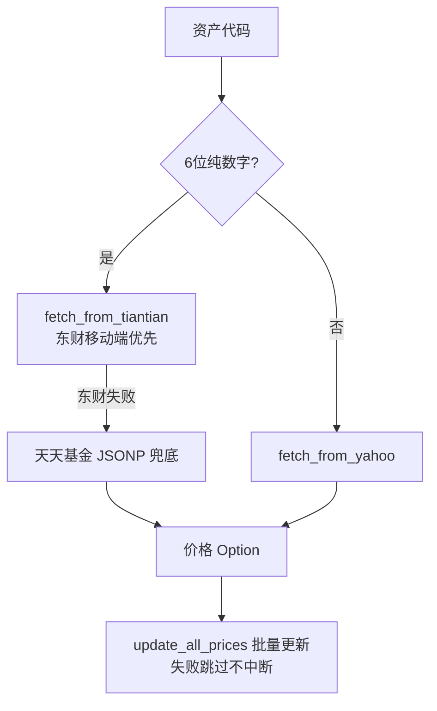

## 情绪与行情模块深度报告

### 模块概述

情绪与行情模块是 MNS 的"情报科"（importance 7）——系统与外界的唯一通道。它负责三件事：拉取 CNN 恐贪指数（策略的信号输入）、获取持仓资产的实时价格、拉取全球市场指数。没有它，策略模块就"无米下锅"。模块由三个文件构成：`sentiment.rs`（情绪）、`quote.rs`（价格）、`market.rs`（指数）。

这个模块最重要的设计哲学是**多源冗余 + 优雅降级**：免费金融 API 随时可能反爬、限流甚至下线，所以每个数据需求都准备了主源和备用源，单个失败不拖垮整体。

### 核心功能点

1. **CNN 恐贪指数获取**（`fetch_fear_greed_data`，sentiment.rs:57）——请求带浏览器 UA/Referer 头规避反爬，内置 3 次重试（间隔 500ms），对 418 反爬拦截给出明确中文提示（sentiment.rs:92-98）。解析时从 JSON 文本提取历史值（`extract_historical_value`，sentiment.rs:139），供报告做环比/同比。
2. **智能路由价格获取**（`fetch_price`，quote.rs:178）——按代码特征选数据源：6 位纯数字 → 天天基金（东财移动端 API 优先 `fetch_from_eastmoney_mobile`，JSONP 兜底 `fetch_from_tiantian_jsonp`）；字母 → Yahoo Finance（`fetch_from_yahoo`）。
3. **批量价格更新**（`update_all_prices`，quote.rs:197）——顺序遍历全部持仓，逐资产获取；失败资产 `eprintln` 警告后跳过，不中断整个流程。
4. **全球指数概览**（`fetch_market_indices`，market.rs:45）——9 个指数固定清单（标普/道指/纳指/VIX/富时/DAX/日经/上证/恒生），个别失败汇总成错误表展示（market.rs:57-83）。
5. **个股报价分析**（`fetch_full_quote`，quote.rs:245）——Yahoo v8 chart API 解析，含前收/涨跌幅，供 `mns analyze` 使用。

### 关键组件

| 组件/类型 | 文件路径 | 一句话职责 |
|---------|---------|----------|
| `FearGreedData` | src/sentiment.rs:36 | 恐贪指数数据结构（当前分 + 4 个历史值） |
| `fetch_fear_greed_data` | src/sentiment.rs:57 | CNN API 客户端（重试 + 反爬处理） |
| `fetch_price` | src/quote.rs:178 | 统一价格入口：按代码特征路由数据源 |
| `fetch_from_eastmoney_mobile` | src/quote.rs:32 | 东财移动端基金 API（净值/估值） |
| `fetch_from_yahoo` | src/quote.rs:132 | Yahoo Finance v8 美股/ETF 报价 |
| `fetch_full_quote` | src/quote.rs:245 | 完整报价（含前收）供市场/分析用 |
| `MarketQuote` | src/market.rs:10 | 市场指数报价结构 |
| `MARKET_INDICES` | src/market.rs:19 | 9 个全球指数清单 |

### 内部数据流

### 关键接口与扩展点

- **新增数据源**：新增 `fetch_from_xxx` 函数（与 `fetch_from_eastmoney_mobile` 同签名 `(code) -> Result<Option<f64>>`），在 `fetch_price` 或 `fetch_from_tiantian` 的降级链中插入即可（quote.rs:124-129 展示了降级链模式）
- **新增指数**：在 `MARKET_INDICES` 常量加一行（market.rs:19-29），自动纳入 `mns market` 与 `mns market-indices`
- **API 端点可配**：恐贪指数 URL 由配置 `api.fear_greed_url` 控制（config.rs:217-220），无需改代码即可切换镜像/代理

### 与其他模块的交互

| 交互模块 | 方向 | 接口/协议 | 说明 |
|---------|------|---------|------|
| 配置系统 | 依赖 | `api.fear_greed_url` | API 端点来自配置 |
| 数据模型 | 依赖 | `Position` | 批量更新遍历持仓 |
| 数据持久化 | 被依赖（调用方） | `db.update_price` | 命令层协调：本模块产出价格，db 持久化 |

### 跨模块协作场景

**在每日报告生成流程中**：本模块是第一步——`cmd_report` 调用 `sentiment::fetch_fear_greed_data` 拿到情绪信号（main.rs:356），后续所有决策都建立在这个输入上。**在价格批量更新流程中**：本模块是执行者——`quote::update_all_prices` 产出 `Vec<PriceUpdate>`，命令层写回数据库（main.rs:783-799）。

### 性能考量

网络 IO 是系统唯一的外部延迟来源。设计选择是**顺序请求而非并发**（quote.rs:197-235）——放弃了并发速度，换来了对免费 API 的友好与实现的简单。请求均设超时（连接 5-10s、请求 10-15s），避免单次挂死拖垮命令。重试策略只用于最关键的恐贪指数（sentiment.rs:62-77），价格批量更新不重试（逐个失败逐个跳过）——因为价格明天还会再拉，而报告需要当下就要结果。

### 实现亮点

- **降级链设计**（quote.rs:124-129）：`fetch_from_tiantian` 先试东财移动端再试 JSONP——上游失效自动滑到下游，用户无感知
- **反爬对抗的工程细节**：请求带浏览器 UA、`Accept-Language`、`Referer`（sentiment.rs:81-88, quote.rs:138-150）——免费 API 需要"像浏览器"才能拿到数据
- **优雅失败**：`mns market` 中恐贪指数获取失败只打警告不报错退出（main.rs:862-870）——市场概况命令核心是指数表，情绪失败不应让整个命令失败
