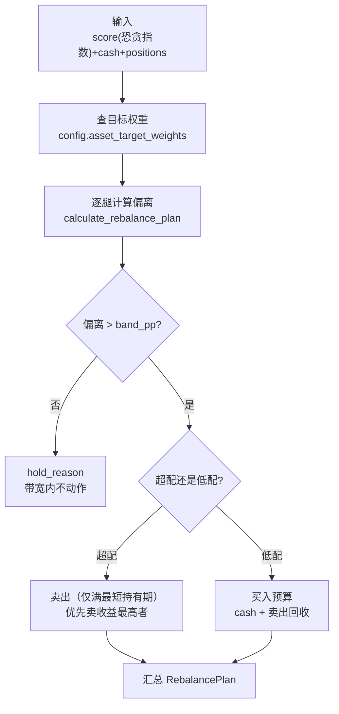

## 策略核心模块深度报告

### 模块概述

策略核心是 MNS 的"决策大脑"，也是整个系统最重要的模块（importance 10）。恐贪指数、价格、持仓这些数据本身没有意义，是策略模块把它们翻译成了"该买多少、该卖多少、该警惕什么"。它解决的核心问题是：**在情绪极值点，用规则替代直觉做出反直觉但正确的仓位决策**。

模块内有两套框架：**新框架（目标仓位 + 偏离带）**驱动实盘报告，**旧框架（现金/份额百分比）**保留仅供回测对照。这个"新旧并存"设计很有深意——它不是为了兼容性，而是为了让回测能直接回答"新框架到底比旧框架好在哪"。

### 核心功能点

1. **目标仓位调仓计划**（`calculate_rebalance_plan`，strategy.rs:406）——新框架主入口。先由情绪查目标权重曲线，再逐腿计算当前权重与目标的偏离，超带宽才动作。买入腿受"现金 + 卖出回收"总预算约束，不足时按缺口比例缩减并标记 `cash_constrained`。
2. **逆向加权分摊**（`split_within_leg`，strategy.rs:560）——同一条资产腿内部如何分钱：浮亏越多的标的获得越多资金（`cost_price/current_price` 加权，上限 `max_contrarian_weight`），真正实现"别人恐惧我贪婪"。但**宽基指数深度浮亏不排除**（`is_broad_index`，strategy.rs:602），个股深度浮亏排除——因为指数跌 30% 是机会、个股跌 30% 可能是基本面恶化。
3. **风险警告**（`check_risk_warnings`，strategy.rs:292）——浮亏超 20% 的持仓按情绪环境给出三级差异化建议：恐慌环境→可能是加仓机会；中性→审视基本面；贪婪→紧急审视（别人赚钱你还在亏，需怀疑结构性问题）。
4. **双重止盈**（`calculate_sell_suggestions`，strategy.rs:209，旧框架）——年化收益达标 或 绝对收益≥30% 且持仓够长，两种路径锁定利润。

### 关键组件

| 组件/类型 | 文件路径 | 一句话职责 |
|---------|---------|----------|
| `RebalancePlan` | src/strategy.rs:360 | 调仓计划根类型：目标/当前风险权重、各腿计划、现金约束标记 |
| `LegPlan` | src/strategy.rs:334 | 单条资产腿的计划：目标/当前权重、偏离、建议金额、不动作原因 |
| `calculate_rebalance_plan` | src/strategy.rs:406 | 新框架主入口，实盘报告与回测共同的理论来源 |
| `split_within_leg` | src/strategy.rs:560 | 腿内逆向加权分摊（宽基不排除个股排除） |
| `check_risk_warnings` | src/strategy.rs:292 | 浮亏预警 + 按情绪环境分级建议 |
| `is_broad_index` | src/strategy.rs:602 | 14 个关键词粗判宽基指数/ETF |

### 内部数据流

关键步骤：
1. 目标权重查询：`config.asset_target_weights(score)`（config.rs:380）把情绪分数映射为三条腿的目标权重——这是策略的"锚"，保证建议无路径依赖
2. 卖出优先：strategy.rs:449-497 先处理超配腿，回收现金后供买入腿使用（买卖互感知），实现资金利用率最大化
3. 预算约束：strategy.rs:505-535 买入预算 = 现金 + 卖出回收，不足时按比例分配并标记 `cash_constrained`

### 扩展点

- **目标权重曲线**是最大的"扩展点"：`target_weight.*` 五档配置完全由用户定义，校验只强制"随情绪单调不增"（config.rs:300-308）。用户想要更激进的逆向策略，改配置即可，代码零改动
- **带宽** `rebalance.band_pp` 是"交易频率调节器"：带宽大→动作少→交易少；带宽小→动作频繁。回测验证了"带宽越大交易越少"（backtest.rs:1231-1246）
- `is_broad_index` 的关键词表（strategy.rs:603-607）是可扩展的：新增指数/ETF 关键词即可调整"宽基不排除"的识别范围

### 性能考量

无性能压力——单用户每日跑一次，O(持仓数) 的简单遍历。没有缓存、没有异步，刻意保持简单可读。真正的"性能"考量在回测侧（metrics/backtest 的数值稳定性），决策侧追求的是逻辑可验证。

### 实现亮点

- **无路径依赖**：策略.rs 内大量测试（strategy.rs:760-780）验证"相同权重结构下建议与组合规模无关"——这是新框架相对旧框架最核心的改进
- **宽基 vs 个股的规则细分**（strategy.rs:557-559 注释）：承认"指数下跌是逆向机会、个股下跌可能是风险"，这是对旧逻辑"一刀切排除深亏标的"的规则修正，体现对策略语义的深入理解
