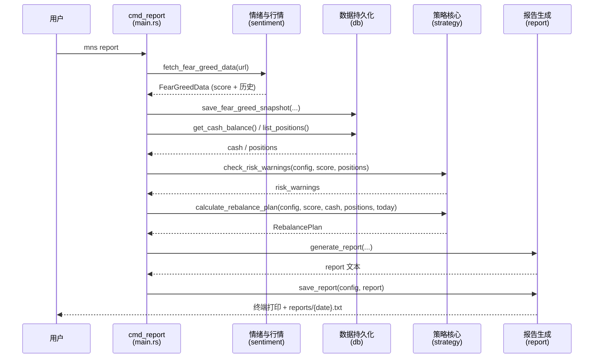
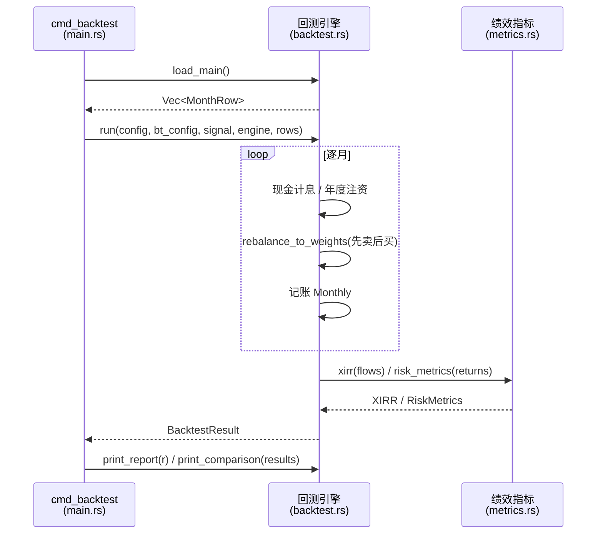

## 工作流研究报告

### 主要工作流

MNS 的核心工作流可以比喻成一家"晚间报盘公司"的生产线：**原材料（市场数据）从外部市场进来 → 档案室（SQLite）归档 → 分析师（策略）给出建议 → 秘书（报告）排版出厂**。回测则像"审计部门"——用历史档案抽查分析师的建议在过去的表现，确保建议不是拍脑袋。

整体是**同步顺序执行**的命令行流水线：一次命令 = 一个完整闭环，没有常驻进程、没有后台任务、没有事件驱动。

#### 工作流1：每日报告生成（核心价值流）

这是 MNS 的"拳头产品"，把用户从"今天该不该买/卖？"的情绪困境中解放出来。它解决的是：市场波动时，人脑会被恐惧和贪婪劫持，而这个流程用固定的规则链替代情绪决策。

**触发方式**：用户执行 `mns report`
**入口**：`cmd_report` in `src/main.rs:348`
**执行步骤**：
1. 拉取 CNN 恐贪指数（调用：`sentiment::fetch_fear_greed_data`，sentiment.rs:57）——系统先感知市场情绪温度；内置 3 次重试与 418 反爬处理
2. 保存情绪快照到 SQLite（调用：`db.save_fear_greed_snapshot`，db.rs:373）——同一天只保留最新快照，形成可回溯的历史序列
3. 计算风险警告（调用：`strategy::check_risk_warnings`，strategy.rs:292）——找出浮亏超 20% 的持仓，按情绪环境给出差异化建议（恐慌环境→可能加仓机会；贪婪环境→紧急审视）
4. 计算调仓计划（调用：`strategy::calculate_rebalance_plan`，strategy.rs:406）——核心决策：目标仓位 vs 当前仓位，偏离超带宽才动作，卖出先于买入
5. 渲染报告并落盘（调用：`report::generate_report` + `report::save_report`，report.rs:23/298）——终端展示 + `reports/{date}.txt` 存档

**输出/结果**：完整报告（市场情绪、账户概览、持仓明细、调仓计划、净操作指引、风险警告、目标仓位预案、信号口径）

**流程图数据**：
- 节点：[拉取FGI, 保存快照, 计算风险警告, 计算调仓计划, 渲染报告]
- 边：[拉取FGI→保存快照, 保存快照→计算风险警告, 计算风险警告→计算调仓计划, 计算调仓计划→渲染报告]

#### 工作流2：价格批量更新

价格是决策的燃料——没有现价，就无法计算偏离、无法给出调仓建议。这个流程解决"我持仓的几十个基金/ETF 今天值多少钱"的批量获取问题。

**触发方式**：用户执行 `mns update-prices`
**入口**：`cmd_update_prices` in `src/main.rs:772`
**执行步骤**：
1. 列出全部持仓（调用：`db.list_positions`，db.rs:121）
2. 逐个获取价格（调用：`quote::update_all_prices`，quote.rs:197）——按代码特征路由：6 位纯数字 → 天天基金（东财移动端优先，JSONP 兜底）；字母 → Yahoo Finance
3. 单个资产失败只打 eprintln 警告并跳过，不中断整个流程（quote.rs:218-231）——体现"局部失败不应导致全局中断"的降级理念
4. 成功更新的资产写回数据库（调用：`db.update_price`，db.rs:287）——同时调用 `record_price`（db.rs:303）累积价格历史，为趋势锚（价格 vs 12 月均线）积累数据

**输出/结果**：更新结果表格（代码/名称/原价/新价/来源）+ 数据库同步

#### 工作流3：交易记录（买入/卖出）

**触发方式**：用户执行 `mns buy` / `mns sell`
**入口**：`cmd_buy` in `src/main.rs:270`、`cmd_sell` in `src/main.rs:281`
**执行步骤**：
1. 校验参数（份额/价格为正；卖出不超持有量）
2. 打开 SQLite 事务（`unchecked_transaction`，db.rs:210/263）——买入：更新持仓份额与加权平均成本 + 扣减现金 + 写入 buy 交易流水；卖出：更新持仓 + 回补现金 + 写入 sell 流水。**三步在同一事务内**，保证不出现"钱扣了持仓没加"这类账目不一致
3. 提交事务

**输出/结果**：确认信息 + 数据库一致性变更

#### 工作流4：策略回测

**触发方式**：用户执行 `mns backtest`
**入口**：`cmd_backtest` in `src/main.rs:437`
**执行步骤**：
1. 加载编译期嵌入的真实数据（调用：`backtest::load_main`，backtest.rs:85）——2016-2025 月度全收益序列（人民币计价、含分红），113 个月
2. 平滑情绪信号（调用：`smooth_fgi`，backtest.rs:360）——3 个月移动平均，避免用周级噪声驱动年级组合
3. 计算目标权重序列（调用：`compute_target_risk_weights`，backtest.rs:322）——按锚点类型（情绪锚/趋势锚）映射
4. 逐月模拟（调用：`run`，backtest.rs:557）——月循环：现金计息 → 年度注资 → 调仓（先卖后买）→ 记账
5. 指标统计（调用：`metrics::xirr` / `metrics::risk_metrics`，metrics.rs:18/140）——XIRR、最大回撤、Sharpe、Sortino、Calmar
6. 输出对比（调用：`print_report` / `print_comparison`，backtest.rs:864/1018）——默认跑 5 个变体（趋势锚/情绪锚/旧框架/买入持有+再平衡/买入持有）在同一数据与成本模型下对比

**输出/结果**：逐策略报告 + 策略对比表

#### 工作流5：样本外验证

**触发方式**：用户执行 `mns backtest validate`
**入口**：`cmd_backtest_validate` in `src/main.rs:533`
**执行步骤**：
1. Walk-forward 切分：前 60% 数据调参，后 40% 验证（main.rs:549）
2. 网格搜索：3 个仓位缩放 × 4 个偏离带，在样本内挑 Calmar 最优（main.rs:568-586）
3. 样本外测试：最优参数 vs 默认配置 vs 趋势锚 vs 买入持有（main.rs:619-628）；若最优参数样本外劣于默认，明确提示"典型过拟合信号"（main.rs:649-651）
4. 分块 bootstrap：2000 次重采样，给出年化/回撤的 P5/P50/P95 分布（main.rs:653-688）
5. Holdout 区块：用从未参与调参的独立数据段复核（main.rs:690-718）

**输出/结果**：调参网格表、样本外对比表、bootstrap 分布表、holdout 表 + 口径与局限说明

### 并发/异步模型

MNS 的并发策略是"**稳优先而非快优先**"。它是单用户 CLI，绝大多数操作是同步的 SQLite 读写与同步的顺序遍历，根本不需要并发。唯一的异步点是网络请求（拉取恐贪指数、批量价格、市场指数），用 `#[tokio::main]`（main.rs:19）+ `async fn` + reqwest 处理。但即使在这里，也是**串行 await 而非并发 fetch**——例如 `update_all_prices` 逐个资产顺序请求（quote.rs:197-235）。这种设计放弃了批量并发的速度，换来了：对免费第三方 API 的友好（不会并发打爆反爬）、实现简单、错误隔离清晰。对个人工具而言，等待几十个请求多花几秒，远不如稳定重要。

没有共享可变状态、没有锁、没有通道——Rust 的所有权模型在这里自然适配了"单线程流水线"。

### 错误处理策略

核心理念是"**局部失败不应导致全局中断，关键数据缺失必须显式失败**"：

- 网络层**重试 + 降级**：sentiment.rs 对 CNN API 最多重试 3 次、间隔 500ms（sentiment.rs:62-77）；quote.rs 对东财失败则降级到天天基金 JSONP（quote.rs:124-129）
- 批量更新**逐项隔离**：单个资产价格失败只打 `eprintln` 警告，继续处理其余资产（quote.rs:218-231）；市场指数获取失败汇总成一张错误表展示，不全军覆没（market.rs:57-83）
- 业务规则**前置校验**：买入前查现金余额不足即拒绝（db.rs:187-190）、卖出前查超持即拒绝（db.rs:245-250）、配置写盘前 `validate()`（main.rs:142）
- 数据完整性**事务保障**：买卖操作在单个 SQLite 事务内完成持仓+现金+流水三写（db.rs:208-231）
- 用户输入**友好报错**：anyhow + `with_context` 给出中文错误上下文（如"打开数据库失败: {path}"，db.rs:18）

### 关键时序交互

#### 每日报告时序

参与者：User、main.rs（cmd_report）、sentiment、db、strategy、report

从时序图能读出的关键模式：**数据单向流动**——外部数据进来先归档（snapshot），决策只读已归档数据，报告只消费决策结果。每一步的输出类型明确（`FearGreedData` → `RebalancePlan` → 文本），没有隐藏的共享状态。

#### 回测时序

参与者：main.rs（cmd_backtest）、backtest engine、metrics

关键交互模式：回测引擎与绩效指标是**纯函数式调用**——`run()` 输入配置+数据返回结果结构体，无副作用，天然可复现、可测试（backtest.rs 有 15+ 个单元测试验证引擎行为）。
