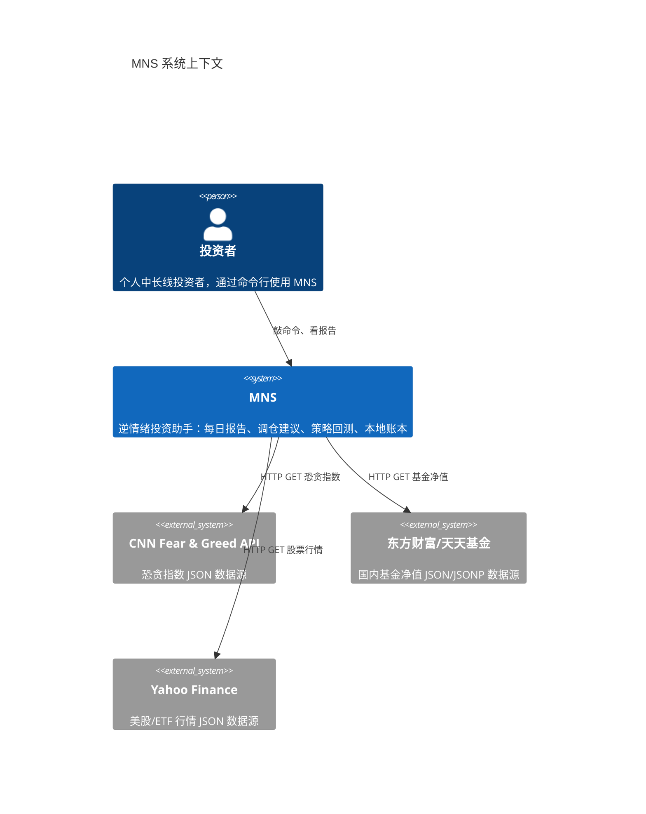

# MNS（Money Never Sleeps）—— 逆情绪投资助手

MNS 是一套运行在你本机的**个人投资决策工具**。它服务的对象是中长线投资者——那些相信"别人恐惧时我贪婪"的人。你每天早上敲一个 `mns report`，它会告诉你今天市场情绪几何、你的仓位离目标差多少、应该买还是卖、以及这套建议背后的依据和局限。工具刻意不做自动交易，只做"参谋"，最终拍板永远是你。

这个项目解决的核心问题是：**在情绪驱动的市场中，如何让"逆势而动"变得可执行、可量化、可复盘**。传统的追涨杀跌靠感觉，而 MNS 把"恐惧"和"贪婪"量化为 CNN 恐贪指数（0-100），再把"应该配多少风险资产"映射成一张目标仓位曲线——越恐慌仓位越高，越贪婪仓位越低。它用 2016-2025 年 112 个月的真实数据回测过这套逻辑（`src/backtest.rs`），并用样本外数据验证过它不会在换了历史之后失效。

MNS 最重要的性格是**诚实**。它的回测报告坦率承认买入持有策略的绝对收益更高（年化 14.60% vs 12.75%），它只在"每单位风险的收益"（Calmar 比率 1.17 vs 0.98）上胜出；它每天生成的报告都写着"情绪信号在加入趋势锚后贡献接近零"（`src/report.rs:281`）。这套工具的价值不在于承诺收益，而在于把投资决策从"情绪驱动"变成"规则驱动、且知道自己规则的边界"。

## 它能做什么

MNS 的全部能力都围绕一条主线展开：**抓取市场情绪 → 计算目标仓位 → 给出调仓建议 → 回测验证这套逻辑**。下面把六个核心能力分别讲清楚。

**每日策略报告（`mns report`）**——MNS 最核心的能力。它抓取当天恐贪指数并落库（`src/main.rs:361`），读入你的现金与持仓，调用 `strategy::calculate_rebalance_plan` 计算每个资产的偏离度，然后生成一份包含市场情绪、账户概览、调仓计划、净操作指引、风险警告的完整报告，并留档为 `reports/YYYY-MM-DD.txt`。它的关键设计是"先留档再决策"——每天的决策快照不可篡改地保存在本地。

**逆情绪调仓计划（`strategy.rs`）**——这是 MNS 的"大脑"。它把恐贪指数换算成目标风险权重，再按偏离带宽决定哪些资产该买、哪些该卖、哪些按兵不动。仓位管理采用"先卖后买"的再平衡顺序（`src/strategy.rs`），避免买入后又被迫卖出的来回摩擦。报告里甚至专门有一段话安抚用户："偏离均在带宽内，持有即可……中长线框架下多数月份都不应有动作"（`src/report.rs:236`）。

**策略回测与样本外验证（`mns backtest`）**——MNS 自带"时间机器"。`cmd_backtest`（`src/main.rs:437`）把新框架（目标权重）、旧框架（比例）、买入持有、买入持有+年度再平衡四种策略在同样 112 个月数据上公平对比；`cmd_backtest_validate`（`src/main.rs:533`）更进一步，用 walk-forward 调参 + bootstrap 收益分布 + 独立区块验证，专门防"回测看着漂亮、实盘就失效"的过拟合陷阱。

**行情与市场速览（`mns market` / `mns update-prices`）**——一个命令看全景：9 个宽基指数（标普、纳指、上证、深成、创业板、恒生、黄金、原油、美元）加恐贪指数一张表刷出来（`src/market.rs`），涨绿跌红；另一个命令批量刷新全部持仓价格，让账户价值保持新鲜。

**严格的本地账本（`mns buy` / `mns sell` / `mns portfolio`）**——买卖记账用 SQLite 事务保证原子性：持仓、现金、流水三者要么全成、要么全不（`src/db.rs:170`）。持仓表格实时计算年化收益，达标飘绿、亏损飘红。它是一本"不能改的账本"，所有历史决策都能回溯。

**诚实的能力边界（`mns report` 的信号口径）**——MNS 不仅告诉你怎么做，还告诉你为什么这么做、以及这办法的弱点在哪。报告末尾的信号口径章节（`src/report.rs:281-291`）每天都提醒你：当前建议由情绪锚驱动，回测显示趋势锚更好但需要 12 个月本地价格历史，且情绪信号在加入趋势锚后贡献接近零。这不是自我贬低，而是刻意防止用户对工具盲目信任。

## C4 Context 图（系统全景）

下面的图展示了 MNS 在生态中的定位：一个本地优先的单机工具，用户通过命令行与之交互，它唯一的外部依赖是三个免费公开行情接口。

从这张图能读出 MNS 的核心设计决策：**系统只出建议、不触碰真实交易**（外部世界只有"读行情"而没有"下单"）；**对外部依赖保持最小化**（三个免费接口，全部容错降级）；**数据全部留在本机**（`~/.mns/` 下的 TOML 配置与 SQLite 数据库），没有云服务、没有遥测。

## 技术选型背后的思考

MNS 选择 Rust 不是赶时髦。作为一个"每天抓十几个 HTTP 请求 + 读写几个表 + 算几十行数学"的工具，它的性能需求并不夸张，真正决定选型的因素有三个：**内存安全**（处理的是真金白银的账目，不该有空指针和缓冲区溢出）；**单文件分发的便利**（`cargo build --release` 产出一个二进制，拷到任何机器就能跑）；**生态的完整性**（rusqlite 让你不用外挂任何数据库服务，clap 让你花两分钟就得到一个工业级的命令行界面）。

| 技术领域 | 具体选择 | 为什么这样选 |
|---------|---------|------------|
| 语言与运行时 | Rust（edition 2024） | 内存安全 + 高性能；个人投资工具对可靠性要求高，且发布为单二进制 |
| 异步运行时 | tokio | 行情抓取是 IO 密集任务，`cmd_market` 用 `futures::join!` 并发抓取 10 个接口（`src/market.rs:44`） |
| 数据持久化 | SQLite（rusqlite） | 单文件零运维，个人工具规模完全够用；事务支持保证买卖记账原子性（`src/db.rs:170`） |
| 命令行 | clap（derive） | 声明式定义 18 个命令与参数校验（`src/cli.rs`），`--help` 自动生成 |
| 配置 | TOML + serde | 人类可读、可手改；`#[serde(default)]` 保证旧配置向后兼容（`src/config.rs:15`） |
| 报告渲染 | comfy-table + unicode-width | 终端表格美观且中文对齐正确（`src/report.rs:12`） |

这套组合的取舍是明确的：**放弃了 web 界面**（用户是懂命令行的投资者，终端表格足够），**放弃了云同步**（数据敏感且场景单机），**放弃了外部数据库服务**（SQLite 一个文件带走所有）。换来的是极低的部署成本与极高的可靠性。

## MNS 能做什么，不能做什么

理解系统的边界，比理解它能做什么更重要——尤其对一个投资工具而言。MNS 的定位是"参谋"，不是"操盘手"，这条边界是刻意画下的。

**它能做的事**——每天给你一份有依据、可追溯的调仓建议（恐贪指数 + 目标仓位曲线 + 偏离带宽）；把这些建议拿到 112 个月的历史数据上验证，并诚实地告诉你它在哪方面强、哪方面弱；把每一笔买卖、每一次市场情绪快照原原本本地记在本地账本里，随时可以回溯"当时为什么这么决定"；让你通过 `mns config` 调整参数后立刻看到建议的变化，形成一个"调参 → 看报告 → 再调"的快速闭环。

**它不做的事**——它不自动下单（买卖命令只是记账，交易动作永远由你手动执行）；它不缓存行情（每个请求都是实时抓取，模块自身无缓存层，持久化全部交给数据库）；它不承诺收益（回测报告反而专门披露买入持有的绝对收益更高）；它不保证外部接口可用（免费公开接口可能反爬或限流，MNS 只做重试与失败隔离）。这些"不做"合起来就是一句话：**MNS 把决策过程变得可复现，但把决策权留给你**。
