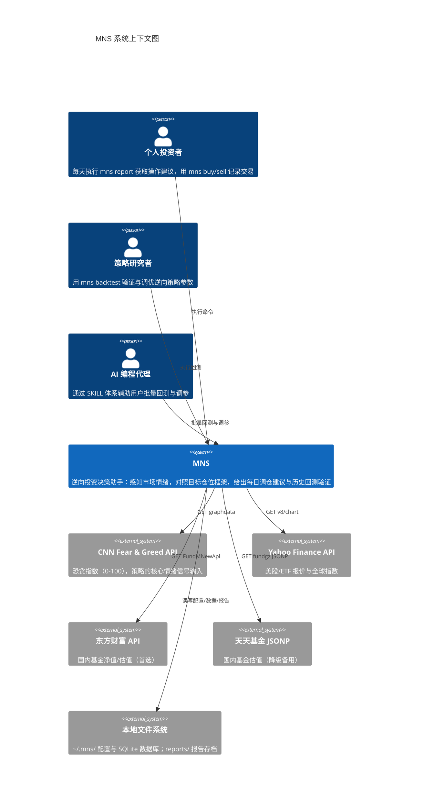

# 1. 概述

> 本文档由 Terrain 文档流水线生成，面向首次接触 MNS 的读者。

## 项目是什么

MNS（**M**oney **N**ever **S**leeps）是一个面向个人投资者的**逆向投资决策助手**，以命令行工具（CLI）的形式运行在本地。它不做交易、不预测市场，只做一件事：**在恐慌时提醒你贪婪，在贪婪时提醒你恐慌**。

这个工具的诞生源于一个朴素的投资观察：市场情绪（恐惧与贪婪）是均值回归的——极度恐慌之后往往跟着修复，极度贪婪之后往往跟着回调。绝大多数散户亏钱不是因为不懂这个道理，而是因为**在情绪极值点管不住手**：恐慌时被吓到不敢买，贪婪时被冲昏不愿卖。MNS 把"在恐慌中贪婪、在贪婪中恐慌"这条逆向策略固化成一套可计算的规则，用 `mns report` 一条命令，给出今天该买多少、该卖多少、该警惕什么的明确建议。

它是一个"决策支持系统"而非"自动交易系统"：建议由程序给出，买卖决定永远由用户做出（`c1-system-context.md` 系统边界章节明确排除了自动执行交易）。工具的真正价值在于**纪律性**——当大盘暴跌、恐慌指数飙升时，它不会像人一样手足无措，而是冷静地算出"应该加仓多少钱"。

## 核心能力

MNS 的能力可以概括为"一个闭环 + 一个审计"：

- **决策闭环**：实时拉取 CNN 恐贪指数作为情绪信号 → 对照用户的目标仓位框架 → 计算每类资产的调仓计划 → 渲染成每日报告。整个闭环由一条命令 `mns report` 触发。
- **历史审计**：用 2016-2025 的真实全收益数据回测策略，回答"这套规则过去十年会赚多少、亏多少、抗不抗揍"——并且诚实披露回测的局限（README 明确写出"买入持有年化 14.60% 优于策略 12.75%，本工具的价值仅在风险调整后成立"）。

所有功能通过 17 个命令行命令暴露，核心数据（持仓、现金、交易、价格历史、情绪快照）持久化在用户本机的 SQLite 单文件数据库（`~/.mns/mns.db`），配置集中在 `~/.mns/config.toml`。

## 系统上下文

MNS 是一个完全本地的个人工具：没有图形界面、没有远程服务端、不管理多用户。它对外部世界的依赖只有两个方向——**拉取市场数据**（CNN 恐贪指数、美股/ETF 价格、国内基金净值）和**读写本地文件**（配置 + 数据库 + 报告）。

数据流向高度单向化：**外部市场数据（情绪 + 价格）→ 本地持久化 → 策略计算 → 报告输出**。回测引擎则旁路复用同样的策略代码，用编译期嵌入的历史数据做验证。

## 用户画像

| 角色 | 描述 | 主要使用场景 |
|------|------|------------|
| 个人投资者（核心） | 持有 A 股基金/美股 ETF/黄金的个人，希望系统化执行逆向投资 | 每日 `mns report` 获取操作建议；`mns update-prices` 更新价格；`mns portfolio` 查看持仓 |
| 策略研究者（进阶） | 想验证/调优逆向策略参数的用户 | `mns backtest`、`mns backtest validate` 对比策略表现、做样本外验证 |
| AI 编程代理（协作） | 通过 SKILL 辅助用户调参的 AI 工具 | 读取 `.ai-context/SKILL.md`、执行 `mns backtest run --config` 批量验证 |

## 业务价值

- **解决的核心问题**：投资者在恐慌/贪婪极点时做出反直觉但正确的仓位决策，防止情绪化追涨杀跌。
- **主要输入**：CNN 恐贪指数（实时）、资产价格（实时/手工）、用户持仓记录（手工录入买卖）。
- **主要输出**：每日策略报告（终端 + `reports/*.txt` 落盘）、持仓/交易/市场概况表格、回测对比报告。
- **决策逻辑**：目标仓位框架——由恐贪指数映射出"风险资产目标总权重"（极度恐慌 85% → 极度贪婪 35%），实际权重偏离目标超过带宽（±4pp）才动作；卖出先于买入计算，卖出现金回收计入买入预算。
- **诚实披露**：工具不保证跑赢买入持有，价值仅在风险调整后（更低回撤、更高 Calmar）成立。

## 文档导航

| 文档 | 内容 |
|------|------|
| [2. 架构](./2.架构.md) | 系统架构、模块划分、关键设计决策、技术栈 |
| [3. 工作流](./3.工作流.md) | 五大核心工作流、时序交互、并发与错误处理 |
| [4. Deep-Exploration](./4.Deep-Exploration/README.md) | 九个领域模块的深度拆解 |
| [5. 边界接口](./5.边界接口.md) | CLI 命令、配置结构、外部 API 集成 |
| [6. 数据库概览](./6.数据库概览.md) | SQLite 五张表的结构与关系 |
