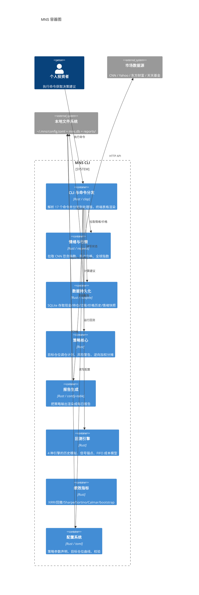
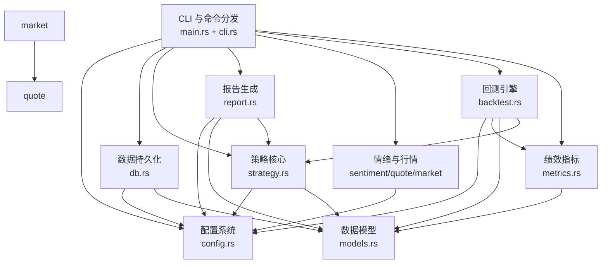

# 2. 架构

> 面向想要理解"MNS 是怎么组织起来的"的读者。本文从整体架构模式讲起，再到模块划分、关键数据结构，最后落到关键设计决策。

## 架构概览

MNS 是一个**分层单片式 CLI 应用**。把它想象成一家小型"决策咨询公司"会更直观：**前台（CLI）**接待你的指令，**数据科（情绪与行情）**负责出去收集市场情报，**档案室（数据持久化）**把所有信息归档，**分析师（策略核心）**基于情报与档案给出建议，**秘书（报告生成）**把建议写成工整的报告，而**审计部门（回测引擎）**定期用历史数据检验分析师的建议靠不靠谱。

这不是偶然的扁平结构，而是一种刻意为之的克制。作为一个个人工具，它不需要微服务、不需要消息队列、不需要复杂的依赖注入——**极简的模块边界 + 单一入口分发**已经足够。证据是 `main.rs` 作为唯一枢纽直接调用所有模块（src/main.rs:24-64），模块之间通过 `crate::` 引用保持轻量耦合，没有循环依赖、没有全局共享可变状态。

## 模块划分

MNS 源码为 `src/` 下 11 个平铺的 `.rs` 文件，按 DDD 语义划分为 9 个领域模块。之所以叫"领域模块"而不是"服务"，是因为模块之间的耦合是源码级（`use crate::`）而非进程级——它们共享同一个二进制、同一份内存、同一份数据文件。

| 模块 | 源文件 | 核心职责 | 域类型 | 重要性 |
|------|--------|---------|--------|-------|
| 策略核心 | src/strategy.rs | 目标仓位调仓计划、风险警告、逆向加权分摊 | 核心域 | 10 |
| 回测引擎 | src/backtest.rs | 4 种策略引擎的历史模拟、信号锚点、FIFO 成本 | 核心域 | 8 |
| 报告生成 | src/report.rs | 每日策略报告渲染与落盘 | 核心域 | 8 |
| 情绪与行情 | src/sentiment.rs + src/quote.rs + src/market.rs | 恐贪指数、资产价格、市场指数获取 | 核心域 | 7 |
| 数据持久化 | src/db.rs | SQLite 存取全部本地状态 | 支撑域 | 7 |
| 绩效指标 | src/metrics.rs | XIRR/回撤/Sharpe/Sortino/Calmar/bootstrap | 支撑域 | 6 |
| 配置系统 | src/config.rs | 策略参数声明、目标仓位曲线、成本模型、校验 | 支撑域 | 7 |
| CLI 与命令分发 | src/cli.rs + src/main.rs | clap 定义 + 17 个命令的处理器 | 通用域 | 6 |
| 数据模型 | src/models.rs | Position/Transaction/FearGreedSnapshot 纯数据 | 通用域 | 5 |

模块间的依赖方向遵守一个清晰的原则：**通用域和支撑域在下，核心域在上**。`models.rs`（纯数据）被几乎所有模块依赖却不依赖任何人；`config.rs` 同样只提供纯数据与校验逻辑；而 `main.rs` 作为顶层枢纽，依赖全部业务模块但反过来不被打扰。这个分层让每个模块都可以独立读、独立测——回测引擎 15+ 个单元测试、策略模块 760-780 行测试都是这种可测性的受益者。

## 关键数据结构

理解这些类型就理解了 MNS 的决策闭环。它们大多是"纯数据 + 少量方法"的结构体，在模块间作为显式契约传递：

| 类型 | 文件位置 | 用途 |
|------|---------|------|
| `AppConfig` | src/config.rs:7 | 全部策略参数的容器，分 9 个子结构管理目标仓位/成本/阈值/配置 |
| `TargetWeight` | src/config.rs:31 | 情绪→风险资产目标权重的 5 档曲线（极度恐慌 85%→极度贪婪 35%） |
| `RebalancePlan` | src/strategy.rs:360 | 调仓计划的根类型：目标 vs 当前权重、每腿建议金额、现金约束标记 |
| `LegPlan` | src/strategy.rs:334 | 单条资产腿（美股/A 股/黄金）的目标/当前权重、偏离、建议金额 |
| `Position` | src/models.rs:5 | 持仓快照：份额、成本价、现价、首次买入日 |
| `MonthRow` | src/backtest.rs:38 | 回测数据行：月末日期 + FGI + 三腿价格 |
| `BacktestResult` | src/backtest.rs:406 | 回测产出：XIRR、回撤、风险指标、交易列表、逐月序列 |
| `SignalConfig` | src/backtest.rs:268 | 信号配置：平滑窗口、锚点（情绪/趋势）、趋势参数、情绪倾斜量 |

其中 `RebalancePlan` / `LegPlan` 是"目标权重 + 偏离带"框架的载体，`Position` 是全系统流转最频繁的数据形状——db 读出、策略计算、报告渲染全程复用同一个类型，杜绝了"层层转换导致的信息损耗"。

## 核心设计决策

以下六个决策决定了 MNS 现在的样子。每个都值得理解"为什么选 A 而不选 B"，因为它们不是随意选择，而是针对个人金融工具这个场景的刻意权衡。

### 决策 1：回测与实盘共用决策代码（单一口径）

回测引擎没有复制一份策略逻辑，而是直接复用 `strategy.rs` 的决策函数：`Engine::Legacy` 调用 `calculate_buy_suggestions`/`calculate_sell_suggestions`（src/backtest.rs:18, src/backtest.rs:753-797），实盘报告调用 `calculate_rebalance_plan`（src/main.rs:379）。回测的 `rebalance_to_weights`（src/backtest.rs:687）与实盘的 `calculate_rebalance_plan`（src/strategy.rs:406）都共享 `config.target_weight_for`（src/config.rs:350）这条"情绪→目标仓位"映射。

**为什么这样做**：如果回测用一套独立逻辑、实盘用另一套，就会出现"回测回测的是纸上策略，实盘跑的是另一套"的系统性失真——这是金融工具最容易踩的坑。共用代码牺牲了"回测实现独立清晰"，换来**实盘与回测口径完全一致**，是避免"回测好看、实盘拉胯"的根本保障。

### 决策 2：目标权重思维取代现金比例思维

旧框架的买入逻辑是"花掉手上现金的百分之几"（src/strategy.rs:79-288）。这有两个致命缺陷：连续恐慌期弹药几何衰减（越买越没钱），以及路径依赖（刚注资则买入金额被放大）。新框架（设计动机记录在 src/config.rs:25-29 注释）始终对照"我应该持有多少风险资产"，只在实际权重偏离目标超过带宽时才动作。

**为什么这样做**：把逆向策略从"直觉"变成"可回测、可验证、无路径依赖的规则"。目标权重是"锚"，带宽是"容忍度"，这个组合天然限制了单次加仓的仓位上限，也避免了连续下跌时把钱在 10% 的跌幅里就全部打完的窘境。

### 决策 3：SQLite 单文件 + TOML 配置，不引入 ORM/迁移框架

schema 由 `init_tables` 内联的 `CREATE TABLE IF NOT EXISTS` 管理（src/db.rs:24-73），配置带 `#[serde(default)]` 向后兼容（src/config.rs:15-22），旧配置缺少新字段仍可加载（src/config.rs:636 测试保障）。

**为什么这样做**：个人工具没有多版本多环境并发运维的需求。零配置、开箱即用、备份就是复制两个文件，比引入一套迁移工具链划算得多。代价是 schema 演进靠"幂等建表"而非显式迁移——但对单用户本地库，这恰恰是最低负担的方案。

### 决策 4：回测数据编译期嵌入

历史数据通过 `include_str!` 编译进二进制（src/backtest.rs:24-29），而非运行时读外部 CSV。

**为什么这样做**：换来二进制自包含与结果可复现——回测结论必须可审计，同一个二进制在任何机器上跑出的结果完全一致。代价是更新数据需重新编译，但对一年最多更新几次的月度数据完全可接受。

### 决策 5：XIRR 作为年化主口径

分批注资下（期初 10 万、中途又投 10 万），简单年化 `(期末/总投入)^(1/年数)` 会把晚到的资金误当作全程投入，系统性低估真实收益。XIRR（现金流加权收益率）通过求解净现值方程得到准确值（src/metrics.rs:1-4 注释）。

**为什么这样做**：度量口径的诚实直接决定"策略到底好不好"的结论可信度。README 的诚实披露（买入持有收益更高、工具价值仅在风险调整后成立）正是建立在这把尺子之上的。

### 决策 6：多源冗余 + 重试降级

价格获取按代码特征路由：6 位纯数字 → 天天基金（东财移动端优先、JSONP 兜底，src/quote.rs:32-129），字母 → Yahoo（src/quote.rs:132-176）。恐贪指数带 3 次重试与 418 反爬处理（src/sentiment.rs:57-104）。

**为什么这样做**：免费金融 API 随时可能反爬、限流甚至下线，单数据源是单点故障。多源冗余 + 优雅降级让"一个源挂了"不至于让整个命令失败；批量价格更新中单个资产失败只警告不中断（src/quote.rs:218-231），体现"局部失败不应导致全局中断"的容错理念。

## 技术栈

技术选型围绕"个人金融工具"这一场景展开——需要可靠、轻量、跨平台、可长期维护，而不是追求极限性能或炫技：

| 层次/领域 | 技术选型 | 选择理由 |
|---------|---------|---------|
| 语言与运行时 | Rust edition 2024 + Tokio | 单一静态二进制、内存安全、跨平台（darwin/linux/windows）；Tokio 处理网络请求的并发等待 |
| CLI | clap 4（derive） | 声明式定义命令/参数/帮助，与 Rust 类型系统天然结合 |
| HTTP | reqwest 0.12 + rustls-tls | 成熟异步客户端；选 rustls 而非 OpenSSL，避免跨平台原生依赖编译问题 |
| 数据库 | rusqlite + bundled SQLite | 零配置、单文件、SQL 能力足够；`bundled` 特性免去系统级 SQLite 依赖 |
| 序列化 | serde + serde_json + toml | 配置用 TOML（人类可编辑），API 响应用 JSON（机器解析） |
| 日期时间 | chrono | Rust 生态标准日期库，回测需要精确的日期算术与排序 |
| 终端渲染 | comfy-table + unicode-width | 中文终端对齐需要按显示宽度而非字符数补齐（src/report.rs:12-19 专门处理） |
| 错误处理 | anyhow | 个人工具优先"快速失败 + 友好报错"，无需自定义错误类型 |

## 边界与不做什么

MNS 的克制是架构的一部分。明确不在范围内的事：

- **不执行交易**：只给建议，不连接券商、不下单。
- **不预测市场**：不做涨跌方向预测，只做情绪→仓位的规则映射。
- **不管理多用户/多账户**：单用户、单数据库（`~/.mns/mns.db`）。
- **无 GUI/Web 服务**：纯 CLI，本地运行。
- **不保证跑赢买入持有**：README 明确披露收益低于买入持有，价值仅在风险调整后（低回撤）成立。

这些"不做"保证了系统的简单性——没有券商协议、没有推送服务、没有多租户隔离，每一行代码都在服务"决策支持"这一个核心命题。

## 延伸阅读

- 各模块的深度拆解见 [4. Deep-Exploration](./4.Deep-Exploration/README.md)
- 数据在模块间如何流转见 [3. 工作流](./3.工作流.md)
- 对外接口清单见 [5. 边界接口](./5.边界接口.md)
