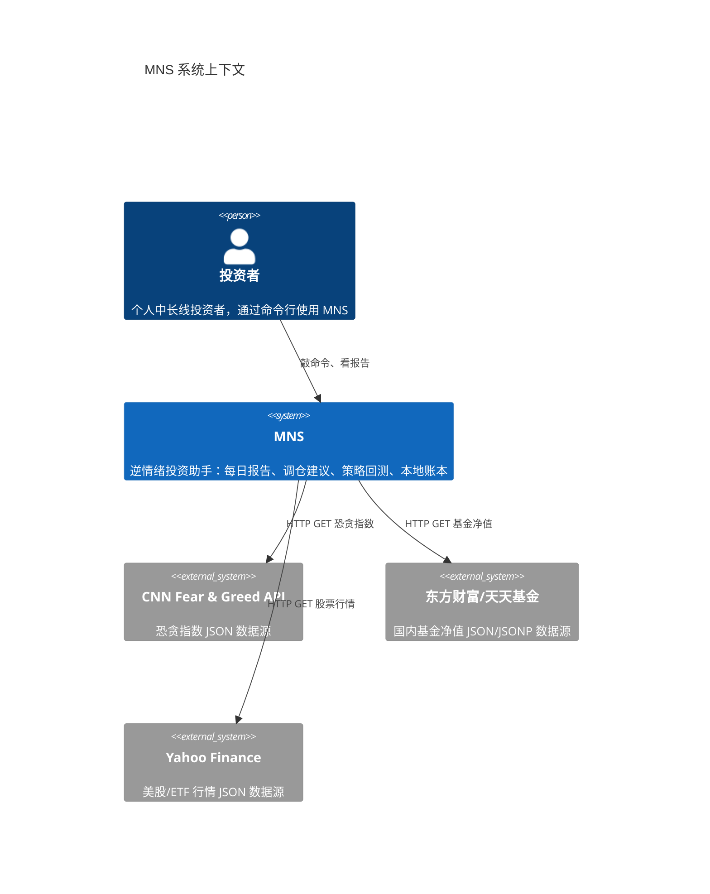
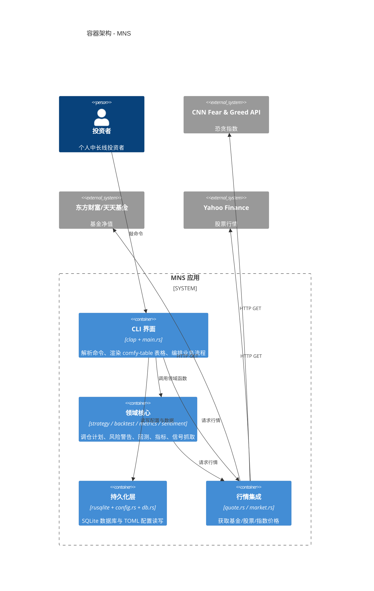
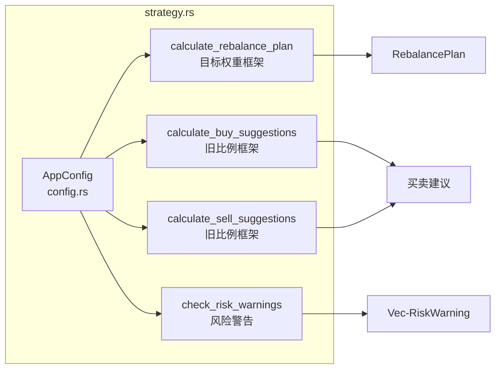
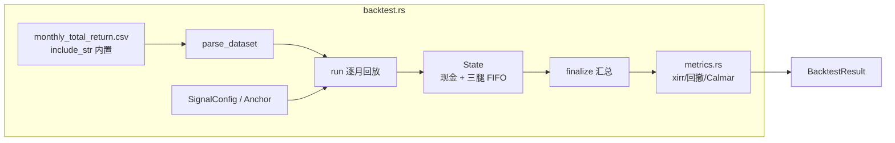
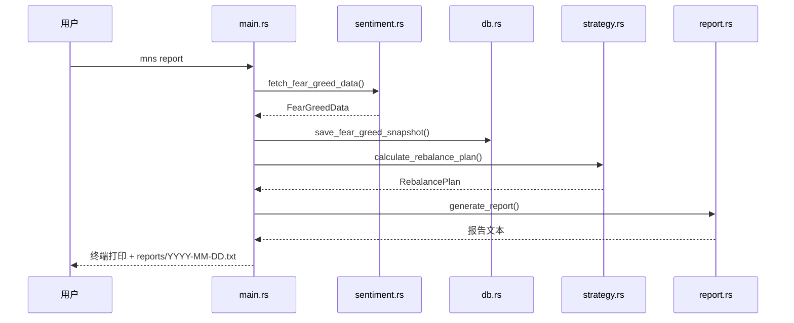
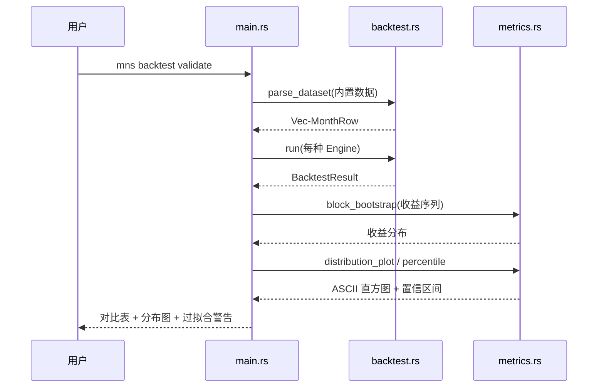

# 系统架构文档：MNS（Money Never Sleeps）

**版本：** 1.0
**分类：** 内部架构文档
**生成日期：** 2026-08-03

---

## 1. 架构概述

### 1.1 设计理念

理解 MNS 的架构，关键是抓住一句话：**它是一座"薄壳 + 纯函数核心"的命令行应用**。主入口 `main.rs`（943 行）虽然很厚，但里面几乎全是"打开数据库 → 调领域函数 → 渲染表格 → 打印"的胶水代码，真正的投资逻辑全部住在 `strategy.rs`、`backtest.rs`、`metrics.rs` 这些纯函数模块里。这种分层换来四个可验证的好处，下面逐一说明。

**1. 领域逻辑与表现层彻底分离**

决策计算（调仓计划、风险警告）与信息呈现（表格、报告文本）互不感知。`strategy::calculate_rebalance_plan` 返回一个纯粹的 `RebalancePlan` 数据结构，它不知道也无需知道这个计划最终是打印在终端还是写进 `reports/*.txt`——渲染全权交给 `report.rs`。这样任何一端改动都不会波及另一端。

**2. 模块边界 = 文件边界，职责单一**

项目刻意保持 `src/` 下 12 个平铺 `.rs` 文件，每个文件一个清晰主题：`cli.rs` 只管命令定义、`config.rs` 只管参数与校验、`db.rs` 只管持久化、`models.rs` 只管数据契约、`sentiment.rs` 只管恐贪抓取、`quote.rs` 只管价格抓取……没有一个文件跨领域做两件不相干的事。这种扁平结构的收益是"新工程师 10 分钟能找到任何功能的实现"。

**3. 诚实优先：局限被写进输出**

这不是一句口号，而是架构层面的刻意安排。回测引擎（`backtest.rs`）与报告生成（`report.rs`）把策略的已知缺陷——情绪信号贡献近零、买入持有收益更高——作为**正式输出内容**呈现给用户，而不是藏在角落。这让工具天然免疫"自我吹嘘"，也让用户对它的判断保持健康怀疑。

**4. 新旧框架共存但隔离**

`strategy.rs` 里同时存在新一代目标权重框架（`calculate_rebalance_plan`，驱动实盘报告）与旧一代比例框架（`calculate_buy_suggestions`/`calculate_sell_suggestions`，仅保留给 `Engine::Legacy` 回测做对照）。它们同文件共存，但在代码层面被函数签名清晰隔开，旧的不会污染新的调用链。这种"并排对照"是回测公平性的基础——新旧策略必须在同一数据、同一成本模型下对比。

### 1.2 核心架构模式

| 模式 | 实现方式 | 目的 |
|------|---------|------|
| 薄壳 + 纯函数核心 | `main.rs` 只编排，领域逻辑在 `strategy`/`backtest`/`metrics` | 让投资逻辑无副作用、可单元测试、可复现 |
| 命令分派表 | `main()` 用 match 把 `Commands` 变体分派到 `cmd_*`（`src/main.rs:23`） | 每个命令独立可调试、独立失败不互相影响 |
| 数据契约集中 | `models.rs` 定义 `Position`/`Transaction` | 模块间传递数据的"通用语"，跨层不私传 |
| 防御式配置 | `AppConfig::validate` 拒绝非法配置（`src/config.rs:255`） | 从入口杜绝"写坏配置"，策略语义的数学内核由校验强制 |
| 事务化账本 | `db.rs` 买卖记账用事务包裹（`src/db.rs:170`） | 持仓/现金/流水永远一致 |

### 1.3 技术栈概述

MNS 是 Rust edition 2024 项目，技术栈选择的核心逻辑在 1.概述.md 已有详述，此处补充架构相关的细节：异步只用于行情抓取场景（`tokio` + `futures`），回测与指标计算是纯同步计算；数据库用 `rusqlite` 直接嵌 SQLite，无 ORM、无连接池——因为单用户单连接场景下它们只增加复杂度和间接层；表格渲染用 `comfy-table` 配合 `unicode-width` 解决中英文混排的对齐问题（`src/report.rs:12`）。外部 HTTP 依赖仅有 `reqwest`，JSON 解析用 `serde_json`（含容错路径 `from_str::<T>().unwrap_or_default()`，`src/quote.rs:75`）。

---

## 2. 系统上下文（C4 Level 1）

MNS 是一个边界清晰的单机系统：它只对外读取行情，从不对外写任何东西。下图的三个外部系统都是免费公开接口，且全部走容错降级路径。

---

## 3. 容器视图（C4 Level 2）

把系统放大一层，可以看到四个内聚的容器：CLI 界面负责一切与用户的交互，领域核心承载全部投资逻辑，持久化层管住账本与参数，行情集成负责与外部世界对话。注意 `quote` 容器同时被领域核心和 CLI 引用——因为市场速览（`mns market`）是纯展示场景，不需要经过领域计算。

### 3.1 领域模块职责

下面这张表是理解 MNS 的"地图"。值得特别关注的是 `config.rs` 的定位——它不止是参数容器，还实现了全部业务映射函数（情绪区间划分、情绪→目标权重、三腿拆分、成本计算），这是"参数与参数的用法住在同一文件"的刻意设计。

| 模块/领域 | 路径 | 职责 | 关键抽象 |
|---------|------|------|---------|
| 命令入口 | `src/cli.rs` | 定义 18 个命令与参数校验 | `Cli` / `Commands` / `CashAction` / `BacktestAction` |
| 编排层 | `src/main.rs` | 命令分派、业务流程编排、表格渲染 | `main()` / 各 `cmd_*` 函数 |
| 配置管理 | `src/config.rs` | 参数定义、校验、业务映射函数 | `AppConfig` / `TargetWeight` / `Rebalance` / `Costs` / `validate()` |
| 数据模型 | `src/models.rs` | 持仓/交易数据契约 + 收益计算 | `Position` / `Transaction` |
| 持久化 | `src/db.rs` | SQLite 读写、事务化买卖记账 | `Database` / `buy_position` / `sell_position` |
| 策略 | `src/strategy.rs` | 调仓计划、风险警告、新旧框架 | `RebalancePlan` / `LegPlan` / `RiskWarning` / `calculate_rebalance_plan` |
| 回测 | `src/backtest.rs` | 多引擎回放、成本模型、XIRR | `Engine` / `State` / `Leg` / `Lot` / `rebalance_to_weights()` |
| 指标 | `src/metrics.rs` | XIRR/回撤/Calmar/bootstrap 分布 | `xirr()` / `block_bootstrap()` / `distribution_plot()` |
| 恐贪信号 | `src/sentiment.rs` | 抓取 CNN 恐贪指数 | `FearGreedData` / `fetch_fear_greed_data()` |
| 价格行情 | `src/quote.rs` | 基金/股票/ETF 价格抓取与路由 | `PriceUpdate` / `StockQuote` / `fetch_price()` |
| 市场速览 | `src/market.rs` | 宽基指数表 + 恐贪表渲染 | `MainIndex` / `MAIN_INDEXES` / `render_market_table()` |
| 报告生成 | `src/report.rs` | 每日报告组装与落盘 | `generate_report()` / `save_report()` / `pad_display()` |

---

## 4. 组件视图（C4 Level 3）

### 4.1 策略模块组件架构

策略模块是 MNS 的决策核心。它以"目标仓位曲线 + 偏离带宽"为骨架，产出逐腿的调仓计划与风险警告。注意新旧两代框架在模块内是并排但隔离的——实盘走 `calculate_rebalance_plan`，旧框架只服务回测对照。

**组件职责：**
- **`calculate_rebalance_plan`**（`src/strategy.rs`）：新框架主入口，输出 `RebalancePlan`（含逐腿 `LegPlan`、偏离带宽判断、风险警告）。
- **`calculate_buy_suggestions` / `calculate_sell_suggestions`**（`src/strategy.rs`）：旧框架保留函数，仅被 `Engine::Legacy` 回测调用。
- **`check_risk_warnings`**（`src/strategy.rs`）：基于恐贪快照历史序列发出情绪极端警告（如"恐贪 92，贪婪程度异常高"）。

### 4.2 回测引擎组件架构

回测引擎是一个"时间机器"：同一份 112 个月数据喂给四种策略，公平对比。它的内部有一个 FIFO 批次账本（`Leg`/`Lot`），让赎回费按每个批次的真实持有天数计算。

**组件职责：**
- **`parse_dataset`**（`src/backtest.rs:53`）：解析内置 CSV 为 `MonthRow` 序列并排序。
- **`run`**（`src/backtest.rs:557`）：逐月推进状态机（现金生息 → 注资 → 调仓 → 记账）。
- **`State` / `Leg` / `Lot`**（`src/backtest.rs:437/103/96`）：账户状态与 FIFO 批次账本。
- **`rebalance_to_weights`**（`src/backtest.rs:687`）：与实盘 `calculate_rebalance_plan` 同源的目标仓位调仓。
- **`finalize`**（`src/backtest.rs:799`）：汇总现金流并调 `metrics::xirr` 计算年化收益。

---

## 5. 关键流程

### 5.1 每日策略报告流程

### 5.2 回测与样本外验证流程

---

## 6. 技术实现

### 6.1 关键架构模式

**配置即策略语义**：`AppConfig` 承载的不只是键值对，而是完整的业务映射。`validate()`（`src/config.rs:255`）强制"目标权重随情绪单调不增"（`src/config.rs:300`），从配置层面锁死逆向策略的数学内核——任何人想"调参把策略调反"都会在校验这关被拦下。

**双轨策略的隔离共存**：实盘用目标权重框架，旧比例框架只活在回测的 `Engine::Legacy` 分支里。两个框架的函数签名清晰分离（`src/strategy.rs`），确保旧代码不会通过任何默认路径影响实盘建议。

**趋势锚目前只存在于回测**：`backtest.rs` 的 `Anchor::TrendTilt`（价格 vs 12 月均线 + 情绪倾斜）样本内表现优于实盘用的情绪锚，但它读的是回测自带的历史行情数据集，不依赖账本；`mns report` 未接入这一信号，仍走纯情绪锚（`Anchor::SentimentOnly`）。此前曾有一套"为趋势锚预埋每日价格"的账本表（`price_history`/`monthly_price_history`）,因从未被任何调用方读取而已随半成品一起移除——若未来要把趋势锚接入实盘，需要重新设计数据管道，而不是复用这套已删除的机制。

### 6.2 并发和并行策略

MNS 是单用户工具，并发只出现在一个场景：**行情抓取**。`cmd_market` 用 `futures::join!` 同时抓 9 个指数与恐贪指数（`src/market.rs:44`），把一个串行 ~10 秒的操作压缩到 ~2 秒。其他所有流程都是同步串行——回测、指标、记账均无并发需求。`block_bootstrap`（`src/metrics.rs:164`）在代码里预留了 Rayon 并行开关的注释位，但个人工具秒级场景下刻意未启用。

### 6.3 性能优化策略

- **编译期数据**：回测数据集通过 `include_str!`（`src/backtest.rs:24`）编译进二进制，运行时零 I/O 加载。
- **失败隔离**：批量价格更新中单个标的失败只打警告、继续处理其他（`src/quote.rs:217-231`），不因单点失败阻塞全批。
- **幂等建表**：`CREATE TABLE IF NOT EXISTS`（`src/db.rs:25`）让 `Database::open` 永远安全可重复调用。
- **确定性随机**：bootstrap 用种子固定的 xorshift（`src/metrics.rs:160`），保证同数据重跑结果完全一致，避免"重跑验证数字变了"的困惑。

---

## 附录：架构决策记录（ADR）

**ADR 1：模块粒度采用"文件即模块"扁平结构**
- **决策**：不建 `src/` 子目录，12 个领域各一个 `.rs` 文件。
- **原因**：项目规模小（~5000 行），平铺让每个功能"一找就到"，降低导航成本；过度分层只增加认知负担。
- **后果**：新增功能需注意文件大小（`backtest.rs` 已达 1293 行）；若未来增长可拆分 `backtest/` 目录。

**ADR 2：新旧策略框架同文件共存**
- **决策**：保留旧比例框架函数，仅服务 `Engine::Legacy` 回测对照。
- **原因**：回测公平性要求新旧策略在同一数据、同一成本模型下对比；删除旧框架会失去"升级是否值得"的证据。
- **后果**：`strategy.rs` 文件偏大，但两个框架调用链互不污染；实盘路径不会执行旧代码。

**ADR 3：配置携带业务映射逻辑**
- **决策**：`AppConfig` 实现 `sentiment_zone`/`target_weight_for`/`asset_target_weights` 等映射函数，而非只做数据容器。
- **原因**：参数与参数的用法同居一处，策略引擎只需依赖 `AppConfig` 即可取到全部决策输入；防止映射逻辑散落多处导致口径不一致。
- **后果**：`config.rs` 变大，但"参数 → 行为"的对应关系单一可查。

**ADR 4：买卖记账用事务保证原子性**
- **决策**：`buy_position`/`sell_position` 用 SQLite 事务把持仓、现金、流水三步包成一体（`src/db.rs:170`）。
- **原因**：账目一致性是投资工具的底线；任何一步失败必须整体回滚，绝不允许"持仓变了现金没扣"。
- **后果**：记账路径无性能问题（单用户点写），换取数据完整性的强保证。

**ADR 5：行情抓取"多源降级 + 失败隔离"**
- **决策**：国内基金双源（东财 mobile 主、天天 JSONP 备，`src/quote.rs:124`）；批量更新单点失败仅警告。
- **原因**：依赖的是免费公开接口，稳定性不可控；宁可部分成功也不全盘失败。
- **后果**：`mns update-prices` 在接口不稳定时仍能更新大部分资产；单接口的可靠性问题被隔离在单个资产内。
