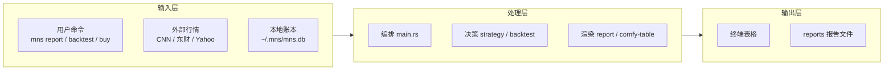
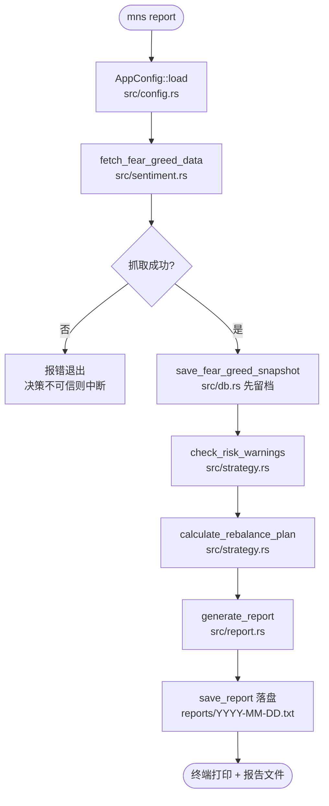
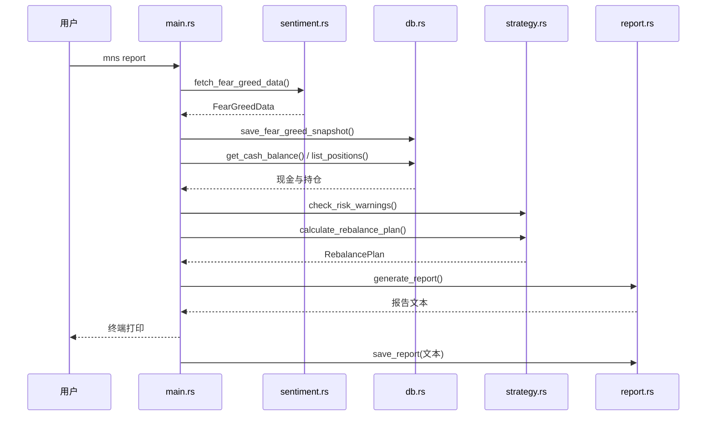
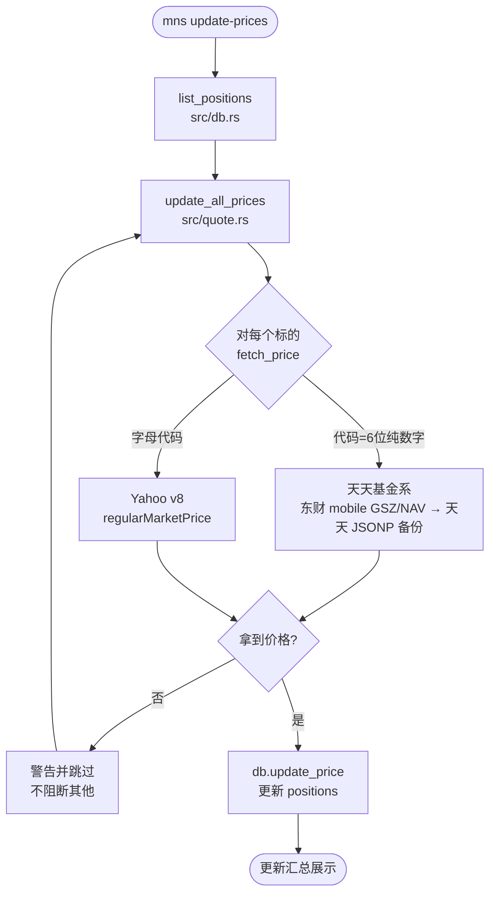
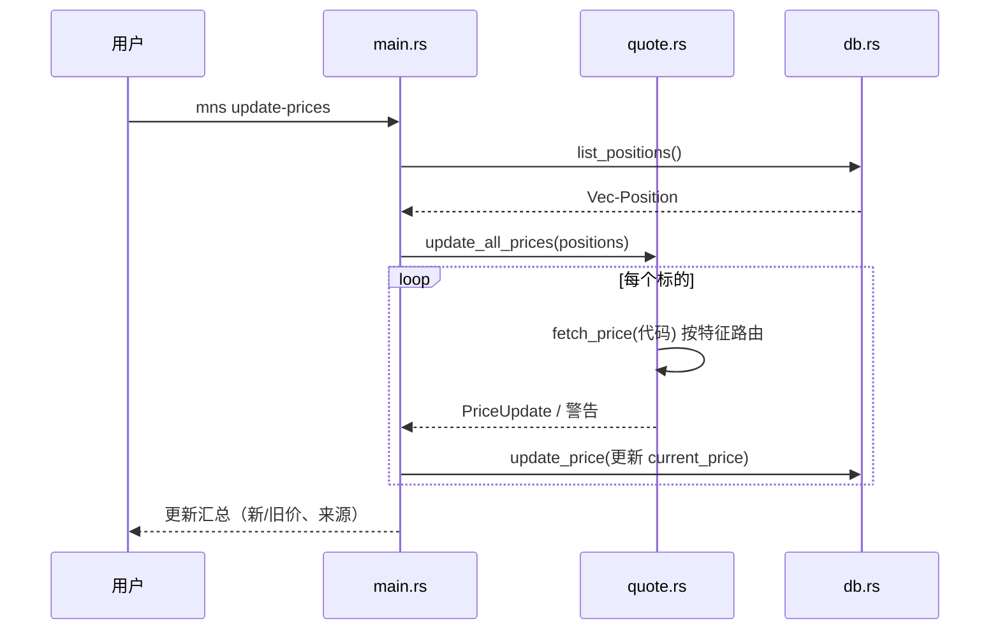
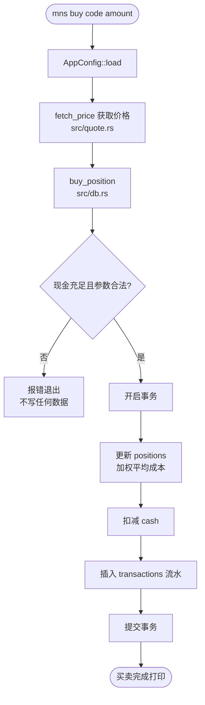
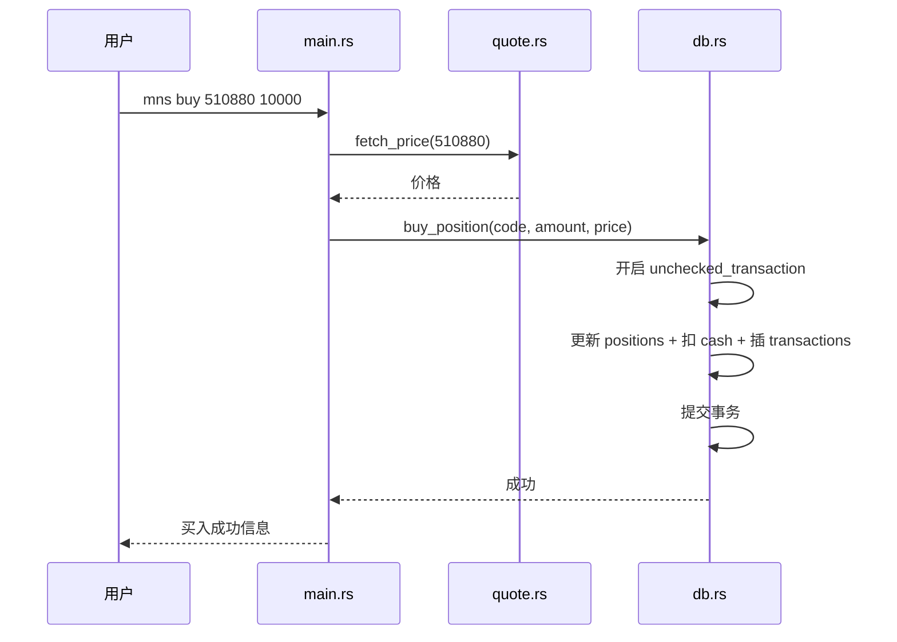
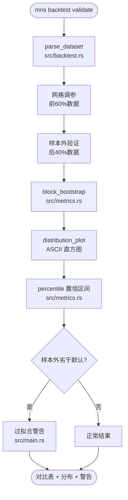
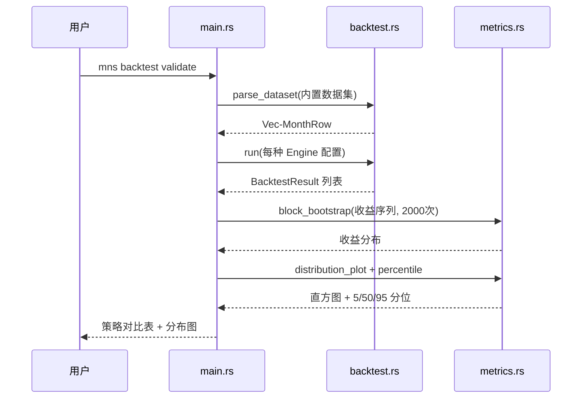

# 核心工作流

## 1. 工作流概述

### 1.1 系统架构与工作流理念

MNS 的工作流理念可以用一个比喻概括：**它像一家分工明确的小型银行柜台**。柜员（`main.rs`）负责接待客户、接单、递出结果；信贷员（`strategy.rs`）负责评估该借多少、该收回多少；档案员（`db.rs`）负责把每一笔业务原原本本记进账本；而市场专员（`sentiment.rs` / `quote.rs` / `market.rs`）负责去外面打听行情。每个岗位只做自己那一摊事，所有跨岗位的协作都由柜员按固定顺序串联。

这个系统一共只有四条核心工作流，它们的共同点是**"先取证、再决策、后留档"**：先抓取或读取事实数据，再调用领域函数做决策，最后把决策结果写进本地账本或报告文件。四套流程的代码都遵循同一个骨架：`AppConfig::load()` + `Database::open()` → 取数据 → 算决策 → 渲染/落盘。

### 1.2 核心执行路径

---

## 2. 主要工作流

### 2.1 每日策略报告流程（mns report）

这条流程是 MNS 的主干——它把"市场情绪 → 目标仓位 → 调仓建议 → 风险警告 → 报告留档"串成一条流水线，回答投资者每天早上最关心的那个问题：**今天该动还是该等？** 它的设计精髓是"先留档再决策"：当天的恐贪指数先落库，然后才用它做决策，确保任何一天的建议都能在未来回溯当时的市场状态。

#### 流程图

#### 时序图

#### 阶段说明
| 阶段 | 执行者 | 输入 | 输出 | 说明 |
|------|-------|------|------|------|
| 配置加载 | main.rs + config.rs | 无 | `AppConfig` | 读 `~/.mns/config.toml` 并校验 |
| 情绪抓取 | sentiment.rs | URL | `FearGreedData` | 带重试的 CNN 抓取；失败则中断（`src/main.rs:356`） |
| 情绪留档 | db.rs | `FearGreedData` | 无 | `save_fear_greed_snapshot` 同日去重落库（`src/main.rs:361`） |
| 风险检查 | strategy.rs | 快照序列 | `Vec<RiskWarning>` | 情绪极端时给警告 |
| 决策计算 | strategy.rs | 持仓+现金+情绪 | `RebalancePlan` | 目标权重框架，含逐腿偏离与带宽判断 |
| 报告生成 | report.rs | 全部决策产物 | 报告 String | 排版渲染，中文对齐处理 |
| 报告落盘 | report.rs | 报告 String | `reports/YYYY-MM-DD.txt` | 每天一份，天然幂等 |

### 2.2 价格更新流程（mns update-prices）

价格更新是"让账户价值保持新鲜"的流程。它的核心性格是**宽容**——面对免费公共接口的不稳定，它选择"能更新多少更新多少"，单个标的失败绝不拖垮整批。这也是它和 `mns report` 严格失败策略的刻意差异。

#### 流程图

#### 时序图

#### 阶段说明
| 阶段 | 执行者 | 输入 | 输出 | 说明 |
|------|-------|------|------|------|
| 持仓读取 | db.rs | 无 | `Vec<Position>` | 读出全部持仓代码与现价 |
| 价格路由 | quote.rs | `Position` | `PriceUpdate` | 按代码特征决定数据源（`src/quote.rs:178`） |
| 失败隔离 | quote.rs | 抓取结果 | 警告 | 单点失败仅 `eprintln!` 后继续（`src/quote.rs:217-231`） |
| 落库 | db.rs | `PriceUpdate` | 无 | 更新 `positions.current_price` |

### 2.3 买卖记账流程（mns buy / mns sell）

买卖记账是账本的"写入路径"，它的核心性格是**严格**——与价格更新的宽容形成对照。账目是投资工具的底线，所以这里用事务保证原子性、用代码校验保证合理性（现金不足拒绝买入、超持拒绝卖出）。

#### 流程图

#### 时序图

#### 阶段说明
| 阶段 | 执行者 | 输入 | 输出 | 说明 |
|------|-------|------|------|------|
| 价格获取 | quote.rs | 代码 | 价格 | 与报告流程共用同一价格路由 |
| 事务写入 | db.rs | 代码/金额/价格 | 无 | 三步写库一体提交（`src/db.rs:170`） |
| 参数校验 | db.rs | 现金/份额/价格 | 校验结果 | 现金不足、份额为负、超卖等均拒绝 |

### 2.4 回测与样本外验证流程（mns backtest）

回测是 MNS 的"诚实的自我检验"——它把策略放回 2016-2025 年的真实数据里跑一遍，再跑一个 walk-forward 的样本外验证，专门防"回测漂亮、实盘失效"。这条流程的独特之处在于它把"收益分布"当核心输出：单次回测数字毫无意义，bootstrap 重采样给出的置信区间才是判断依据。

#### 流程图

#### 时序图

#### 阶段说明
| 阶段 | 执行者 | 输入 | 输出 | 说明 |
|------|-------|------|------|------|
| 数据加载 | backtest.rs | 无 | `Vec<MonthRow>` | `include_str!` 编译期内置，零 I/O |
| 网格调参 | main.rs | 数据 | 最优参数组合 | 前 60% 数据寻优（`src/main.rs`） |
| 样本外验证 | main.rs | 最优参数 + 后 40% 数据 | 验证结果 | 独立数据检验参数是否过拟合 |
| Bootstrap 分布 | metrics.rs | 收益序列 | 分布 | 块重采样保留自相关（`src/metrics.rs:164`） |
| 结果呈现 | metrics.rs + main.rs | 分布 | 直方图 + 区间 | 确定性种子保证可复现 |

---

## 3. 并发与异步模型

MNS 的并发模型非常朴素：**只在行情抓取时用异步，其余全同步**。`cmd_market` 用 `futures::join!` 把 9 个指数加恐贪指数的抓取并发执行（`src/market.rs:44`），换来约 10 倍的墙钟时间压缩；`cmd_report`、`cmd_update_prices` 内部的抓取则是串行——前者因为决策链必须按序推进，后者因为免费接口并发轰炸会触发反爬，刻意保守。回测与指标计算无并发需求，`block_bootstrap` 预留了 Rayon 并行注释位（`src/metrics.rs`）但未启用——个人工具秒级场景不值得引入线程复杂度。

## 4. 错误处理策略

MNS 的错误处理遵循两条互补的策略，按场景严格区分：

**严格路径（决策链）**：凡参与"今天该怎么做"的流程，失败即中断。`cmd_report` 里恐贪抓取失败直接 `?` 向上抛（`src/main.rs:356`），因为"没有市场情绪的决策不可信"——宁可让用户看到一个明确的失败，也不给一个缺信号的建议。同理，`mns buy` 现金不足直接拒绝，写坏账比报错可怕得多。

**宽容路径（展示与批量）**：凡"信息补充"性质的流程，失败降级为警告。`cmd_market` 恐贪抓取失败只打印警告、指数表格照常显示（`src/market.rs:33-37`）；`cmd_update_prices` 单标的失败跳过继续（`src/quote.rs:217-231`）。对外部免费接口的不可靠性，用"部分成功"来对冲。

**降级设计**：国内基金价格走"东财 mobile → 天天 JSONP"双源降级（`src/quote.rs:124`）；配置加载用 `#[serde(default)]` 让旧版 config.toml 平滑兼容（`src/config.rs:15`）；数据库建表用 `CREATE TABLE IF NOT EXISTS` 幂等重入（`src/db.rs:25`）。系统处处假设"外部不可靠、历史存在、重跑必然发生"，并为此做了针对性防御。
