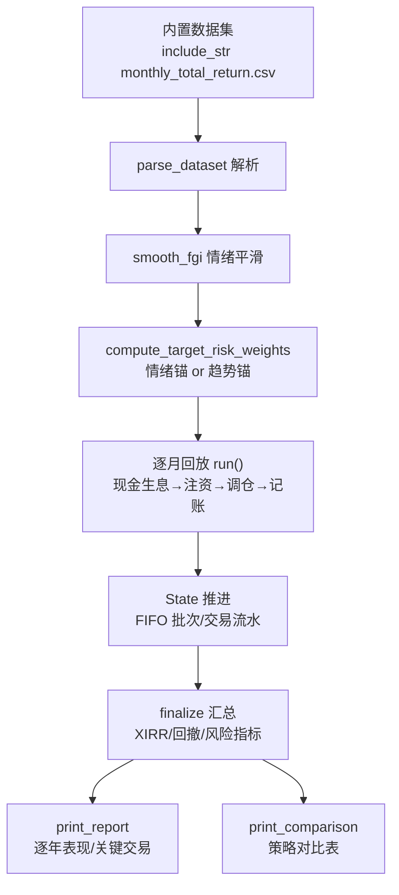

# 回测引擎模块领域

**模块路径**：`src/backtest.rs`
**生成日期**：2026-08-03

---

## 概述

回测引擎是 MNS 的"时间机器"——它把投资策略放到 2016 至 2025 年共 112 个月的真实全收益数据（人民币计价、含分红）上逐月回放，回答"这套规则在过去会赚多少、回撤多大、一年交易几次"。它存在的意义远超"看个热闹"：MNS 的诚实承诺——"更好的风险调整收益、更低的收益、更低的回撤"——正是由这里的数据支撑的。引擎的关键设计是**统一**：四种策略（`Engine` 枚举）走同一份数据、同一套成本模型，旧版各自实现导致对比不公平的问题在这里被彻底消除（`src/backtest.rs:4-13` 注释）。

引擎内部还有一个精妙的"双重记忆"：`State`（现金 + 三个 `Leg`）逐月推进，而每个 `Leg` 用 `Lot` 批次（FIFO）记录每笔买入——这样卖出时能按每个批次**各自的持有天数**计算阶梯赎回费（国内基金 <7 天 1.5%、<30 天 0.75% 等），而不是一刀切平均成本。这是"成本诚实"在代码层面的具体体现：回测如果忽略赎回费的持有期依赖，实盘的真实摩擦成本就会被严重低估。

回测引擎还承载了 MNS 最重要的方法论：**单次回测的数字毫无意义，分布才有意义**。`cmd_backtest_validate` 用 walk-forward（前 60% 调参、后 40% 验证）+ bootstrap 收益分布 + 独立区块验证三层防线，专门对付"回测看着漂亮、实盘就失效"的过拟合陷阱。引擎的可复现性（确定性种子）让这套验证可信。

---

## 核心功能点

1. **统一多引擎回放**（`run` + `Engine` 枚举，`src/backtest.rs:557/232`）——`TargetWeight`（目标仓位+偏离带，新框架）、`Legacy`（旧比例框架）、`BuyHold`（买入持有基准）、`BuyHoldRebalanced`（买入持有+年度再平衡，分离"再平衡贡献"与"择时贡献"）。
2. **双信号锚点**（`Anchor`，`src/backtest.rs:259`）——`SentimentOnly`（恐贪指数平滑→目标仓位）与 `TrendTilt`（价格 vs N 月均线做趋势主锚，情绪仅 ±tilt_pp 倾斜）。这是回测发现的"恐贪指数边际价值近零"结论的实现载体。
3. **FIFO 分批 + 阶梯赎回费**（`Leg::sell_fifo`，`src/backtest.rs:138`）——卖出时按批次持有天数分别计费，未满最短持有期的批次跳过（规避惩罚性赎回费）。
4. **真实成本与现金收益**（`Costs`，来自 config）——买入费、卖出费、现金货币基金年化收益（每月按天复利增长，`src/backtest.rs:587-591`）。
5. **现金流加权年化 XIRR**（`finalize` 调用 `metrics::xirr`，`src/backtest.rs:821`）——存在分批注资时 `(期末/总投入)^(1/年)` 会忽略资金到账时点，XIRR 按现金流时点加权，是更诚实的主口径。
6. **逐年表现与关键交易**（`print_yearly` / `print_key_trades`，`src/backtest.rs:917/972`）——中长线投资者关注逐年分解；每年最大一笔交易用于人工核对策略在关键时点的行为。

---

## 关键组件

| 组件/类型 | 文件路径 | 核心职责 |
|---------|---------|---------|
| `Engine` 枚举 | `src/backtest.rs:232` | 四种策略引擎的标签（含中文 label） |
| `Anchor` / `SignalConfig` | `src/backtest.rs:259/267` | 信号模式与平滑/趋势/倾斜参数 |
| `MonthRow` | `src/backtest.rs:38` | 数据集一行：日期 + 恐贪指数 + 三腿价格 |
| `State` | `src/backtest.rs:437` | 回测进行时的账户状态（现金 + 三腿 FIFO + 流水/交易记录） |
| `Leg` / `Lot` | `src/backtest.rs:103/96` | 单腿持仓，以批次粒度记录买入，支持 FIFO 卖出计费 |
| `BacktestResult` / `Monthly` / `Trade` | `src/backtest.rs:406/388/375` | 回测结果、月度快照、单笔交易记录 |
| `rebalance_to_weights()` | `src/backtest.rs:687` | 与实盘 `calculate_rebalance_plan` 同源的目标仓位调仓（先卖后买） |

---

## 内部数据流

**关键步骤说明**：
1. 数据加载：`DATASET` 通过 `include_str!` 编译进二进制（`src/backtest.rs:24`），`parse_dataset`（`src/backtest.rs:53`）按 CSV 解析并按日期排序。
2. 信号计算：`smooth_fgi`（`src/backtest.rs:360`）做 N 月移动平均；`compute_target_risk_weights`（`src/backtest.rs:322`）按锚点类型生成每月的目标风险权重序列。
3. 逐月状态机：`run`（`src/backtest.rs:557`）每月循环——现金按 `costs.cash_growth` 生息（`src/backtest.rs:587-591`）→ 每年 3 月后首个月注入 `annual_inflow`（`src/backtest.rs:594-604`）→ 按引擎调仓 → 记账到 `Monthly`。
4. 汇总：`finalize`（`src/backtest.rs:799`）推出现金流（期初 -initial、每年 -inflow、期末 +final_value）算 XIRR，并计算总收益/回撤/风险指标/交易频率。

---

## 关键接口与扩展点

回测引擎以 `Engine` 枚举为主要的扩展点：新增一种策略只需加一个变体 + 在 `run` 里加一个分支，其余（数据加载、成本模型、汇总指标）全部复用。`SignalConfig` 与 `Anchor` 分离了"信号怎么算"与"参数是什么"，让信号模式可组合（情绪锚/趋势锚/混合）。数据加载的 `parse_dataset` 是独立函数，未来支持加载外部数据集（holdout）时无需改动引擎核心——`load_holdout` 已在 `cmd_backtest_validate` 中复用该接口。

---

## 与其他模块的交互

| 交互模块 | 方向 | 接口/协议 | 说明 |
|---------|------|---------|------|
| config | 依赖 | `AppConfig` + `Costs`/`Rebalance`（`src/config.rs`） | 参数与成本模型唯一来源 |
| metrics | 依赖 | `metrics::xirr`/`max_drawdown`/`risk_metrics`（`src/metrics.rs`） | 金融指标计算 |
| strategy | 依赖 | `calculate_buy_suggestions`/`calculate_sell_suggestions`（`Engine::Legacy` 用） | 旧框架策略函数 |
| models | 依赖 | `Position`（`Leg::to_position` 转换） | 供旧框架函数消费的持仓视图 |
| main | 被依赖 | `cmd_backtest`/`cmd_backtest_validate` | 回测/验证命令入口 |

---

## 跨模块协作场景

**在"策略回测"流程中**：`cmd_backtest`（`src/main.rs:437`）加载配置与数据，对 `Engine::TargetWeight`（趋势锚 + 情绪锚两种信号）、`Engine::Legacy`、`Engine::BuyHoldRebalanced`、`Engine::BuyHold` 各跑一次 `run`，最后 `print_comparison` 输出对比表。

**在"样本外验证"流程中**：`cmd_backtest_validate`（`src/main.rs:533`）用 walk-forward 把前 60% 数据做网格调参（仓位缩放 × 偏离带），再用后 40% 验证，配合 `metrics::block_bootstrap` 给出收益分布，最后用 `load_holdout` 的独立区块做 holdout 验证——本模块的数据加载与 `run` 被三处复用。

**在"买卖记账"流程中**：本模块的调仓逻辑（`rebalance_to_weights`）与实盘 `strategy::calculate_rebalance_plan` 同源（`src/backtest.rs:687`），保证"回测验证的规则"与"实盘执行的规则"是同一套——这是回测结果对实盘有意义的前提。

---

## 性能考量

单次回测是 O(月数 × 标的) 的量级，约 112 步 × 3 腿，毫秒级完成。真正的重头是 `cmd_backtest_validate`：网格调参 12 组合 × 回测 + bootstrap 2000 次 × 3 策略，每次 bootstrap 内部再构造一条长度 ~112 的路径。`block_bootstrap`（`metrics.rs`）设计为可并行，但当前实现顺序执行——在个人工具场景（秒级）下足够。所有随机数用确定性 xorshift（`metrics.rs:160`），保证可复现。

---

## 实现亮点

- **数据集无拼接断点校验**：测试"内置数据集应可解析且无拼接断点"（`src/backtest.rs:1062`）逐月检查单月跳变 <35%，专门防止旧数据集的拼接坑。
- **"新批次被最短持有期锁定"**：`sell_fifo` 对 `days < min_days` 的批次跳过（`src/backtest.rs:154`），回测与实盘共享同一套"防惩罚性赎回费"逻辑。
- **XIRR 为主口径、简单年化仅对照**：`finalize` 同时算出 `xirr` 与 `naive_annualized`（`src/backtest.rs:821/817`），报告里 XIRR 是主数字，简单口径仅供旧版对照——"金融正确性优先"的体现。
- **信号与决策分离**：`Anchor`/`SignalConfig` 与 `rebalance_to_weights` 解耦，使得"换一种信号"不需要改调仓逻辑，为 `TrendTilt` 这样的实验性信号提供了低成本的试错通道。
