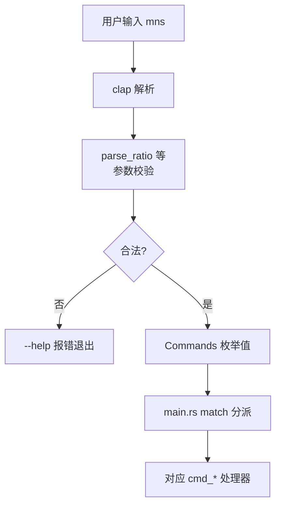

# 命令行定义模块领域

**模块路径**：`src/cli.rs`
**生成日期**：2026-08-03

---

## 概述

命令行定义模块是 MNS 的"门牌号"——它用 clap 定义了整个 CLI 的接口契约：程序长什么样（`Cli`）、有哪些命令（`Commands`）、每个命令带什么参数。你可以把它想成一份"命令字典"：`mns help` 显示的每一行、`mns` 打出的 usage，都由这里的 derive 定义决定。这个模块不执行任何业务，只声明"能敲什么命令、参数合法范围是什么"。

模块把命令分成四组（`src/cli.rs:5-27` 用注释标注）：第一组基础命令（init/config/cash/portfolio/history）、第二组策略与报告（report/backtest/validate/params/sentiment）、第三组市场数据（update-prices/market/market-indices/analyze）、第四组价格更新（quote）。这种分组是**面向用户的心智模型**，让 `--help` 和 usage 更易扫读。同时用 clap 的 `value_parser`（`src/cli.rs:19`）在解析层就拦截非法参数——比业务层校验更早、更省事。

这个模块还与 `main.rs` 形成"声明与执行"的分工：`cli.rs` 只声明"有什么命令、参数长什么样"，`main.rs` 的 match 分派表把命令变体映射到 `cmd_*` 处理器。一个命令的开发流程永远是"先改 `cli.rs` 加变体，再在 `main.rs` 加分派"，两者成对演进、职责绝不混淆。

---

## 核心功能点

1. **CLI 入口**（`Cli`，`src/cli.rs:3`）——无子命令时 `--help` 打印全部用法；全局 `--version`。
2. **18 个子命令**（`Commands`，`src/cli.rs:10`）——init/config/cash/portfolio/history/report/backtest/validate/params/sentiment/update-prices/market/market-indices/analyze/quote/buy/sell/backtest-validate（按来源分组）。
3. **子命令参数**（`CashAction`/`BacktestAction` 等，`src/cli.rs:13/14`）——嵌套枚举定义带参子命令（`mns cash set 100000`、`mns backtest --config x`）。
4. **解析期校验**（`value_parser`，`src/cli.rs:19`）——如 `parse_ratio` 把"50%"格式解析为 0.5，非法输入在解析期即报错。

---

## 关键组件

| 组件/类型 | 文件路径 | 核心职责 |
|---------|---------|---------|
| `Cli` | `src/cli.rs:3` | 程序入口定义（无子命令时打印 help） |
| `Commands` | `src/cli.rs:10` | 全部子命令枚举 |
| `CashAction` / `BacktestAction` | `src/cli.rs:13/14` | 带参子命令的参数结构 |
| `parse_ratio` 等解析函数 | `src/cli.rs:19` | 参数格式校验 |

---

## 内部数据流

**关键步骤说明**：
1. 解析：clap 按 `Commands` 枚举与每个命令的参数定义解析用户输入（`src/cli.rs:10-40`）。
2. 校验：`value_parser`（`src/cli.rs:19`）拦截格式错误——如"比例必须 0-1"——在解析期直接报错。
3. 分派：解析出的 `Commands` 变体交 `main.rs` 的 match 分发到各 `cmd_*`。

---

## 关键接口与扩展点

模块的扩展机制极其朴素且高效：**加一个 `Commands` 变体 + 定义它的参数**。clap 的 derive 宏自动生成解析与 `--help`，无需手写任何解析代码。`value_parser` 的自定义解析函数（`parse_ratio` 等）是"参数格式的规则中心"——新增参数类型时在此注册解析函数。模块与 `main.rs` 的 match 分派表是唯一的一处对应关系，新增命令时需要同步两处。

---

## 与其他模块的交互

| 交互模块 | 方向 | 接口/协议 | 说明 |
|---------|------|---------|------|
| main | 被依赖 | `Cli::parse` → `Commands` 变体 | 命令分派的唯一来源 |
| backtest | 被依赖（间接） | `BacktestAction` 参数 | 回测命令的参数定义 |

---

## 跨模块协作场景

**在全部命令入口**：`main()`（`src/main.rs:19`）第一行 `Cli::parse()`，之后 match `Commands` 分发。任何新命令的开发都从"加一个 `Commands` 变体"开始（`src/cli.rs:10-40`）——`cli.rs` 是功能扩展的"第一站"。例如 `mns backtest validate` 经 `BacktestAction::Validate` 变体，最终落到 `main.rs` 的 `cmd_backtest_validate`（`src/main.rs:533`），由它调用 `backtest::parse_dataset` 与 `metrics::block_bootstrap`（`src/backtest.rs:53`/`src/metrics.rs:164`）。

**在参数校验**：如 `mns cash set 100000` 的金额校验（`CashAction`，`src/cli.rs:13`）、`mns backtest --config` 的文件路径参数，都在 clap 层完成格式校验，业务层不用重复——解析期报错与业务层报错对用户的价值完全不同。

---

## 性能考量

纯解析，毫秒级，无性能问题。clap 的 derive 宏在编译期生成解析代码，运行时只是匹配。命令树层级浅（最多二级子命令），参数个数有限，匹配开销可忽略。

---

## 实现亮点

- **分组即文档**：命令按"基础/策略/市场/价格"四组注释分组（`src/cli.rs:5-27`），`--help` 的 usage 清晰分层——分组同时服务了"可发现性"，用户扫一眼就知道哪类功能在哪。
- **解析期校验前置**：`value_parser`（`src/cli.rs:19`）把非法输入挡在命令执行之前，用户得到的是"参数格式错误"而非业务层的晦涩报错——错误发生在最该发生的地方。
- **命令树的嵌套枚举**：`CashAction`/`BacktestAction`（`src/cli.rs:13/14`）把"mns cash set/get"、"mns backtest run/validate/params"拆成二级子命令，语义清晰、参数按动作分组，避免"一个命令十来个可选参数"的扁平地狱。
