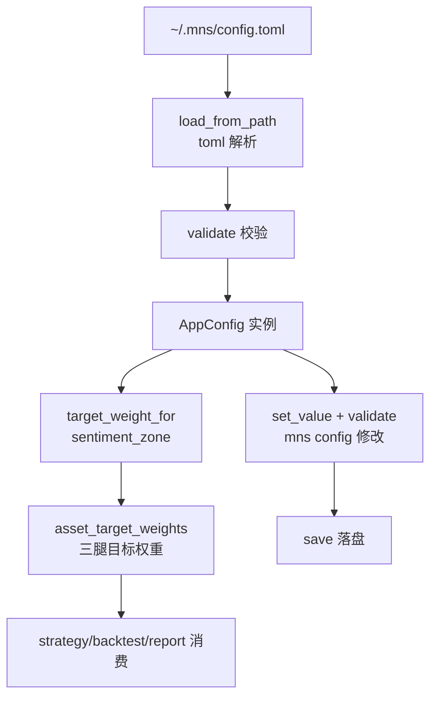

# 配置管理模块领域

**模块路径**：`src/config.rs`
**生成日期**：2026-08-03

---

## 概述

配置管理模块是 MNS 的"规则手册"——所有策略参数都在这里定义、校验、读写。它的独特之处在于：**配置不只是"键值对"，而是策略语义的载体**。`AppConfig` 里不仅存参数，还实现了完整的业务映射函数（情绪区间划分 `sentiment_zone`、情绪→目标权重 `target_weight_for`、三腿拆分 `asset_target_weights`、成本计算 `total_sell_rate` 等）。这设计让"参数"与"参数的用法"住在同一个文件里，策略引擎（strategy.rs）和回测引擎（backtest.rs）只依赖 `AppConfig` 即可取到"该持有什么"的全部信息。

配置管理的另一个重点是**防御**：`validate()`（`src/config.rs:255`）是项目里最长的校验函数，逐条拒绝非法配置——资产配置比例和必须为 100%、目标仓位曲线必须随情绪单调不增（逆向策略的数学约束）、情绪阈值必须单调递增、数值必须落在合法区间。更妙的是向后兼容：`#[serde(default)]`（`src/config.rs:15-23`）让老版本的 config.toml（缺 `target_weight`/`rebalance`/`costs` 字段）也能加载，旧字段自动回落默认值（有测试验证，`src/config.rs:636`）。

模块默认配置的取向也值得注意：`default_config`（`src/config.rs:181`）刻意选择**防御式默认**——美股 55/A 股 25/黄金 20 的三腿结构，目标仓位曲线 85→75→60→45→35，偏离带 ±6pp。默认值保守、回撤优先，用户想激进必须显式修改配置——这在投资工具里是最负责任的设计取向。

---

## 核心功能点

1. **配置结构定义**（`AppConfig` + 8 个子结构，`src/config.rs:7-178`）——settings/allocation/thresholds/buy_ratio/sell_ratio/api/target_weight/rebalance/costs。
2. **策略语义映射**（`src/config.rs:332-431`）——`sentiment_zone`（分数→区间）、`target_weight_for`（区间→目标风险权重%）、`sleeve_split`/`asset_target_weights`（三腿拆分）、`buy_ratio_for`/`sell_ratio_for`（旧框架的买卖比例矩阵）。
3. **成本计算**（`Costs` impl，`src/config.rs:102-130`）——阶梯赎回费 `redemption_rate`（按持有天数取档）、`total_sell_rate`（固定费+赎回费）、`cash_growth`（现金复利增长因子）。
4. **严格校验**（`validate`，`src/config.rs:255`）——逆向策略约束（目标权重单调不增）、配置和=100%、阈值单调递增、数值区间检查。
5. **dot-path 读写**（`get_value`/`set_value`，`src/config.rs:434/493`）——支持 `mns config thresholds.fear 45` 这样的命令式参数调整，每个可用 key 白名单式列出。
6. **默认配置**（`default_config`，`src/config.rs:181`）——防御式默认（低回撤优先）：美股 55/A 股 25/黄金 20，目标仓位曲线 85→75→60→45→35。

---

## 关键组件

| 组件/类型 | 文件路径 | 核心职责 |
|---------|---------|---------|
| `AppConfig` | `src/config.rs:7` | 配置根结构 + 全部业务映射函数 |
| `TargetWeight` | `src/config.rs:31` | 风险资产目标权重曲线（逆向策略锚） |
| `Rebalance` | `src/config.rs:58` | 偏离带/最小交易额/最短持有期 |
| `Costs` | `src/config.rs:79` | 买入费/卖出费/现金年化/阶梯赎回费 |
| `validate()` | `src/config.rs:255` | 配置合法性校验 |
| `get_value`/`set_value` | `src/config.rs:434/493` | dot-path 配置读写 |
| `asset_target_weights()` | `src/config.rs:380` | 情绪→三腿占总资产的目标权重 |

---

## 内部数据流

**关键步骤说明**：
1. 加载：`load_from_path`（`src/config.rs:245`）读 TOML → serde 反序列化（缺字段走 `#[serde(default)]`）→ `validate()` 校验通过才返回。
2. 映射：`sentiment_zone`（`src/config.rs:332`）把分数切成五档；`target_weight_for`（`src/config.rs:350`）取目标风险权重；`asset_target_weights`（`src/config.rs:380`）按三腿比例拆到总资产。
3. 修改：`cmd_config`（`src/main.rs:139-144`）调 `set_value` → `validate` → `save`，三明治流程保证不落盘坏配置。

---

## 关键接口与扩展点

`AppConfig` 是系统的"配置单一事实源"，所有领域模块只认这一个类型。扩展点有两类：新增参数 → 在对应子结构加字段 + `set_value` 的 key 白名单加条目；新增策略语义映射 → 在 `AppConfig` impl 加方法（如趋势锚的 `trend_anchor` 参数已存在于 `backtest.rs` 的 `SignalConfig`）。`validate` 是配置正确性的唯一守门人，任何新参数都要在校验中补对应规则。

---

## 与其他模块的交互

| 交互模块 | 方向 | 接口/协议 | 说明 |
|---------|------|---------|------|
| strategy | 被依赖 | `target_weight_for`/`asset_target_weights`/`sell_ratio_for` | 调仓计划取数 |
| backtest | 被依赖 | `Costs`/`Rebalance`/`TargetWeight` | 回测的成本与参数模型 |
| report | 被依赖 | `settings`/`thresholds`/`target_weight` | 预案与口径展示 |
| db | 被依赖 | `config_path()`/`db_path()` | 数据库文件定位 |
| main | 被依赖 | `load`/`load_from_path`/`save`/`get_value`/`set_value` | 全部命令 |

---

## 跨模块协作场景

**在"每日策略报告"流程中**：`AppConfig` 同时供给策略（目标仓位）、报告（预案章节）、入口（路径）。配置变更（如调高偏离带 `mns config rebalance.band_pp 6`）下一次 `mns report` 立即生效——"调参→看报告→再调"形成快速闭环。

**在"回测对比"流程中**：`cmd_backtest --config my.toml --compare a.toml,b.toml`（`src/main.rs:467-487`）让多个配置在同一数据/成本模型下公平对比，验证参数敏感性——这是"配置即语义"的直接受益者：不同配置文件就是不同策略。

**在"买卖记账"流程中**：`Costs` 提供买入费率与阶梯赎回费率，`cmd_buy`/`cmd_sell` 记账时若涉及费率会使用（成本模型统一来自配置，避免口径漂移）。

---

## 性能考量

配置加载为一次小文件读 + TOML 解析（KB 级），毫秒级。无缓存（每次命令都重读），因为配置可能被 `mns config` 修改，重读保证一致性。`validate` 为 O(1) 常量检查，无性能问题。`get_value` 用 dot-path 白名单线性查找，字段数十个，同样无压力。

---

## 实现亮点

- **校验即文档**：`validate`（`src/config.rs:255`）的每个检查都带明确中文错误信息，如"target_weight 必须随情绪升高而单调不增（逆向策略）"——既是校验也是参数文档，用户看到错误信息就懂了规则。
- **旧配置向后兼容**：`#[serde(default = "TargetWeight::default_curve")]`（`src/config.rs:15`）+ 专门测试（`src/config.rs:636`），老用户升级不丢配置、不崩启动。
- **单调性约束是策略的数学内核**：`validate` 强制"越恐慌目标仓位越高"（`src/config.rs:300-309`），从配置层面保证任何人的修改都不会破坏逆向策略的本质——这是防止"调参把策略调反"的最后防线。
- **防御式默认**：`default_config` 的三腿结构与保守曲线（`src/config.rs:181`）让"零配置用户"天然走在低回撤路径上，激进化必须显式为之。
