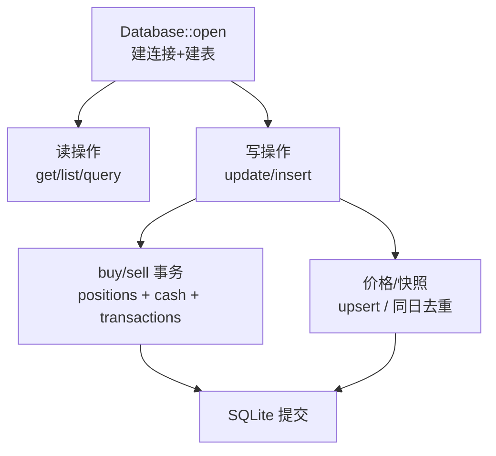

# 数据持久化模块领域

**模块路径**：`src/db.rs`
**生成日期**：2026-08-03

---

## 概述

数据持久化模块是 MNS 的"账房"——所有需要长期保留的数据都经它进出 SQLite。它管理 5 张表：单行现金余额 `cash`、持仓 `positions`、交易流水 `transactions`、价格历史 `price_history`、恐贪快照 `fear_greed_snapshots`。你可以把它想成一本"不能改的账本"：买卖必须原子（持仓、现金、流水三件事要么全成要么全不成），现金余额有校验不能为负，同日恐贪快照去重只留最新。

`Database` 结构体把 `rusqlite::Connection` 包起来，所有方法都是"参数进来、数据出去"的纯 SQL 封装。它不做任何投资判断——不计算收益（那是 `models.rs` 的 `Position` 方法）、不生成建议（那是 `strategy.rs`）。它的价值在**数据完整性**：用事务保证买卖原子性、用 `UNIQUE` 约束防重复价格、用 CHECK 约束限制交易类型只能是 buy/sell。

模块还有一个"为未来铺路"的设计：`price_history` 表（`src/db.rs:52`）单独累积每日价格快照，`monthly_price_history`（`src/db.rs:319`）取月末价格序列——这是为趋势锚（价格 vs 12 月均线）准备的。注释明确写道：老表只存 `current_price` 无法回溯历史（`src/db.rs:300-302`）。架构允许"现在的信号用情绪、未来的信号用趋势"平滑演进，而数据基础现在就开始累积。

---

## 核心功能点

1. **表结构与初始化**（`init_tables`，`src/db.rs:24`）——`CREATE TABLE IF NOT EXISTS` 幂等建表，5 张表 + 现金默认行（`INSERT OR IGNORE ... id=1, balance=0`）。
2. **现金管理**（`src/db.rs:77-106`）——`get_cash_balance`/`set_cash_balance`（拒绝负数）/`add_cash`（拒绝非正数）。
3. **买卖原子记账**（`buy_position`/`sell_position`，`src/db.rs:170/233`）——`unchecked_transaction` 内完成持仓更新 + 现金联动 + 流水插入；买入用加权平均成本（`src/db.rs:193-199`），首笔记录 `first_buy_date`。
4. **价格历史**（`record_price`/`monthly_price_history`，`src/db.rs:303/319`）——每日价格快照（同日 upsert），按年月取月末序列，为趋势锚（价格 vs 12 月均线）累积数据。
5. **恐贪快照**（`save_fear_greed_snapshot`/`get_latest_snapshot`，`src/db.rs:373/398`）——同日先删后插（只留最新），保存 4 个历史参照值。

---

## 关键组件

| 组件/类型 | 文件路径 | 核心职责 |
|---------|---------|---------|
| `Database` | `src/db.rs:7` | 连接封装 + 全部数据操作 |
| `init_tables()` | `src/db.rs:24` | 幂等建表 SQL |
| `buy_position()` / `sell_position()` | `src/db.rs:170/233` | 事务化买卖记账 |
| `record_price()` | `src/db.rs:303` | 价格历史 upsert |
| `save_fear_greed_snapshot()` | `src/db.rs:373` | 恐贪快照（同日去重） |
| `row_to_position()` | `src/db.rs:129` | SQL 行 → `models::Position` |

---

## 内部数据流

**关键步骤说明**：
1. 打开：`Database::open`（`src/db.rs:12`）确保父目录存在、打开 `~/.mns/mns.db`、调 `init_tables` 建表。
2. 买卖：`buy_position`（`src/db.rs:170`）先校验现金足够（`src/db.rs:188`）与份额/价格为正，再在事务里三步写库；`sell_position`（`src/db.rs:233`）校验不超持有量并做浮点保护（`shares.min(pos.shares)`，`src/db.rs:253`）。
3. 快照：`save_fear_greed_snapshot`（`src/db.rs:373`）先删同日记录再插入，保证每天一条。

---

## 关键接口与扩展点

`Database` 是对 SQLite 的薄封装，扩展模式是"新增需求 → 新增方法"。业务语义（如"该不该买"）绝不进入本模块，保持纯数据操作。价格历史与恐贪快照的表结构都预留了未来功能的数据基础：`price_history` 供趋势锚、快照表的历史参照值供风险警告。若未来需要趋势锚，`monthly_price_history` 已是现成接口。

---

## 与其他模块的交互

| 交互模块 | 方向 | 接口/协议 | 说明 |
|---------|------|---------|------|
| config | 依赖 | `AppConfig::db_path()` | 数据库文件路径 |
| models | 依赖 | `Position`/`Transaction`/`FearGreedSnapshot` | 行→结构体映射 |
| main | 被依赖 | 全部命令的持久化调用 | 命令层唯一持久化入口 |

---

## 跨模块协作场景

**在"每日策略报告"流程中**：`cmd_report`（`src/main.rs:361`）先 `save_fear_greed_snapshot` 把当日恐贪落库，再读现金/持仓（`src/main.rs:372-373`）用于计算——"先留档再决策"，让每天的决策可回溯。

**在"价格更新"流程中**：`cmd_update_prices`（`src/main.rs:799`）对每个成功抓取的价格调 `update_price`，它同时更新 `positions.current_price` 并写 `price_history`（`src/db.rs:287-297`），为未来的趋势锚（`monthly_price_history`，`src/db.rs:319`）累积数据。

**在"买卖记账"流程中**：`cmd_buy`/`cmd_sell`（`src/main.rs:270/281`）直接调用 `buy_position`/`sell_position`，事务保证现金与持仓永远一致。

---

## 性能考量

SQLite 单连接、单用户场景，所有操作都是点查/点写（按 asset_code 索引），毫秒级。事务只在买卖时开启（两步以上写操作），其余单条 SQL 自动提交。无 WAL/连接池等复杂配置——个人工具规模不需要。数据量上限约"几十年 × 每天一条"，远低于 SQLite 的能力边界。

---

## 实现亮点

- **买卖事务原子性**（`src/db.rs:207-228`）——持仓、现金、流水在一个事务里，任何一步失败整体回滚，杜绝"持仓变了现金没扣"这类账目错误。
- **幂等建表 + 默认现金行**（`src/db.rs:24-71`）——`CREATE TABLE IF NOT EXISTS` + `INSERT OR IGNORE`，`Database::open` 永远安全可重复调用。
- **价格历史的设计意图**（`src/db.rs:300-302` 注释）——单独累积 `price_history` 是为了趋势锚需要历史序列，而旧表只存 `current_price` 无法回溯——这是新功能（趋势锚）驱动的表结构演进，说明数据架构是为策略演进预留的。
- **CHECK 约束兜底**：交易类型仅 buy/sell（`src/db.rs:44`）、现金单行（`src/db.rs:27`）在数据库层面锁死非法状态，代码校验 + DB 约束双重防线。
