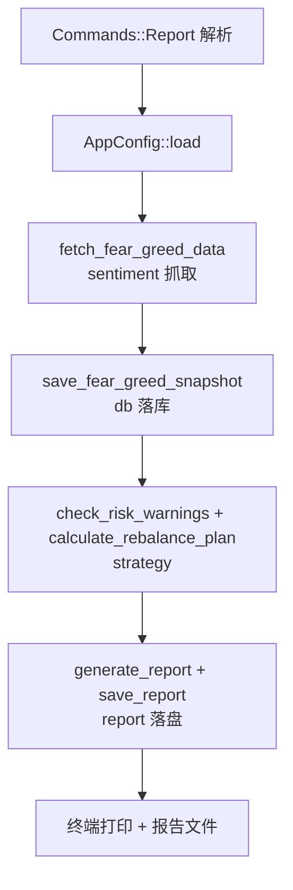

# 命令行编排模块领域

**模块路径**：`src/main.rs`
**生成日期**：2026-08-03

---

## 概述

`main.rs` 是 MNS 的"总指挥部"——所有 18 个 CLI 命令在这里解析、分派、执行，所有面向用户的信息在这里渲染。它也是全项目最"厚"的薄壳：`main.rs` 有 943 行，但没有多少"投资逻辑"，绝大多数是"打开数据库→调领域函数→渲染表格→打印/落盘"这样的胶水代码。你可以把它想象成一家餐厅的传菜口：后厨（strategy/backtest/sentiment）负责做菜，传菜口负责接单（解析命令）、摆盘（comfy-table 渲染）、上菜（打印/落盘）。

这种"薄壳+纯函数核心"的架构决定了 `main.rs` 的形态：`#[tokio::main] async fn main()`（`src/main.rs:19`）用一个巨大的 match 分派表（`src/main.rs:23-64`）把 `cli::Commands` 的每个变体映射到对应的 `cmd_*` 处理器；处理器之间几乎不共享状态，每个都独立 `Database::open()` + `AppConfig::load()`。这牺牲了进程内状态复用，换来了命令之间的完全隔离——任何命令都可以独立调试、独立失败而不影响其他命令。

编排层还承担了另一个重要职责：**错误策略的分发**。它既实现"决策链失败即中断"（`cmd_report` 恐贪抓取失败直接 `?` 抛错，`src/main.rs:356`），也实现"展示链失败仅警告"（`cmd_market` 恐贪失败继续，`src/main.rs:862`）——同一编排者在不同场景执行不同的容错哲学。

---

## 核心功能点

1. **命令分派**（`main`，`src/main.rs:19-67`）——clap 解析 + match 分派 18 个命令；异步命令（`cmd_sentiment`/`cmd_report`/`cmd_update_prices`/`cmd_market`/`cmd_market_indices`/`cmd_analyze`）用 `.await` 调用。
2. **初始化**（`cmd_init`，`src/main.rs:69`）——创建 `~/.mns/config.toml` 与数据库；已有数据时交互式确认（`--force` 跳过）；覆盖前删除旧库文件。
3. **配置管理**（`cmd_config`，`src/main.rs:123`）——无参显示全配置、单 key 查值、key+value 改值（改前 `validate()` 防写坏）。
4. **组合展示**（`cmd_portfolio`/`cmd_history`，`src/main.rs:175/402`）——持仓表格（年化收益着色：达标绿/亏损红）、交易历史表。
5. **回测编排**（`cmd_backtest`/`cmd_backtest_validate`/`cmd_backtest_params`，`src/main.rs:437/533/730`）——组装配置、信号、引擎跑回测；网格调参 + bootstrap 分布 + holdout 验证；打印可调参数帮助。
6. **市场查询**（`cmd_market`/`cmd_market_indices`/`cmd_analyze`，`src/main.rs:827/876/908`）——指数表格（涨绿跌红）+ 恐贪指数 + 个股报价。

---

## 关键组件

| 组件/类型 | 文件路径 | 核心职责 |
|---------|---------|---------|
| `main()` | `src/main.rs:19` | tokio 入口 + 命令分派表 |
| `cmd_init` / `cmd_config` | `src/main.rs:69/123` | 初始化与配置读写（含防覆盖确认） |
| `cmd_report` | `src/main.rs:348` | 每日报告流水线编排（抓取→快照→策略→落盘） |
| `cmd_backtest` / `cmd_backtest_validate` | `src/main.rs:437/533` | 回测与样本外验证编排 |
| `cmd_update_prices` | `src/main.rs:772` | 价格更新编排 |
| 各 `cmd_*` 的 comfy-table 渲染 | 分散 | 统一表格样式（UTF8_FULL + UTF8_ROUND_CORNERS） |

---

## 内部数据流（以 cmd_report 为例）

**关键步骤说明**：
1. 每个命令独立开库开配置：`db::Database::open()` 与 `AppConfig::load()`（`src/main.rs:350`），保证隔离性。
2. 决策前先落库快照（`src/main.rs:361`），让报告与历史快照同时生成。
3. 策略计算（`src/main.rs:377-379`）产出的 `RebalancePlan` 不直接落库，只用于渲染——报告是"决策快照"，不可篡改地每日留档。

---

## 关键接口与扩展点

编排层的扩展模式高度统一：**新增命令 = 加一个 `Commands` 变体（`src/cli.rs`）+ 写一个 `cmd_*` 函数 + 在 match 里加一行**。没有服务注册表、没有插件系统——对一个 18 命令的 CLI 而言，显式的 match 分派就是最简单的扩展机制。表格渲染的样式常量（UTF8_FULL + UTF8_ROUND_CORNERS）统一，新命令直接复用。

---

## 与其他模块的交互

| 交互模块 | 方向 | 接口/协议 | 说明 |
|---------|------|---------|------|
| cli | 依赖 | `cli::Cli`/`Commands`/`CashAction`/`BacktestAction` | 命令树类型 |
| config | 依赖 | `AppConfig` 全接口 | 所有命令都需要配置 |
| db | 依赖 | `Database` 全接口 | 持久化 |
| strategy | 依赖 | `calculate_rebalance_plan`/`check_risk_warnings` | 决策计算 |
| backtest | 依赖 | `BacktestConfig`/`Engine`/`SignalConfig`/`run` | 回测编排 |
| sentiment / quote / market | 依赖 | `fetch_fear_greed_data`/`update_all_prices`/`fetch_market_indices` | 外部行情 |
| metrics | 依赖 | `block_bootstrap`/`percentile` | 验证分布 |

---

## 跨模块协作场景

**在全部业务流程中**：本模块是唯一的"编排者"。每日报告、价格更新、买卖记账、回测验证四条主流程都由它发起并协调各领域模块；它不拥有任何领域逻辑，只做"顺序调用 + 结果呈现"。这也是为什么任何新命令的开发都遵循同一模式——编排层的统一性降低了系统整体的认知负担。

**在"市场速览"流程中**：`cmd_market`（`src/main.rs:827`）不仅渲染指数表，还会顺带调 `update_all_prices`（`src/main.rs:834-841`）刷新持仓价格——"看行情"与"记账"一次完成，是编排者主动做的一处流程合并。

---

## 性能考量

命令级串行编排，无并发需求（单用户单命令）；唯一可能耗时的是网络抓取（sentiment/quote/market 都是异步函数，但每个命令内部串行）。`cmd_backtest_validate` 是重计算路径（网格 12 次回测 + bootstrap 2000×3），在个人工具量级下秒级完成。表格渲染对几十行的数据集无压力。

---

## 实现亮点

- **`cmd_init` 的防误覆盖交互**：检测到已有数据时打印警告并要求输入 `y/yes` 确认，`--force` 才跳过（`src/main.rs:78-98`）——保护用户数据的第一道防线。
- **配置写前校验**：`cmd_config` 修改配置时先 `set_value` → `validate()` → 通过才 `save()`（`src/main.rs:141-143`），从入口杜绝"写坏配置"。
- **`cmd_backtest_validate` 的过拟合检测**：样本内最优参数在样本外劣于默认时直接打印警告（`src/main.rs:649-650`）——把"调参陷阱"显式暴露给用户，而非让用户自嗨于样本内数字。
- **异步命令的 `.await` 统一处理**：`main` 对六类异步命令分别 `.await`（`src/main.rs:23-64`），同步命令直接调用，两类路径在一个分派表内清晰区分。
