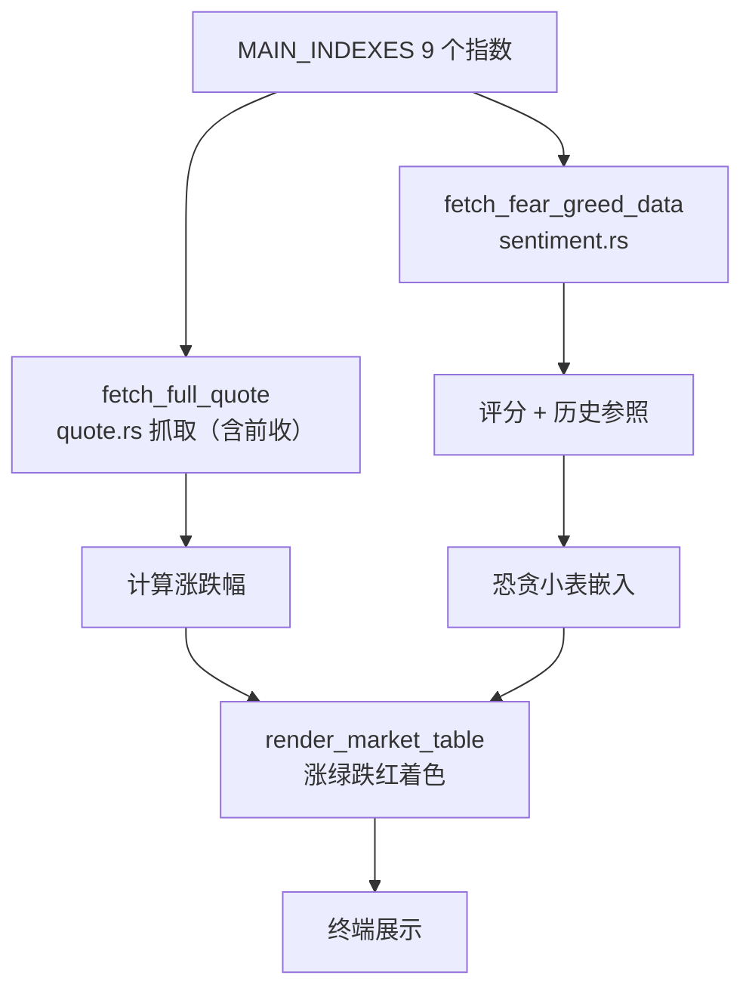

# 市场概况模块领域

**模块路径**：`src/market.rs`
**生成日期**：2026-08-03

---

## 概述

市场概况模块是 MNS 的"大盘速览"——`mns market` 一屏给出一组宽基指数（美股、A 股、港股、黄金、原油、美元指数、恐惧贪婪指数），全部实时抓取并渲染成一张涨绿跌红的终端表格。它的定位是**决策场景的"开场白"**：报告（report.rs）是"今天该做什么"，市场概况是"今天市场怎么样"——前者深度、后者广度。

这个模块有个"表格包一层表格"的巧思：终端里先渲染一张指数涨跌表，表头下方再嵌入一张恐贪指数小表（score + 评级 + 4 个历史参照值），两张表叠起来呈现"全景 + 情绪"两层信息。考虑到恐贪指数抓取可能失败（免费接口），模块采用宽松策略：失败只打警告、不阻断指数表格（`src/market.rs:33-37`），因为指数涨跌才是这张表的主角。

模块对并发也有安排：`fetch_market_indices`（`src/market.rs:17`）用 `futures::join!`/`join_all` 同时抓 9 个指数 + 恐贪指数——这是全系统唯一使用异步并发的场景。10 个独立 HTTP 请求串行要 ~10 秒，并发压到 ~2 秒，而实现只需几行 futures 代码。

---

## 核心功能点

1. **指数清单**（`MAIN_INDEXES`，`src/market.rs:7`）——9 个指数/商品的代码与名称：标普 500、纳斯达克、道琼斯、上证指数、深证成指、创业板、恒生指数、黄金、原油，外加美元指数。
2. **宽基抓取**（`fetch_market_indices`，`src/market.rs:17`）——对每个代码调 `quote::fetch_full_quote`（含前收），算涨跌幅。
3. **恐贪并行抓取**（`src/market.rs:44-46`）——用 `futures::join!` 同时抓 9 个指数 + 恐贪指数，全部失败均降级为警告。
4. **双层表格渲染**（`render_market_table`，`src/market.rs:50`）——主表（指数/点位/涨跌额/涨跌幅，涨绿跌红着色）+ 恐贪小表（评分/评级/环比/同比），返回 String 供 `cmd_market` 打印。

---

## 关键组件

| 组件/类型 | 文件路径 | 核心职责 |
|---------|---------|---------|
| `MainIndex` | `src/market.rs:5` | 指数元数据（代码 + 中文名） |
| `MAIN_INDEXES` | `src/market.rs:7` | 9 个宽基指数常量表 |
| `fetch_market_indices()` | `src/market.rs:17` | 并行抓取全部指数 |
| `render_market_table()` | `src/market.rs:50` | 双层表格渲染（涨绿跌红） |

---

## 内部数据流

**关键步骤说明**：
1. 并行抓取：`fetch_market_indices`（`src/market.rs:17`）先抓 9 个指数（`futures::join_all`），再抓恐贪指数（`futures::join!`），两者失败都仅记录警告。
2. 涨跌计算：用 `quote::fetch_full_quote` 返回的 `StockQuote`（含 `previous_close` 与 `current_price`）算出涨跌额与百分比（`src/market.rs:31-32`）。
3. 双层渲染：`render_market_table`（`src/market.rs:50`）把指数表与恐贪表上下拼接，每行数据用前收为基准着色（涨绿、跌红）。

---

## 关键接口与扩展点

模块对外接口为 `fetch_market_indices()`（数据）与 `render_market_table()`（渲染）两个纯函数。扩展点在于 `MAIN_INDEXES` 常量表：加指数只需加一行（代码 + 中文名），路由由 `quote.rs` 自动处理。恐贪表嵌入由 `render_market_table` 内部完成，未来若想调整展示结构只需改渲染函数，数据抓取不动。

---

## 与其他模块的交互

| 交互模块 | 方向 | 接口/协议 | 说明 |
|---------|------|---------|------|
| quote | 依赖 | `fetch_full_quote` → `StockQuote` | 每个指数的价格与前收 |
| sentiment | 依赖 | `fetch_fear_greed_data` | 恐贪指数 |
| main | 被依赖 | `cmd_market` 调 `fetch_market_indices` + `render_market_table` | 市场命令 |

---

## 跨模块协作场景

**在"市场速览"流程中**：`cmd_market`（`src/main.rs:827`）调 `fetch_market_indices` 拿数据 → `render_market_table` 渲染 → 打印。同时该命令会调 `update_all_prices`（`src/main.rs:834-841`）顺带更新持仓价格，实现"看行情"与"记账"一次完成——这是编排层主动做的流程合并，本模块是其中一个数据源。

**在"报告"流程中**：本模块不直接参与，但它展示的恐贪指数与报告用的是**同一个** `sentiment::fetch_fear_greed_data`——同一数据源保证"速览"与"决策"的情绪读数一致，不会出现两边数值打架。

---

## 性能考量

9 个指数 + 1 个恐贪，全部用 `futures::join_all`/`join!` 并发抓取（`src/market.rs:17/44`）——比串行快约 10 倍，单请求 10s 超时下整体最坏约 10s。每个请求独立，单个失败不阻塞整体。渲染为纯字符串拼接，毫秒级。

---

## 实现亮点

- **"涨绿跌红"的文化适配**：终端表格按中国市场习惯绿涨红跌着色（`src/market.rs:61-63`），与 comfy-table 默认样式区分——细节处见产品对目标用户的尊重。
- **双层信息密度**：把恐贪小表嵌入指数主表下方（`src/market.rs:69-78`），一张屏幕同时呈现"市场位置"与"市场情绪"——信息层级设计。
- **宽松的失败策略**：所有抓取失败都降级为警告继续（`src/market.rs:44-46`），与 `cmd_report` 的严格 `?` 中断策略形成对照——本模块是"浏览"场景，不允许一个小接口失败让整屏空白。
- **系统内唯一的异步并发**：`futures::join!` 的使用点（`src/market.rs:44`）示范了"何时该用并发"——多个独立网络请求、无依赖、追求墙钟时间，三个条件同时满足才值得并发。
