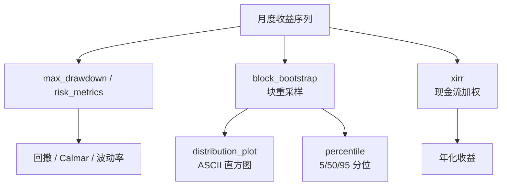

# 指标计算模块领域

**模块路径**：`src/metrics.rs`
**生成日期**：2026-08-03

---

## 概述

指标计算模块是 MNS 的"统计实验室"——它专门处理"怎么评估一笔投资做得好不好"。模块分成两半：上半部分是标准的**金融指标**（XIRR 现金流加权年化、最大回撤、收益风险比 Calmar、按月波动的年化波动率、盈利率），下半部分是**统计检验**（Block Bootstrap 与基于分位数的置信区间、分布直方图）。前者的作用是"描述"（这次回测赚了多少、回撤多大），后者的作用是"判断"（这个收益是真的还是运气，置信区间在哪）。

统计检验部分尤其贴合 MNS 的"诚实文化"：单次回测的收益数字毫无意义，只有把它放进 bootstrap 的分布里才能看出波动范围。`block_bootstrap`（`src/metrics.rs:164`）按块重采样月度收益序列，模拟"换个运气会怎样"，然后用 `percentile` 输出 5/50/95 分位区间；`distribution_plot`（`src/metrics.rs:139`）把分布画成 ASCII 直方图。两个函数都刻意保持确定性（种子固定的 xorshift，`src/metrics.rs:160`）——因为"重跑回测必须得到同样的分布"是样本外验证可信的前提。

模块与 `backtest.rs` 的协作是"**引擎算账、实验室评估**"的关系：回测引擎跑出逐月收益序列，指标模块负责把所有"结论性数字"算出来。两处代码职责分明，指标模块不关心回测怎么跑，回测引擎也不关心指标怎么算。

---

## 核心功能点

1. **现金流加权年化 XIRR**（`xirr`，`src/metrics.rs:10`）——按现金流时点计算内部收益率，用二分法求解 `sum(cf_i / (1+r)^t_i) = 0`；`xirr_guess`（`src/metrics.rs:49`）用现金流和做初值，避免求解失败。
2. **最大回撤与风险指标**（`max_drawdown`/`risk_metrics`，`src/metrics.rs:78/96`）——回撤峰谷差、Calmar 比率（年化/回撤）、年化波动率、盈利率。
3. **置信区间**（`percentile`/`confidence_interval`，`src/metrics.rs:122/131`）——p 分位数计算与数组边界补齐。
4. **Block Bootstrap**（`block_bootstrap`，`src/metrics.rs:164`）——按块重采样月度收益（块长默认 3 个月），保留自相关结构。
5. **ASCII 分布图**（`distribution_plot`，`src/metrics.rs:139`）——把重采样收益画成直方图（含均值标记）。

---

## 关键组件

| 组件/类型 | 文件路径 | 核心职责 |
|---------|---------|---------|
| `xirr()` | `src/metrics.rs:10` | 现金流加权年化收益率 |
| `xirr_guess()` | `src/metrics.rs:49` | XIRR 求解初值 |
| `max_drawdown()` | `src/metrics.rs:78` | 最大回撤 |
| `risk_metrics()` | `src/metrics.rs:96` | Calmar/波动率/盈利率 |
| `block_bootstrap()` | `src/metrics.rs:164` | 块重采样分布 |
| `distribution_plot()` | `src/metrics.rs:139` | ASCII 直方图 |
| `percentile()` / `confidence_interval()` | `src/metrics.rs:122/131` | 分位与区间 |

---

## 内部数据流

**关键步骤说明**：
1. XIRR：`xirr`（`src/metrics.rs:10`）迭代求解现金流方程；初值 `xirr_guess`（`src/metrics.rs:49`）按现金流和估算，再二分收敛（迭代上限 100 次）。
2. Bootstrap：`block_bootstrap`（`src/metrics.rs:164`）先把收益重采样为 N 条路径，每条路径独立计算年化，得到分布。
3. 呈现：`distribution_plot`（`src/metrics.rs:139`）对分布分桶，输出 `*` 高度的 ASCII 直方图，配合分位数区间一起给用户"收益的波动范围"。

---

## 关键接口与扩展点

模块全部是纯函数，输入输出均为数值序列，无状态、无副作用——这是"可复现统计"的基石。扩展点在于指标类型：新增指标只需加一个纯函数（如 Sortino 比率），`backtest.rs` 的 `finalize` 与 `cmd_backtest_validate` 的调用点各自接入即可。`block_bootstrap` 内部预留了 Rayon 并行开关的注释位（`src/metrics.rs`），未来数据量大时可一键开启并行。

---

## 与其他模块的交互

| 交互模块 | 方向 | 接口/协议 | 说明 |
|---------|------|---------|------|
| backtest | 依赖 | `xirr`/`max_drawdown`/`risk_metrics` | 回测结果汇总 |
| main | 依赖 | `block_bootstrap`/`percentile`/`distribution_plot` | 验证命令的分布分析 |

---

## 跨模块协作场景

**在"样本外验证"流程中**：`cmd_backtest_validate`（`src/main.rs:533`）先用 `block_bootstrap`（`src/main.rs:560-563`）对回测收益做重采样分布，再用 `distribution_plot`（`src/main.rs:578-579`）画图、`percentile` 输出区间——"跑一次回测 + 重采样 2000 次"评估收益的稳健性。

**在"回测报告"流程中**：`backtest::finalize`（`src/backtest.rs:821`）调 `metrics::xirr` 计算最终年化，`risk_metrics` 提供回撤与 Calmar——所有回测输出都经过本模块，保证"同一口径"。

---

## 性能考量

XIRR 每次迭代 O(现金流数)，二分最多 100 次，毫秒级。`block_bootstrap` 重采样 N=2000 次、每次构造 ~112 步路径，是计算热点，但顺序执行在秒级完成；内部逻辑（`src/metrics.rs:164-231`）已留好可并行化的空间（`RAYON` 开关注释），个人工具场景下未启用。

---

## 实现亮点

- **XIRR 的确定性**：xorshift 种子写死（`src/metrics.rs:160`），保证"同数据重跑 → 同分布"——验证结果可复现，避免"重跑数字变了"的信任危机。
- **"收益分布"思维**：`block_bootstrap` 不是玩具，它把"回测收益 12% 真的吗"变成"12% 在 95% 区间 [8%, 16%] 里"——把直觉判断变成数字判断，这正是 MNS 诚实文化的方法论支柱。
- **贴近业务的边界处理**：`confidence_interval`（`src/metrics.rs:131`）对超界分位数做 `min/max` 夹紧，bootstrap 样本数不足时也能给出不越界的区间。
- **XIRR 优先、简单年化对照**：`xirr` 是主口径（`src/backtest.rs:821` 优先呈现），因为它正确反映分批注资的时点价值；简单年化（`naive_annualized`）仅作对照——金融正确性优先的度量选择。
