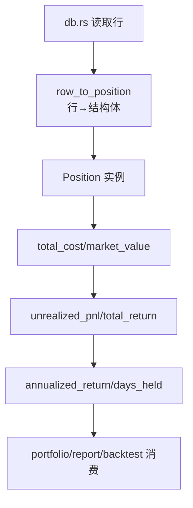

# 数据模型模块领域

**模块路径**：`src/models.rs`
**生成日期**：2026-08-03

---

## 概述

数据模型模块是 MNS 的"档案室"——它定义了系统里的三类核心实体：持仓（`Position`）、交易（`Transaction`）、恐贪快照（`FearGreedSnapshot`），并且把"持仓收益怎么算"这层领域逻辑直接挂在这些结构体上。你可以把它想成一份"活档案"：不只是存储字段，还自带计算方法（年化收益率、收益金额、持有天数），谁拿到 `Position` 谁就能算收益。

这个模块刻意保持**只存数据 + 计算，不碰存储**——SQL 读写全在 `db.rs`，数据库行 ↔ 结构体的映射也在 `db.rs`（`row_to_position`/`row_to_transaction`）。`models.rs` 里的三个结构体恰好对应 `db.rs` 里的三张业务表（`positions`/`transactions`/`fear_greed_snapshots`），形成清晰的"模型层 ↔ 持久化层"对照。模块很小（约 120 行），却是全系统数据契约的所在——任何模块之间的数据传递都绕不开这几个类型。

`Position` 在回测引擎里还有一个特别的身份：`backtest::Leg::to_position`（`src/backtest.rs:132`）把回测中间态（FIFO 批次）压平成 `Position`，喂给旧框架的买卖建议函数。同一个类型既服务实盘展示、又服务回测兼容——模型层承担了"新旧框架接口兼容"的桥接角色，这是它存在价值的又一个证明。

---

## 核心功能点

1. **持仓模型**（`Position`，`src/models.rs:4`）——代码、名称、类别（fund/stock/etf）、已购份额、平均成本、现价、首次买入日期。
2. **持仓收益计算**（`Position` impl，`src/models.rs:21-73`）——`total_cost`（成本总额）、`market_value`（市值）、`unrealized_pnl`（浮盈/亏）、`total_return`（总收益率）、`annualized_return`（年化收益率）、`days_held`（持有天数）。
3. **交易模型**（`Transaction`，`src/models.rs:75`）——买卖类型（buy/sell）、代码、名称、份额、价格、金额、时间。
4. **恐贪快照**（`FearGreedSnapshot`，`src/models.rs:92`）——日期、score、评级、环比/同比参照值。

---

## 关键组件

| 组件/类型 | 文件路径 | 核心职责 |
|---------|---------|---------|
| `Position` | `src/models.rs:4` | 持仓数据结构 + 收益计算方法 |
| `Transaction` | `src/models.rs:75` | 单笔交易记录 |
| `FearGreedSnapshot` | `src/models.rs:92` | 单日恐贪指数快照 |
| `Position::annualized_return` | `src/models.rs:51` | 年化收益率（含持有期处理） |
| `Position::market_value` | `src/models.rs:29` | 当前市值 |

---

## 内部数据流

**关键步骤说明**：
1. 行→模型：`db.rs` 的 `row_to_position`（`src/db.rs:129`）把 SQL 行转成 `Position`，字段一一对应。
2. 计算链：`Position` 的计算方法（`src/models.rs:21-73`）纯函数式，从成本→市值→浮盈→收益率逐级推导，无副作用。
3. 消费：`cmd_portfolio`（`src/main.rs:175`）读库→转 `Position`→用计算法渲染表格；`backtest.rs` 用 `Leg::to_position`（`src/backtest.rs:132`）把回测中间态转成 `Position` 供旧框架函数消费。

---

## 关键接口与扩展点

`Position` 是全系统最核心的数据契约：它既是数据库行映射，又是回测中间态视图，又是报表渲染的输入。扩展点在于"模型方法"：新增一个指标（如 Sharpe 需要历史波动）只需给 `Position`（或配合 `metrics.rs`）加方法，不需要动存储。`Transaction` 与 `FearGreedSnapshot` 是纯数据载体，字段变化需要同步 `db.rs` 的映射函数与 SQL——两者是成对演进的。

---

## 与其他模块的交互

| 交互模块 | 方向 | 接口/协议 | 说明 |
|---------|------|---------|------|
| db | 被依赖 | `row_to_position`/`row_to_transaction` | 行→结构体映射 |
| main | 依赖 | `Position`/`Transaction`/`FearGreedSnapshot` | 表格渲染与展示 |
| backtest | 依赖 | `Position`（`Leg::to_position` 转换） | 旧框架回测输入 |
| report | 依赖 | `Position` 的收益计算 | 持仓明细渲染 |

---

## 跨模块协作场景

**在"持仓一览"流程中**：`cmd_portfolio`（`src/main.rs:175`）读所有持仓→`Position` 列表→`models` 的年化收益计算→按达标/亏损着色渲染（`src/main.rs:209-214`）。本模块是数据契约的中心——`Position` 的类型定义决定了所有下游如何消费。

**在"回测兼容"流程中**：`backtest.rs` 的 `Leg::to_position`（`src/backtest.rs:132`）把回测中间态（FIFO 批次）压平为 `Position`，让旧框架的买卖建议函数能消费回测数据——模型层承担了"新旧框架接口兼容"的桥接角色。

**在"每日报告"流程中**：`cmd_report` 读持仓 → `Position` → 收益计算 → 报告持仓明细章节。与 portfolio 复用同一套计算口径，保证"报告里的年化收益"与"portfolio 表格里的"完全一致。

---

## 性能考量

纯结构体与算术，无 I/O 与算法复杂度问题。`annualized_return` 用 `days_held` 做指数运算（`src/models.rs:60`），单次 O(1)。唯一的"陷阱"是 `days_held == 0` 的除零保护（`src/models.rs:56`）——当天买入当天查看时必须返回 0 而非 panic，这是实盘场景必然会遇到的边界。

---

## 实现亮点

- **领域逻辑内聚**：收益计算直接挂在 `Position` 上（`src/models.rs:21-73`），而不是散落在 main 或 report——任何持有一份 `Position` 的模块都能得到一致的收益口径，杜绝"各处算收益口径打架"。
- **除零与边界防御**：`days_held` 保护（`src/models.rs:56`）与年化对持有期的处理（`src/models.rs:60-66`），保证"买入当天即查看"这类极端场景不崩。
- **单结构体多角色**：`Position` 既是数据库行映射，又是回测中间态视图（`Leg::to_position`），一个类型服务两个场景——简洁但信息密度高。
- **薄模型理念**：`Transaction`/`FearGreedSnapshot` 保持纯数据，行为全部内聚在 `Position`——需要行为的实体才有方法，不需要的保持哑数据，避免过度设计。
