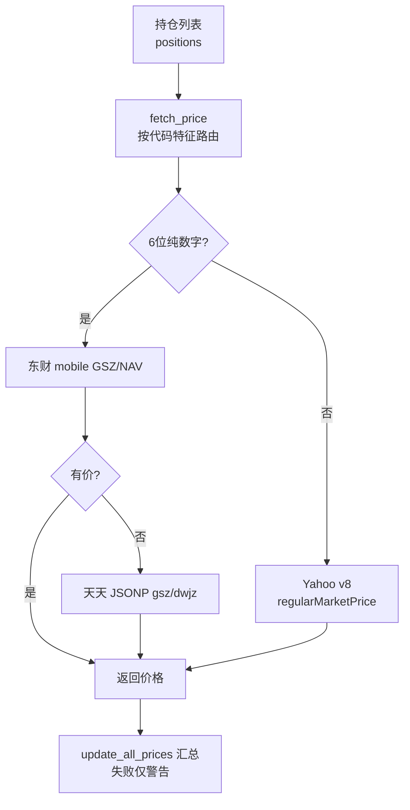

# 价格获取模块领域

**模块路径**：`src/quote.rs`
**生成日期**：2026-08-03

---

## 概述

价格获取模块是 MNS 的"行情接线员"——它负责把用户持仓的代码翻译成真实的当前价格。难点在于资产类型混杂：国内基金（6 位纯数字代码，如 510880）和美股/ETF（字母代码，如 QQQ）走完全不同的数据源。本模块按代码特征路由：纯数字 6 位 → 天天基金（东方财富移动端主接口 + 天天基金 JSONP 备份）；字母 → Yahoo Finance。你可以把它想成一个"多语言翻译器"：根据代码的"长相"决定找哪个数据源要价。

考虑到这些都是免费公共接口，模块的策略是**"主源优先、多源降级、失败不阻断"**：东财 mobile 接口失败会自动落到天天 JSONP（`fetch_from_tiantian`，`src/quote.rs:124`）；批量更新时单个标的失败只打印警告、继续处理其他（`update_all_prices`，`src/quote.rs:217-231`）。这让 `mns update-prices` 在接口不稳定时仍能更新大部分资产。

模块对"数据源响应不可靠"保持悲观预期，这一点在解析层体现得淋漓尽致：多处用 `unwrap_or_default()` 容错（`src/quote.rs:75`），Yahoo 前收价格用多级 fallback（`chartPreviousClose` → `previousClose` → indicators 历史收盘，`src/quote.rs:290-307`），因为指数这类标的在 v8 接口里根本没有 `previousClose` 字段。能容忍的"小残缺"绝不升级成"整个请求失败"。

---

## 核心功能点

1. **价格路由**（`fetch_price`，`src/quote.rs:178`）——`is_chinese_fund = code.len()==6 && 全数字`；国内基金或 cn_stocks 走天天基金系，否则走 Yahoo。
2. **东方财富移动端 API**（`fetch_from_eastmoney_mobile`，`src/quote.rs:32`）——优先取估算净值 `GSZ`，缺则取单位净值 `NAV`。
3. **天天基金 JSONP 备份**（`fetch_from_tiantian_jsonp`，`src/quote.rs:80`）——解析 `jsonpgz({...})` 格式，取 `gsz`/`dwjz`。
4. **Yahoo v8 chart API**（`fetch_from_yahoo`，`src/quote.rs:132`）——解析 `regularMarketPrice`。
5. **批量更新**（`update_all_prices`，`src/quote.rs:197`）——逐个抓取，产出 `PriceUpdate` 列表（含新旧价、来源标记），失败仅警告。
6. **完整报价**（`fetch_full_quote`，`src/quote.rs:245`）——给 `market.rs` 用的：价格 + 前收（指数用 `chartPreviousClose`，多级 fallback）+ 名称，算出涨跌与涨跌幅。

---

## 关键组件

| 组件/类型 | 文件路径 | 核心职责 |
|---------|---------|---------|
| `PriceUpdate` | `src/quote.rs:6` | 单标的更新结果（新旧价 + 来源） |
| `StockQuote` | `src/quote.rs:15` | 完整报价（价格/涨跌/涨跌幅） |
| `fetch_price()` | `src/quote.rs:178` | 按代码特征路由的入口 |
| `fetch_from_eastmoney_mobile()` | `src/quote.rs:32` | 东财基金净值主源 |
| `fetch_from_tiantian_jsonp()` | `src/quote.rs:80` | 天天基金 JSONP 备份 |
| `fetch_from_yahoo()` | `src/quote.rs:132` | 美股/ETF 报价 |
| `update_all_prices()` | `src/quote.rs:197` | 批量更新（失败隔离） |
| `fetch_full_quote()` | `src/quote.rs:245` | 含前收的完整报价 |

---

## 内部数据流

**关键步骤说明**：
1. 路由判断：`fetch_price`（`src/quote.rs:178`）用 `code.len()==6 && is_ascii_digit` 判断国内基金。
2. 国内链路：`fetch_from_tiantian`（`src/quote.rs:124`）先东财 mobile，失败再天天 JSONP——双源保障。
3. 批量汇总：`update_all_prices`（`src/quote.rs:197`）逐标的调用，`Ok(None)`/`Err` 都只 `eprintln!` 警告后 `continue`（`src/quote.rs:217-231`），保证单点失败不拖垮全批。

---

## 关键接口与扩展点

模块对外提供三个层级的数据接口：`fetch_price`（单标的、返回价格）、`update_all_prices`（批量、返回 `PriceUpdate` 列表）、`fetch_full_quote`（单标的、返回含前收与名称的 `StockQuote`）。扩展点在于数据源：`fetch_price` 的路由分支是"加数据源"的位置（如未来支持港股代码前缀 0/5 路由）；内部双源降级结构（`fetch_from_tiantian`）已示范"主源 + 备份"模式，可复制到任何新资产类型。

---

## 与其他模块的交互

| 交互模块 | 方向 | 接口/协议 | 说明 |
|---------|------|---------|------|
| models | 依赖 | `Position` | 读取持仓代码/类别/现价 |
| main | 被依赖 | `cmd_update_prices` 调 `update_all_prices` | 价格更新命令 |
| market | 被依赖 | `fetch_full_quote` → `StockQuote` → `MarketQuote` | 指数/个股报价 |

---

## 跨模块协作场景

**在"价格更新"流程中**：`cmd_update_prices`（`src/main.rs:783`）调 `update_all_prices`，拿到 `PriceUpdate` 列表后逐个 `db.update_price`（`src/main.rs:799`）更新 `positions.current_price`。本模块的输出是整个"账户价值计算"（portfolio/report）的输入。

**在"市场概况"流程中**：`market.rs` 调 `fetch_full_quote`（`src/market.rs:50`）抓 9 个指数，本模块提供含前收的 `StockQuote` 让市场模块算出涨跌百分比——涨绿跌红的表格直接建立在 `fetch_full_quote` 的输出上。

**在"买卖记账"流程中**：`cmd_buy`（`src/main.rs:270`）先用 `fetch_price` 拿当前价，再交给 `db.buy_position` 记账——价格获取是记账链路的前置环节。

---

## 性能考量

每个标的一次 HTTP 请求，串行执行（`update_all_prices` 内 for 循环，`src/quote.rs:200`）——刻意不做并发：免费公共接口并发轰炸会触发反爬。每请求 10-15s 超时。若持仓几十个标的，全批可能耗时几分钟（受接口响应速度限制），但每单失败快速跳过。`fetch_full_quote` 单独调用时毫秒~秒级。

---

## 实现亮点

- **双源降级**（`src/quote.rs:124-129`）——东财 mobile 为主、天天 JSONP 为备份，接口不可用时自动降级而不是报错。
- **宽严并济的解析**：Yahoo 前收用多级 fallback（`chartPreviousClose` → `previousClose` → indicators 历史收盘，`src/quote.rs:290-307`），对指数这类"v8 接口没有 previousClose"的特殊情况做了专门处理。
- **"失败隔离"的批处理哲学**：`update_all_prices` 明确注释"接口无数据，跳过该资产""请求失败，跳过该资产，继续处理其他"（`src/quote.rs:218/226`）——单个标的的价格问题不应阻塞整个组合的更新。
- **容错优先的解析**：多处 `unwrap_or_default()`（`src/quote.rs:75`），把"第三方字段缺失"降级为"默认值"，而不是让整个命令崩溃。
