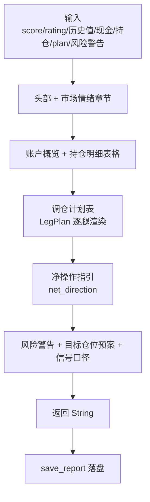

# 报告生成模块领域

**模块路径**：`src/report.rs`
**生成日期**：2026-08-03

---

## 概述

报告生成模块是 MNS 的"新闻发言部"——它把 `strategy.rs` 算出的调仓计划、`config.rs` 里的目标仓位预案、数据库里的持仓明细、风险警告，组织成一份人类可读的**每日策略报告**。你可以把报告想象成一份"值班参谋递上来的作战简报"：开头是市场情绪（恐贪指数 + 环比同比），中间是账户概览与持仓明细表格，然后是今天要做的动作（调仓计划表 + 净操作指引），最后是风险警告与"不同情绪下我该怎么动"的预案。

这个模块刻意不做任何决策计算——决策已经由 `strategy::calculate_rebalance_plan` 完成，报告只是**排版与呈现**。它负责两件事：把 `RebalancePlan` 的字段翻译成直观的"买入 ¥xxx / 卖出 ¥xxx / 不动作"，以及保证文本对齐（中文占 2 列的问题用 `unicode-width` 的 `pad_display` 解决，`src/report.rs:12`）。报告最终落盘为 `reports/YYYY-MM-DD.txt`。

报告模块最动人的设计在细节里：当今日无需调仓时，它不说冷冰冰的"无建议"，而是耐心解释"偏离均在带宽内，持有即可……中长线框架下多数月份都不应有动作"（`src/report.rs:236`）。而报告末尾的信号口径章节则诚实披露策略的局限（情绪信号贡献近零、趋势锚更好但未启用）——这是一份会"自我泼冷水"的报告，也是一份值得信任的报告。

---

## 核心功能点

1. **报告组装**（`generate_report`，`src/report.rs:23`）——按章节拼接：市场情绪（含环比/同比）→ 账户概览 → 持仓明细表格 → 调仓计划表 → 腿内明细 → 净操作指引 → 风险警告 → 目标仓位预案 → 信号口径说明。
2. **调仓计划渲染**（`src/report.rs:147-220`）——把 `LegPlan` 渲染成"类别/目标/当前/偏离/建议"五列表，偏离超带宽标红（超配）或绿（低配）；腿内 `LegItem` 渲染为"代码 (名称): 买入/卖出 ¥xxx"。
3. **净操作指引**（`src/report.rs:222-239`）——一句话总结今天的方向：净买入/净卖出/持仓不动；"无动作"时明确告诉用户"这是正常状态，中长线框架下多数月份都不应有动作"——刻意安抚用户不交易的焦虑。
4. **信号口径披露**（`src/report.rs:281-291`）——报告末尾诚实说明当前建议由情绪锚驱动，回测显示趋势锚更好但需要 12 个月本地价格历史，且"情绪信号在加入趋势锚后贡献接近零"。这是 MNS"诚实优先"理念在报告里的直接体现。
5. **落盘**（`save_report`，`src/report.rs:298`）——写入 `reports/YYYY-MM-DD.txt`，天然幂等（同一天重复运行覆盖同名文件）。

---

## 关键组件

| 组件/类型 | 文件路径 | 核心职责 |
|---------|---------|---------|
| `generate_report()` | `src/report.rs:23` | 主装配函数：全部章节的文本拼接 |
| `save_report()` | `src/report.rs:298` | 报告文件落盘（自动建目录） |
| `pad_display()` | `src/report.rs:12` | 按显示宽度补齐（中文占 2 列） |

---

## 内部数据流

**关键步骤说明**：
1. 头部与情绪：`generate_report`（`src/report.rs:23`）先拼日期与"逆情绪投资助手"标题，然后渲染恐贪指数与 4 个历史参照值。
2. 表格渲染：持仓明细与调仓计划都用 comfy-table 渲染后再整体缩进两格嵌入文本（`src/report.rs:141-143`），保证报告格式统一。
3. 预案与口径：最后两个章节分别给出"各情绪区间下的目标仓位预案"（数值化预案）与"信号口径"（诚实披露），让用户既知道该做什么，也知道建议的依据和局限。

---

## 关键接口与扩展点

本模块对外接口为纯函数 `generate_report(输入参数集合) -> String` 与 `save_report(text, date)`。扩展点在于章节编排：新增章节只需在 `generate_report` 的拼接序列中插入一个段落函数即可，不影响既有章节。渲染细节（表格缩进、着色）集中在模块内，调用方无需感知。`pad_display` 的中文对齐处理对调用方透明——任何模块需要中文对齐都可复用它。

---

## 与其他模块的交互

| 交互模块 | 方向 | 接口/协议 | 说明 |
|---------|------|---------|------|
| strategy | 依赖 | `RebalancePlan` / `RiskWarning` / `RiskAdvice` | 报告的核心内容来自调仓计划与风险警告 |
| config | 依赖 | `AppConfig::settings`/`thresholds`/`target_weight` | 目标仓位预案与年度目标来自配置 |
| models | 依赖 | `Position` 的收益计算方法 | 持仓明细渲染 |
| main | 被依赖 | `cmd_report` 调用 `generate_report` + `save_report` | 报告命令的唯一入口 |

---

## 跨模块协作场景

**在"每日策略报告"流程中**：本模块是输出端。`cmd_report`（`src/main.rs:382-396`）把抓到的恐贪指数、库里的现金/持仓、`strategy` 算出的 `plan` 与 `risk_warnings` 全部传入 `generate_report`，得到文本后既打印到终端也通过 `save_report` 落盘。整条链路上本模块是最后一步，前面任何一步失败（如恐贪抓取失败）都不会走到这里。

**在"买卖记账"流程中**：本模块不直接参与，但它输出的调仓建议（"买入 ¥xxx"）正是用户执行 `mns buy` 的决策依据——报告是决策链路的"出口"，记账是执行链路的"入口"，两者通过用户的判断衔接。

---

## 性能考量

纯字符串拼接与表格渲染，毫秒级。唯一 I/O 是落盘写一个几 KB 的文本文件。无缓存需求——报告按天生成，天然幂等。`pad_display` 对每行的 unicode 宽度计算为 O(行长)，在报告规模（几十行）下无压力。

---

## 实现亮点

- **"无动作"也写清楚**：报告在今日无需调仓时不是简单说"无建议"，而是解释"偏离均在带宽内，持有即可……中长线框架下多数月份都不应有动作"（`src/report.rs:236-238`）——这针对的是投资者"不交易就难受"的心理弱点，是产品设计层面的细节。
- **诚实披露内建于输出**：信号口径章节（`src/report.rs:281-291`）把策略的局限直接写进每天的报告，用户每次 `mns report` 都会看到"情绪贡献接近零""趋势锚更好但未启用"，防止对工具的盲目信任。
- **中文对齐处理**：`pad_display`（`src/report.rs:12`）用 `UnicodeWidthStr` 而非 `{:<n}` 按字符补齐，避免中英文混排错位——这是中文 CLI 工具最容易忽略的细节。
- **着色语义化**：偏离超带宽标红（超配）、低配标绿（`src/report.rs`），颜色承载"该卖/该买"的语义，而非装饰。
