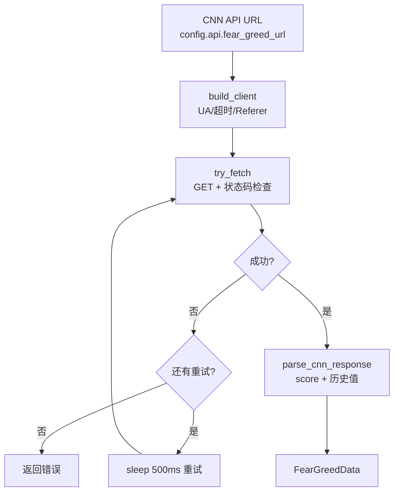

# 恐贪指数模块领域

**模块路径**：`src/sentiment.rs`
**生成日期**：2026-08-03

---

## 概述

恐贪指数模块是 MNS 的"市场体温计"——它从 CNN 的公开 API 抓取 Fear & Greed Index（0-100 的情绪量化值），并顺带提取一周/一月/一年前等历史参照值。这个数字是整个策略的**主输入信号**：`mns report`、`mns sentiment`、`mns market` 都依赖它，`AppConfig::sentiment_zone` 把它映射成"极度恐慌/恐慌/中性/贪婪/极度贪婪"五个区间，再查表得到目标仓位。可以想象成：医生（策略）先量体温（恐贪指数），再决定用药剂量（目标权重）。

考虑到 CNN 接口是免费的公开接口，随时可能反爬或限流，本模块花了大量精力在"抓取健壮性"上：UA 伪装成浏览器、请求/连接超时、最多 3 次重试、专门处理反爬虫的 HTTP 418 状态码。它不缓存（快照由 `db.rs` 负责），也不做业务判断（区间映射在 `config.rs`）——职责非常单一，这正是它可靠的前提。

模块的另一层设计是"**容错解析**"：CNN 响应结构随时可能变化，所以对历史参照值不做强类型断言，而是用字符串扫描提取数字。结构变了最多历史值缺失，但不会整个解析崩溃——这种"对第三方响应保持悲观预期"的思路贯穿整个模块。

---

## 核心功能点

1. **抓取当前指数与历史值**（`fetch_fear_greed_data`，`src/sentiment.rs:57`）——返回 `FearGreedData`（score 0-100 + 4 个历史参照值），供 `cmd_report`/`cmd_sentiment`/`cmd_market` 使用。
2. **健壮的网络访问**（`try_fetch` + `build_client`，`src/sentiment.rs:81/107`）——10s 请求超时、5s 连接超时、Chrome UA、Accept/Accept-Language/Referer 头齐全，伪装成正常浏览器访问。
3. **重试机制**（`src/sentiment.rs:63-74`）——最多 3 次、间隔 500ms，最后一次失败不等待；对 CNN 反爬（418）给出专门提示"稍后重试或使用代理"。
4. **容错解析**（`parse_cnn_response` + `extract_historical_value`，`src/sentiment.rs:117/139`）——历史值用字符串扫描提取（JSON 字段定位 + 数字字符收集），避免对 CNN 响应结构做强类型假设；score 用 `clamp(0.0, 100.0)` 防越界。

---

## 关键组件

| 组件/类型 | 文件路径 | 核心职责 |
|---------|---------|---------|
| `FearGreedData` | `src/sentiment.rs:36` | 恐贪指数数据包：当前分 + 4 个历史参照值 |
| `CnnResponse` / `FearGreed` | `src/sentiment.rs:24/30` | CNN 响应结构的强类型骨架（`fear_and_greed.score`） |
| `fetch_fear_greed_data()` | `src/sentiment.rs:57` | 对外主入口：带重试的抓取 |
| `try_fetch()` / `build_client()` | `src/sentiment.rs:81/107` | 单次请求 / HTTP 客户端构造 |
| `parse_cnn_response()` / `extract_historical_value()` | `src/sentiment.rs:117/139` | 响应解析与容错历史值提取 |

---

## 内部数据流

**关键步骤说明**：
1. 客户端构造：`build_client`（`src/sentiment.rs:107`）设置浏览器 UA、10s 请求超时、5s 连接超时。
2. 单次抓取：`try_fetch`（`src/sentiment.rs:81`）设置 `Accept: application/json` 与 CNN 站内 `Referer`，非 2xx 直接报错（418 特判反爬）。
3. 重试循环：`fetch_fear_greed_data`（`src/sentiment.rs:57`）外层 `for attempt in 1..=MAX_RETRIES`，失败则 sleep 500ms 再试。
4. 解析：强类型骨架读 `score`，历史值用 `extract_historical_value`（`src/sentiment.rs:139`）做字符串扫描容错提取。

---

## 关键接口与扩展点

本模块对外只有一个主入口 `fetch_fear_greed_data()`，输入输出均为纯数据，无状态。扩展点在于数据源：若 CNN 接口彻底不可用，可替换 `fetch_fear_greed_data` 内部实现（保留 `FearGreedData` 数据契约）即可，调用方（main/market）零改动。`parse_cnn_response` 与 `extract_historical_value` 的分离也允许未来适配新响应格式而只改解析层。

---

## 与其他模块的交互

| 交互模块 | 方向 | 接口/协议 | 说明 |
|---------|------|---------|------|
| main | 被依赖 | `cmd_sentiment`/`cmd_report`/`cmd_market` 调用 `fetch_fear_greed_data` | 三处命令消费恐贪指数 |
| config | 被依赖（由 main 传递） | `config.api.fear_greed_url` + `config.sentiment_zone` | URL 来自配置、区间映射在 config |
| db | 被依赖（由 main 调用） | `db.save_fear_greed_snapshot` | main 抓取后保存快照 |

---

## 跨模块协作场景

**在"每日策略报告"流程中**：`cmd_report`（`src/main.rs:356`）抓取恐贪指数 → 保存快照（`src/main.rs:361`）→ 用 `score` 驱动 `calculate_rebalance_plan` 与 `check_risk_warnings`。本模块是这条流水线的"信号源"——它失败，报告就失败（`?` 直接中断，`src/main.rs:356`），这是刻意设计：没有市场情绪的决策不可信。

**在"市场概况"流程中**：`cmd_market`（`src/main.rs:862`）对恐贪抓取采用**宽松策略**——失败只打印警告，不影响指数表格展示（`src/market.rs:33-37`），因为这里恐贪指数只是补充信息而非决策输入。同一模块、两种失败策略，体现了"失败策略随场景调整"的系统级约定。

---

## 性能考量

单次 HTTP 请求，量级毫秒~秒级。重试上限 3 次、总等待 ≤1s，保证最坏情况（网络不可用）也在 10s 超时 + 重试预算内结束。无缓存、无并发——恐贪指数一天抓一次足够，模块刻意保持"每命令实时抓取"以保证数据新鲜度。

---

## 实现亮点

- **字符串扫描式历史值提取**（`extract_historical_value`，`src/sentiment.rs:139`）——不依赖响应结构稳定性的聪明做法：用 `"field":` 定位后逐字符收集数字，CNN 改结构也不会崩，最多历史值缺失。
- **418 反爬特判**（`src/sentiment.rs:94`）——专门给出人性化错误提示"CNN 反爬虫拦截，稍后重试或使用代理"，比泛泛的"请求失败"更有可操作性。
- **`#[ignore]` 的真实网络测试**（`src/sentiment.rs:173`）——联网测试默认跳过（`cargo test -- --ignored` 才跑），保证 CI 无网络依赖，同时保留人工联网验证的通道。
