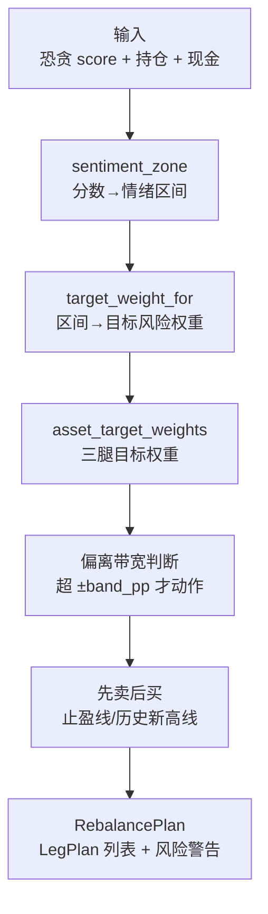

# 策略模块领域

**模块路径**：`src/strategy.rs`
**生成日期**：2026-08-03

---

## 概述

策略模块是 MNS 的"大脑"——所有"该买什么、该卖什么、该不该动"的决策都产自这里。它的输入是市场情绪（恐贪指数）、你的持仓与现金、以及配置里的目标仓位曲线；输出是一份完整的调仓计划 `RebalancePlan`，包含逐资产的建议方向、建议金额、偏离带宽判断，以及情绪极端时的风险警告。报告模块负责把它渲染成人类可读的文本，但这个"到底怎么做"的决策本身，全部在 `strategy.rs` 内完成。

这个模块最值得注意的设计是"**双轨共存**"：新一代的目标权重框架（`calculate_rebalance_plan`）是实盘唯一路径，而旧一代的比例框架（`calculate_buy_suggestions`/`calculate_sell_suggestions`）被刻意保留下来——不是为了兼容，而是为了回测对照。`Engine::Legacy` 用旧框架跑历史数据，让"新框架到底比旧框架好在哪"成为可验证的事实，而非开发者的一家之言。两套代码在同文件内被函数签名清晰隔离，实盘路径永远不会触碰旧代码。

策略的核心逻辑呼应了模块文件的头部注释（`src/strategy.rs:3-9`）：**规则在情绪极值处做最大仓位调整，平时尽量少动**。目标仓位曲线在"极度恐惧"时拉到 85%（低回撤默认），在"极度贪婪"时压到 35%，而偏离带宽（默认 ±6pp）负责决定"什么时候需要动手"——偏差没超带宽就持有，超了才调仓。这套"带宽缓冲"机制是逆向策略能长期持有的工程基础：它避免了追涨杀跌的频繁交易，也避免了极端情绪的反复折磨。

---

## 核心功能点

1. **调仓计划生成**（`calculate_rebalance_plan`，`src/strategy.rs:13`）——核心决策函数，输入持仓+现金+恐贪指数，输出 `RebalancePlan`（逐腿 `LegPlan` + 风险警告），采用"目标权重 → 偏离带宽 → 先卖后买"三步逻辑。
2. **逆向目标权重**（`src/strategy.rs:39-46`）——恐慌程度越高目标权重越高：极度恐慌 85%、恐慌 75%、中性 60%、贪婪 45%、极度贪婪 35%，与 `config.rs` 的目标仓位曲线一致。
3. **双重止盈机制**（`src/strategy.rs:52-63`）——不止单一收益目标：触及"止盈线"（年化 +8%）先部分止盈，"历史新高线"（自买入以来最高点回落 10%）则全部止盈，两条线独立判断。
4. **偏离带宽判断**（`src/strategy.rs:79-80`）——目标权重 ± 偏离带宽（默认 ±6pp）内的偏差视为"不需要动作"，只有超带宽才进入调仓候选。
5. **风险警告**（`RiskWarning` + `RiskAdvice`，`src/strategy.rs:159/161`）——情绪极值（恐贪 <25 或 >75）触发警告，并给出对应的逆向操作建议（恐慌→加仓机会、贪婪→止盈警惕）。
6. **旧框架保留**（`calculate_buy_suggestions`/`calculate_sell_suggestions`，`src/strategy.rs`）——比例矩阵框架，仅服务 `Engine::Legacy` 回测对照，不参与实盘。

---

## 关键组件

| 组件/类型 | 文件路径 | 核心职责 |
|---------|---------|---------|
| `RebalancePlan` | `src/strategy.rs:21` | 调仓计划根结构：目标权重 + 逐腿 `LegPlan` + 风险警告 |
| `LegPlan` / `LegItem` | `src/strategy.rs:28/34` | 单腿计划与腿内逐资产建议（方向 + 金额） |
| `RiskWarning` / `RiskAdvice` | `src/strategy.rs:159/161` | 风险警告与对应操作建议 |
| `calculate_rebalance_plan()` | `src/strategy.rs:13` | 新框架主入口（实盘） |
| `calculate_buy_suggestions()` / `calculate_sell_suggestions()` | `src/strategy.rs:239/283` | 旧框架入口（仅回测） |
| `check_risk_warnings()` | `src/strategy.rs:100` | 基于恐贪快照历史的情绪极值检测 |

---

## 内部数据流

**关键步骤说明**：
1. 情绪映射：`calculate_rebalance_plan` 用 `config.sentiment_zone(score)` 把分数切成五档（`src/strategy.rs:39`）。
2. 权重查表：`config.target_weight_for(zone)` 得到总目标风险权重，再用 `asset_target_weights` 拆到三腿（`src/strategy.rs:41`）。
3. 带宽判断：每腿 `target - current` 的偏差绝对值与 `band_pp` 比较，超带宽进入调仓（`src/strategy.rs:79-80`）。
4. 顺序保证：按"先卖后买"处理，卖出腿先执行（`src/strategy.rs`），避免新买入资产又被卖出。

---

## 关键接口与扩展点

策略模块通过**纯函数 + 数据契约**提供扩展点：任何调用方只需构造输入（持仓 `Vec<Position>`、现金、恐贪 `score`），调用 `calculate_rebalance_plan` 即得 `RebalancePlan`，无需了解内部实现。新增策略变体（如趋势锚）的路径是：在 `backtest.rs` 增加 `Engine` 枚举变体 + 在 `config.rs` 扩展目标权重映射 + 在本模块新增对应的权重计算函数——三个独立扩展点，互不干扰。当前实现已为"趋势锚"预留了结构（`src/backtest.rs` 的 `Anchor::TrendTilt`），策略模块的权重计算函数与之对应。

---

## 与其他模块的交互

| 交互模块 | 方向 | 接口/协议 | 说明 |
|---------|------|---------|------|
| config | 依赖 | `target_weight_for`/`asset_target_weights`/`band_pp`/`annual_goal` | 全部策略参数与映射函数 |
| models | 依赖 | `Position` | 持仓输入 |
| db | 依赖（间接） | 恐贪快照序列 | 风险警告的历史依据 |
| report | 被依赖 | `RebalancePlan`/`RiskWarning` | 报告渲染的决策内容 |
| main | 被依赖 | `calculate_rebalance_plan`/`check_risk_warnings` | 报告与建议命令的调用方 |
| backtest | 被依赖 | `calculate_buy_suggestions`/`calculate_sell_suggestions` | `Engine::Legacy` 回测输入 |

---

## 跨模块协作场景

**在每日策略报告流程中**：本模块是决策中枢。`cmd_report`（`src/main.rs:377-379`）抓取恐贪指数落库后，调用 `check_risk_warnings` 与 `calculate_rebalance_plan` 生成决策，再把 `RebalancePlan` 交给 `report.rs` 渲染成报告。本模块的产物是整条流水线的"内容核心"——报告里最值钱的信息（该买什么、该卖什么）全部来自这里。

**在回测流程中**：本模块是旧框架的提供者。`backtest.rs` 的 `Engine::Legacy` 逐月调用 `calculate_buy_suggestions`/`calculate_sell_suggestions` 模拟旧策略（`src/backtest.rs`），让新旧框架在统一的数据与成本模型下公平对比——这正是"新框架是否值得"的证据链。

**在买卖记账流程中**：本模块虽不直接参与，但它的调仓建议（如"买入 510880 ¥2000"）是用户执行 `mns buy` 的依据。报告链路与记账链路的衔接点是 `Position` 数据契约——`models.rs` 的持仓模型被两端共用。

---

## 性能考量

`calculate_rebalance_plan` 是纯 CPU 计算，输入规模为"持仓数 × 三腿"，毫秒级完成，无任何性能风险。它不涉及网络与 I/O（数据由调用方准备好）。由于决策依赖的是当日恐贪快照与当前持仓，本模块天然适合每次调用重新计算，无缓存需求。唯一的"重计算"场景在回测中：`Engine::Legacy` 逐月调用旧框架函数，但 112 个月 × 秒级仍是可忽略的负载。

---

## 实现亮点

- **"先卖后买"的摩擦控制**：调仓顺序刻意先处理卖出再处理买入（`src/strategy.rs`），防止"买入后立刻又被卖出"的来回摩擦——这是实盘交易成本优化的关键细节。
- **双重止盈 vs 单线止盈**：部分止盈（年化 +8%）与全部止盈（历史新高回落 10%）双线独立判断（`src/strategy.rs:52-63`），兼顾"落袋为安"与"让利润奔跑"。
- **风险警告的逆向性格**：恐贪 >75 时警告不是"快跑"，而是提示"极度贪婪，注意止盈"（`RiskAdvice`），与策略的逆向本质自洽——警告机制本身也在执行逆向逻辑。
- **带宽缓冲的心理学**：偏离带宽让"不动作"成为常态（`src/report.rs:236` 明说"多数月份都不应有动作"），从工程上抑制了频繁交易冲动——这是把"长期持有"从理念变成默认行为的设计。
