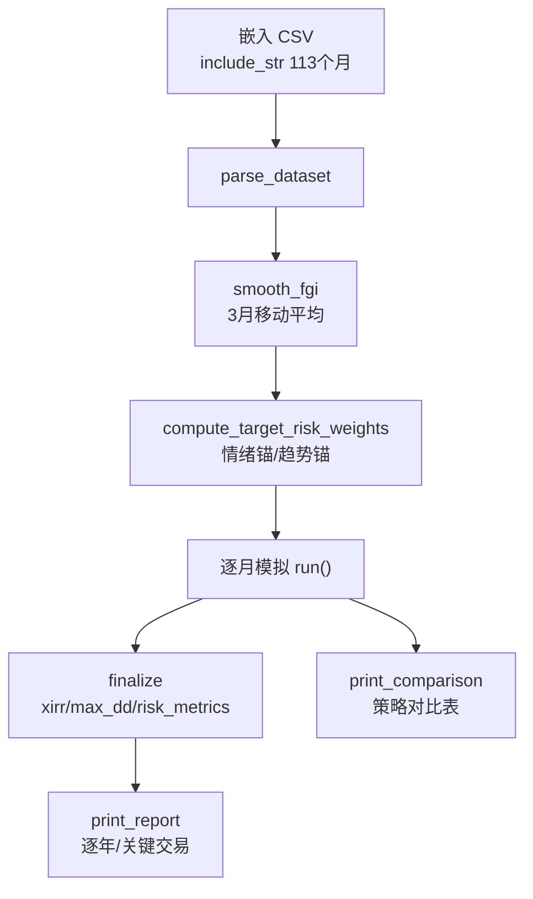

# 回测引擎

> 源码：`src/backtest.rs`

## 模块职责

回测引擎是 MNS 的"审计部门"——它不产生建议，而是用 2016-2025 的真实市场数据检验建议逻辑过去表现如何。它解决的核心问题是：**在我把钱投进去之前，先告诉我这套规则过去十年会赚多少、亏多少、抗不抗揍**。

模块最关键的设计是与实盘策略**共用决策代码**（src/backtest.rs:18 直接 `use crate::strategy`），保证回测与实盘口径一致。数据通过 `include_str!` 编译期嵌入（src/backtest.rs:24-29），回测结果对同一二进制确定可复现。

## 核心功能

| 功能 | 位置 | 说明 |
|------|------|------|
| 四引擎统一模拟 | src/backtest.rs:232 | TargetWeight / Legacy / BuyHold / BuyHoldRebalanced |
| 真实成本模型 | src/backtest.rs:5-13 | 买入费 + FIFO 分批阶梯赎回费 + 闲置现金收益 |
| 双信号锚点 | src/backtest.rs:259 | SentimentOnly（纯情绪）/ TrendTilt（趋势主锚 + 情绪倾斜） |
| FIFO 分批持仓 | src/backtest.rs:95-195 | 逐批买入登记，卖出按先进先出，各批次独立计赎回费 |
| 数据完整性自检 | src/backtest.rs:1062-1087 | 逐月跳变 <35%、整数行过少检测，防拼接断点与人工估填 |

### 引擎统一（四策略同一口径）

`Engine` 枚举（src/backtest.rs:232）把 4 种策略类型化。旧版三者实现各自独立、基准还硬编码了不同配置（70/15/15 vs 55/25/20），导致对比不公平；新版本全部走同一数据与同一成本模型（src/backtest.rs:3-8）。

关键步骤：

1. `smooth_fgi`（src/backtest.rs:360）把逐月 FGI 平滑，避免周级噪声驱动年级组合——**信号周期错配的修正**：FGI 均值回归周期是数周，而组合决策周期是数月到数年（src/backtest.rs:255-257 注释）。
2. `compute_target_risk_weights`（src/backtest.rs:322）产出目标权重序列：情绪锚直接查配置曲线；趋势锚用价格 vs 12 月均线分腿判断升降趋势，再叠加情绪倾斜。
3. `run` 主循环（src/backtest.rs:557）每月的四步：现金按 `cash_growth` 计息 → 年度 3 月后注资 → 按引擎调仓 → 记账（`Monthly` 记录风险权重/目标权重/期间收益）。

### 成本模型

回测把"扣掉真实费用后还剩多少"诚实呈现：买入费 + 卖出 FIFO 分批阶梯赎回费（每批次按各自持有天数计费）+ 闲置现金货币基金收益。`sell_fifo`（src/backtest.rs:138）是核心——同一资产的不同买入批次持有天数不同，卖出时逐批计算费用，而不是简单用"最早买入日"一刀切。

## 关键类型

| 类型 | 位置 | 一句话职责 |
|------|------|-----------|
| `Engine` | src/backtest.rs:232 | 4 种策略引擎类型化枚举 |
| `Anchor` | src/backtest.rs:259 | 信号锚点：SentimentOnly / TrendTilt |
| `SignalConfig` | src/backtest.rs:268 | 信号处理配置：平滑窗口/锚点/趋势参数/情绪倾斜 |
| `MonthRow` | src/backtest.rs:38 | 单月数据行：月末日期 + FGI + 三腿价格 |
| `BacktestResult` | src/backtest.rs:406 | 回测产出：XIRR、回撤、风险指标、交易列表、逐月序列 |
| `Leg` / `Lot` | src/backtest.rs:95/105 | FIFO 分批持仓模型 |
| `Trade` / `Monthly` | src/backtest.rs:53/64 | 关键交易与逐月记录 |

## 跨模块协作

| 交互模块 | 方向 | 说明 |
|---------|------|------|
| 策略核心 | 依赖 | `Engine::Legacy` 复用实盘买卖建议函数（`calculate_buy_suggestions` 等） |
| 绩效指标 | 依赖 | `xirr` / `risk_metrics` / `max_drawdown`（src/metrics.rs:18/140/87） |
| 配置系统 | 依赖 | `AppConfig` / `Costs`（参数与成本模型） |
| 数据模型 | 依赖 | `Position`（`Leg::to_position` 转换，src/backtest.rs:175） |
| CLI 与命令分发 | 被依赖 | `cmd_backtest` / `cmd_backtest_validate` 调用 |

**协作的关键**：`rebalance_to_weights`（src/backtest.rs:687）与实盘 `calculate_rebalance_plan` 共享 `config.target_weight_for`（src/config.rs:350）这条"情绪→目标仓位"映射——回测与实盘建议同源，杜绝"回测好看、实盘拉胯"。

## 扩展点

- **新增引擎**：在 `Engine` enum 加变体（src/backtest.rs:232）+ `run` 的 match 分支（src/backtest.rs:610-650）+ `label()` 加名称。设计刻意让引擎实现集中在一个函数内，便于对照。
- **新增锚点**：在 `Anchor` enum 加变体 + `compute_target_risk_weights` 加分支（src/backtest.rs:328-356）。
- **信号可配置**：`SignalConfig::trend_tilt()`（src/backtest.rs:296）工厂方法，扩展信号模式只需新增工厂。
- **自定义数据**：更换 `DATASET` 常量（src/backtest.rs:24-29）指向新 CSV 即可回测不同时期/不同资产。

## 性能考量

回测是数值密集型但数据量极小（113 个月 × 3 腿），单次 run 毫秒级。刻意使用**确定性算法**（无随机数依赖的确定性 xorshift RNG 用于 bootstrap，src/metrics.rs:161-178）——同种子可复现是"验证策略有效"的前提。bootstrap 2000 次重采样在主线程串行完成，对 CLI 工具可接受。

## 实现亮点

- **口径一致性**：统一引擎 + 统一成本模型 + 统一数据（src/backtest.rs:3-8），从根上消除"回测好看、实盘拉胯"的系统性失真。
- **诚实披露内建**：`print_report` 同时输出 XIRR 与简单年化（src/backtest.rs:874-877）、逐年表现与关键交易（src/backtest.rs:917-1006），让用户能自己核对策略在关键时点做了什么。
- **反过拟合内置**：bootstrap 分布与 holdout 区块（src/main.rs:690-718）把"单条历史路径的偶然性"可视化——"年化差异若落在分布宽度之内就不具统计显著性"。
