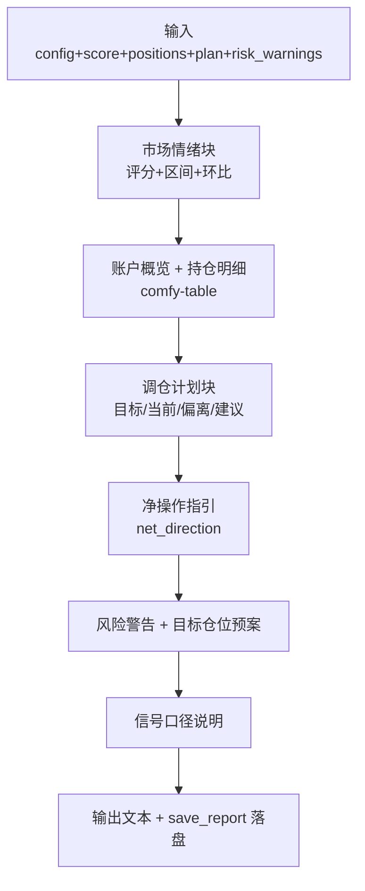

# 报告生成

> 源码：`src/report.rs`

## 模块职责

报告生成模块是 MNS 的"秘书"——它不产生决策，但把策略的决策翻译成人能秒懂的格式。它解决的核心问题是：**如何把"该买多少、该卖多少、该警惕什么"讲得清楚、讲得诚实、讲得可追溯**。

报告覆盖 8 个信息块：市场情绪、账户概览、持仓明细、调仓计划、净操作指引、风险警告、目标仓位预案、信号口径。其中**信号口径块**（src/report.rs:282-291）是亮点——它明确告知用户当前建议由什么信号驱动、该信号经回测检验的效果如何，以及趋势锚何时可切换。

## 核心功能

| 功能 | 位置 | 说明 |
|------|------|------|
| 结构化报告渲染 | src/report.rs:23 | 纯函数：配置+情绪+持仓+调仓计划 → 文本报告 |
| 中文宽度对齐 | src/report.rs:12 | `pad_display` 按显示宽度而非字符数补齐 |
| 分级着色 | src/report.rs:119-127 | 年化达标标绿、为负标红；偏离超带宽类别标色 |
| 落盘存档 | src/report.rs:298 | `reports/{date}.txt`，形成每日决策日志 |

### 渲染流程

`generate_report` 是**纯函数**（src/report.rs:23）——不读库、不调 API，只做渲染，天然可测。

## 关键组件

| 组件 | 位置 | 一句话职责 |
|------|------|-----------|
| `generate_report` | src/report.rs:23 | 主渲染函数：8 个信息块拼装为文本报告 |
| `save_report` | src/report.rs:298 | 落盘到 `{report_output_dir}/{date}.txt` |
| `pad_display` | src/report.rs:12 | 中文宽度感知的补位（终端对齐） |

## 跨模块协作

| 交互模块 | 方向 | 说明 |
|---------|------|------|
| 策略核心 | 依赖 | 消费 `RebalancePlan` / `RiskWarning` / `RiskAdvice` |
| 数据模型 | 依赖 | `Position` 持仓明细渲染 |
| 配置系统 | 依赖 | 阈值/目标仓位/输出目录来自 `AppConfig` |
| CLI 与命令分发 | 被依赖 | `cmd_report` 调用 `generate_report` + `save_report` |

**协作场景**：`cmd_report`（src/main.rs:348）完成数据获取与决策后，调用 `report::generate_report` 与 `report::save_report` 渲染并落盘。报告中的"调仓计划"直接来自 `strategy::calculate_rebalance_plan` 的输出，保证用户看到的建议与策略逻辑零失真。

## 性能考量

渲染为纯字符串拼接，微秒级。无需缓存——报告每日一次，每次都基于最新数据完整重算，避免"读缓存导致建议过期"。

## 实现亮点

- **诚实内建**：信号口径块明确披露"当前建议由情绪锚驱动；回测显示趋势锚更优但需 12 个月价格历史"（src/report.rs:282-291）。工具的价值是纪律而非吹嘘。
- **"不动作"也是结论**：调仓计划块在无动作时输出"今日无需调仓——各类别偏离均在带宽内，持有即可。这是正常状态：中长线框架下多数月份都不应有动作"（src/report.rs:235-238）——把"无事可做"解释为正常而非失败，管理用户预期。
- **中文对齐的工程细节**：中文字符在终端占 2 列，`{:<n}` 按字符数补齐会错位，必须用 `unicode-width` 按显示宽度补齐（src/report.rs:12-19）——细节决定专业感。
