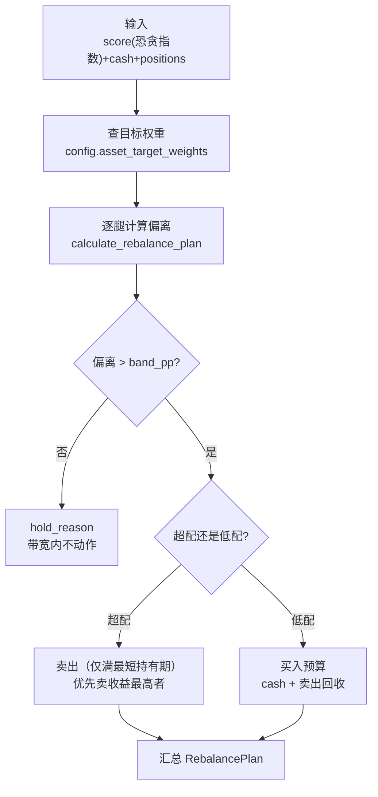

# 策略核心

> 源码：`src/strategy.rs`

## 模块职责

策略核心是 MNS 的"决策大脑"，也是整个系统最重要的模块。恐贪指数、价格、持仓这些数据本身没有意义，是策略模块把它们翻译成了"该买多少、该卖多少、该警惕什么"。它解决的核心问题是：**在情绪极值点，用规则替代直觉做出反直觉但正确的仓位决策**。

模块内有两套框架：**新框架（目标仓位 + 偏离带）**驱动实盘报告，**旧框架（现金/份额百分比）**保留仅供回测对照。这个"新旧并存"设计不是兼容性包袱——它让回测能直接回答"新框架到底比旧框架好在哪"。

## 核心功能

| 功能 | 位置 | 说明 |
|------|------|------|
| 目标仓位调仓计划 | src/strategy.rs:406 | 新框架主入口：情绪→目标权重，逐腿算偏离，超带宽才动作 |
| 逆向加权分摊 | src/strategy.rs:560 | 腿内分钱：浮亏越多获得资金越多，宽基不排除、个股深度浮亏排除 |
| 风险警告 | src/strategy.rs:292 | 浮亏超 20% 持仓按情绪环境给差异化建议 |
| 双重止盈 | src/strategy.rs:209 | 年化达标 或 绝对收益 ≥30% 且持仓够长 |

### 调仓计划（新框架）

`calculate_rebalance_plan`（src/strategy.rs:406）的处理流程：

三个关键步骤的设计动机：

1. **目标权重是"锚"**：`config.asset_target_weights(score)`（src/config.rs:380）把情绪分数映射为三条腿的目标权重——由于决策只对照锚，**建议无路径依赖**（同样权重结构下，组合规模大小不影响建议，src/strategy.rs:760-780 测试验证）。
2. **卖出先于买入**（src/strategy.rs:449-497）：先处理超配腿，回收现金后供买入腿使用，买卖互感知，资金利用率最大化。
3. **预算约束**（src/strategy.rs:505-535）：买入预算 = 现金 + 卖出回收，不足时按比例分配并标记 `cash_constrained`。

### 逆向加权分摊

`split_within_leg`（src/strategy.rs:560）回答"一条腿里的钱怎么分"：浮亏越多的标的获得越多资金（`cost_price/current_price` 加权，上限 `max_contrarian_weight`），真正实现"别人恐惧我贪婪"。一个重要的规则细分在 src/strategy.rs:557-559 的注释里：**宽基指数深度浮亏不排除**（`is_broad_index`，src/strategy.rs:602），**个股深度浮亏排除**——因为指数跌 30% 是机会、个股跌 30% 可能是基本面恶化。这是对"一刀切排除深亏标的"旧逻辑的规则修正。

### 风险警告

`check_risk_warnings`（src/strategy.rs:292）对浮亏超 20% 的持仓按情绪环境给三级差异化建议：恐慌环境 → 可能是加仓机会；中性 → 审视基本面；贪婪 → 紧急审视（别人赚钱你还在亏，需怀疑结构性问题）。

## 关键类型

| 类型 | 位置 | 一句话职责 |
|------|------|-----------|
| `RebalancePlan` | src/strategy.rs:360 | 调仓计划根类型：目标/当前风险权重、各腿计划、现金约束标记 |
| `LegPlan` | src/strategy.rs:334 | 单条资产腿的计划：目标/当前权重、偏离、建议金额、不动作原因 |
| `LegItem` | src/strategy.rs:380 | 腿内标的级别的动作明细 |
| `RiskWarning` | src/strategy.rs:311 | 风险警告结构（标的 + 浮亏 + 建议） |
| `RiskAdvice` | src/strategy.rs:292 | 风险建议枚举（加仓机会/审视/紧急审视） |

## 跨模块协作

| 交互模块 | 方向 | 说明 |
|---------|------|------|
| 配置系统 | 依赖 | 目标权重曲线、带宽、阈值全部来自 `AppConfig` |
| 数据模型 | 依赖 | 消费 `Position` 做逐标的计算 |
| 报告生成 | 被依赖 | 报告消费 `RebalancePlan`/`RiskWarning` 渲染 |
| 回测引擎 | 被依赖 | `Engine::Legacy` 复用旧框架买卖建议函数（src/backtest.rs:753-797） |
| CLI 与命令分发 | 被依赖 | `cmd_report` 调用 `calculate_rebalance_plan`（src/main.rs:379） |

## 扩展点

- **目标权重曲线**是最大的扩展点：`target_weight.*` 五档配置完全由用户定义，校验只强制"随情绪单调不增"（src/config.rs:300-308）。想要更激进/更保守的逆向策略，改配置即可，代码零改动。
- **带宽** `rebalance.band_pp` 是"交易频率调节器"：带宽大 → 动作少 → 交易少。回测验证了"带宽越大交易越少"（src/backtest.rs:1231-1246）。
- `is_broad_index` 的关键词表（src/strategy.rs:603-607）可扩展：新增指数/ETF 关键词即可调整"宽基不排除"的识别范围。

## 性能考量

无性能压力——单用户每日跑一次，O(持仓数) 的简单遍历。刻意保持简单可读，无缓存、无异步。真正的"性能"考量在回测侧（数值稳定性），决策侧追求的是逻辑可验证。

## 实现亮点

- **无路径依赖**：决策只对照目标权重锚，与组合规模无关（src/strategy.rs:760-780 测试保障）——这是新框架相对旧框架最核心的改进。
- **规则细分**：宽基 vs 个股的差异化处理（src/strategy.rs:557-559）体现对策略语义的深入理解——不是"一个规则走天下"，而是理解什么值得逆向、什么需要回避。
