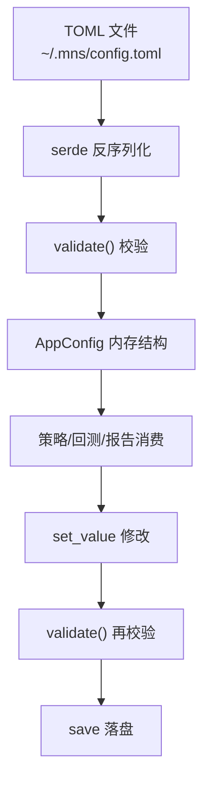

# 配置系统

> 源码：`src/config.rs`

## 模块职责

配置系统是 MNS 的"仪表盘"——所有策略参数、成本假设、API 端点都集中在这里。它解决的核心问题是：**如何让一个不懂代码的用户安全地调整策略行为**。用户改一个 `rebalance.band_pp 6`，交易频率就变了；改 `target_weight.extreme_fear 90`，恐慌时仓位就更激进。配置是策略的"可编程接口"。

模块承载了新旧两套策略框架的参数（旧：buy_ratio/sell_ratio/settings；新：target_weight/rebalance/costs），并靠 `validate()`（src/config.rs:255）在加载和写入时双向把关——**非法配置永远进不了系统**。

## 核心功能

| 功能 | 位置 | 说明 |
|------|------|------|
| 声明式配置结构 | src/config.rs:7 | 9 个子结构 + serde 反序列化 |
| 合法性校验 | src/config.rs:255 | 五大类校验（见下） |
| dot-path 读写 | src/config.rs:434-551 | `mns config thresholds.fear 40` 直接映射嵌套字段 |
| 旧配置向后兼容 | src/config.rs:15-22 | `#[serde(default)]` 缺字段自动回落默认值 |
| 目标权重默认曲线 | src/config.rs:40 | 85/75/60/45/35，注释说明"这是仓位管理的锚"（src/config.rs:25-29） |

### 五大类校验

`validate()`（src/config.rs:255）在加载和写盘两端都执行：

1. 三腿配置之和必须 = 100%
2. 情绪阈值必须严格单调递增
3. **目标权重必须随情绪单调不增**（逆向策略核心约束，src/config.rs:300-308）——不是文档建议而是强制校验，"逆向策略的数学约束直接写进了系统"
4. 仓位缩放 0-100
5. 带宽与现金收益非负

### 配置数据流

## 关键组件

| 组件 | 位置 | 一句话职责 |
|------|------|-----------|
| `AppConfig` | src/config.rs:7 | 配置根结构：9 个子节承载全部参数 |
| `TargetWeight` | src/config.rs:31 | 情绪→目标权重五档曲线（逆向策略锚） |
| `Rebalance` | src/config.rs:58 | 偏离带/最小交易额/最短持有期 |
| `Costs` | src/config.rs:79 | 买卖费率/现金收益/阶梯赎回费 |
| `validate` | src/config.rs:255 | 配置合法性校验（加载与写盘双向） |
| `sentiment_zone` | src/config.rs:332 | 分数→情绪区间映射 |
| `target_weight_for` | src/config.rs:350 | 分数→风险资产目标权重 |

## 跨模块协作

| 交互模块 | 方向 | 说明 |
|---------|------|------|
| 策略核心 | 被依赖 | `asset_target_weights` / `target_weight_for`（决策的锚） |
| 回测引擎 | 被依赖 | `AppConfig` / `Costs`（参数与成本模型） |
| 数据持久化 | 被依赖 | `db_path` / `config_path`（数据文件位置） |
| CLI 与命令分发 | 被依赖 | `load` / `save` / `get_value` / `set_value` |

**协作场景**：每日报告中本模块提供全部决策参数——`cmd_report` 加载 `AppConfig`（src/main.rs:349），策略模块从中读取目标权重曲线、带宽、阈值。回测流程中本模块是实验变量——`mns backtest run --config my.toml` 加载自定义配置（src/main.rs:489-492），`--compare a.toml,b.toml` 加载多个配置做公平对比（src/main.rs:467-487）。

## 性能考量

无性能问题——配置在命令开始时加载一次，全程只读（除 `mns config` 修改命令）。纯内存结构，所有计算都在策略层完成。

## 实现亮点

- **"校验在加载和写入两端都执行"**（src/main.rs:142 + src/config.rs:250）：用户手改 TOML 后加载会校验，`mns config` 命令修改也会先校验再落盘——两条修改路径都有护栏。
- **新框架对旧框架的参数分层**（src/config.rs:14-22）：`target_weight`/`rebalance`/`costs` 与旧参数并列但职责清晰，配合 `#[serde(default)]` 实现无痛升级。
- **逆向约束编码为校验规则**（src/config.rs:300-308）："目标权重必须随情绪升高单调不增"不是文档建议而是强制校验——这是配置系统最"硬"的一道护栏。
