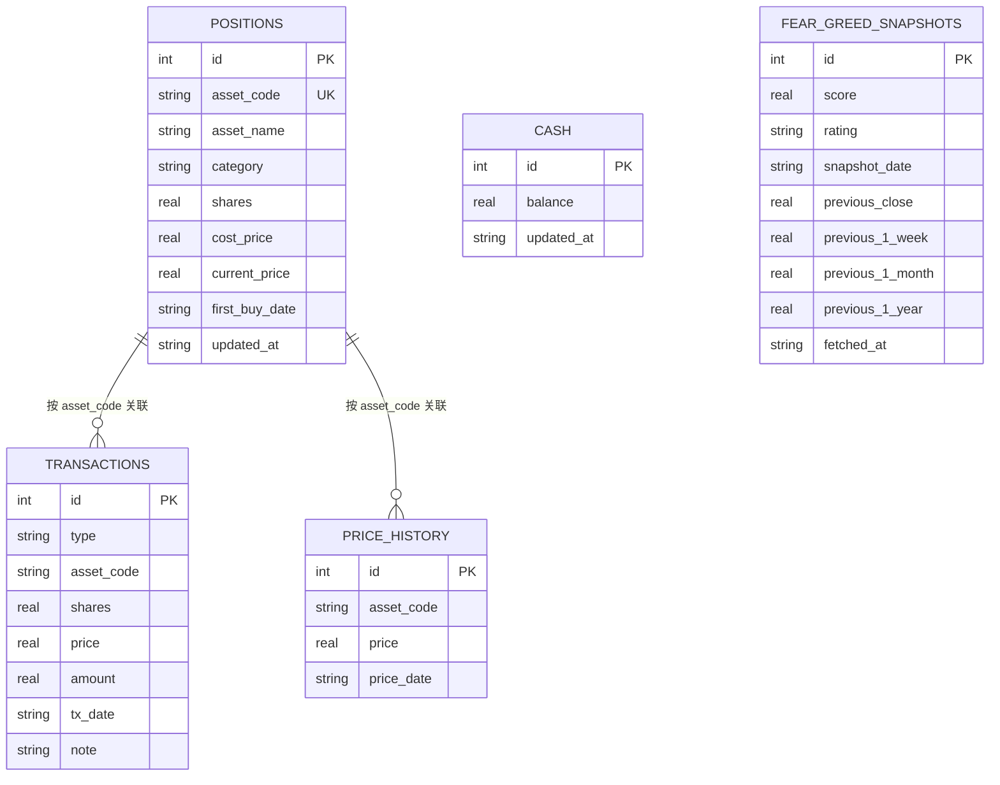

# 6. 数据库概览

> 面向需要理解 MNS 数据如何落盘的读者。MNS 使用 SQLite（rusqlite bundled），数据库文件位于 `~/.mns/mns.db`（src/config.rs:236-238）。schema 由 `Database::init_tables`（src/db.rs:24-73）内联 SQL 管理，无独立迁移文件。

## 概览

MNS 的数据库是典型的**单用户记账式本地库**：5 张表、无视图、无存储过程，靠"幂等建表"而非迁移脚本演进。打开数据库时 `init_tables` 自动补齐缺失的表——旧版本数据库在新版本二进制下打开即自动升级。

| 类型 | 数量 |
|------|------|
| 数据表 | 5 |
| 视图 | 0 |
| 存储过程 | 0 |
| 显式索引 | 0（含 2 个 UNIQUE 约束隐式索引） |

## 实体关系图

本库是"记账式"结构，表间通过**业务主键**关联而非严格外键（SQLite 未声明 FOREIGN KEY 约束）：

- `positions.asset_code` ↔ `transactions.asset_code`：资产与交易流水的 1:N 关系（一个资产多条交易）
- `positions.asset_code` ↔ `price_history.asset_code`：资产与价格历史的 1:N 关系（一个资产多条逐日价格）
- `cash`：孤立的单行账户余额，不与其他表关联
- `fear_greed_snapshots`：独立的情绪快照序列，不与持仓关联（市场级数据）

## 核心数据表

### `cash`

单行表（`id = 1` 约束），存储账户现金余额。

| 字段 | 类型 | 约束 | 说明 |
|------|------|------|------|
| id | INTEGER | PK, CHECK(id=1) | 固定单行主键 |
| balance | REAL | NOT NULL | 现金余额 |
| updated_at | TEXT | NOT NULL | 更新时间（datetime('now')） |

设计成单行表而非单值存储，便于与 SQLite 语义对齐并保留更新时间。每次买入/卖出都会在事务中同步更新余额（src/db.rs:208-231）。

### `positions`

持仓池——资产注册表 + 当前持仓状态。

| 字段 | 类型 | 约束 | 说明 |
|------|------|------|------|
| id | INTEGER | PK AUTOINCREMENT | 主键 |
| asset_code | TEXT | NOT NULL UNIQUE | 资产代码（如 QQQ、510880） |
| asset_name | TEXT | NOT NULL | 资产名称 |
| category | TEXT | NOT NULL | 类别：us_stocks/cn_stocks/counter_cyclical |
| shares | REAL | NOT NULL | 当前份额 |
| cost_price | REAL | NOT NULL | 加权平均成本价 |
| current_price | REAL | - | 现价（可空，未更新时用成本价估算） |
| first_buy_date | TEXT | NOT NULL | 首次买入日（决定持有天数/赎回费档） |
| updated_at | TEXT | NOT NULL | 更新时间 |

`first_buy_date` 是策略的关键输入——持有天数决定"是否可卖"（规避惩罚性赎回费）与年化收益计算。`current_price` 可空，空值时所有估算降级到成本价（src/models.rs:25-29）。

### `transactions`

交易流水账（买入/卖出历史）。

| 字段 | 类型 | 约束 | 说明 |
|------|------|------|------|
| id | INTEGER | PK AUTOINCREMENT | 主键 |
| type | TEXT | NOT NULL, CHECK IN ('buy','sell') | 交易类型 |
| asset_code | TEXT | NOT NULL | 资产代码 |
| shares | REAL | NOT NULL | 份额 |
| price | REAL | NOT NULL | 成交价 |
| amount | REAL | NOT NULL | 金额 = shares × price |
| tx_date | TEXT | NOT NULL | 交易日 |
| note | TEXT | - | 备注 |

### `price_history`

逐日价格快照——为趋势锚（价格 vs 12 月均线）提供历史序列。

| 字段 | 类型 | 约束 | 说明 |
|------|------|------|------|
| id | INTEGER | PK AUTOINCREMENT | 主键 |
| asset_code | TEXT | NOT NULL | 资产代码 |
| price | REAL | NOT NULL | 价格 |
| price_date | TEXT | NOT NULL | 价格日期 |
| 唯一约束 | - | UNIQUE(asset_code, price_date) | 同一天同资产只保留一条（最新覆盖） |

设计动机记录在 src/db.rs:300-314 注释：旧表只存 current_price 无法回溯，趋势锚需要历史序列故单独累积；同一天重复调用用 `ON CONFLICT ... DO UPDATE` 保留最新值。

### `fear_greed_snapshots`

恐贪指数历史快照。

| 字段 | 类型 | 约束 | 说明 |
|------|------|------|------|
| id | INTEGER | PK AUTOINCREMENT | 主键 |
| score | REAL | NOT NULL | 恐贪指数（0-100） |
| rating | TEXT | NOT NULL | 情绪区间（极度恐慌/恐慌/...） |
| snapshot_date | TEXT | NOT NULL | 快照日期 |
| previous_close | REAL | - | 前日收盘值 |
| previous_1_week | REAL | - | 一周前值 |
| previous_1_month | REAL | - | 一月前值 |
| previous_1_year | REAL | - | 一年前值 |
| fetched_at | TEXT | NOT NULL | 抓取时间 |

同一天只保留最新快照——`save_fear_greed_snapshot`（src/db.rs:373-395）先 DELETE 当天已有记录再 INSERT，形成干净的情绪历史序列供报告做环比/同比。

## 数据访问模式

| 操作 | 位置 | 说明 |
|------|------|------|
| 建表 | src/db.rs:24-73 | `CREATE TABLE IF NOT EXISTS` 幂等建表 |
| 买入 | src/db.rs:170 | 单事务：持仓+现金+流水三写 |
| 卖出 | src/db.rs:233 | 单事务：校验持有量+三写 |
| 价格更新 | src/db.rs:287/303 | `update_price` + `record_price` 双写 |
| 情绪快照 | src/db.rs:373 | 当天去重后插入 |
| 配置路径 | src/config.rs:236-238 | `db_path` 默认 `~/.mns/mns.db` |

所有写操作走事务（`unchecked_transaction`，src/db.rs:210/263），保证崩溃时不会出现半完成状态。备份整个系统状态只需复制 `~/.mns/` 下的 `config.toml` 与 `mns.db` 两个文件。
