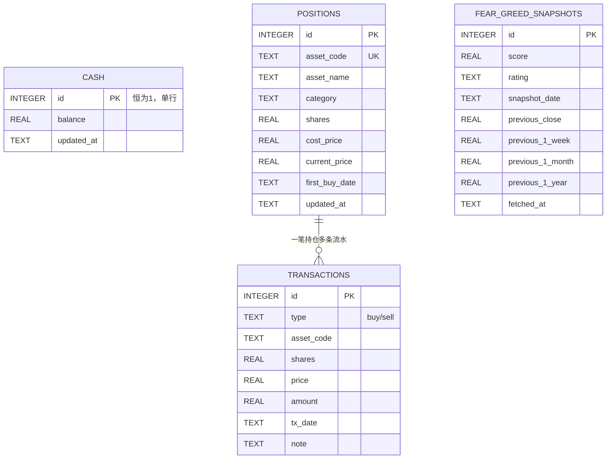

# 数据库概览

MNS 使用 SQLite（rusqlite）作为本地账本，单文件 `~/.mns/mns.db`，零运维、随备份目录整体复制即可迁移。数据库由 `src/db.rs` 独占管理，`Database::open`（`src/db.rs:12`）负责建目录、开连接、幂等建表（`CREATE TABLE IF NOT EXISTS`，`src/db.rs:24`）。它服务的核心原则是"**账本不能改**"：买卖用事务保证原子、现金用 CHECK 约束防负、交易类型用 CHECK 约束限死——代码校验与数据库约束双重防线。

下面先看整体统计，再展开实体关系与每张表。数据规模是"几十年 × 每天一条"量级，远低于 SQLite 能力边界，无分表/归档需求。

---

## 统计摘要

| 类型 | 数量 |
|------|------|
| 数据表 | 4 |
| 视图 | 0 |
| 存储过程 | 0 |
| 触发器 | 0 |

四张表对应 `models.rs` 的两类业务实体 + 两个单表结构：`positions`/`transactions` 对应持仓与流水，`fear_greed_snapshots` 对应恐贪快照（写入即用作报告展示与审计留痕，未接读取接口），`cash` 是单行现金。

---

## 实体关系图

---

## 核心数据表

### `cash`（现金余额）

单行表，通过 `CHECK (id = 1)` 在数据库层强制"永远只有一行"（`src/db.rs:27`）。初始化时 `INSERT OR IGNORE ... (1, 0)` 植入默认行（`src/db.rs:70`）。

| 字段 | 类型 | 约束 | 说明 |
|------|------|------|------|
| id | INTEGER | PK | 恒为 1（CHECK id=1），强制单行 |
| balance | REAL | NN | 现金余额；代码层拒绝负数（`src/db.rs:88`） |
| updated_at | TEXT | NN | 更新时间 |

读写接口：`get_cash_balance` / `set_cash_balance` / `add_cash`（`src/db.rs:77-106`）。

---

### `positions`（持仓）

`asset_code` 唯一，同一资产永远一行；买入时 `cost_price` 按加权平均成本更新（`src/db.rs:193-199`），首笔买入记录 `first_buy_date`。

| 字段 | 类型 | 约束 | 说明 |
|------|------|------|------|
| id | INTEGER | PK | 自增 |
| asset_code | TEXT | UNIQUE | 资产代码，如 510880 |
| asset_name | TEXT | NN | 资产名称 |
| category | TEXT | NN | fund/stock/etf |
| shares | REAL | NN | 已购份额 |
| cost_price | REAL | NN | 加权平均成本 |
| current_price | REAL | NULL | 现价（`update_price` 刷新，可空） |
| first_buy_date | TEXT | NN | 首笔买入日期 |
| updated_at | TEXT | NN | 更新时间 |

行→模型映射：`row_to_position`（`src/db.rs:129`）→ `models::Position`。

---

### `transactions`（交易流水）

只读的流水账，`CHECK (type IN ('buy','sell'))` 锁死交易类型（`src/db.rs:44`）。每一笔买卖在事务内同时写此表 + 更新 `positions` + 联动 `cash`（`src/db.rs:170`）。

| 字段 | 类型 | 约束 | 说明 |
|------|------|------|------|
| id | INTEGER | PK | 自增 |
| type | TEXT | CHECK | 仅 buy/sell |
| asset_code | TEXT | NN | 标的代码 |
| shares | REAL | NN | 份额 |
| price | REAL | NN | 成交价 |
| amount | REAL | NN | 成交金额 |
| tx_date | TEXT | NN | 交易日 |
| note | TEXT | NULL | 备注 |

---

### `fear_greed_snapshots`（恐贪快照）

每日一条，同日先删后插保证唯一（`save_fear_greed_snapshot`，`src/db.rs:373`）。4 个历史参照值来自 CNN 接口当次响应（不是本表回读），写入即用于当次报告【市场情绪】章节的展示；本表本身只写不读，作用是留存每日快照供人工回溯查询，暂无专门的读取命令。

| 字段 | 类型 | 约束 | 说明 |
|------|------|------|------|
| id | INTEGER | PK | 自增 |
| score | REAL | NN | 恐贪指数 0-100 |
| rating | TEXT | NN | 评级 |
| snapshot_date | TEXT | NN | 快照日期 |
| previous_close | REAL | NULL | 前值参照 |
| previous_1_week | REAL | NULL | 一周前参照 |
| previous_1_month | REAL | NULL | 一月前参照 |
| previous_1_year | REAL | NULL | 一年前参照 |
| fetched_at | TEXT | NN | 抓取时间 |

---

## 视图、存储过程、函数

无。所有数据访问都是 `Database` 方法中的直接 SQL，业务逻辑全部在 Rust 层（`strategy.rs`/`models.rs`），数据库保持"纯存储"定位——这是刻意的：把计算留在类型安全的 Rust，把约束留给 SQLite 的 CHECK/UNIQUE，各司其职。

---

## 事务与一致性设计

- **买卖原子性**：`buy_position`/`sell_position` 用 `unchecked_transaction` 把"持仓 + 现金 + 流水"三步包成一个事务（`src/db.rs:170-228`），任何一步失败整体回滚——账目永远不会出现"持仓变了现金没扣"。
- **浮点保护**：`sell_position` 用 `shares.min(pos.shares)` 防超卖（`src/db.rs:253`）。
- **现金校验**：`set_cash_balance` 拒绝负数、`add_cash` 拒绝非正数（`src/db.rs:88/102`）。
- **迁移策略**：目前无 schema 版本号，靠 `CREATE TABLE IF NOT EXISTS` 幂等演进；破坏性变更需删库重初始化（`mns init --force`，有交互确认保护）。
