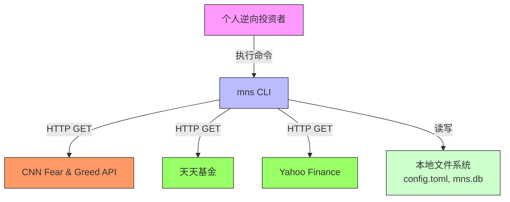

# System Context Overview

## 1. Project Introduction

**项目名称**：mns（Money Never Sleeps，Market Neutral Strategist）  
**项目描述**：mns 是一个轻量级、无服务依赖的命令行投资助手工具，专为个人逆向投资者设计，旨在通过整合实时市场情绪数据、本地持仓信息与自动化策略引擎，提供数据驱动、纪律严明的投资决策支持。系统不依赖任何远程服务器、Web界面或第三方交易平台，所有计算、存储与交互均在本地完成，确保用户数据隐私与系统可控性。

**核心功能与价值**：  
mns 的核心价值在于将主观情绪化交易转化为可量化、可复盘的规则化操作。系统通过以下能力显著提升个人投资者的决策质量：  
- **自动化逆向策略**：基于恐惧与贪婪指数动态计算买入与卖出建议，避免"接飞刀"与追高杀跌；  
- **智能风险预警**：识别亏损超阈值持仓，结合情绪等级提供分级警示，防止风险累积；  
- **每日中文策略报告**：自动生成结构化、可读性强的投资复盘日报，帮助用户回顾决策逻辑、强化纪律执行；  
- **本地化资产管理**：支持现金余额管理、持仓增减、价格更新与交易历史记录，实现完整投资闭环；  
- **策略回测验证**：基于历史数据验证策略有效性，优化参数配置；  
- **自动价格获取**：支持天天基金和 Yahoo Finance 双数据源，自动更新持仓价格；
- **高可配置性**：所有策略参数均通过TOML配置文件定义，支持个性化定制。

**技术特征概览**：  
- **语言与平台**：基于 Rust 编程语言构建（edition 2024），具备内存安全、高性能与跨平台特性；  
- **数据获取**：使用 CNN API 获取恐贪指数（股票市场），reqwest 获取价格数据；
- **数据持久化**：采用 SQLite 本地数据库，实现原子性事务操作，保障资产数据一致性；  
- **配置管理**：使用 TOML 格式配置文件，支持热加载与规则验证；  
- **外部依赖**：通过 CNN API 获取市场情绪数据，天天基金/Yahoo Finance 获取价格；
- **交互方式**：完全通过命令行接口（CLI）与用户交互，无需图形界面；  
- **架构风格**：分层模块化架构，严格分离核心业务逻辑与基础设施。

---

## 2. Target Users

### 用户角色定义

| 用户角色 | 描述 |
|----------|------|
| **个人逆向投资者** | 具备一定投资经验、追求长期价值、厌恶情绪化交易的个人投资者。他们理解市场周期性，相信"别人恐惧时我贪婪，别人贪婪时我恐惧"的逆向投资哲学，但缺乏系统化工具辅助执行。 |

### 使用场景描述

1. **每日复盘与决策**：  
   投资者在交易日结束后执行 `mns report` 命令，系统自动加载当日持仓、现金余额、交易历史，并获取最新恐惧与贪婪指数，生成一份包含"买入建议""卖出建议""风险预警"和"资金分配预案"的中文日报。用户据此决定次日操作，避免冲动交易。

2. **执行交易操作**：  
   用户通过 `mns buy QQQ 10 380` 或 `mns sell 512890 100` 等命令执行买入/卖出操作。系统实时校验现金余额、资产类别限额与配置规则，确保交易合法，并自动更新数据库与持仓模型。

3. **自动更新价格**：  
   用户执行 `mns update-prices` 自动获取所有持仓资产的当前价格，无需手动更新。

4. **策略回测验证**：  
   用户执行 `mns backtest` 验证当前配置的历史表现，对比不同参数的效果。

5. **系统初始化与配置调整**：  
   新用户首次运行 `mns init`，系统引导创建默认配置文件与数据库结构。用户可后续通过 `mns config` 动态修改资产分配比例或策略阈值。

### 用户需求分析

| 需求编号 | 用户需求 | 系统实现方式 | 重要性 |
|----------|----------|--------------|--------|
| U1 | 根据市场情绪自动判断买入/卖出时机 | 策略引擎基于恐贪指数动态计算建议，采用反向权重机制 | 高 |
| U2 | 避免在亏损资产上过度加仓 | 策略引擎排除亏损超阈值且情绪未反转的资产 | 高 |
| U3 | 动态调整资产配置比例以实现风险对冲 | 配置管理模块支持多资产类别比例设定 | 高 |
| U4 | 获取每日中文投资策略报告以复盘与执行 | 报告生成模块整合输出，持久化为文件 | 极高 |
| U5 | 保持投资纪律，减少主观判断干扰 | 所有操作基于预设规则，报告提供决策依据 | 极高 |
| U6 | 数据本地存储，保障隐私与离线可用性 | 使用SQLite本地数据库 | 高 |
| U7 | 配置灵活可调，支持个性化策略 | TOML配置文件支持自定义参数 | 高 |
| U8 | 自动获取资产价格，减少手动操作 | quote 模块支持双数据源自动获取 | 高 |
| U9 | 验证策略历史表现，优化参数 | backtest 模块支持历史回测 | 高 |

---

## 3. System Boundaries

### 系统范围定义

mns 是一个**独立、自包含、无服务依赖的命令行工具**，其系统边界严格限定于本地计算与有限外部数据获取。系统不涉及任何远程服务、Web服务、移动应用、云存储或交易平台对接，所有核心逻辑与数据均驻留在用户本地设备中。

### 包含的核心组件

| 组件 | 作用说明 |
|------|----------|
| `main.rs` | 程序入口，协调模块初始化与命令分发 |
| `cli.rs` | 命令行解析器（基于 clap），支持 init、report、backtest、update-prices 等子命令 |
| `config.rs` | 加载与验证 `config.toml`，管理资产比例、风险阈值、API端点等配置参数 |
| `db.rs` | SQLite数据库连接管理、事务控制、CRUD操作 |
| `models.rs` | 定义核心金融数据结构，含业务计算逻辑 |
| `strategy.rs` | 核心策略引擎，实现买入建议、卖出建议、风险预警的智能决策算法 |
| `report.rs` | 将策略输出整合为中文日报并保存为本地文件 |
| `sentiment.rs` | 使用 CNN API 获取恐惧贪婪指数（股票市场） |
| `quote.rs` | 自动价格获取（天天基金/Yahoo Finance） |
| `backtest.rs` | 历史回测引擎，参数优化验证 |

### 排除的外部依赖

以下组件明确**不属于系统范围**：

- Web界面（HTML/React/Vue）
- 移动应用（iOS/Android）
- 后端服务（Node.js/Python Flask/Django）
- 云数据库（PostgreSQL/MySQL）
- 第三方交易平台API（如Binance、Alpaca、雪球）
- 实时行情推送服务（WebSocket）
- 消息通知系统（邮件/微信/钉钉）
- 机器学习模型训练平台
- Docker容器化部署脚本

> **架构决策说明**：系统刻意规避任何远程服务依赖，以确保用户数据主权、系统轻量化与运行稳定性。

---

## 4. External System Interactions

### 外部系统列表

| 外部系统名称 | 描述 | 交互频率 | 可用性依赖 |
|--------------|------|----------|------------|
| **CNN Fear & Greed** | 提供股票市场恐惧贪婪指数（0–100分），实时更新 | 每日1次 | 中等。失败时返回错误 |
| **天天基金** | 国内基金实时估值 | 用户手动触发 | 低。失败时跳过该资产 |
| **Yahoo Finance** | 美股/ETF实时报价 | 用户手动触发 | 低。失败时跳过该资产 |

### 交互方式描述

| 数据源 | 协议 | 说明 |
|--------|------|------|
| CNN API | HTTP GET | 使用 reqwest 直接调用 CNN Fear & Greed API |
| 天天基金 | HTTP GET | 6位数字代码自动识别 |
| Yahoo Finance | HTTP GET | 字母代码自动识别 |

---

## 5. System Context Diagram

---

## 6. Technical Architecture Overview

### 主要技术栈

| 层级 | 技术组件 | 说明 |
|------|----------|------|
| **编程语言** | Rust 1.92+ (edition 2024) | 内存安全、零成本抽象、高性能 |
| **数据获取** | reqwest + CNN API | 直接调用 CNN Fear & Greed API |
| **配置管理** | TOML + `serde` | 人类可读、结构清晰 |
| **数据持久化** | SQLite + `rusqlite` | 轻量级嵌入式数据库 |
| **HTTP客户端** | `reqwest` + `tokio` | 异步非阻塞 |
| **CLI解析** | `clap` v4 | 高性能命令行解析 |
| **表格输出** | `comfy-table` | 美观的ASCII表格渲染 |

### 架构模式

- **分层架构（Layered Architecture）**：
  1. **入口层**：main.rs + cli.rs —— 用户交互点
  2. **应用层**：strategy.rs + report.rs + backtest.rs —— 核心价值
  3. **基础设施层**：config.rs + db.rs + sentiment.rs + quote.rs —— 支撑服务
  4. **数据模型层**：models.rs —— 共享数据结构

- **模块化设计（Modular Design）**：每个模块职责单一

- **依赖注入（Dependency Injection）**：模块间通过参数传递依赖

### 关键设计决策

| 决策编号 | 决策内容 | 理由与影响 |
|----------|----------|------------|
| D1 | **不使用Web服务器** | 降低复杂度，符合"个人工具"定位 |
| D2 | **仅支持SQLite** | 事务支持，无需安装服务 |
| D3 | **配置文件为TOML** | 易读、支持注释、结构清晰 |
| D4 | **报告输出为Markdown** | 可被任意编辑器打开，支持Git版本控制 |
| D5 | **使用CNN API** | 获取股票市场恐贪指数（非crypto） |
| D6 | **默认保守配置** | 基于历史回测优化，低回撤优先 |

---

## 7. 默认配置（保守配置）

基于2016-2025历史数据回测，当前默认配置为**保守配置**（低回撤优先）：

| 参数 | 默认值 | 说明 |
|------|--------|------|
| us_stocks | 55% | 降低美股占比 |
| cn_stocks | 25% | 红利低波稳健配置 |
| counter_cyclical | 20% | 提高黄金对冲比例 |
| extreme_fear | 30% | 更严格的极度恐慌阈值 |
| fear | 45% | 恐慌阈值 |
| greed | 70% | 更早触发贪婪卖出 |
| extreme_fear_buy | 60% | 极度恐慌适度买入 |
| fear_buy | 35% | 恐慌保守买入 |
| annualized_target_low | 10% | 年化10%开始减仓 |
| annualized_target_high | 15% | 年化15%大笔减仓 |
| min_holding_days | 45 | 最小持仓天数 |

**预期表现**：
- 年化收益：7-8%
- 最大回撤：13-18%
- 收益/回撤比：0.5+
