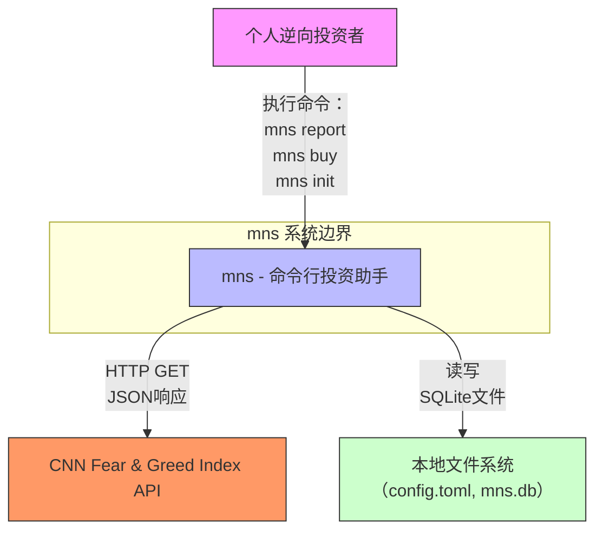

# System Context Overview

## 1. Project Introduction

**项目名称**：mns（Money Never Sleeps，Market Neutral Strategist）  
**项目描述**：mns 是一个轻量级、无服务依赖的命令行投资助手工具，专为个人逆向投资者设计，旨在通过整合实时市场情绪数据、本地持仓信息与自动化策略引擎，提供数据驱动、纪律严明的投资决策支持。系统不依赖任何远程服务器、Web界面或第三方交易平台，所有计算、存储与交互均在本地完成，确保用户数据隐私与系统可控性。

**核心功能与价值**：  
mns 的核心价值在于将主观情绪化交易转化为可量化、可复盘的规则化操作。系统通过以下能力显著提升个人投资者的决策质量：  
- **自动化逆向策略**：基于CNN恐惧与贪婪指数动态计算买入与卖出建议，避免“接飞刀”与追高杀跌；  
- **智能风险预警**：识别亏损超阈值持仓，结合情绪等级提供分级警示，防止风险累积；  
- **每日中文策略报告**：自动生成结构化、可读性强的投资复盘日报，帮助用户回顾决策逻辑、强化纪律执行；  
- **本地化资产管理**：支持现金余额管理、持仓增减、价格更新与交易历史记录，实现完整投资闭环；  
- **高可配置性**：所有策略参数（资产分配比例、风险阈值、情绪映射规则）均通过TOML配置文件定义，支持个性化定制。

**技术特征概览**：  
- **语言与平台**：基于 Rust 编程语言构建，具备内存安全、高性能与跨平台特性；  
- **数据持久化**：采用 SQLite 本地数据库，实现原子性事务操作，保障资产数据一致性；  
- **配置管理**：使用 TOML 格式配置文件，支持热加载与规则验证；  
- **外部依赖**：仅通过 HTTP GET 请求获取 CNN Fear & Greed Index API 的公开市场情绪数据；  
- **交互方式**：完全通过命令行接口（CLI）与用户交互，无需图形界面；  
- **架构风格**：分层模块化架构，严格分离核心业务逻辑（策略引擎、报告生成）与基础设施（配置、数据库、外部数据获取），实现高内聚、低耦合。

---

## 2. Target Users

### 用户角色定义

| 用户角色 | 描述 |
|----------|------|
| **个人逆向投资者** | 具备一定投资经验、追求长期价值、厌恶情绪化交易的个人投资者。他们理解市场周期性，相信“别人恐惧时我贪婪，别人贪婪时我恐惧”的逆向投资哲学，但缺乏系统化工具辅助执行。他们重视纪律性、数据透明性与操作可追溯性，希望减少主观判断对投资行为的干扰。 |

### 使用场景描述

1. **每日复盘与决策**：  
   投资者在交易日结束后执行 `mns report` 命令，系统自动加载当日持仓、现金余额、交易历史，并调用CNN API获取最新恐惧与贪婪指数，生成一份包含“买入建议”“卖出建议”“风险预警”和“资金分配预案”的中文日报。用户据此决定次日操作，避免冲动交易。

2. **执行交易操作**：  
   用户在观察到市场信号后，通过 `mns buy BTC 0.1 45000` 或 `mns sell AAPL 2` 等命令执行买入/卖出操作。系统实时校验现金余额、资产类别限额与配置规则，确保交易合法，并自动更新数据库与持仓模型。

3. **系统初始化与配置调整**：  
   新用户首次运行 `mns init`，系统引导创建默认配置文件与SQLite数据库结构（如已有数据会提示确认，`--force` 可跳过确认）。用户可后续通过 `mns config` 动态修改资产分配比例（如股票60%、加密货币30%、现金10%）、风险阈值（如亏损超20%触发预警）或API超时设置。

4. **情绪监控与独立分析**：  
   用户可单独执行 `mns sentiment` 获取实时CNN指数（如“恐惧”等级为15），用于独立分析市场状态，而不触发完整报告流程。

### 用户需求分析

| 需求编号 | 用户需求 | 系统实现方式 | 重要性 |
|----------|----------|--------------|--------|
| U1 | 根据市场情绪自动判断买入/卖出时机 | 策略引擎基于CNN指数与资产表现动态计算建议，采用反向权重机制 | 高 |
| U2 | 避免在亏损资产上过度加仓（防止“接飞刀”） | 策略引擎在买入建议中排除亏损超阈值且情绪未反转的资产，结合配置中的“禁止加仓”规则 | 高 |
| U3 | 动态调整资产配置比例以实现风险对冲 | 配置管理模块支持多资产类别比例设定，策略引擎根据比例与可用资金计算最优买入组合 | 高 |
| U4 | 获取每日中文投资策略报告以复盘与执行 | 报告生成模块整合策略输出、持仓数据与情绪指标，输出结构化中文文本并持久化 | 极高 |
| U5 | 保持投资纪律，减少主观判断干扰 | 所有操作基于预设规则，CLI强制参数校验，禁止无配置支持的操作，报告提供决策依据而非指令 | 极高 |
| U6 | 数据本地存储，保障隐私与离线可用性 | 使用SQLite本地数据库，无云端同步，无远程API调用除CNN情绪数据外 | 高 |
| U7 | 配置灵活可调，支持个性化策略 | TOML配置文件支持自定义阈值、比例、API端点，支持验证总和为100%等业务规则 | 高 |

---

## 3. System Boundaries

### 系统范围定义

mns 是一个**独立、自包含、无服务依赖的命令行工具**，其系统边界严格限定于本地计算与有限外部数据获取。系统不涉及任何远程服务、Web服务、移动应用、云存储或交易平台对接，所有核心逻辑与数据均驻留在用户本地设备中。

### 包含的核心组件

以下组件均属于系统边界内，由用户直接部署与维护：

| 组件 | 作用说明 |
|------|----------|
| `main.rs` | 程序入口，协调模块初始化与命令分发 |
| `cli.rs` | 命令行解析器（基于 clap），解析 `buy`, `sell`, `report`, `init`, `config`, `sentiment` 等子命令 |
| `config.rs` | 加载与验证 `config.toml`，管理资产比例、风险阈值、API端点等配置参数 |
| `db.rs` | SQLite数据库连接管理、事务控制、CRUD操作（持仓、交易、现金、情绪快照） |
| `models.rs` | 定义 `Position`, `Transaction`, `FearGreedSnapshot` 等核心金融数据结构，含业务计算逻辑（如年化收益率） |
| `strategy.rs` | 核心策略引擎，实现买入建议、卖出建议、风险预警的智能决策算法 |
| `report.rs` | 将策略输出、持仓数据、情绪指数整合为中文日报并保存为本地文件 |
| `sentiment.rs` | 封装对 CNN Fear & Greed Index API 的 HTTP 请求与JSON解析 |

### 排除的外部依赖

以下组件明确**不属于系统范围**，系统不提供、不集成、不依赖：

- Web界面（HTML/React/Vue）
- 移动应用（iOS/Android）
- 后端服务（Node.js/Python Flask/Django）
- 云数据库（PostgreSQL/MySQL）
- 第三方交易平台API（如Binance、Alpaca、雪球）
- 实时行情推送服务（WebSocket）
- 消息通知系统（邮件/微信/钉钉）
- 机器学习模型训练平台
- Docker容器化部署脚本
- CI/CD流水线配置

> **架构决策说明**：系统刻意规避任何远程服务依赖，以确保用户数据主权、系统轻量化与运行稳定性。即使CNN API不可用，系统仍可基于本地历史数据生成报告（降级模式），核心功能不完全瘫痪。

---

## 4. External System Interactions

### 外部系统列表

| 外部系统名称 | 描述 | 交互频率 | 可用性依赖 |
|--------------|------|----------|------------|
| **CNN Fear & Greed Index API** | 提供全球市场情绪指标（0–100分），反映投资者普遍的恐惧与贪婪心理。数据公开、免费、无认证，每日更新一次（UTC时间凌晨）。 | 每日报告生成时触发（约1次/日），或用户手动调用 `mns sentiment` 时触发 | 中等。系统在API超时或返回错误时采用缓存上一次有效值，确保报告可生成，但标记“情绪数据过期”。 |

### 交互方式描述

- **协议**：HTTP/1.1 over TLS (HTTPS)  
- **方法**：GET  
- **端点**：`https://api.alternative.me/fng/`（标准公开API）  
- **请求头**：`User-Agent: mns/v1.0 (personal-investor-tool)`  
- **响应格式**：JSON，包含字段 `value`, `value_classification`, `timestamp`  
- **数据处理**：  
  - `sentiment.rs` 模块负责发起请求、解析JSON、封装错误上下文（网络超时、JSON解析失败、HTTP状态码非200）；  
  - 返回的 `FearGreedResponse` 模型由 `models.rs` 定义，经验证后传递给 `strategy.rs` 和 `report.rs`；  
  - 若请求失败，系统记录错误日志并使用本地缓存的最近有效值（最多保留7天），确保报告完整性。

### 依赖关系分析

| 依赖方向 | 依赖强度 | 说明 |
|----------|----------|------|
| **系统 → CNN API** | 高（8.5） | 情绪数据是策略引擎的核心输入变量，直接影响买卖建议与风险预警的准确性。无此数据，系统将降级运行，但核心功能（持仓管理、报告生成）仍可用。 |
| **CNN API → 系统** | 无 | CNN API为单向只读数据源，系统不向其发送任何用户数据或身份信息，符合隐私保护原则。 |
| **依赖风险** | 中等 | CNN API可能因网络问题、服务变更或域名失效而不可用。系统已通过缓存机制、重试逻辑与降级策略降低影响，但用户需知晓情绪数据缺失对策略建议的潜在偏差。 |

> **架构决策说明**：选择CNN API而非其他数据源（如TradingView、CoinGecko）因其公开、稳定、无认证门槛、数据定义清晰（恐惧/贪婪单一指标），且与“逆向投资”理念高度契合。系统不集成多源聚合，保持简单性与可验证性。

---

## 5. System Context Diagram

### C4 SystemContext 图描述（Mermaid 格式）

### 关键交互流程说明

1. **用户 → mns**：  
   用户通过终端执行CLI命令（如 `mns report`），触发系统主流程。所有输入均通过 `cli.rs` 解析，无图形界面或鼠标交互。

2. **mns → CNN API**：  
   在生成报告或查询情绪时，`sentiment.rs` 模块发起HTTP请求，获取当前市场情绪指数。该交互为**异步、无状态、只读**，不携带用户身份信息。

3. **mns ↔ 本地文件系统**：  
   - **配置文件**（`config.toml`）：存储用户自定义规则，由 `config.rs` 读写，支持手动编辑；  
   - **数据库文件**（`mns.db`）：SQLite文件，存储持仓、交易、现金、情绪快照，由 `db.rs` 管理，支持事务回滚；  
   - **报告文件**（`report_2025-04-05.md`）：由 `report.rs` 生成，保存为Markdown格式，供用户手动查阅或归档。

### 架构决策描述

- **无服务架构**：系统设计为“单机工具”，避免部署复杂性与运维成本，符合个人投资者“开箱即用、无需维护”的期望。  
- **数据主权优先**：所有敏感金融数据（持仓、交易记录）完全驻留本地，不上传、不备份、不共享，满足隐私合规要求。  
- **最小外部依赖**：仅依赖一个公开、免费、稳定的API，降低系统脆弱性。若未来需扩展，可设计为插件式数据源（如支持本地CSV导入），但当前版本不实现。  
- **命令行即接口**：CLI作为唯一交互方式，便于自动化（如cron定时执行报告）、脚本集成与版本控制（配置文件可纳入Git）。

---

## 6. Technical Architecture Overview

### 主要技术栈

| 层级 | 技术组件 | 说明 |
|------|----------|------|
| **编程语言** | Rust 1.75+ | 提供内存安全、零成本抽象、并发安全与高性能，适合构建金融级CLI工具 |
| **配置管理** | TOML + `serde` | 使用 `config` crate 加载并反序列化 `config.toml`，支持嵌套结构与类型安全验证 |
| **数据持久化** | SQLite 3 + `rusqlite` | 轻量级嵌入式数据库，支持ACID事务，无需安装服务，单文件存储，适用于个人场景 |
| **HTTP客户端** | `reqwest` + `tokio` | 异步HTTP客户端，支持超时、重试、SSL验证，封装对CNN API的调用逻辑 |
| **CLI解析** | `clap` | 高性能命令行参数解析库，支持子命令、参数校验、自动生成帮助文档 |
| **模板渲染** | `handlebars` / 原生字符串拼接 | 报告生成采用简单模板拼接，避免复杂模板引擎依赖，确保输出稳定可控 |
| **日志记录** | `tracing` + `env_logger` | 开发阶段输出调试日志，生产环境默认静默，仅记录关键错误 |

### 架构模式

- **分层架构（Layered Architecture）**：  
  系统严格划分为四层：  
  1. **入口层**：`main.rs` + `cli.rs` —— 唯一用户交互点，无业务逻辑；  
  2. **应用层**：`strategy.rs` + `report.rs` —— 核心价值实现，依赖基础设施；  
  3. **基础设施层**：`config.rs` + `db.rs` + `sentiment.rs` —— 提供配置、数据、外部服务访问能力；  
  4. **数据模型层**：`models.rs` —— 所有模块共享的数据结构定义，实现领域建模。

- **模块化设计（Modular Design）**：  
  每个模块职责单一，通过接口（Rust trait）或结构体依赖解耦。例如，`strategy.rs` 依赖 `config.rs` 的配置对象与 `db.rs` 的数据库查询结果，但不直接依赖数据库连接或文件路径。

- **依赖注入（Dependency Injection）**：  
  模块间通过参数传递依赖（如 `StrategyEngine::new(config, db)`），便于单元测试与未来扩展。

### 关键设计决策

| 决策编号 | 决策内容 | 理由与影响 |
|----------|----------|------------|
| D1 | **不使用Web服务器** | 降低复杂度、安全风险与运维负担，符合“个人工具”定位。用户无需安装数据库服务或开放端口。 |
| D2 | **仅支持SQLite，不使用NoSQL或文件JSON** | SQLite提供事务支持与SQL查询能力，确保“买入+扣现金”等原子操作一致性，JSON文件无法保证并发安全。 |
| D3 | **配置文件为TOML而非JSON/YAML** | TOML语法更易读、支持注释、结构清晰，适合非程序员用户手动编辑。 |
| D4 | **报告输出为Markdown而非PDF/HTML** | Markdown可被任意文本编辑器打开，支持Git版本控制，便于归档与对比历史报告。 |
| D5 | **不缓存CNN API响应超过24小时** | 市场情绪每日变化显著，缓存过久将误导策略。系统仅缓存至下一次运行，避免“过期数据”误用。 |
| D6 | **所有错误返回用户友好提示，不暴露堆栈** | 面向非技术用户，错误信息如“无法连接CNN API，请检查网络”而非“reqwest::Error: timeout”。 |
| D7 | **策略逻辑完全可配置，无硬编码阈值** | 所有阈值（如“亏损20%触发预警”）均来自配置文件，允许用户根据风险偏好调整，提升系统适应性。 |

> **架构哲学总结**：  
> mns 的架构核心是“**在最小化依赖的前提下，最大化用户控制力**”。它不是智能投顾，而是**纪律执行助手**。它不预测市场，而是帮助用户**严格执行自己
