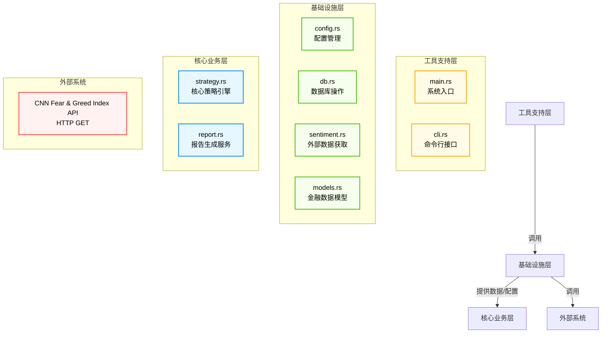

# System Architecture Documentation

## 1. Architecture Overview

### Architecture Design Philosophy

mns（Market Neutral Strategist）系统的设计哲学根植于“**配置驱动、数据隔离、业务解耦、本地优先**”四大原则，旨在为个人逆向投资者构建一个**无服务依赖、高纪律性、可复现**的自动化投资辅助工具。系统摒弃了传统金融平台的复杂后端架构，转而采用轻量级、单机运行的命令行模式，确保用户数据完全自主可控，规避云端隐私泄露与服务中断风险。

其核心思想是：**将投资策略从代码中剥离，固化为可读、可改、可审计的配置文件；将数据持久化与业务逻辑分离，确保状态可回溯；将外部依赖封装为可替换的适配层，提升系统健壮性**。这种设计不仅契合个人投资者对“纪律性交易”的心理需求，也完美适配Rust语言在内存安全、零成本抽象和编译期验证方面的优势，使系统兼具高性能与高可靠性。

### Core Architecture Patterns

mns系统采用**分层架构（Layered Architecture）** 作为主干，并融合以下经典设计模式：

| 模式 | 应用场景 | 价值体现 |
|------|----------|----------|
| **分层架构（Layered）** | 划分工具支持层、基础设施层、核心业务层 | 实现关注点分离，降低模块耦合，提升可维护性 |
| **依赖倒置原则（DIP）** | 所有模块依赖抽象接口（数据模型、函数签名），而非具体实现 | 便于单元测试（如mock数据库或API） |
| **外观模式（Facade）** | `cli.rs` 作为统一入口，隐藏内部模块调用复杂性 | 提供简洁、一致的用户交互界面 |
| **适配器模式（Adapter）** | `sentiment.rs` 封装CNN API调用，返回统一结构体 | 隔离外部服务变化，降低上游API变更影响 |
| **事务性模式（Transaction Script）** | 数据库操作通过原子事务完成（`db.rs`） | 保障金融数据一致性，避免账实不符 |
| **策略模式（Strategy）** | 策略引擎内部通过配置动态决定买入/卖出权重 | 实现策略参数化，无需修改代码即可调整投资逻辑 |

### Technology Stack Overview

| 层级 | 技术选型 | 选型理由 |
|------|----------|----------|
| **编程语言** | Rust 1.70+ | 内存安全、零成本抽象、编译期错误检查、无GC延迟，适合金融级稳定系统 |
| **配置管理** | TOML + `serde` | 人类可读、结构清晰、支持嵌套、与Rust结构体无缝序列化 |
| **数据持久化** | SQLite 3.40+ | 单文件、零配置、ACID事务、无服务依赖、跨平台，完美适配本地工具场景 |
| **HTTP客户端** | `reqwest` + `tokio` | 异步非阻塞、支持HTTPS、自动重试、JSON反序列化集成良好 |
| **CLI解析** | `clap` (v4) | 功能强大、类型安全、自动生成帮助文档、支持子命令嵌套 |
| **数据模型** | Rust Struct + `#[derive(Serialize, Deserialize)]` | 类型安全、编译期校验、与数据库ORM（`sqlx`）兼容 |
| **日志系统** | 无（待增强） | 当前使用`println!`，未来建议引入`tracing`或`log` + `env_logger` |
| **构建工具** | Cargo | 标准Rust包管理与构建系统，支持跨平台编译与依赖管理 |
| **测试框架** | `cargo test` + `mockall` | 单元测试与模拟依赖一体化，保障核心逻辑正确性 |

> ✅ **技术选型总结**：系统采用“**最小可行技术栈**”策略，所有组件均为成熟、稳定、无运行时依赖的开源库，确保系统可编译为单个二进制文件（`mns`），部署零环境依赖，符合“个人投资助手”的轻量定位。

---

## 2. System Context

### System Positioning and Value

mns是一个面向**个人逆向投资者**的本地命令行金融决策辅助工具，其核心价值在于**将行为金融学中的“恐惧与贪婪”理论转化为可执行、可复盘、可自动化**的投资纪律系统。

在传统投资场景中，投资者常因情绪波动（如恐慌性抛售、贪婪性追高）导致非理性决策。mns通过以下方式提供差异化价值：

- **自动化逆向策略**：当市场情绪极度恐惧（<30）时，系统自动推荐加仓；当极度贪婪（>70）时，推荐获利了结。
- **防止“接飞刀”**：基于配置阈值（如亏损≥30%）自动过滤高风险资产，避免在下跌趋势中盲目抄底。
- **动态风险对冲**：根据情绪等级动态调整买入/卖出比例，实现“情绪对冲”。
- **每日复盘报告**：生成结构化中文日报，强制用户进行“非情绪化”决策回顾，提升投资纪律。

该系统不是交易平台，也不是投资顾问，而是**用户投资行为的“纪律教练”** —— 通过数据与规则，将主观判断转化为客观行动指南。

### User Roles and Scenarios

| 用户角色 | 描述 | 典型使用场景 |
|----------|------|--------------|
| **个人逆向投资者** | 具备一定投资经验，追求长期价值，厌恶情绪化交易，偏好手动执行但需要数据支持 | 每日早晨执行 `mns report` 查看当日买卖建议；在市场暴跌后执行 `mns buy` 按系统建议加仓；在牛市高点执行 `mns sell` 锁定利润 |
| **配置管理者** | 系统的高级用户，定期调整策略参数以适应市场变化 | 修改 `config.toml` 中的“反向权重系数”、“最低持有天数”、“情绪映射阈值”等参数，优化策略表现 |
| **历史审计者** | 需要回溯过往决策依据的用户 | 查阅 `reports/` 目录下历史日报，分析“为何当时买入X资产”，验证策略有效性 |

> **用户核心需求**：  
> 1. 自动化生成基于情绪的买卖建议  
> 2. 避免在亏损资产上过度加仓（防“接飞刀”）  
> 3. 动态调整资产比例实现风险对冲  
> 4. 获取每日中文报告用于复盘与执行  
> 5. 保持投资纪律，减少主观干扰  

### External System Interactions

| 外部系统 | 交互方式 | 数据格式 | 频率 | 容错策略 |
|----------|----------|----------|------|----------|
| **CNN Fear & Greed Index API** | `HTTP GET`（RESTful） | JSON响应（`{ "value": 45, "valueText": "Fear", "timestamp": "2025-04-05T12:00:00Z" }`） | 每日1次（报告生成时） | - 重试机制（最多3次）<br>- 超时控制（5秒）<br>- 缓存机制（建议未来引入）<br>- 失败降级：使用上一次有效值 + 日志告警 |

> ⚠️ **唯一外部依赖**：系统所有外部交互仅限于该API，无券商接口、无第三方支付、无用户账户系统，符合“本地优先”设计原则。

### System Boundary Definition

| 边界项 | 包含 | 不包含 |
|--------|------|--------|
| **用户交互** | 命令行界面（CLI） | Web界面、移动端、GUI |
| **数据存储** | 本地SQLite数据库（`.mns/mns.db`）、本地TOML配置文件（`.mns/config.toml`）、本地报告文件（`reports/`） | 云数据库、远程文件系统、区块链存储 |
| **网络通信** | 仅向CNN API发起只读HTTP GET请求 | 连接券商API、推送通知、WebSocket流、API网关 |
| **计算逻辑** | 策略引擎、报告生成、交易校验、情绪映射 | 机器学习模型、量化回测引擎、因子分析 |
| **部署环境** | 单用户本地环境（Windows/macOS/Linux） | Docker容器、Kubernetes集群、服务器部署 |
| **多用户支持** | 单用户文件隔离（用户目录下独立配置） | 多用户登录、权限管理、共享数据库 |

> ✅ **边界结论**：系统严格限定为**单机、单用户、无服务、无网络暴露**的轻量级工具，符合“个人投资者本地决策助手”的精准定位，无架构越界。

---

## 3. Container View

### Domain Module Division

系统采用**四层模块化架构**，按职责划分为四大领域（Container）：



### Domain Module Architecture

| 容器 | 职责 | 关键能力 | 交互方式 |
|------|------|----------|----------|
| **工具支持层** | 程序启动与用户交互入口 | 命令解析、参数校验、功能路由 | 调用基础设施层与核心业务层 |
| **基础设施层** | 提供系统运行所需的稳定支撑服务 | 配置加载、数据持久化、外部API封装、数据建模 | 被上层调用，依赖数据模型，访问外部系统 |
| **核心业务层** | 实现系统核心价值 | 策略计算、报告编排 | 依赖基础设施层的数据与配置，输出最终结果 |
| **外部系统** | 提供市场情绪数据源 | 提供实时恐惧与贪婪指数 | 被基础设施层调用，仅支持只读访问 |

### Storage Design

系统采用**本地文件系统 + SQLite** 的双层持久化架构：

#### 1. 配置存储（TOML）
- **路径**：`~/.mns/config.toml`
- **内容结构**：
  ```toml
  [assets]
  us_stocks = 0.4
  cn_stocks = 0.3
  counter_cycle = 0.2
  cash = 0.1

  [risk]
  max_loss_threshold = 0.30
  min_holding_days = 7
  fear_threshold = 30
  greed_threshold = 70

  [strategy]
  buy_weight_factor = 1.5
  sell_weight_factor = 1.2

  [api]
  fear_greed_url = "https://api.alternative.me/fng/"
  ```

#### 2. 数据存储（SQLite）
- **路径**：`~/.mns/mns.db`
- **表结构**：
  ```sql
  CREATE TABLE cash (
      balance REAL NOT NULL,
      updated_at DATETIME DEFAULT CURRENT_TIMESTAMP
  );

  CREATE TABLE positions (
      id INTEGER PRIMARY KEY AUTOINCREMENT,
      symbol TEXT NOT NULL UNIQUE,
      quantity REAL NOT NULL,
      cost_price REAL NOT NULL,
      current_price REAL NOT NULL,
      purchase_date DATE NOT NULL,
      last_updated DATETIME DEFAULT CURRENT_TIMESTAMP
  );

  CREATE TABLE transactions (
      id INTEGER PRIMARY KEY AUTOINCREMENT,
      type TEXT NOT NULL CHECK(type IN ('buy','sell','add','price')),
      symbol TEXT NOT NULL,
      quantity REAL NOT NULL,
      price REAL NOT NULL,
      amount REAL NOT NULL,
      timestamp DATETIME DEFAULT CURRENT_TIMESTAMP
  );

  CREATE TABLE fear_greed (
      value INTEGER NOT NULL,
      value_text TEXT NOT NULL,
      timestamp DATETIME PRIMARY KEY
  );
  ```

> ✅ **设计亮点**：
> - 所有表均有`timestamp`字段，支持完整审计
> - `positions`表使用`cost_price`而非平均成本，便于精确计算
> - `fear_greed`表仅保留最新记录，历史由`reports/`目录替代

### Inter-Domain Module Communication

| 通信方向 | 通信方式 | 数据载体 | 说明 |
|----------|----------|----------|------|
| 工具支持层 → 基础设施层 | 函数调用 | 结构体参数 | CLI调用`config::load_config()`、`db::init_db()`等 |
| 工具支持层 → 核心业务层 | 函数调用 | 结构体参数 | CLI调用`strategy::calculate_buy_suggestions()` |
| 基础设施层 → 核心业务层 | 函数调用 | 结构体参数 | `strategy.rs`调用`config::get_buy_ratio()`、`db::fetch_cash_balance()` |
| 核心业务层 → 基础设施层 | 函数调用 | 结构体参数 | `report.rs`调用`strategy::check_risk_warnings()`、`sentiment::fetch_fear_greed()` |
| 基础设施层 → 外部系统 | HTTP请求 | JSON | `sentiment.rs`发起`reqwest::get()`，返回`FearGreedResponse` |
| 基础设施层 ↔ 数据模型 | 结构体共享 | `Position`, `Transaction`, `FearGreedResponse` | 所有模块共用`models.rs`定义的结构体，确保类型安全 |

> 🔒 **通信原则**：  
> - **无循环依赖**：核心业务层不依赖工具支持层  
> - **无直接HTTP调用**：外部API仅通过`sentiment.rs`访问  
> - **无全局状态**：所有数据通过参数传递，避免单例污染  
> - **数据模型为契约**：所有模块通过`models.rs`定义的结构体交换数据，实现接口契约化

---

## 4. Component View

### Core Functional Components

| 组件 | 所属容器 | 责任 | 关键方法 | 依赖 |
|------|----------|------|----------|------|
| **策略引擎（Strategy Engine）** | 核心业务层 | 根据持仓、情绪、配置计算买卖建议与风险预警 | `calculate_buy_suggestions()`, `calculate_sell_suggestions()`, `check_risk_warnings()` | `config.rs`, `db.rs`, `sentiment.rs`, `models.rs` |
| **报告生成服务（Report Generator）** | 核心业务层 | 整合策略输出、持仓、情绪、配置，生成中文日报 | `generate_report_content()`, `save_report()` | `strategy.rs`, `db.rs`, `sentiment.rs`, `config.rs` |
| **配置管理（Config Manager）** | 基础设施层 | 加载、验证、提供策略规则与API端点 | `load_config()`, `validate_config()`, `get_buy_ratio()`, `map_fear_greed_to_zone()` | `models.rs` |
| **数据库操作（Database Adapter）** | 基础设施层 | 管理SQLite连接、事务、CRUD操作 | `init_db()`, `update_position()`, `add_transaction()`, `fetch_cash_balance()` | `models.rs` |
| **外部数据获取（External Data Adapter）** | 基础设施层 | 封装CNN API调用，返回结构化情绪数据 | `fetch_fear_greed()` | `models.rs`, `reqwest` |
| **金融数据模型（Financial Data Models）** | 基础设施层 | 定义核心实体结构与业务计算方法 | `Position::annual_return()`, `Transaction::new()` | 无（被其他模块依赖） |

### Technical Support Components

| 组件 | 责任 | 关键方法 | 说明 |
|------|------|----------|------|
| **系统入口（System Entry）** | 程序启动与协调 | `main()`, `handle_command()` | 初始化所有模块，根据CLI参数路由至对应处理函数 |
| **命令行接口（CLI Parser）** | 用户交互入口 | `Cli::parse()`, `dispatch_command()` | 使用`clap`解析`mns buy --symbol AAPL --quantity 2`等命令，无业务逻辑 |

### Component Responsibility Division

| 组件 | 是否包含业务逻辑 | 是否包含外部依赖 | 是否可测试 | 是否可替换 |
|------|------------------|------------------|------------|------------|
| **策略引擎** | ✅ 是（核心） | ❌ 否（仅依赖接口） | ✅ 是（可mock配置/数据库） | ✅ 是（可替换为其他策略） |
| **报告生成** | ✅ 是（输出逻辑） | ❌ 否 | ✅ 是 | ✅ 是（可替换模板引擎） |
| **配置管理** | ✅ 是（规则校验） | ✅ 是（TOML文件） | ✅ 是