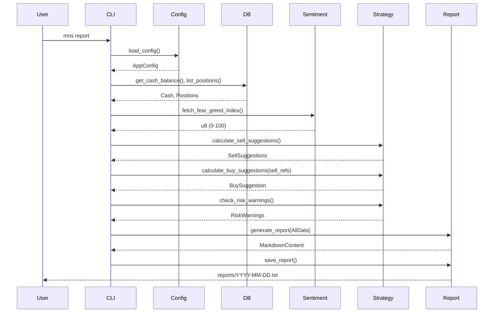
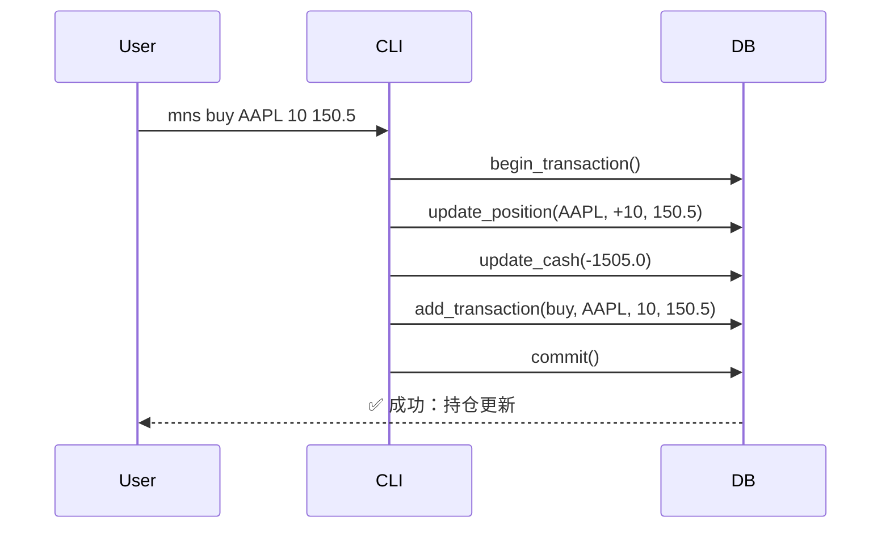
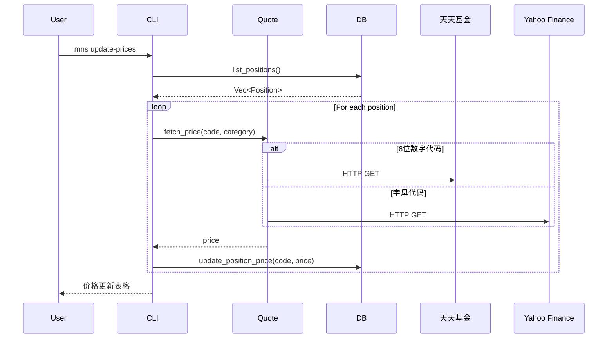
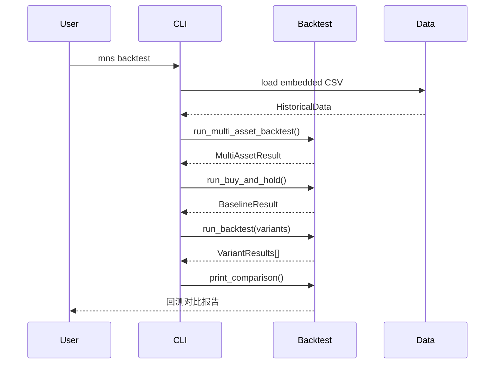

# Core Workflows

## 1. Workflow Overview

本系统（mns，Money Never Sleeps，Market Neutral Strategist）是一个面向个人逆向投资者的本地命令行投资辅助工具，其核心价值在于通过**数据驱动的纪律性交易策略**，将市场情绪、持仓表现与用户自定义规则相结合，自动生成可执行的投资日报，从而降低情绪化交易风险，提升长期投资回报的稳定性。

系统共包含四大核心工作流，构成"配置→执行→验证→反馈"的完整闭环：

| 工作流名称 | 触发入口 | 核心价值 | 关键输出 |
|----------|----------|----------|----------|
| **每日投资策略报告生成流程** | `mns report` | 系统核心价值输出，整合多源数据生成决策指南 | 中文日报（.md文件） |
| **资产交易与持仓更新流程** | `mns buy/sell/add/price` | 维护账户状态一致性，为策略提供准确输入 | 原子更新的持仓、现金、交易历史 |
| **自动价格更新流程** | `mns update-prices` | 自动获取资产价格，减少手动操作 | 更新后的持仓价格表 |
| **策略回测验证流程** | `mns backtest` | 验证策略历史表现，优化参数 | 回测报告，参数对比 |
| **系统初始化与配置管理流程** | `mns init [-f]` / `mns config` | 建立系统运行基础，确保规则合法 | 可验证的配置与数据库 |

---

## 2. Main Workflows

### 2.1 每日投资策略报告生成流程

#### 执行顺序与依赖



#### 输入/输出数据流

| 输入 | 来源 | 类型 | 说明 |
|------|------|------|------|
| 配置参数 | `config.toml` | `AppConfig` | 分配比例、阈值、API端点 |
| 持仓数据 | SQLite `positions` | `Vec<Position>` | 资产代码、成本价、当前价、购买日期 |
| 现金余额 | SQLite `cash` | `f64` | 可用资金 |
| 市场情绪 | CNN API | `u8` | 情绪分数（0–100） |

| 输出 | 目标 | 类型 | 说明 |
|------|------|------|------|
| 买入建议 | 报告 | `BuySuggestion` | 资产、金额、分配比例 |
| 卖出建议 | 报告 | `Vec<SellSuggestion>` | 资产、份额、理由 |
| 风险预警 | 报告 | `Vec<RiskWarning>` | 资产、亏损率、建议等级 |
| 中文日报 | 文件系统 | `.txt` 文件 | 结构化、可读、带时间戳 |

---

### 2.2 资产交易与持仓更新流程

#### 执行顺序与依赖



#### 业务价值
- **数据一致性保障**：原子事务确保钱与持仓同步更新
- **可审计性**：完整交易历史记录

---

### 2.3 自动价格更新流程

#### 执行顺序



#### 数据源选择逻辑

| 代码格式 | 数据源 | 说明 |
|----------|--------|------|
| 6位数字 | 天天基金 | 国内基金 |
| 字母 | Yahoo Finance | 美股/ETF |

---

### 2.4 策略回测验证流程

#### 执行顺序



#### 回测配置对比

| 配置 | 年化收益 | 最大回撤 |
|------|----------|----------|
| 逆向策略 | 8.87% | 23.10% |
| 激进配置 | 9.20% | 24.99% |
| 防御配置 | 7.80% | 13.59% |
| 买入持有 | 10.97% | 14.70% |

---

## 3. Data Flow Summary

```
配置文件
    ↓
数据库
    ↓
外部数据 (CNN API / 天天基金 / Yahoo Finance)
    ↓
策略引擎
    ↓
报告生成 / 回测引擎
    ↓
用户输出 (终端 / 文件)
```

---

## 4. Key Process Nodes

| 节点 | 说明 |
|------|------|
| **配置加载** | 所有流程的决策基准 |
| **数据库事务** | 资产变动的唯一入口，保障一致性 |
| **情绪获取** | 唯一外部动态变量，使策略具备市场感知 |
| **策略计算** | 系统核心，sell→buy→risk 顺序执行 |
| **回测验证** | 历史数据验证，参数优化 |
| **价格更新** | 自动化数据获取，减少手动操作 |
| **报告生成** | 价值输出，完成决策闭环 |