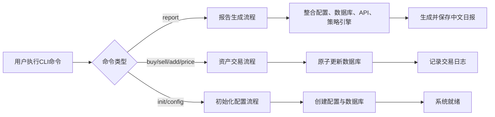
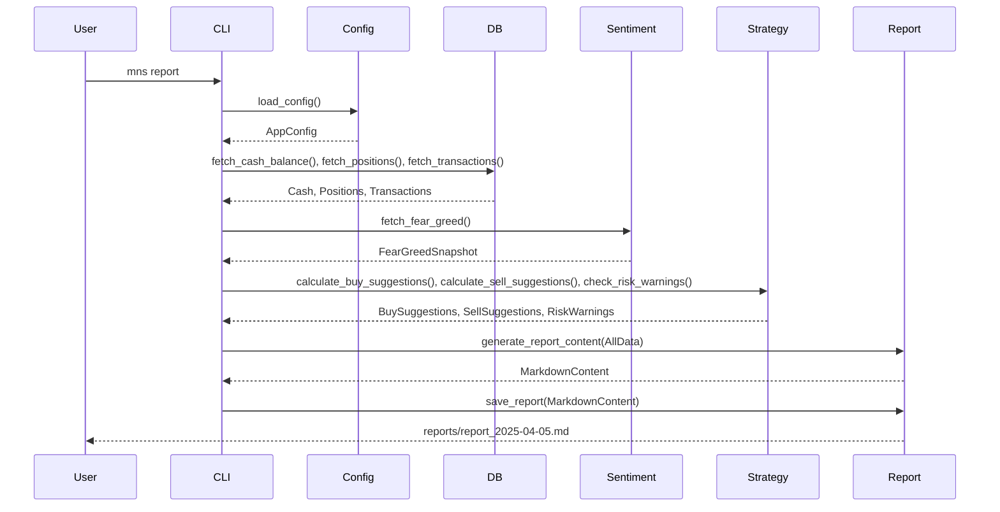
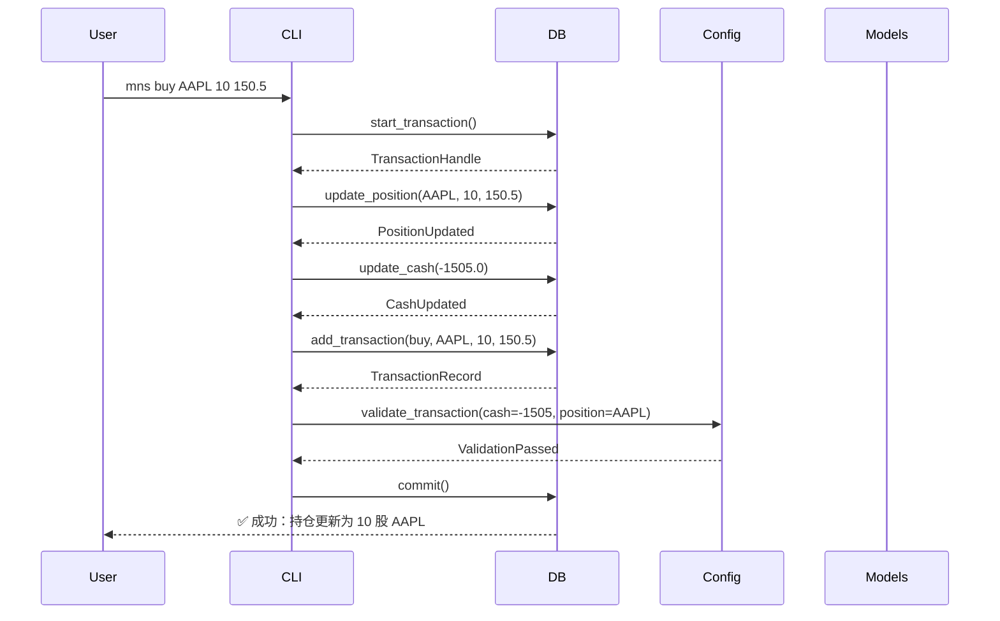

# Core Workflows

## 1. Workflow Overview

本系统（mns，Money Never Sleeps，Market Neutral Strategist）是一个面向个人逆向投资者的本地命令行投资辅助工具，其核心价值在于通过**数据驱动的纪律性交易策略**，将市场情绪（CNN Fear & Greed Index）、持仓表现与用户自定义规则相结合，自动生成可执行的投资日报，从而降低情绪化交易风险，提升长期投资回报的稳定性。

系统共包含三大核心工作流，构成“配置→执行→反馈”的完整闭环：

| 工作流名称 | 触发入口 | 核心价值 | 关键输出 |
|----------|----------|----------|----------|
| **每日投资策略报告生成流程** | `mns report` | 系统核心价值输出，整合多源数据生成决策指南 | 中文日报（.md文件），含买卖建议、风险预警、资金预案 |
| **资产交易与持仓更新流程** | `mns buy/sell/add/price` | 维护账户状态一致性，为策略提供准确输入 | 原子更新的持仓、现金、交易历史 |
| **系统初始化与配置管理流程** | `mns init [-f]` / `mns config` | 建立系统运行基础，确保规则合法（init已有数据会提示确认） | 可验证的配置文件与数据库结构 |

### 核心执行路径
系统所有功能均通过CLI命令触发，主执行路径为：


### 关键过程节点
- **配置加载**：作为所有流程的“决策基准”，决定策略权重、阈值、分配比例。
- **数据库事务**：确保资产变动（买/卖）中现金与持仓的强一致性。
- **情感数据获取**：引入外部动态变量（CNN指数），使策略具备“市场感知”能力。
- **策略引擎计算**：系统“大脑”，执行反向权重买入、动态比例卖出、分级风险预警。
- **报告编排与持久化**：将抽象策略转化为可读、可执行的人类语言，完成价值闭环。

### 过程协调机制
系统采用**分层松耦合架构**，通过以下机制实现模块协同：
- **单向依赖**：CLI → 配置/数据库/策略/报告，避免循环依赖。
- **数据模型驱动**：`models.rs` 定义统一数据结构（Position, Transaction等），作为模块间数据交换契约。
- **服务委托**：CLI不处理业务逻辑，仅解析参数并委托至对应服务模块。
- **事务边界清晰**：数据库操作封装原子事务；策略计算无副作用，仅输出建议；报告仅读取，不修改状态。

---

## 2. Main Workflows

### 2.1 每日投资策略报告生成流程

#### 核心业务流程
该流程是系统的核心价值输出路径，旨在为用户提供一份结构化、可执行的中文投资日报。流程以“市场情绪”为动态输入，整合静态配置与持久化持仓数据，通过智能策略引擎生成决策建议，并沉淀为可追溯的报告。

#### 关键技术流程描述
1. **配置加载**  
   - 调用 `config.rs::load_config()` 从 `~/.mns/config.toml` 加载配置对象 `AppConfig`。
   - 验证关键业务规则：`allocation.sum() == 100%`，`min_holding_days >= 0`，`thresholds` 合理（如买入阈值 < 卖出阈值）。
   - 映射情绪区间：`map_fear_greed_to_zone()` 将0–100分映射为“恐惧”（0–30）、“中性”（31–69）、“贪婪”（70–100）三类区域。

2. **数据库状态查询**  
   - 调用 `db.rs::fetch_cash_balance()` 获取当前现金余额。
   - 调用 `db.rs::fetch_positions()` 获取所有持仓记录（含资产代码、成本价、当前价、购买日期、数量）。
   - 调用 `db.rs::fetch_transactions()` 获取近30日交易历史（用于审计与反向验证）。

3. **外部情感数据获取**  
   - 调用 `sentiment.rs::fetch_fear_greed()` 发起HTTP GET请求至CNN API（URL由配置提供）。
   - 请求头设置：`User-Agent`, `Accept`, `Accept-Language`, `Referer`，确保API兼容性。
   - 超时控制：5秒HTTP超时，避免阻塞主线程。
   - 响应验证：检查HTTP状态码为200，JSON结构符合 `FearGreedResponse` 模型（含 `value`, `timestamp`）。
   - 数据持久化：将最新情绪快照写入 `fear_greed` 表（去重逻辑：按日期唯一索引）。

4. **策略引擎计算**  
   - **买入建议**（`strategy.rs::calculate_buy_suggestions`）：
     - 计算可用资金：`cash_balance + sell_proceeds`（来自卖出建议的预计回笼资金）。
     - 按配置分配比例（如美股40%、中股30%、反周期30%）拆分资金。
     - 对每类资产，按“反向权重”排序：`weight = min(1.0, (cost_price / current_price - 1.0) * max_weight)`，排除亏损≥30%的资产（“接飞刀”过滤）。
     - 输出建议：`[{"asset": "AAPL", "amount": 1000, "weight": 0.85, "reason": "亏损28%, 情绪恐惧"}]`
   - **卖出建议**（`strategy.rs::calculate_sell_suggestions`）：
     - 计算每个持仓的年化收益率（`annualized_return`）：正收益用复利公式，亏损用线性年化（避免负收益失真）。
     - 过滤条件：持有天数 ≥ `min_holding_days`，绝对收益 ≥ 10%。
     - 动态调整卖出比例：情绪为“贪婪”时，卖出比例×1.5；“恐惧”时×0.5。
     - 按年化收益降序排序，优先卖出高收益资产。
     - 输出建议：`[{"asset": "TSLA", "quantity": 5, "reason": "年化收益120%, 情绪贪婪"}]`
   - **风险预警**（`strategy.rs::check_risk_warnings`）：
     - 识别亏损 >20% 的持仓。
     - 结合情绪等级输出分级建议：
       - 情绪“恐惧” → “考虑加仓”（反向操作）
       - 情绪“中性” → “审视基本面”
       - 情绪“贪婪” → “紧急复盘”（可能泡沫）

5. **报告生成与持久化**  
   - 调用 `report.rs::generate_report_content()`，按中文模板组织内容：
     - 市场情绪（带颜色标注）
     - 账户概览（现金、总市值、年化收益）
     - 持仓详情（ASCII表格）
     - 买卖建议（分项列表）
     - 风险预警（分级标签）
     - 资金分配预案（基于情绪的动态配置）
   - 调用 `report.rs::save_report()`，生成文件名：`reports/report_YYYY-MM-DD.md`。
   - 自动创建 `reports/` 目录（若不存在），使用 `std::fs::write()` 写入文件。

#### 执行顺序与依赖


#### 输入/输出数据流
| 输入 | 来源 | 类型 | 说明 |
|------|------|------|------|
| 配置参数 | `config.toml` | `AppConfig` | 分配比例、阈值、API端点、最小持有天数 |
| 持仓数据 | SQLite `positions` 表 | `Vec<Position>` | 资产代码、成本价、当前价、购买日期、数量 |
| 现金余额 | SQLite `cash` 表 | `f64` | 可用资金 |
| 市场情绪 | CNN API | `FearGreedSnapshot` | 情绪分数（0–100）、时间戳 |
| 交易历史 | SQLite `transactions` 表 | `Vec<Transaction>` | 用于审计与反向验证 |

| 输出 | 目标 | 类型 | 说明 |
|------|------|------|------|
| 买入建议 | 报告 | `Vec<BuySuggestion>` | 资产、金额、权重、理由 |
| 卖出建议 | 报告 | `Vec<SellSuggestion>` | 资产、数量、理由 |
| 风险预警 | 报告 | `Vec<RiskWarning>` | 资产、亏损率、建议等级 |
| 中文日报 | 文件系统 | `.md` 文件 | 结构化、可读、带时间戳 |

#### 业务价值
- **降低情绪干扰**：将主观判断转化为基于规则的量化建议。
- **提升执行纪律**：日报作为“每日操作手册”，强制用户复盘与执行。
- **构建投资复盘体系**：历史报告形成决策轨迹，便于长期策略优化。

---

### 2.2 资产交易与持仓更新流程

#### 核心业务流程
处理用户发起的资产操作（买入、卖出、加仓、价格更新），确保账户状态（现金、持仓）的实时一致性与事务完整性，是系统“状态变更”的唯一入口。

#### 关键技术流程描述
1. **CLI参数解析与校验**  
   - `cli.rs` 使用 `clap` 解析命令（如 `mns buy AAPL 10 150.5`）。
   - 校验规则：
     - 资产代码格式（字母/数字组合）
     - 数量 > 0
     - 价格 > 0
     - 操作类型合法（buy/sell/add/price）

2. **数据库事务启动**  
   - 调用 `db.rs::start_transaction()`，开启SQLite事务（`conn.transaction()`）。
   - 事务隔离级别：`SERIALIZABLE`（默认），确保并发安全。

3. **资产与现金状态更新**  
   - **买入（buy）**：
     - 更新持仓：调用 `update_position()`，计算加权平均成本：  
       `new_cost = (old_quantity * old_cost + new_quantity * price) / (old_quantity + new_quantity)`  
       更新 `quantity`, `cost_price`, `purchase_date`（首次购买则记录）。
     - 更新现金：`cash_balance -= new_quantity * price`
   - **卖出（sell）**：
     - 更新持仓：`quantity -= sold_quantity`，若为0则删除记录。
     - 更新现金：`cash_balance += sold_quantity * price`
   - **加仓（add）**：仅更新 `quantity` 与 `cost_price`（不涉及现金）。
   - **价格更新（price）**：仅更新 `current_price`，不影响成本或现金。

4. **交易记录写入**  
   - 构造 `Transaction` 模型：`asset`, `action`（buy/sell/add/price）, `quantity`, `price`, `amount`, `timestamp`。
   - 调用 `add_transaction()` 写入 `transactions` 表，确保审计追溯。

5. **配置规则校验**  
   - 调用 `config.rs::validate_transaction()`：
     - 防止负现金余额（`cash_balance >= 0`）
     - 检查类别是否在配置允许范围内（如仅允许美股/中股）
     - 检查单笔交易是否超过配置上限（如单次买入不超过现金30%）

6. **事务提交与反馈**  
   - 若所有操作成功，调用 `conn.commit()` 提交事务。
   - 若任一环节失败，自动回滚（`conn.rollback()`）。
   - 返回结构化反馈：`Success: 操作成功，持仓更新为 15 股` 或 `Error: 余额不足，无法买入 10 股 AAPL`

#### 执行顺序与依赖


#### 输入/输出数据流
| 输入 | 来源 | 类型 | 说明 |
|------|------|------|------|
| 操作类型 | CLI参数 | `Buy/Sell/Add/Price` | 用户指令 |
| 资产代码 | CLI参数 | `String` | 如 AAPL, TSLA, 600519 |
| 数量/价格 | CLI参数 | `f64` | 买入数量、成交价 |
| 当前状态 | 数据库 | `Cash, Position` | 更新前的账户快照 |

| 输出 | 目标 | 类型 | 说明 |
|------|------|------|------|
| 更新后持仓 | 数据库 | `Position` | 包含新成本价、数量、日期 |
| 更新后现金 | 数据库 | `f64` | 扣款或入账后余额 |
| 交易记录 | 数据库 | `Transaction` | 审计日志，含时间戳 |
| 操作结果 | 用户终端 | `String` | 成功/失败提示 |

#### 业务价值
- **数据一致性保障**：通过原子事务，杜绝“钱没了但没买上”或“卖了但钱没到账”的金融级错误。
- **可审计性**：完整交易历史为策略回溯提供数据基础。
- **风控前置**：在变更生效前拦截违反规则的操作（如负余额）。

---

### 2.3 系统初始化与配置管理流程

#### 核心业务流程
系统首次运行或用户主动配置时，建立运行所需的基础设施与规则框架，确保系统始终处于“合法、可预测”的状态。

#### 关键技术流程描述
1. **CLI指令识别**  
   - `cli.rs` 检测 `init` 或 `config` 命令，进入初始化模式。

2. **配置文件创建/编辑**  
   - **首次运行（init）**：
     - 创建目录 `~/.mns/`（若不存在）。
     - 生成默认 `config.toml`，包含：
       ```toml
       [allocation]
       us_stock = 40
       cn_stock = 30
       counter_cyclical = 30
       [thresholds]
       min_holding_days = 7
       annualized_return_target = 15
       max_buy_weight = 0.8
       [api]
       fear_greed_url = "https://api cnn.com/fear-greed"
       ```
   - **非首次（config）**：
     - 打开现有文件，允许用户交互式修改（或通过参数指定键值）。

3. **配置验证**  
   - `config.rs::validate_config()` 执行：
     - 分配总和是否为100%（误差容忍 < 0.1%）
     - 阈值是否合理（如 `min_holding_days` ≥ 0）
     - API URL 是否为有效HTTP(S)格式
     - `max_buy_weight` 是否在 [0,1] 区间

4. **数据库初始化**  
   - 调用 `db.rs::init_db()`：
     - 创建四张表：
       ```sql
       CREATE TABLE cash (balance REAL NOT NULL DEFAULT 0);
       CREATE TABLE positions (
         asset TEXT PRIMARY KEY,
         quantity REAL NOT NULL,
         cost_price REAL NOT NULL,
         current_price REAL NOT NULL,
         purchase_date TEXT NOT NULL
       );
       CREATE TABLE transactions (
         id INTEGER PRIMARY KEY AUTOINCREMENT,
         asset TEXT NOT NULL,
         action TEXT NOT NULL,
         quantity REAL NOT NULL,
         price REAL NOT NULL,
         amount REAL NOT NULL,
         timestamp DATETIME DEFAULT CURRENT_TIMESTAMP
       );
       CREATE TABLE fear_greed (
