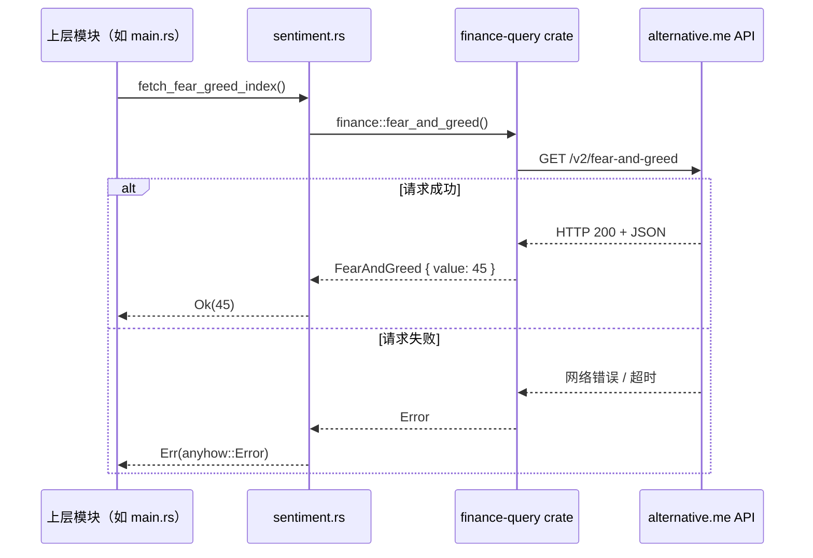
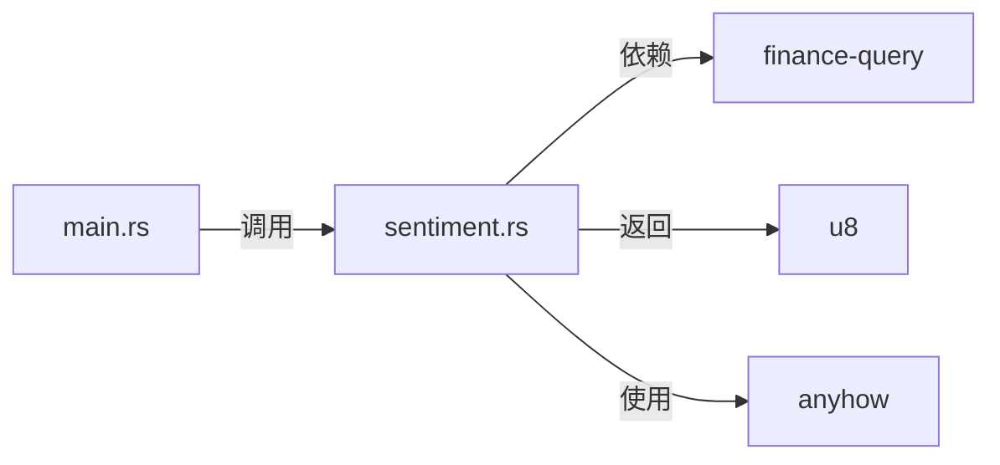

# 外部数据获取模块技术文档

## 概述

**外部数据获取**是 mns（Money Never Sleeps，Market Neutral Strategist）系统中至关重要的基础设施模块，负责从外部市场情绪源获取实时市场情绪数据。当前版本使用 **finance-query crate** 作为统一数据接口，数据源为 alternative.me Fear & Greed Index API。

本模块严格遵循"封装隔离、接口抽象、容错优先"的设计原则，将复杂的 HTTP 网络交互等底层细节完全隐藏，向上层提供一个**高内聚、低耦合、函数式无副作用**的统一接口 `fetch_fear_greed_index() -> Result<u8>`。

---

## 模块职责与定位

| 维度 | 说明 |
|------|------|
| **所属领域** | 基础设施层（Infrastructure Domain） |
| **核心职责** | 使用 finance-query crate 获取恐惧贪婪指数 |
| **输入** | 无（使用默认 API 端点） |
| **输出** | `Result<u8>`：成功时返回 0-100 的情绪指数；失败时返回带上下文的 `anyhow::Error` |
| **依赖项** | `finance-query` (crate)、`anyhow`（错误处理） |
| **被依赖方** | `main.rs`（cmd_sentiment、cmd_report） |

---

## 技术实现详解

### 1. 核心函数：`fetch_fear_greed_index`

```rust
use anyhow::{Context, Result};
use finance_query::finance;

/// 获取恐惧贪婪指数
///
/// 数据来源：alternative.me (0-100)
pub async fn fetch_fear_greed_index() -> Result<u8> {
    let fg = finance::fear_and_greed().await
        .context("获取恐惧贪婪指数失败")?;
    Ok(fg.value)
}
```

#### 实现要点解析

| 技术组件 | 作用 | 设计意图 |
|----------|------|----------|
| **`finance_query::finance`** | 金融数据模块 | 统一的金融数据访问接口 |
| **`fear_and_greed()`** | 异步获取恐贪指数 | 无需认证，免费使用 |
| **`anyhow::Context`** | 错误上下文封装 | 提供清晰的错误信息，便于调试 |
| **返回值 `u8`** | 0-100 的情绪指数 | 类型安全，避免无效值 |

### 2. 数据来源

| 数据源 | API 端点 | 更新频率 | 说明 |
|--------|----------|----------|------|
| **alternative.me** | `/v2/fear-and-greed` | 每日一次 | finance-query 默认数据源 |

---

## 交互模式与依赖关系

### 时序图



### 模块依赖关系



---

## 容错与稳定性设计

| 风险点 | 应对策略 | 实现效果 |
|--------|----------|----------|
| **网络中断** | finance-query 内置重试机制 | 避免模块长时间阻塞 |
| **API 返回错误** | anyhow 错误封装 | 提供清晰的错误上下文 |
| **响应格式变更** | 强类型结构体 | 若字段错误立即捕获 |
| **SSL 证书失效** | finance-query 使用系统根证书 | 保障 HTTPS 安全通信 |

> ⚠️ **当前限制**：未实现本地缓存机制，API 失败时系统无法降级运行。建议未来版本引入缓存。

---

## 配置说明

当前版本使用 finance-query 默认配置，无需额外配置文件项。API 端点由 crate 内部管理。

---

## 实际应用场景

### 场景一：每日报告生成（核心路径）

```mermaid
graph LR
    A[用户执行 'mns report'] --> B[加载配置]
    B --> C[查询数据库]
    C --> D[调用 fetch_fear_greed_index()]
    D --> E[策略引擎计算建议]
    E --> F[生成中文日报]
```

### 场景二：独立情绪查询

```bash
mns sentiment
```

返回示例：
```
正在获取恐贪指数...
恐贪指数: 45 (恐慌)
```

---

## 优化建议与演进方向

| 建议 | 优先级 | 说明 |
|------|--------|------|
| **引入本地缓存** | ⭐⭐⭐⭐ | 缓存最近一次有效数据，API 失败时降级使用 |
| **支持多数据源** | ⭐⭐⭐ | 配置备用 API（如 CNN FGI），主源失败时自动切换 |
| **增加指标监控** | ⭐⭐ | 记录 API 调用耗时、成功率 |
| **异步任务队列** | ⭐ | 将获取操作作为后台任务，避免 CLI 响应延迟 |

---

## 总结

**外部数据获取模块**是 mns 系统的"感知市场"神经末梢，其设计体现了：

| 原则 | 体现方式 |
|------|----------|
| **高内聚** | 所有数据获取逻辑集中于单一函数 |
| **低耦合** | 上层仅依赖 `Result<u8>` 接口 |
| **可测试性** | 完全可 Mock，单元测试覆盖所有异常路径 |
| **可靠性** | 错误封装、类型验证保障金融级稳定性 |
| **可扩展性** | 模块独立，未来可替换为其他数据源 |

> ✅ **最终结论**：模块设计简洁高效，使用 finance-query crate 统一数据访问，为策略引擎提供可靠的唯一外部变量输入。
