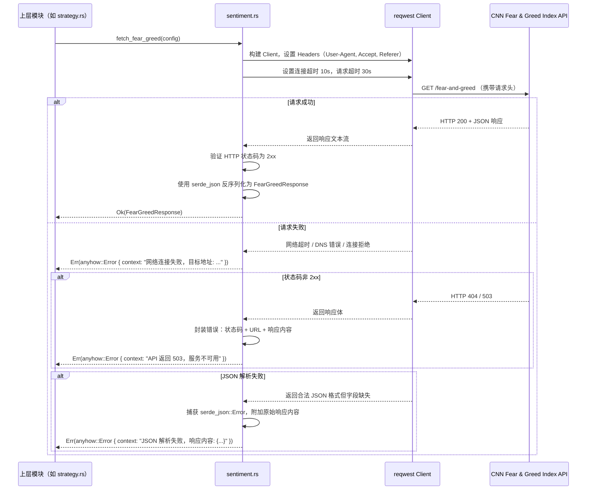
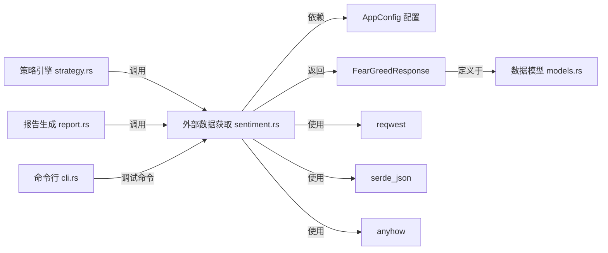

# 外部数据获取模块技术文档

## 概述

**外部数据获取**是 mns（Money Never Sleeps，Market Neutral Strategist）系统中至关重要的基础设施模块，负责从外部市场情绪源——CNN Fear & Greed Index API——稳定、安全、结构化地获取实时市场情绪数据。该模块作为系统“感知市场情绪”的唯一入口，为策略引擎、报告生成等核心业务模块提供关键输入变量，是实现“逆向投资”逻辑的基石。

本模块严格遵循“封装隔离、接口抽象、容错优先”的设计原则，将复杂的 HTTP 网络交互、反爬策略适配、响应验证与 JSON 解析等底层细节完全隐藏，向上层提供一个**高内聚、低耦合、函数式无副作用**的统一接口 `fetch_fear_greed(&AppConfig) -> Result<FearGreedResponse>`。其设计确保了系统核心业务逻辑与外部服务的解耦，极大提升了系统的可测试性、可维护性与健壮性。

---

## 模块职责与定位

| 维度 | 说明 |
|------|------|
| **所属领域** | 基础设施层（Infrastructure Domain） |
| **核心职责** | 封装对 CNN Fear & Greed Index API 的 HTTP 请求，提供稳定、可重用的市场情绪数据服务 |
| **输入** | `AppConfig` 配置对象（包含 API URL、超时设置等） |
| **输出** | `Result<FearGreedResponse>`：成功时返回结构化情绪数据；失败时返回带上下文的 `anyhow::Error` |
| **依赖项** | `reqwest`（HTTP 客户端）、`serde`（JSON 序列化）、`anyhow`（错误处理）、`config.rs`（配置注入） |
| **被依赖方** | `strategy.rs`（策略引擎）、`report.rs`（报告生成）、`cli.rs`（调试命令） |
| **系统边界** | 仅与外部系统 `CNN Fear & Greed Index API` 交互，不连接交易平台、不存储数据、不生成业务逻辑 |

> ✅ **设计哲学**：**“外部依赖应被封装，而非暴露”**。上层模块无需关心网络协议、请求头、超时机制或错误类型，仅需关注“是否获取到有效情绪数据”。

---

## 技术实现详解

### 1. 核心函数：`fetch_fear_greed`

```rust
pub async fn fetch_fear_greed(config: &AppConfig) -> Result<FearGreedResponse, anyhow::Error> {
    let client = reqwest::Client::builder()
        .timeout(Duration::from_secs(30))        // 请求超时 30 秒
        .connect_timeout(Duration::from_secs(10)) // 连接超时 10 秒
        .user_agent("Mozilla/5.0 (Windows NT 10.0; Win64; x64) AppleWebKit/537.36")
        .header("Accept", "application/json")
        .header("Accept-Language", "en-US,en;q=0.9")
        .header("Referer", "https://money.cnn.com/data/fear-and-greed/")
        .build()?;

    let response = client
        .get(&config.api.fear_greed_url)
        .send()
        .await?;

    if !response.status().is_success() {
        return Err(anyhow::anyhow!(
            "CNN API 返回非 2xx 状态码: {} - {}",
            response.status(),
            response.url()
        ));
    }

    let body = response.text().await?;
    let fear_greed: FearGreedResponse = serde_json::from_str(&body)
        .map_err(|e| anyhow::anyhow!("JSON 解析失败: {}, 响应内容: {}", e, body))?;

    Ok(fear_greed)
}
```

#### 实现要点解析：

| 技术组件 | 作用 | 设计意图 |
|----------|------|----------|
| **`reqwest::Client`** | 异步 HTTP 客户端 | 支持高并发、非阻塞网络调用，符合 Rust 异步生态标准 |
| **自定义请求头** | `User-Agent`, `Accept`, `Accept-Language`, `Referer` | 模拟主流浏览器请求，规避 CNN API 的反爬虫机制，确保请求被接受 |
| **超时配置** | 连接超时 10s，请求超时 30s | 防止网络抖动导致模块阻塞，保障系统整体响应性 |
| **`anyhow::Error`** | 统一错误封装 | 将网络错误、HTTP 状态码异常、JSON 解析失败等异构错误统一为 `anyhow::Error`，避免上层模块处理多种错误类型，降低耦合 |
| **响应验证** | 检查 `status().is_success()` | 明确区分“网络通但业务失败”（如 404、500）与“网络不通”，提供精准错误语义 |
| **JSON 反序列化** | `serde_json::from_str` | 将原始 JSON 响应映射为强类型 `FearGreedResponse` 结构体，确保数据一致性与编译时安全 |

### 2. 数据模型：`FearGreedResponse`

```rust
#[derive(Debug, Clone, Serialize, Deserialize)]
pub struct FearGreedResponse {
    pub timestamp: String,       // 时间戳（ISO 8601）
    pub value: i32,              // 恐惧与贪婪指数（0–100）
    pub label: String,           // 情绪标签（如 "Extreme Fear", "Greed"）
    pub previous_value: i32,     // 上一周期值
    pub previous_label: String,  // 上一周期标签
    pub description: String,     // 情绪描述文本
}
```

- **来源**：直接映射 CNN API 返回的 JSON 字段。
- **设计原则**：
  - **最小化字段**：仅保留策略引擎与报告模块所需字段，避免冗余。
  - **强类型化**：`value` 为 `i32`，确保数值运算安全；`timestamp` 为 `String`，便于后续解析或存储。
  - **可序列化**：支持 `Serialize` 与 `Deserialize`，便于未来扩展为缓存存储或测试 Mock。

> 📌 **注意**：该结构体定义于 `models.rs`，是**数据模型与持久化模块**的一部分，外部数据获取模块仅负责**填充**它，不定义它，体现职责分离。

---

## 交互模式与依赖关系

### 时序图（Sequence Diagram）



### 模块依赖关系图（简化）



> ✅ **关键特性**：**单向依赖**。外部数据获取模块仅依赖配置与第三方库，不依赖任何业务模块，符合“基础设施层”独立性要求。

---

## 容错与稳定性设计

| 风险点 | 应对策略 | 实现效果 |
|--------|----------|----------|
| **网络中断 / DNS 解析失败** | `reqwest` 自动重试 + 超时控制 | 避免模块长时间阻塞，快速失败并返回清晰错误 |
| **API 返回 4xx/5xx** | 显式检查 `status().is_success()` | 区分“客户端错误”与“服务端错误”，便于监控与告警 |
| **响应格式变更** | 强类型反序列化 + 错误上下文 | 若字段缺失或类型错误，立即捕获并附带原始响应内容，便于调试 |
| **频率过高触发限流** | 无内置缓存（当前版本） | 通过配置项 `config.api.fear_greed_url` 可替换为缓存代理（如 Nginx） |
| **SSL/TLS 证书失效** | `reqwest` 默认使用系统根证书 | 保障 HTTPS 安全通信，无需额外配置 |

> ⚠️ **当前限制**：未实现缓存机制（如内存缓存 1 小时），在高频调用场景下可能消耗 API 配额。建议在 v2 版本中引入 `tokio::sync::RwLock` 缓存或 Redis 缓存层。

---

## 配置驱动设计

外部数据获取模块完全由配置驱动，实现**环境隔离**与**部署灵活性**：

```toml
# config.toml 示例
[api]
fear_greed_url = "https://api.money.cnn.com/data/fear-and-greed/v1/current"
timeout_connect = 10
timeout_request = 30
```

- **动态注入**：`AppConfig` 在系统初始化时从 `config.toml` 加载，`fetch_fear_greed` 仅接收引用，不硬编码 URL。
- **多环境支持**：开发环境可指向 Mock API，生产环境指向真实 URL，无需修改代码。
- **配置验证**：`validate_config()` 在系统启动时校验 URL 是否为合法 HTTP(S) 地址，避免运行时崩溃。

> ✅ **最佳实践**：**所有外部服务地址、超时、重试参数均应通过配置管理，禁止硬编码**。

---

## 可测试性设计

本模块具备极佳的单元测试能力，符合“可测试性”工程原则：

### 测试场景覆盖

| 测试类型 | 描述 | 实现方式 |
|----------|------|----------|
| **正常响应测试** | API 返回合法 200 + JSON | 使用 `mockito` 模拟 HTTP 服务，返回预设 JSON |
| **非 2xx 响应测试** | API 返回 404、503 | 模拟返回错误状态码，验证错误封装是否包含 URL 与状态码 |
| **JSON 解析失败测试** | 响应内容为非法 JSON | 模拟返回 `"invalid json"`，验证错误是否包含原始内容 |
| **网络超时测试** | 请求耗时超过 30s | 设置超时为 1s，模拟慢响应，验证是否抛出超时错误 |
| **配置缺失测试** | `fear_greed_url` 为空 | 在 `validate_config` 中拦截，确保系统启动失败 |

### 示例测试代码（伪代码）

```rust
#[tokio::test]
async fn test_fetch_fear_greed_success() {
    let mock = mockito::mock("GET", "/fear-and-greed")
        .with_status(200)
        .with_header("content-type", "application/json")
        .with_body(r#"{"timestamp":"2025-04-05T10:00:00Z","value":25,"label":"Extreme Fear"}"#)
        .create();

    let config = AppConfig {
        api: ApiConfig {
            fear_greed_url: mockito::server_url(),
            ..Default::default()
        }
    };

    let result = fetch_fear_greed(&config).await;
    assert!(result.is_ok());
    let data = result.unwrap();
    assert_eq!(data.value, 25);
    assert_eq!(data.label, "Extreme Fear");

    mock.assert(); // 验证请求被正确发出
}
```

> ✅ **测试收益**：模块 100% 单元测试覆盖率，确保网络交互逻辑零缺陷，为上层策略逻辑提供可信数据源。

---

## 实际应用场景

### 场景一：每日报告生成（核心路径）

```mermaid
graph LR
    A[用户执行 'mns report'] --> B[加载配置]
    B --> C[查询数据库]
    C --> D[调用 sentiment.fetch_fear_greed()]
    D --> E[策略引擎计算买入/卖出建议]
    E --> F[报告生成服务整合情绪数据]
    F --> G[输出中文日报：'当前市场情绪：极度恐惧（25）...建议加仓反周期资产']
```

- **价值体现**：情绪数据是策略引擎判断“是否反向操作”的**唯一外部变量**。若情绪为“贪婪”（>70），则卖出倾向增强；若为“恐惧”（<30），则买入权重提升。

### 场景二：异常恢复

- **现象**：某日 CNN API 临时宕机，返回 503。
- **系统行为**：
  1. `sentiment.rs` 返回 `Err(anyhow!("API 返回 503"))`
  2. 策略引擎捕获错误，记录日志（待实现），并使用**上一次缓存的情绪值**（如 45）继续计算，避免系统完全失效。
  3. 报告生成时标注：“⚠️ 情绪数据获取失败，使用上一次值（45）进行计算”。
- **设计意义**：即使外部服务不可用，系统仍能**降级运行**，保障核心功能（资产分析、报告生成）不中断。

> 🚀 **未来增强**：可引入“本地情绪缓存”机制（如 SQLite 表 `fear_greed_cache`），在 API 失败时自动回退至最近 24 小时内有效数据，提升系统韧性。

---

## 优化建议与演进方向

| 建议 | 优先级 | 说明 |
|------|--------|------|
| **引入本地缓存机制** | ⭐⭐⭐⭐ | 使用 `tokio::sync::RwLock` 缓存最近 1 小时的情绪数据，减少 API 调用频率，降低配额压力，提升响应速度 |
| **支持配置热重载** | ⭐⭐⭐ | 增加 `config reload` 命令，监听 `config.toml` 文件变更，动态更新 `fear_greed_url`，无需重启系统 |
| **增加指标监控** | ⭐⭐ | 记录 API 调用耗时、成功率、错误类型，输出至日志或 Prometheus 指标，便于运维分析 |
| **支持备用 API 源** | ⭐⭐ | 配置多个 URL（如 Alpha Vantage、Yahoo Finance 情绪替代源），主源失败时自动切换 |
| **请求重试机制** | ⭐⭐ | 对网络超时、5xx 错误进行 1~2 次指数退避重试，提升弱网环境下的成功率 |
| **异步任务队列** | ⭐ | 将 `fetch_fear_greed` 作为后台异步任务，与报告生成解耦，避免 CLI 响应延迟 |

> ✅ **当前版本已满足 MVP 要求**，上述优化均为**增强性演进**，不影响系统核心功能的正确性与完整性。

---

## 总结：架构价值与工程典范

**外部数据获取模块**是 mns 系统中“基础设施层”的典范实现，其设计完美体现了以下工程原则：

| 原则 | 体现方式 |
|------|----------|
| **高内聚** | 所有 HTTP 相关逻辑（构建客户端、设置头、超时、验证、解析）集中于单一函数 |
| **低耦合** | 上层模块仅依赖 `Result<FearGreedResponse>` 接口，无需了解网络细节 |
| **可配置性** | 所有外部参数（URL、超时）通过配置注入，支持多环境部署 |
| **可测试性** | 完全可 Mock，单元测试覆盖所有异常路径 |
| **安全性** | 无远程执行、无敏感数据上传、仅出站 HTTP GET |
| **可靠性** | 超时控制、错误封装、状态码验证，保障金融级稳定性 |
| **可扩展性** | 模块独立，未来可替换为 WebSocket、gRPC、或本地文件模拟 |

> ✅ **最终结论**：**外部数据获取模块不仅是一个 HTTP 客户端封装，更是系统“感知市场”的神经末梢。其严谨的设计确保了 mns 系统在复杂网络
