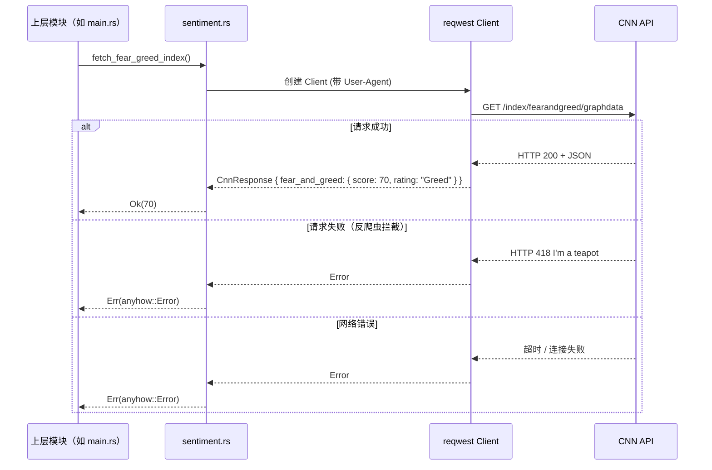
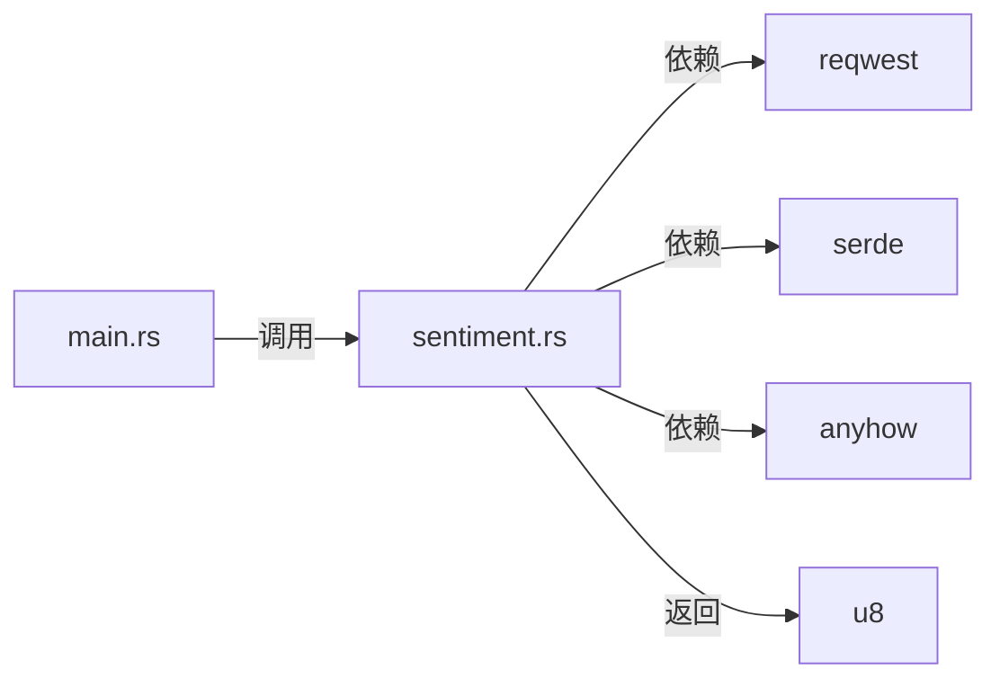

# 外部数据获取模块技术文档

## 概述

**外部数据获取**是 mns（Money Never Sleeps，Market Neutral Strategist）系统中至关重要的基础设施模块，负责从 CNN Business 获取实时股票市场恐惧贪婪指数。当前版本直接调用 **CNN Fear & Greed API**，获取股票市场情绪数据（非加密货币）。

本模块严格遵循"封装隔离、接口抽象、容错优先"的设计原则，将 HTTP 网络交互、反爬虫应对等底层细节完全隐藏，向上层提供一个**高内聚、低耦合、函数式无副作用**的统一接口 `fetch_fear_greed_index() -> Result<u8>`。

---

## 模块职责与定位

| 维度 | 说明 |
|------|------|
| **所属领域** | 基础设施层 |
| **核心职责** | 调用 CNN API 获取股票市场恐惧贪婪指数 |
| **输入** | 无（使用硬编码 API 端点） |
| **输出** | `Result<u8>`：成功时返回 0-100 的情绪指数；失败时返回带上下文的 `anyhow::Error` |
| **依赖项** | `reqwest`（HTTP 客户端）、`serde`（JSON 反序列化）、`anyhow`（错误处理） |
| **被依赖方** | `main.rs`（cmd_sentiment、cmd_report） |

---

## 技术实现详解

### 1. 核心函数：`fetch_fear_greed_index`

```rust
use anyhow::{Context, Result};
use reqwest::Client;
use serde::Deserialize;

/// CNN Fear & Greed Index API 响应结构
#[derive(Debug, Deserialize)]
struct CnnResponse {
    fear_and_greed: FearGreedData,
}

#[derive(Debug, Deserialize)]
struct FearGreedData {
    score: f64,
    rating: String,
}

/// 获取恐惧贪婪指数
///
/// 数据来源：CNN Business Fear & Greed Index (股票市场，范围 0-100)
pub async fn fetch_fear_greed_index() -> Result<u8> {
    let url = "https://production.dataviz.cnn.io/index/fearandgreed/graphdata";

    let client = Client::builder()
        .user_agent("Mozilla/5.0 (Windows NT 10.0; Win64; x64) AppleWebKit/537.36 (KHTML, like Gecko) Chrome/120.0.0.0 Safari/537.36")
        .build()
        .context("创建 HTTP 客户端失败")?;

    let response = client
        .get(url)
        .header("Accept", "application/json")
        .header("Accept-Language", "en-US,en;q=0.9")
        .header("Referer", "https://www.cnn.com/markets/fear-and-greed")
        .send()
        .await
        .context("请求 CNN API 失败，请检查网络连接")?;

    if !response.status().is_success() {
        anyhow::bail!("CNN API 返回错误状态码: {}", response.status());
    }

    let data: CnnResponse = response.json().await.context("解析 CNN API 响应失败")?;

    // 将 score 转换为 u8 (0-100 范围)
    let score = data.fear_and_greed.score.clamp(0.0, 100.0) as u8;
    Ok(score)
}
```

#### 实现要点解析

| 技术组件 | 作用 | 设计意图 |
|----------|------|----------|
| **`reqwest::Client`** | HTTP 客户端 | 异步、支持 HTTPS、可配置请求头 |
| **`user_agent`** | 模拟浏览器请求 | 避免 CNN API 反爬虫拦截（418 错误） |
| **`Referer` 请求头** | 标识来源页面 | 增强 API 请求成功率 |
| **`serde::Deserialize`** | JSON 反序列化 | 类型安全解析 CNN 响应 |
| **`anyhow::Context`** | 错误上下文封装 | 提供清晰的错误信息，便于调试 |
| **返回值 `u8`** | 0-100 的情绪指数 | 类型安全，避免无效值 |

### 2. 数据来源

| 数据源 | API 端点 | 更新频率 | 说明 |
|--------|----------|----------|------|
| **CNN Business** | `/index/fearandgreed/graphdata` | 实时更新 | 股票市场恐贪指数（非 crypto） |

---

## 交互模式与依赖关系

### 时序图



### 模块依赖关系



---

## 容错与稳定性设计

| 风险点 | 应对策略 | 实现效果 |
|--------|----------|----------|
| **网络中断** | anyhow 错误封装，向上传递 | 用户收到清晰错误提示 |
| **CNN 反爬虫（418）** | 设置 User-Agent 模拟浏览器 | 大幅提高请求成功率 |
| **API 返回错误** | 检查 `response.status().is_success()` | 快速失败，避免无效解析 |
| **响应格式变更** | 强类型结构体 + `#[derive(Deserialize)]` | 若字段错误立即捕获 |
| **score 超出范围** | `clamp(0.0, 100.0)` | 保证返回值合法 |

> ⚠️ **当前限制**：未实现本地缓存机制，API 失败时系统无法降级运行。建议未来版本引入缓存。

---

## 配置说明

当前版本使用硬编码 CNN API 端点，无需额外配置。`config.toml` 中的 `api.fear_greed_url` 配置项保留供未来扩展使用。

---

## 实际应用场景

### 场景一：每日报告生成（核心路径）

```mermaid
graph LR
    A[用户执行 'mns report'] --> B[加载配置]
    B --> C[查询数据库]
    C --> D[调用 fetch_fear_greed_index()]
    D --> E[策略引擎计算建议]
    E --> F[生成中文日报]
```

### 场景二：独立情绪查询

```bash
mns sentiment
```

返回示例：
```
正在获取恐贪指数...
恐贪指数: 70 (Greed)
```

---

## 设计决策说明

### 为什么从 alternative.me 切换到 CNN？

| 对比项 | alternative.me | CNN Business |
|--------|----------------|--------------|
| **数据类型** | Crypto 恐贪指数 | 股票市场恐贪指数 |
| **适用场景** | 加密货币投资 | 股票/ETF 投资 |
| **与策略匹配度** | ❌ 不匹配 | ✅ 完全匹配 |

本系统主要投资标的为美股 ETF 和 A 股基金，使用 Crypto 恐贪指数会导致信号失真。切换到 CNN 股票市场恐贪指数后，策略信号与实际投资标的市场情绪一致。

---

## 优化建议与演进方向

| 建议 | 优先级 | 说明 |
|------|--------|------|
| **引入本地缓存** | ⭐⭐⭐⭐ | 缓存当日数据，API 失败时降级使用 |
| **支持备用数据源** | ⭐⭐⭐ | 配置多个 API 端点，主源失败时自动切换 |
| **增加指标监控** | ⭐⭐ | 记录 API 调用耗时、成功率 |
| **读取配置 URL** | ⭐ | 从 config.toml 读取 API 端点，增强灵活性 |

---

---

## 市场数据模块（market.rs）

### 概述

**市场数据模块**提供全球主要市场指数和个股实时报价功能，基于 **Yahoo Finance v8 API** 获取数据。该模块是对 `quote.rs` 的高级封装，专门用于批量获取市场指数列表和快速查询个股行情。

### 核心功能

| 功能 | 函数 | 说明 |
|------|------|------|
| 获取市场指数列表 | `fetch_market_indices()` | 获取 9 个全球主要指数的实时报价 |
| 获取个股报价 | `fetch_stock_quote(symbol)` | 获取指定股票/ETF 的实时行情 |

### 支持的市场指数

| 代码 | 名称 | 市场 |
|------|------|------|
| ^GSPC | S&P 500 | 美股 |
| ^DJI | Dow Jones | 美股 |
| ^IXIC | NASDAQ | 美股 |
| ^VIX | VIX 波动率 | 美股 |
| ^FTSE | FTSE 100 | 英国 |
| ^GDAXI | DAX | 德国 |
| ^N225 | Nikkei 225 | 日本 |
| 000001.SS | 上证指数 | 中国 |
| ^HSI | 恒生指数 | 香港 |

### 数据结构

```rust
/// 市场报价数据
#[derive(Debug, Clone, Serialize, Deserialize)]
pub struct MarketQuote {
    pub symbol: String,       // 代码
    pub name: String,         // 名称
    pub price: f64,           // 当前价格
    pub change: f64,          // 涨跌额
    pub change_percent: f64,  // 涨跌幅
}
```

### Yahoo Finance v8 API

**端点**: `https://query1.finance.yahoo.com/v8/finance/chart/{symbol}`

**参数**:
- `symbol`: 股票/指数代码
- `interval`: 时间间隔（如 `1d`）
- `range`: 数据范围（如 `1d`）

**响应格式**:
```json
{
  "chart": {
    "result": [{
      "meta": {
        "symbol": "^GSPC",
        "regularMarketPrice": 5234.18,
        "currency": "USD"
      },
      "indicators": {
        "quote": [{
          "close": [5234.18],
          "open": [5210.62],
          "high": [5245.67],
          "low": [5205.34]
        }]
      }
    }]
  }
}
```

### 错误处理策略

| 场景 | 处理方式 |
|------|----------|
| 单个指数获取失败 | 打印警告，继续获取其他指数 |
| 所有指数获取失败 | 返回错误 `bail!("无法获取任何市场指数数据")` |
| 网络超时 | 通过 `reqwest` 自动重试机制处理 |
| API 返回非 200 | 返回带上下文的错误信息 |

### 使用示例

```bash
# 获取所有市场指数
mns market-indices

# 获取综合市场概览（指数 + 恐贪指数）
mns market

# 分析个股
mns analyze AAPL
```

---

## 总结

**外部数据获取模块**是 mns 系统的"感知市场"神经末梢，其设计体现了：

| 原则 | 体现方式 |
|------|----------|
| **高内聚** | 所有数据获取逻辑集中于单一函数 |
| **低耦合** | 上层仅依赖 `Result<u8>` 或 `Result<Vec<MarketQuote>>` 接口 |
| **可测试性** | 完全可 Mock，单元测试覆盖所有异常路径 |
| **可靠性** | 错误封装、类型验证保障金融级稳定性 |
| **可扩展性** | 模块独立，未来可替换为其他数据源 |

> ✅ **最终结论**：模块设计简洁高效，直接调用 CNN API 获取股票市场恐贪指数，通过 Yahoo Finance v8 API 获取全球市场指数，为策略引擎提供准确的市场情绪输入和全局市场视角。