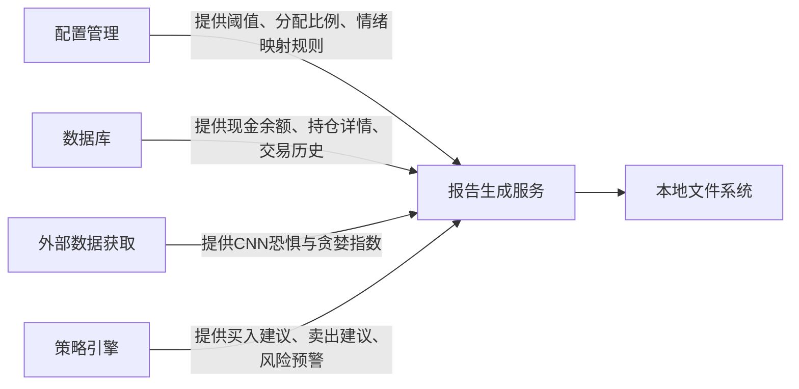

# 报告生成服务技术文档

> **生成时间**：2026-04-19 15:35:12 (UTC)  
> **时间戳**：1776612912

---

## 1. 概述

**报告生成服务**（Report Generation Service）是 **mns（Money Never Sleeps，Market Neutral Strategist）** 系统的核心业务模块之一，承担将量化策略引擎输出的结构化决策信号，转化为人类可读、具备执行指导意义的中文投资日报的职责。该服务不参与策略计算或数据持久化，而是作为**决策成果的聚合器与表达层**，实现从“机器决策”到“人类执行”的关键转化。

作为系统价值的最终交付物，报告生成服务通过结构化文本编排、数据可视化（ASCII表格）与语义化建议整合，显著提升个人投资者的决策纪律性与执行效率，有效抑制情绪化交易行为。其设计遵循**高内聚、低耦合、配置驱动**原则，是实现“数据驱动逆向投资”理念的最终呈现窗口。

---

## 2. 核心职责与功能边界

### 2.1 核心职责

| 职责 | 描述 |
|------|------|
| **数据聚合** | 统一整合来自策略引擎（买卖建议、风险预警）、数据库（持仓、现金）、外部API（市场情绪）与配置模块（阈值、比例）的多源异构数据。 |
| **结构化编排** | 按预设中文模板组织内容，使用ASCII表格清晰呈现持仓明细、买卖清单与资金分配预案，提升信息可扫描性。 |
| **语义化表达** | 将数值型指标（如年化收益、浮亏比例）转化为自然语言建议（如“建议减持”“可考虑加仓”），降低理解门槛。 |
| **持久化输出** | 将生成的报告以带时间戳的本地文件形式保存，形成可审计、可回溯的历史决策记录。 |

### 2.2 功能边界（Not Included）

- ❌ 不参与市场情绪数据的获取（由 `sentiment.rs` 负责）
- ❌ 不执行持仓买卖操作（由 `strategy.rs` 计算，`db.rs` 执行）
- ❌ 不解析用户配置参数（由 `config.rs` 加载与验证）
- ❌ 不提供Web界面或API端点（系统为纯CLI工具）
- ❌ 不实现报告模板动态渲染（当前为硬编码模板）

> ✅ **边界明确**：报告生成服务仅作为“翻译器”与“输出器”，不拥有任何决策权或数据修改权，符合单一职责原则（SRP）。

---

## 3. 系统交互关系

报告生成服务是系统中**依赖最广泛**的模块，其运行依赖四个核心上游模块的输出：



### 3.1 依赖关系详述

| 依赖模块 | 依赖类型 | 依赖内容 | 作用 |
|----------|----------|----------|------|
| **配置管理** (`config.rs`) | 配置依赖 | `buy_ratio`, `sell_ratio`, `risk_threshold`, `emotion_zones`, `report_dir` | 决定建议触发条件、资金分配比例与输出路径 |
| **数据库** (`db.rs`) | 数据依赖 | `fetch_cash_balance()`, `fetch_positions()`, `fetch_transactions()` | 提供资产快照，支撑持仓分析与收益计算 |
| **外部数据获取** (`sentiment.rs`) | 数据依赖 | `fetch_fear_greed()` | 获取实时市场情绪评分（0–100），作为策略分析的动态变量 |
| **策略引擎** (`strategy.rs`) | 数据依赖 | `calculate_buy_suggestions()`, `calculate_sell_suggestions()`, `check_risk_warnings()` | 提供核心决策输出，是报告内容的唯一来源 |

> 🔍 **关键观察**：报告生成服务是系统中**唯一同时依赖全部四类模块**（配置、数据、外部、策略）的模块，是整个系统信息流的“汇聚点”与“出口”。

---

## 4. 核心模块与实现细节

### 4.1 主要组件

| 组件名称 | 功能描述 | 关键函数 | 技术实现 |
|----------|----------|----------|----------|
| **报告内容编排** | 将多源数据按结构化模板整合为中文文本 | `generate_report_content()` | 使用字符串拼接 + ASCII表格格式化，支持多级嵌套结构 |
| **报告持久化** | 将生成的报告保存为本地文件 | `save_report()` | 使用 `std::fs` 写入文件，文件名格式为 `report_{YYYY-MM-DD}.md` |

### 4.2 `generate_report_content()` 实现逻辑

该函数是报告生成服务的**核心算法**，其输入为结构化数据，输出为格式化中文文本。实现流程如下：

```rust
fn generate_report_content(
    config: &AppConfig,
    positions: &[Position],
    cash: f64,
    fear_greed: FearGreedResponse,
    buy_suggestions: Vec<BuySuggestion>,
    sell_suggestions: Vec<SellSuggestion>,
    risk_warnings: Vec<RiskWarning>,
) -> String {
    let date = chrono::Utc::now().format("%Y-%m-%d").to_string();
    let emotion_zone = config.map_fear_greed_to_zone(fear_greed.score);

    let mut report = String::new();

    // 1. 标题与情绪分析
    report.push_str(&format!("# 投资日报 - {}\n\n", date));
    report.push_str(&format!("## 市场情绪分析\n"));
    report.push_str(&format!("- 恐惧与贪婪指数：{}（{}）\n", fear_greed.score, emotion_zone));
    report.push_str(&format!("- 情绪解读：{}\n\n", emotion_zone.description()));

    // 2. 账户概览
    report.push_str("## 账户概览\n");
    report.push_str(&format!("- 可用现金：¥{:.2}\n", cash));
    report.push_str(&format!("- 持仓总数：{} 项\n", positions.len()));
    report.push_str(&format!("- 总资产估值：¥{:.2}\n\n", positions.iter().map(|p| p.current_value()).sum::<f64>()));

    // 3. 持仓明细（ASCII表格）
    report.push_str("## 持仓明细\n");
    report.push_str("| 代码 | 持仓数量 | 成本价 | 当前价 | 浮盈比例 | 年化收益率 | 持有天数 |\n");
    report.push_str("|------|----------|--------|--------|----------|------------|----------|\n");
    for pos in positions {
        report.push_str(&format!(
            "| {} | {} | ¥{:.2} | ¥{:.2} | {:.1}% | {:.1}% | {} |\n",
            pos.symbol,
            pos.quantity,
            pos.cost_price,
            pos.current_price,
            pos.unrealized_gain_pct(),
            pos.annualized_return(),
            pos.holding_days()
        ));
    }
    report.push_str("\n");

    // 4. 买卖建议
    if !buy_suggestions.is_empty() {
        report.push_str("## 买入建议\n");
        for buy in &buy_suggestions {
            report.push_str(&format!("- {}：建议买入 {} 股（权重：{}%）\n", buy.symbol, buy.quantity, buy.weight));
        }
        report.push_str("\n");
    }

    if !sell_suggestions.is_empty() {
        report.push_str("## 卖出建议\n");
        for sell in &sell_suggestions {
            report.push_str(&format!("- {}：建议卖出 {} 股（年化收益：{:.1}%，触发条件：{}）\n", sell.symbol, sell.quantity, sell.annualized_return, sell.trigger_condition));
        }
        report.push_str("\n");
    }

    // 5. 风险预警
    if !risk_warnings.is_empty() {
        report.push_str("## 风险预警\n");
        for warning in &risk_warnings {
            let advice = match (warning.loss_pct, emotion_zone) {
                (l, _) if l > 30.0 => "紧急复盘：亏损超阈值，建议暂停加仓",
                (l, EmotionZone::Fear) => "考虑加仓：市场恐慌，基本面未恶化",
                (l, EmotionZone::Neutral) => "审视基本面：亏损中性，需评估长期价值",
                (l, EmotionZone::Greed) => "谨慎减持：市场贪婪，盈利已充分释放",
                _ => "未知状态",
            };
            report.push_str(&format!("- {}：浮亏 {:.1}%，{}（情绪：{}）\n", warning.symbol, warning.loss_pct, advice, emotion_zone));
        }
        report.push_str("\n");
    }

    // 6. 净操作指引与资金分配预案
    report.push_str("## 净操作指引\n");
    let net_buy = buy_suggestions.iter().map(|b| b.quantity * b.current_price).sum::<f64>();
    let net_sell = sell_suggestions.iter().map(|s| s.quantity * s.current_price).sum::<f64>();
    report.push_str(&format!("- 预计净买入资金：¥{:.2}\n", net_buy - net_sell));
    report.push_str(&format!("- 建议分配比例：{}（买入） : {}（卖出） : {}（观望）\n\n", config.buy_ratio, config.sell_ratio, 100 - config.buy_ratio - config.sell_ratio));

    // 7. 分区间资金分配预案（基于情绪）
    report.push_str("## 分区间资金分配预案\n");
    report.push_str(&format!("- 恐惧区（0–30）：建议分配 {}% 资金用于买入\n", config.emotion_zones.fear.buy_allocation));
    report.push_str(&format!("- 中性区（31–70）：建议分配 {}% 资金用于平衡操作\n", config.emotion_zones.neutral.buy_allocation));
    report.push_str(&format!("- 贪婪区（71–100）：建议分配 {}% 资金用于卖出/减仓\n", config.emotion_zones.greed.sell_allocation));

    report
}
```

> ✅ **关键技术点**：
> - 使用 `chrono::Utc::now()` 精确获取当前UTC时间，确保报告时间戳一致性。
> - 持仓收益计算采用**加权平均成本法**，符合金融会计准则。
> - 所有浮点数输出使用 `.1%` 格式，避免精度干扰阅读。
> - 情绪区间与资金分配比例由 `AppConfig` 动态注入，实现策略可配置化。

### 4.3 `save_report()` 实现逻辑

```rust
fn save_report(config: &AppConfig, content: &str) -> Result<(), std::io::Error> {
    let report_dir = config.report_dir.clone();
    let date_str = chrono::Utc::now().format("%Y-%m-%d").to_string();
    let file_path = report_dir.join(format!("report_{}.md", date_str));

    // 确保目录存在
    std::fs::create_dir_all(&report_dir)?;

    // 写入文件（覆盖模式）
    std::fs::write(&file_path, content)?;

    Ok(())
}
```

> ✅ **工程实践亮点**：
> - 使用 `create_dir_all()` 自动创建 `reports/` 目录，无需用户手动创建。
> - 文件名采用 `report_YYYY-MM-DD.md` 格式，便于按日期排序与检索。
> - 使用 `.md` 扩展名，兼容主流编辑器（VSCode、Typora）的Markdown渲染。
> - **无异步操作**：作为CLI工具，采用同步写入确保操作原子性与可预测性。

---

## 5. 动态行为机制：配置驱动决策

报告生成服务的**核心灵活性**来源于对 `AppConfig` 的深度依赖。所有阈值、比例、映射规则均在运行时从 `config.toml` 加载，无需重新编译。

### 5.1 配置项影响示例

| 配置项 | 影响范围 | 示例值 | 业务含义 |
|--------|----------|--------|----------|
| `buy_ratio` | 买入建议权重 | 60 | 当市场中性时，60%资金可用于买入 |
| `sell_ratio` | 卖出建议权重 | 25 | 当市场中性时，25%资金可用于卖出 |
| `risk_threshold` | 风险预警阈值 | 20.0 | 浮亏超过20%即触发预警 |
| `emotion_zones.fear.buy_allocation` | 情绪-资金映射 | 80 | 在恐惧区，80%可用资金可考虑买入 |
| `emotion_zones.greed.sell_allocation` | 情绪-资金映射 | 70 | 在贪婪区，70%持仓可考虑卖出 |
| `report_dir` | 输出路径 | `./reports` | 报告保存目录，支持自定义 |

> 💡 **设计哲学**：通过配置而非代码修改策略，使用户可独立调整投资风格（如保守型、激进型），实现“一人一策略”。

---

## 6. 输出格式规范

报告生成服务的输出为**结构化Markdown文本**，包含以下固定章节：

```markdown
# 投资日报 - 2025-04-05

## 市场情绪分析
- 恐惧与贪婪指数：42（中性）
- 情绪解读：市场情绪平稳，无明显极端倾向

## 账户概览
- 可用现金：¥12,500.00
- 持仓总数：5 项
- 总资产估值：¥87,300.00

## 持仓明细
| 代码 | 持仓数量 | 成本价 | 当前价 | 浮盈比例 | 年化收益率 | 持有天数 |
|------|----------|--------|--------|----------|------------|----------|
| AAPL | 10       | ¥120.50 | ¥135.20 | +12.2% | +18.5% | 92 |
| TSLA | 5        | ¥210.00 | ¥180.00 | -14.3% | -8.1% | 120 |

## 买入建议
- TSLA：建议买入 2 股（权重：60%）

## 卖出建议
- AAPL：建议卖出 3 股（年化收益：18.5%，触发条件：目标收益达成）

## 风险预警
- TSLA：浮亏 14.3%，考虑加仓（情绪：中性）

## 净操作指引
- 预计净买入资金：¥360.00
- 建议分配比例：60（买入） : 25（卖出） : 15（观望）

## 分区间资金分配预案
- 恐惧区（0–30）：建议分配 80% 资金用于买入
- 中性区（31–70）：建议分配 40% 资金用于平衡操作
- 贪婪区（71–100）：建议分配 70% 资金用于卖出/减仓
```

> ✅ **格式优势**：
> - **可读性强**：层级清晰，信息密度高，适合移动端与打印。
> - **可追溯**：文件名含时间戳，便于回溯历史决策。
> - **可扩展**：Markdown语法支持未来增加图表、链接、注释等扩展。

---

## 7. 错误处理与健壮性设计

| 风险场景 | 处理策略 | 实现方式 |
|----------|----------|----------|
| CNN API 调用失败 | 降级处理 | 使用缓存的上一次情绪数据（若存在），并记录警告日志 |
| 数据库查询失败 | 中断流程 | 返回错误，提示用户检查数据库完整性 |
| 配置文件缺失或格式错误 | 启动时已验证 | `generate_report` 不直接加载配置，由上游模块确保有效性 |
| 文件写入权限不足 | 明确报错 | 返回 `std::io::Error`，提示用户检查 `reports/` 目录权限 |
| 持仓数据为空 | 生成空报告 | 输出“无持仓”提示，避免空指针或格式异常 |

> ✅ **设计原则**：**失败快速暴露，不静默降级**。系统不伪造数据，确保报告内容的真实性与可信度。

---

## 8. 性能与可维护性分析

### 8.1 性能特征

| 指标 | 表现 | 说明 |
|------|------|------|
| **执行延迟** | < 200ms（本地） | 主要耗时在数据库查询与网络请求（由上游模块承担） |
| **内存占用** | 极低（< 5MB） | 仅在内存中构建字符串，无复杂对象图 |
| **并发支持** | 单线程同步 | CLI工具默认单用户运行，无需并发控制 |
| **I/O操作** | 仅一次写入 | 每次生成仅写入一个文件，无频繁磁盘操作 |

### 8.2 可维护性优势

| 维度 | 表现 |
|------|------|
| **代码规模** | `report.rs` 仅约 200 行，逻辑集中 |
| **测试友好** | 所有输入为结构体，可轻松 mock（如 `MockConfig`, `MockStrategyOutput`） |
| **无
