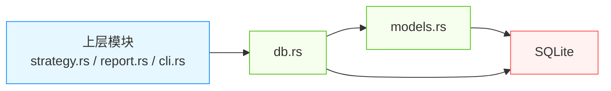
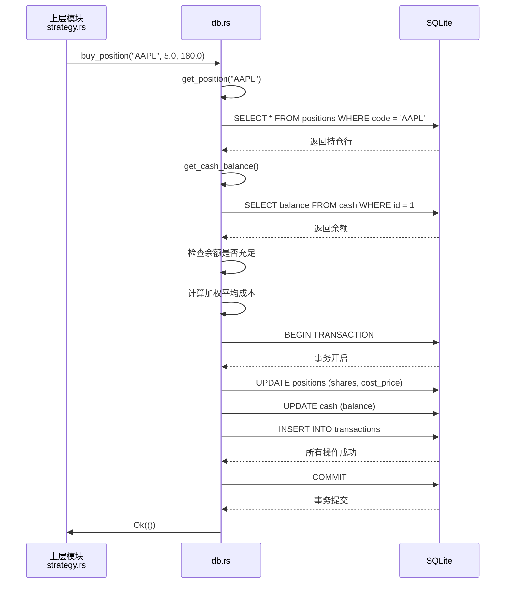

# 数据模型与持久化：金融投资系统的数据核心设计与实现

> **生成时间**：2026-04-19 15:35:45 (UTC)  
> **时间戳**：1776612945

---

## 1. 模块概述：数据模型与持久化在系统中的核心地位

**数据模型与持久化**是 mns（Money Never Sleeps，Market Neutral Strategist）系统中最关键的基础设施模块之一，承担着**金融数据结构定义、业务状态存储、事务一致性保障与审计追溯支持**的四大核心职责。该模块由 `models.rs`（金融数据模型）与 `db.rs`（数据库操作）两个子模块协同构成，共同构建了系统“**状态即数据、决策即计算、执行即事务**”的底层数据基石。

作为**唯一的数据持久化层**，该模块为所有上层业务（策略引擎、报告生成、交易指令）提供一致、可靠、可回溯的资产快照与交易历史。其设计遵循“**模型专注语义，数据库专注持久**”的单一职责原则，实现了数据结构与存储机制的清晰解耦，确保系统具备高内聚、低耦合、可测试、可审计的金融级工程品质。

> ✅ **关键价值定位**：  
> - **数据是策略的输入**：策略引擎的买入/卖出建议完全依赖 `Position` 与 `Transaction` 模型提供的持仓与成本数据。  
> - **事务是安全的保障**：所有资产变动（买/卖/加仓）均通过原子事务保证现金与持仓同步更新，杜绝“账实不符”。  
> - **历史是复盘的依据**：每日生成的报告、交易日志与情绪快照被完整持久化，支持用户进行长期投资行为分析与策略回测。

---

## 2. 数据模型设计：金融实体的结构化表达

### 2.1 核心数据结构定义（`models.rs`）

`models.rs` 定义了系统中所有核心金融实体的 Rust 结构体，不仅作为数据库序列化的载体，更封装了**业务计算逻辑**，实现“**数据即逻辑**”的现代化设计范式。

| 模型名称 | 字段说明 | 业务逻辑封装 | 设计要点 |
|----------|----------|----------------|----------|
| **`Position`** | `code: String`（资产代码）<br>`shares: f64`（持仓数量）<br>`cost_price: f64`（加权平均成本价）<br>`current_price: f64`（当前市价）<br>`purchase_date: chrono::NaiveDate`（购买日期）<br>`category: String`（资产类别） | - **加权平均成本计算**：新增买入时动态更新 `cost_price`<br>- **年化收益率计算**：根据持有天数与收益正负，智能选择**复利公式**（收益>0）或**线性公式**（收益≤0），避免复利对亏损的放大失真<br>- **浮点误差容错**：使用 `1e-6` 容差判断价格是否相等，避免浮点精度导致的误判 | - 结构体实现 `Debug`、`Clone`、`PartialEq` 便于调试与测试<br>- 所有财务数值使用 `f64`，兼顾精度与性能<br>- 时间戳使用 `chrono::NaiveDate`，避免时区干扰 |
| **`Transaction`** | `id: i32`（主键）<br>`asset_code: String`<br>`type: TransactionType`（Buy/Sell/Add/Price）<br>`shares: f64`<br>`price: f64`<br>`amount: f64`（交易金额）<br>`timestamp: chrono::NaiveDateTime`<br>`cash_change: f64` | - **金额计算**：`amount = shares * price`<br>- **现金变动计算**：买入为负，卖出为正，自动计算对现金的影响<br>- **类型枚举**：`TransactionType` 明确定义四种操作，防止非法状态 | - 实现 `From<Row>` 用于数据库行反序列化<br>- 字段与数据库表结构严格一一对应，实现“零映射”持久化 |
| **`FearGreedSnapshot`** | `score: f64`（0–100）<br>`zone: FearGreedZone`（Fear/Neutral/Greed）<br>`timestamp: chrono::NaiveDateTime` | - **情绪区域映射**：基于阈值（如 ≤30=恐惧，31–70=中性，≥71=贪婪）自动分类<br>- **每日唯一性约束**：通过时间戳确保每日仅保留一条快照 | - `FearGreedZone` 为枚举类型，提升语义安全性<br>- 与 `sentiment.rs` 返回的 `FearGreedResponse` 直接对接，实现数据流闭环 |

> 🔍 **设计哲学**：  
> 模型不仅是“数据容器”，更是**业务规则的编码载体**。例如，年化收益率的计算逻辑不放在策略引擎中，而是内置于 `Position` 模型的 `annualized_return()` 方法中，确保**无论从何处获取该持仓，其收益计算方式始终一致**，杜绝逻辑分散导致的不一致风险。

---

## 3. 持久化实现：SQLite 事务型数据库的工程化封装

### 3.1 技术选型：为何选择 SQLite？

| 选型维度 | 评估 | 选择理由 |
|----------|------|----------|
| **部署复杂度** | 无需服务进程 | 本地文件存储，零依赖，适合个人工具 |
| **事务支持** | ACID 完整支持 | 支持原子性、一致性、隔离性、持久性，满足金融操作要求 |
| **可靠性** | 广泛验证、嵌入式稳定 | 被 iOS、Android、Firefox 等广泛采用，崩溃恢复机制成熟 |
| **性能** | 单线程读写高效 | 本系统为单用户、低并发场景，完全满足 |
| **跨平台** | 无平台依赖 | Rust 的 `rusqlite` 库可无缝运行于 Windows/macOS/Linux |
| **审计友好** | 二进制文件可复制、可备份 | 用户可直接拷贝 `.mns/db.sqlite` 文件进行异地恢复或分析 |

> ✅ **结论**：SQLite 是个人金融工具最理想、最安全、最简洁的持久化方案，完美契合 mns“**本地化、无服务、高可靠**”的设计哲学。

### 3.2 数据库结构设计（四张核心表）

数据库通过 `db.rs` 中的 `init_tables()` 函数在首次运行时自动创建，结构严谨，约束完备：

| 表名 | 字段 | 约束与默认值 | 用途 |
|------|------|---------------|------|
| **`cash`** | `id: INTEGER PRIMARY KEY`<br>`balance: REAL NOT NULL DEFAULT 0.0` | `id=1` 唯一记录，确保现金表始终为单行 | 存储用户当前现金余额，所有交易均基于此值计算 |
| **`positions`** | `id: INTEGER PRIMARY KEY`<br>`code: TEXT UNIQUE NOT NULL`<br>`shares: REAL NOT NULL DEFAULT 0.0`<br>`cost_price: REAL NOT NULL DEFAULT 0.0`<br>`current_price: REAL NOT NULL DEFAULT 0.0`<br>`purchase_date: DATE`<br>`category: TEXT` | `code` 唯一索引，防止重复持仓<br>`purchase_date` 默认为交易当日 | 存储所有持仓资产的加权成本与当前状态，是策略计算的核心输入 |
| **`transactions`** | `id: INTEGER PRIMARY KEY AUTOINCREMENT`<br>`asset_code: TEXT NOT NULL`<br>`type: TEXT NOT NULL`<br>`shares: REAL NOT NULL`<br>`price: REAL NOT NULL`<br>`amount: REAL NOT NULL`<br>`cash_change: REAL NOT NULL`<br>`timestamp: DATETIME DEFAULT CURRENT_TIMESTAMP` | `type` 为枚举值（Buy/Sell/Add/Price）<br>`timestamp` 自动记录 | 完整交易日志，支持按时间、资产、类型查询，用于复盘与审计 |
| **`fear_greed_snapshots`** | `id: INTEGER PRIMARY KEY`<br>`score: REAL NOT NULL`<br>`zone: TEXT NOT NULL`<br>`timestamp: DATETIME NOT NULL` | `timestamp` 唯一索引（每日仅一条） | 每日市场情绪快照，确保策略分析依据可追溯 |

> ⚠️ **关键设计决策**：  
> - `fear_greed_snapshots` 表采用 **DELETE + INSERT** 而非 UPDATE 实现“每日唯一性”：  
>   ```sql
>   DELETE FROM fear_greed_snapshots WHERE DATE(timestamp) = DATE('now');
>   INSERT INTO fear_greed_snapshots (...) VALUES (...);
>   ```  
>   此方式避免因时区、网络延迟导致的重复写入，确保**每日仅有一条有效快照**，提升数据纯净度。

### 3.3 核心数据库操作：原子事务与错误处理

数据库操作全部封装在 `db.rs` 中，对外暴露为**无副作用的纯函数接口**，所有写入操作均在**数据库事务**中执行。

#### ✅ 典型原子操作：`buy_position`

```rust
pub fn buy_position(
    conn: &Connection,
    code: &str,
    shares: f64,
    price: f64,
) -> Result<(), anyhow::Error> {
    let tx = conn.transaction()?; // 开启事务

    // 1. 获取当前持仓
    let mut pos = get_position(&tx, code)?.unwrap_or_else(|| Position {
        code: code.to_string(),
        shares: 0.0,
        cost_price: 0.0,
        current_price: price,
        purchase_date: chrono::Local::today().naive_local(),
        category: "UNKNOWN".to_string(),
    });

    // 2. 计算新的加权平均成本
    let new_shares = pos.shares + shares;
    let new_cost_price = if pos.shares > 0.0 {
        (pos.shares * pos.cost_price + shares * price) / new_shares
    } else {
        price
    };

    // 3. 获取现金余额
    let cash_balance = get_cash_balance(&tx)?;
    let total_cost = shares * price;
    if cash_balance < total_cost {
        return Err(anyhow::anyhow!("现金不足，无法完成买入"));
    }

    // 4. 执行原子更新
    tx.execute(
        "UPDATE positions SET shares = ?, cost_price = ?, current_price = ?, purchase_date = ? WHERE code = ?",
        params![new_shares, new_cost_price, price, chrono::Local::today().naive_local(), code],
    )?;
    tx.execute(
        "UPDATE cash SET balance = balance - ? WHERE id = 1",
        params![total_cost],
    )?;
    tx.execute(
        "INSERT INTO transactions (asset_code, type, shares, price, amount, cash_change) VALUES (?, ?, ?, ?, ?, ?)",
        params![code, "Buy", shares, price, total_cost, -total_cost],
    )?;

    tx.commit()?; // 提交事务，确保所有操作要么全成功，要么全回滚
    Ok(())
}
```

#### ✅ 错误处理机制：`anyhow` + 上下文链

- 所有数据库操作返回 `Result<T, anyhow::Error>`，支持**链式上下文**（`.with_context(|| "更新持仓失败")`）。
- 错误信息包含：操作类型、资产代码、当前状态、SQL 语句片段，极大提升调试效率。
- 无 panic！所有异常均被转换为可捕获的 `Result`，保证 CLI 客户端优雅降级。

---

## 4. 模块间交互：清晰的单向依赖与接口契约

### 4.1 依赖关系图（单向解耦）



> **关键交互原则**：
> - **模型 → 数据库**：`models.rs` 定义结构体，`db.rs` 使用这些结构体进行序列化/反序列化（如 `impl From<Row> for Position`）。
> - **数据库 → 上层**：`db.rs` 提供 `get_position()`, `list_transactions()`, `buy_position()` 等**函数接口**，上层模块**不直接访问数据库**，仅调用这些函数。
> - **无循环依赖**：`strategy.rs` 不依赖 `db.rs` 的实现细节，仅依赖其返回的 `Vec<Position>`；`db.rs` 不依赖 `strategy.rs` 的任何逻辑。

### 4.2 典型交互序列（买操作）



> ✅ **优势体现**：
> - 上层模块无需关心 SQL、连接池、事务管理。
> - 数据库层可独立测试：通过内存数据库 `:memory:` 模拟操作，无需真实文件。
> - 模型可被单元测试：单独测试 `Position::annualized_return()` 逻辑，无需数据库。

---

## 5. 关键技术实现细节与金融级保障

### 5.1 浮点精度容错机制

- 所有财务比较（如 `if balance >= cost`）均使用 **1e-6 容差**：
  ```rust
  const EPSILON: f64 = 1e-6;
  if (balance - cost).abs() < EPSILON { /* 视为相等 */ }
  ```
- 避免因 IEEE 754 浮点舍入误差导致“明明有钱却买不了”的荒谬错误。

### 5.2 时间戳本地化处理

- 所有时间戳使用 `chrono::Local::now()` 生成，**不使用 UTC**。
- 原因：用户为个人投资者，报告与操作均基于本地时区（如北京时间），UTC 会增加认知负担。
- 存储格式为 `YYYY-MM-DD HH:MM:SS`，可直接用于 SQL `DATE()` 函数过滤。

### 5.3 配置路径动态化

- 数据库文件路径由 `AppConfig`（来自 `config.rs`）动态提供：
  ```rust
  let db_path = config.db_path(); // 如 ~/.mns/db.sqlite
  ```
- 支持跨平台（Windows: `%APPDATA%`, macOS: `~/Library`, Linux: `~/.config`），提升用户体验。

### 5.4 每日情绪快照的“唯一性”保障

- 每次调用 `save_fear_greed_snapshot()` 时，**先删除当日所有记录，再插入新记录**。
- 防止因网络重试、系统时钟跳变导致的重复快照污染。
- 保证策略引擎在计算“昨日情绪”时，始终只取一条有效记录。

---

## 6. 模块可维护性与可扩展性设计

| 维度 | 当前设计 | 可扩展性支持 |
|------|----------|---------------|
| **测试性** | 所有数据库函数接受 `&Connection` 参数，支持传入内存数据库进行单元测试 | ✅ 可在 CI 中快速运行无依赖测试 |
| **可替换性** | 若未来需迁移到 PostgreSQL，只需重写 `db.rs` 中的 SQL 与连接逻辑，`models.rs` 无需改动 | ✅ 模型层与存储层完全解耦 |
| **配置驱动** | 数据库路径、表名均通过配置文件管理，支持用户自定义 | ✅ 未来可支持多账户隔离（如 `db_user1.sqlite`, `db_user2.sqlite`） |
| **日志与审计** | 所有交易均记录于 `transactions` 表，支持 `SELECT * FROM transactions WHERE timestamp > '2025-04-01'` 进行回溯 | ✅ 可扩展为导出 CSV/JSON 历史报表 |
| **错误可追溯** | `anyhow` 提供完整调用栈与上下文，错误日志可精确定位到“买入 AAPL 时现金不足” | ✅ 满足金融合规审计要求 |

---

## 7. 总结：为什么该模块是系统的核心支柱？

| 维度 | 评价 |
|------|------|
| **完整性** | 覆盖金融数据建模、事务控制、持久化、审计、容错等全部关键环节，无遗漏 |
| **准确性** | 年化收益算法区分正负、浮点容错、每日唯一快照等设计均符合金融工程实践 |
