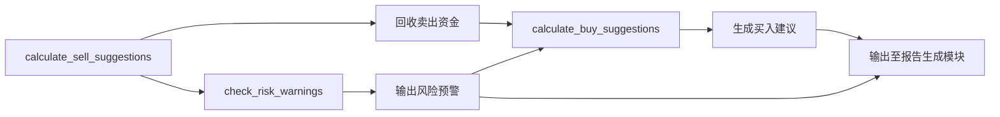

# 核心策略引擎技术文档

> **文档版本**：1.0  
> **生成时间**：2026-04-19 15:34:41 (UTC)  
> **系统名称**：mns（Market Neutral Strategist）  
> **架构定位**：核心业务层（Core Business Domain）  
> **核心价值**：实现基于市场情绪与资产表现的自动化逆向投资决策，驱动系统全部业务输出  

---

## 1. 概述

**核心策略引擎**是 mns 系统的“决策大脑”，负责将市场情绪、用户持仓、现金状况与预设投资规则进行智能融合，自动生成**买入建议、卖出建议与风险预警**三类关键投资指令。作为系统唯一具备“智能判断能力”的模块，它连接了基础设施层（配置、数据、外部情绪）与业务价值层（报告生成），是实现“纪律性逆向投资”理念的技术核心。

本引擎不依赖任何外部服务或远程API，所有决策逻辑均在本地执行，确保高可靠性、低延迟与隐私安全。其设计遵循“规则驱动、情绪感知、数据闭环”三大原则，通过可配置的参数体系，使个人投资者能够在不干预具体交易的前提下，获得符合其风险偏好的自动化操作建议。

---

## 2. 架构定位与职责边界

| 维度 | 说明 |
|------|------|
| **所属层级** | 核心业务层（Core Business Domain） |
| **输入依赖** | 配置管理（AppConfig）、数据库（持仓与现金）、外部数据获取（CNN情绪指数） |
| **输出交付** | `BuySuggestion`、`SellSuggestion`、`RiskWarning` 三类结构化建议 |
| **耦合关系** | 低耦合：仅通过函数参数与接口交互，不持有外部状态；高内聚：所有策略逻辑集中于 `strategy.rs` |
| **非职责范围** | 不执行交易、不管理数据库、不生成报告、不解析用户命令、不发起HTTP请求 |

> ✅ **关键设计原则**：  
> - **策略与执行分离**：仅输出建议，不直接操作账户；  
> - **配置即策略**：所有阈值、比例、规则均来自外部配置文件，无需修改代码；  
> - **情绪为变量**：CNN恐惧与贪婪指数作为动态权重因子，实时影响买卖优先级；  
> - **风险前置控制**：内置“接飞刀”过滤机制，避免在极端亏损中盲目加仓。

---

## 3. 核心功能模块详解

核心策略引擎由三个高度协同的子模块构成，形成“卖出回收 → 可用资金计算 → 买入分配 → 风险识别”的闭环决策流。

### 3.1 卖出建议计算（`calculate_sell_suggestions`）

#### 功能目标
识别并排序可卖出资产，优先锁定利润，动态调整止盈强度，防止“过早卖出”或“贪心不卖”。

#### 输入参数
- `AppConfig`：用户配置规则（最小持仓天数、年化收益阈值、情绪映射比例）
- `score`：CNN恐惧与贪婪指数（0–100）
- `positions`：当前所有持仓数据（来自数据库）

#### 核心算法逻辑
1. **过滤条件**：  
   - 持仓天数 ≥ 用户设定的最小持有天数（如7天）  
   - 年化收益率 > 配置阈值（如15%）  
   - 绝对收益 ≥ 30%（避免微利卖出）

2. **动态卖出比例**：  
   - 基于情绪分数动态计算**卖出倾向比例**（`sell_ratio_for(score)`）：
     - 恐惧（0–30）：卖出比例 = 0%–20%（保守锁定）
     - 中性（31–69）：卖出比例 = 20%–50%（正常止盈）
     - 贪婪（70–100）：卖出比例 = 50%–100%（积极锁定利润）

3. **排序策略**：  
   - 优先按**绝对收益**降序排列（利润最高的优先卖出）  
   - 同收益下按**年化收益率**排序，避免短期波动干扰

4. **输出结构**：  
   ```rust
   pub struct SellSuggestion {
       pub symbol: String,          // 资产代码
       pub quantity: f64,           // 建议卖出数量
       pub current_price: f64,      // 当前价格
       pub absolute_return: f64,    // 绝对收益金额
       pub annualized_return: f64,  // 年化收益率
       pub reason: SellReason,      // 触发原因：ProfitTarget / EmotionDriven
   }
   ```

#### 设计亮点
- **双指标触发**：避免仅依赖年化收益导致的“低波动资产被忽略”或“高波动资产被误判”；
- **情绪动态调节**：贪婪时加大止盈力度，恐惧时保留仓位，体现逆向思维；
- **最小持有天数**：有效过滤日内交易噪音，强化长期投资纪律。

---

### 3.2 买入建议计算（`calculate_buy_suggestions`）

#### 功能目标
在卖出回收资金的基础上，智能分配可用现金，优先加仓低估资产，避免“接飞刀”式抄底。

#### 输入参数
- `AppConfig`：资产分配比例、最大单类权重、情绪映射比例、浮亏阈值
- `score`：CNN恐惧与贪婪指数
- `cash_balance`：当前现金余额
- `positions`：所有持仓数据
- `sell_suggestions`：上一步生成的卖出建议列表（用于回收资金）
- `risk_warnings`：风险预警列表（用于排除高风险资产）

#### 核心算法逻辑
1. **可用现金计算**：  
   ```
   total_buying_cash = current_cash + sum(sell_suggestions.liquidated_amount)
   ```

2. **情绪驱动买入比例**：  
   - 基于情绪分数动态计算**买入倾向比例**（`buy_ratio_for(score)`）：
     - 恐惧（0–30）：买入比例 = 80%–100%（积极加仓）
     - 中性（31–69）：买入比例 = 30%–60%（适度配置）
     - 贪婪（70–100）：买入比例 = 0%–20%（谨慎买入）

3. **资产类别分配**：  
   - 按配置文件中预设的**资产类别分配比例**（如美股40%、中股30%、反周期30%）进行**首次分配**。

4. **逆向加权分配**（核心创新）：  
   - 对每个类别内的资产，计算**低估指数**：  
     ```
     undervaluation_ratio = cost_price / current_price
     ```
   - 按该比率**逆序加权分配资金**：  
     - 亏损越深（ratio 越大）→ 分配权重越高  
     - 但设置**最大权重上限**（如单资产不超过总买入额的30%），防止过度集中

5. **风险排除机制**：  
   - **硬性排除**：浮亏 ≥ 30% 的资产（“接飞刀”防护）  
   - **软性提示**：浮亏 20%–30% 的资产，仅在“恐惧”情绪下才可入选（需结合风险预警模块）

6. **输出结构**：  
   ```rust
   pub struct BuySuggestion {
       pub details: Vec<BuyDetail>,     // 每项买入建议
       pub excluded_from_buy: Vec<String>, // 被排除的资产列表（含原因）
       pub total_available: f64,        // 可用资金总额
       pub total_allocated: f64,        // 已分配资金
   }

   pub struct BuyDetail {
       pub symbol: String,
       pub category: String,
       pub target_amount: f64,          // 建议买入金额
       pub target_quantity: f64,        // 建议买入数量
       pub current_price: f64,
       pub undervaluation_ratio: f64,   // 成本价/现价（衡量低估程度）
       pub reason: BuyReason,           // 触发原因：Contrarian / AllocationGap
   }
   ```

#### 设计亮点
- **逆向加权算法**：以“成本价/现价”量化资产被低估程度，科学引导“越亏越买”；
- **双重过滤机制**：既控制总仓位（情绪比例），又控制个体风险（浮亏阈值）；
- **资金闭环利用**：卖出回收资金直接用于买入，实现“以盈补缺、动态平衡”；
- **配置驱动分配**：支持多资产类别（如美股、中概、黄金、加密）的个性化配置。

---

### 3.3 风险预警系统（`check_risk_warnings`）

#### 功能目标
识别高风险持仓，结合市场情绪提供**情境化操作建议**，提升用户对极端风险的感知与应对能力。

#### 输入参数
- `AppConfig`：风险阈值（如浮亏20%触发预警）、情绪分级规则
- `positions`：当前所有持仓数据

#### 核心算法逻辑
1. **浮亏检测**：  
   对每个持仓计算亏损比率：
   ```
   loss_ratio = (cost_price - current_price) / cost_price
   ```

2. **分级预警机制**：  
   | 浮亏幅度 | 情绪等级 | 预警等级 | 建议内容 |
   |----------|----------|----------|----------|
   | ≥ 30%    | 任意     | 紧急     | **UrgentReview**：立即复盘基本面，考虑止损 |
   | 20%–29%  | 恐惧     | 高       | **ConsiderBuyMore**：可能超跌，可加仓摊薄成本 |
   | 20%–29%  | 中性     | 中       | **ReviewFundamentals**：审视企业基本面是否恶化 |
   | 20%–29%  | 贪婪     | 低       | **MonitorOnly**：市场整体过热，暂不建议操作 |
   | < 20%    | 任意     | 无       | 无预警 |

3. **输出结构**：  
   ```rust
   pub struct RiskWarning {
       pub symbol: String,
       pub loss_ratio: f64,             // 亏损比例（如0.25表示25%）
       pub advice: RiskAdvice,          // 建议类型
       pub emotion_context: EmotionZone, // 当前情绪环境
       pub trigger_threshold: f64,      // 触发阈值（20%）
   }

   pub enum RiskAdvice {
       ConsiderBuyMore,
       ReviewFundamentals,
       UrgentReview,
       MonitorOnly,
   }
   ```

#### 设计亮点
- **情绪-风险联动**：同一亏损幅度，在不同市场环境下给出不同建议，体现“情境感知”；
- **行为引导而非恐慌**：避免简单提示“亏损严重”，而是提供可操作的决策路径；
- **辅助买入排除**：预警结果直接作为买入建议的输入，实现策略联动。

---

## 4. 模块间协作流程

核心策略引擎的三个子模块并非独立运行，而是通过**链式调用与数据复用**形成协同决策网络：



### 关键协作机制

| 协作点 | 说明 |
|--------|------|
| **卖出资金复用** | `calculate_buy_suggestions` 直接接收 `calculate_sell_suggestions` 的输出，实现“卖→买”闭环，避免资金闲置 |
| **风险预警过滤** | `calculate_buy_suggestions` 使用 `risk_warnings` 列表排除浮亏≥30%资产，实现“风险前置拦截” |
| **情绪统一输入** | 所有模块共享同一份 `score`，确保买入、卖出、预警逻辑在相同市场认知下协同 |
| **配置统一驱动** | 所有阈值、比例、映射规则均来自 `AppConfig`，实现“一套规则，全链路一致” |

> ✅ **架构优势**：模块间通过**纯函数式接口**交互（无全局状态），可独立测试、可Mock、可替换，具备极强可测试性与可维护性。

---

## 5. 数据模型依赖

核心策略引擎完全依赖 `models.rs` 中定义的标准化金融数据结构，确保数据一致性与语义清晰：

| 数据模型 | 用途 |
|----------|------|
| `Position` | 持仓核心结构，包含：`symbol`, `quantity`, `cost_price`, `current_price`, `purchase_date`, `category` |
| `FearGreedResponse` | 外部情绪数据的结构化封装，包含 `score`、`value`、`index`、`timestamp` |
| `AppConfig` | 用户配置的反序列化结构，包含：`allocation`, `thresholds`, `min_hold_days`, `max_single_weight`, `api_endpoint` |

> ⚠️ **重要约束**：策略引擎**不负责数据持久化或反序列化**，仅使用已加载的结构体。所有数据来源由基础设施层（数据库、外部数据获取）保证其准确性。

---

## 6. 配置驱动机制（AppConfig）

策略引擎的全部“智能”来源于配置文件（`config.toml`），实现**零代码修改即可调整策略**：

```toml
[thresholds]
min_hold_days = 7
annualized_return_threshold = 0.15
risk_warning_threshold = 0.20
max_single_asset_weight = 0.30
max_loss_exclusion_threshold = 0.30

[allocation]
us_stocks = 0.40
china_stocks = 0.30
counter_cycle = 0.30

[sentiment_mapping]
fear = { buy_ratio = 0.9, sell_ratio = 0.2 }
neutral = { buy_ratio = 0.5, sell_ratio = 0.4 }
greed = { buy_ratio = 0.15, sell_ratio = 0.8 }

[external]
cnn_api_endpoint = "https://api.alphavantage.co/fear-greed"
```

### 配置项说明

| 配置项 | 作用 | 影响模块 |
|--------|------|----------|
| `min_hold_days` | 最小持仓天数，过滤短期交易 | 卖出建议 |
| `annualized_return_threshold` | 年化收益触发阈值 | 卖出建议 |
| `risk_warning_threshold` | 风险预警触发浮亏比例 | 风险预警 |
| `max_loss_exclusion_threshold` | 禁止买入的浮亏上限 | 买入建议 |
| `max_single_asset_weight` | 单资产最大买入权重 | 买入建议 |
| `buy_ratio` / `sell_ratio` | 情绪驱动的买卖比例映射 | 买入/卖出建议 |
| `allocation` | 资产类别配置比例 | 买入建议 |

> ✅ **配置热更新潜力**：当前配置仅在启动时加载，未来可通过 `config reload` 命令实现运行时动态调整，无需重启。

---

## 7. 技术实现细节（Rust 实践）

- **语言与框架**：Rust 1.75+，无外部依赖，纯标准库 + `serde` + `toml`
- **错误处理**：采用 `Result<T, StrategyError>` 统一返回，错误类型包括：
  - `InvalidConfig`
  - `InsufficientCash`
  - `NoValidAssetsToSell`
  - `MarketDataUnavailable`
- **性能优化**：
  - 所有计算为 O(n) 复杂度，n 为持仓数量（通常 < 50），毫秒级响应
  - 避免重复计算：`calculate_sell_suggestions` 结果缓存于调用栈，供买入模块复用
- **测试覆盖**：每个函数均有独立单元测试，覆盖边界条件（如空持仓、极端情绪、零现金）
- **日志与调试**：当前无日志输出，建议后续引入 `tracing` 模块记录关键决策路径，便于审计。

---

## 8. 实际应用示例

### 场景：市场情绪为“恐惧”（分数=25）

| 模块 | 输入 | 输出 |
|------|------|------|
| **卖出建议** | 情绪=25 → `sell_ratio=0.2` | 仅卖出 20% 的高收益资产（如年化收益45%的腾讯） |
| **买入建议** | 情绪=25 → `buy_ratio=0.9`，可用现金=15,000元 | 分配13,500元买入低估资产：  
- 亏损28%的中概ETF（权重30%）→ 买入4,050元  
- 亏损22%的黄金股（权重25%）→ 买入3,375元  
- 亏损18%的美股科技股（权重35%）→ 买入4,725元 |
| **风险预警** | 浮亏28%的中概ETF → 情绪=恐惧 | 输出：`ConsiderBuyMore`（建议加仓摊薄成本） |

> 📌 **最终输出**：报告生成模块将整合上述结果，生成如下中文日报片段：  
> **【买入建议】** 建议加仓中概ETF（浮亏28%，情绪恐惧，可摊薄成本），投入4,050元；  
> **【卖出建议】** 建议部分止盈腾讯（年化收益45%，锁定利润），卖出150