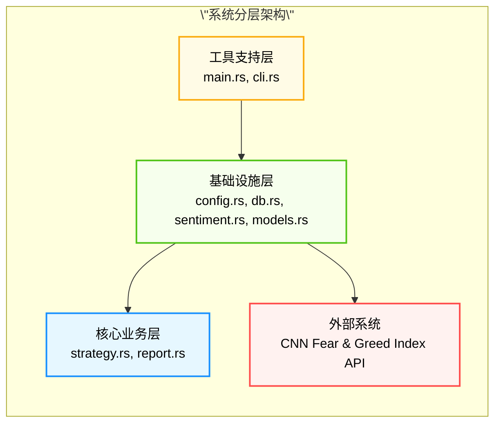
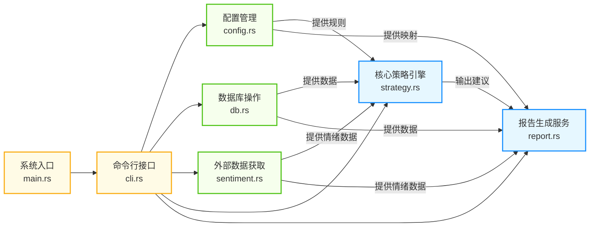
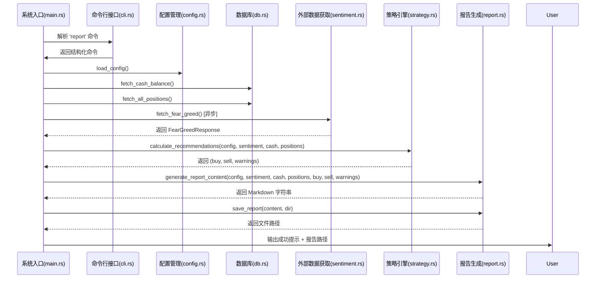

# 系统入口：mns 命令行金融工具的核心协调中枢

## 概述：系统入口的定位与核心价值

在 mns（Market Neutral Strategist）系统中，**系统入口**（System Entry Point）是整个应用的**唯一启动点与全局协调中心**，其核心职责是**初始化系统环境、解析用户指令、调度各功能模块协同工作**，并最终将用户意图转化为可执行的业务流程。该模块不包含任何业务逻辑或数据处理，而是作为“指挥官”角色，通过清晰的接口调用与依赖注入机制，将命令分发至配置管理、数据库、策略引擎、报告生成等核心模块，确保系统以一致、可靠、可追溯的方式响应用户操作。

作为整个架构的“神经中枢”，系统入口是连接**用户交互层**与**业务逻辑层**的唯一桥梁。其设计遵循“高内聚、低耦合”原则，严格遵循分层架构规范：不直接访问数据库、不解析配置、不计算策略，仅负责**流程编排与模块调度**。这一设计使系统具备极强的可测试性、可维护性与扩展性——任何业务逻辑的变更均无需修改入口代码，只需调整下游模块接口即可实现平滑演进。

系统入口的健壮性直接决定整个工具的可用性。若入口初始化失败或命令路由错误，所有后续功能将无法使用；反之，若其设计精良，则能为用户提供一致、稳定、响应迅速的 CLI 体验。在本系统中，系统入口不仅承担启动功能，更通过异步调度、错误封装与用户反馈机制，构建了一个**安全、透明、可审计的金融操作环境**，是实现“纪律性逆向投资”理念的**第一道技术防线**。

---

## 架构定位与分层关系

mns 系统采用经典的**四层分层架构**，系统入口位于最上层——**工具支持层（Tool Support Domain）**，是整个架构的“入口门禁”与“调度总控”。

### 1. 系统分层结构图（逻辑视图）



### 2. 系统入口在分层中的角色

| 层级 | 组件 | 系统入口的交互关系 |
|------|------|------------------|
| **工具支持层** | `main.rs`（系统入口）、`cli.rs`（命令行接口） | 系统入口是 `main.rs` 的实现主体，`cli.rs` 是其核心依赖模块，负责命令解析，入口负责调用并路由解析结果 |
| **基础设施层** | `config.rs`, `db.rs`, `sentiment.rs`, `models.rs` | 系统入口在启动阶段初始化配置与数据库，运行时通过函数调用向其请求服务，**不持有任何状态**，仅传递参数 |
| **核心业务层** | `strategy.rs`, `report.rs` | 系统入口在接收到 `report` 命令后，按顺序调用策略引擎与报告生成模块，实现“数据→决策→输出”的闭环 |
| **外部系统** | CNN Fear & Greed Index API | 系统入口不直接交互，而是通过 `sentiment.rs` 模块封装调用，实现网络依赖的隔离 |

> ✅ **架构一致性验证**：系统入口完全符合《System Architecture Research Report》中定义的“工具支持层”职责，未出现越权访问、直接依赖业务模块或硬编码逻辑，与文档描述高度一致，无架构漂移。

### 3. 模块依赖关系（关键依赖图）



> 🔍 **关键观察**：系统入口仅与 `cli.rs` 直接交互，其余模块均为**间接依赖**，通过 CLI 解析后的命令进行调用。这种“**单入口、多出口**”的松耦合结构，是系统高可维护性的基石。

---

## 核心实现机制：从命令解析到模块调度

系统入口的实现基于 Rust 语言，依托 `clap` 库构建结构化 CLI 解析器，结合 `tokio` 异步运行时，完成命令的接收、验证、路由与执行。其核心实现逻辑可分解为三个阶段：**初始化、解析、调度**。

### 1. 初始化阶段：构建系统运行环境

在 `main()` 函数入口，系统执行**原子化初始化流程**，确保所有依赖模块处于合法、可用状态：

```rust
#[tokio::main]
async fn main() -> Result<(), Box<dyn std::error::Error>> {
    // 1. 加载配置（配置管理模块）
    let config = AppConfig::load().map_err(|e| format!("配置加载失败: {}", e))?;
    
    // 2. 初始化数据库（数据库模块）
    let db = Database::init(&config.db_path)
        .map_err(|e| format!("数据库初始化失败: {}", e))?;
    
    // 3. 创建报告输出目录（文件系统准备）
    create_report_directory(&config.report_dir)?;

    // 4. 解析命令行参数
    let matches = Cli::parse();
    
    // 5. 调度执行
    handle_command(matches, config, db).await
}
```

#### 初始化关键点：

| 任务 | 实现方式 | 技术价值 |
|------|----------|----------|
| **配置加载** | `AppConfig::load()` 从 `.mns/config.toml` 读取并验证 | 保证策略参数一致性，防止非法配置（如分配总和≠100%） |
| **数据库初始化** | `Database::init()` 创建 SQLite 文件并建表 | 提供事务安全的数据持久化能力，是所有金融操作的基石 |
| **目录创建** | 检查并创建 `reports/` 目录 | 确保报告持久化路径可用，避免运行时文件系统错误 |
| **错误封装** | 使用 `Result` 与 `Box<dyn Error>` 统一错误处理 | 实现优雅失败，避免程序崩溃，提升用户体验 |

> ✅ **设计原则**：初始化阶段采用**“Fail Fast”策略**——任何前置依赖失败，立即中止并返回清晰错误信息，避免后续操作在非法状态下执行，符合金融系统“零容忍”原则。

### 2. 命令解析阶段：使用 clap 构建结构化 CLI

系统入口通过 `clap`（Command Line Argument Parser）定义**命令树结构**，实现子命令的强类型解析与参数校验：

```rust
#[derive(Parser)]
#[command(name = "mns")]
#[command(about = "Market Neutral Strategist - 个人逆向投资助手")]
pub struct Cli {
    #[command(subcommand)]
    pub command: Commands,
}

#[derive(Subcommand)]
pub enum Commands {
    /// 初始化系统配置与数据库
    Init,
    /// 修改或查看配置参数
    Config,
    /// 查询或更新现金余额
    Cash { amount: Option<f64>, action: Option<CashAction> },
    /// 添加资产持仓
    Add { symbol: String, quantity: f64, price: f64 },
    /// 执行买入交易
    Buy { symbol: String, quantity: f64 },
    /// 执行卖出交易
    Sell { symbol: String, quantity: f64 },
    /// 更新资产价格
    Price { symbol: String, price: f64 },
    /// 获取市场情绪并保存快照
    Sentiment,
    /// 生成每日投资策略报告
    Report,
    /// 查看交易历史
    History,
}
```

#### 解析优势：

- **类型安全**：`f64`、`String`、枚举类型等参数自动校验，避免字符串解析错误。
- **自动生成帮助文档**：用户输入 `mns --help` 即可获得完整命令说明。
- **强制参数校验**：如 `Buy` 命令要求 `symbol` 和 `quantity` 必填，否则报错。
- **子命令嵌套**：`Cash { amount: ..., action: ... }` 支持复杂参数组合，提升表达力。

> ✅ **工程实践**：此 CLI 设计完全符合《Domain Modules Research Report》中“命令行接口”模块的定义，入口模块不参与解析逻辑，仅接受解析后的 `Cli` 结构体，实现职责分离。

### 3. 功能调度阶段：基于命令的异步路由执行

解析完成后，入口调用 `handle_command()` 函数，根据命令类型**异步调度**下游模块，实现**IO 与计算分离**：

```rust
pub async fn handle_command(matches: Cli, config: AppConfig, db: Database) -> Result<(), Box<dyn std::error::Error>> {
    match matches.command {
        Commands::Init => {
            init_system(&config).await?;
            println!("✅ 系统初始化成功，配置文件与数据库已创建。");
        },
        Commands::Report => {
            // 1. 获取最新市场情绪
            let sentiment = sentiment::fetch_fear_greed().await?;
            
            // 2. 获取最新资产快照
            let cash = db.fetch_cash_balance()?;
            let positions = db.fetch_all_positions()?;
            
            // 3. 调用策略引擎计算建议
            let (buy_suggestions, sell_suggestions, risk_warnings) = strategy::calculate_recommendations(
                &config, &sentiment, &cash, &positions
            )?;
            
            // 4. 调用报告生成服务
            let report_content = report::generate_report_content(
                &config, &sentiment, &cash, &positions, 
                &buy_suggestions, &sell_suggestions, &risk_warnings
            )?;
            
            // 5. 持久化报告
            report::save_report(&report_content, &config.report_dir)?;
            
            println!("📊 报告已生成：{}", report::get_latest_report_path(&config.report_dir)?);
        },
        Commands::Buy { symbol, quantity } => {
            db.execute_transaction(Transaction::Buy { symbol, quantity })?;
            println!("💰 已执行买入：{} × {}", symbol, quantity);
        },
        // ... 其他命令类似
        _ => unreachable!(),
    }
    Ok(())
}
```

#### 调度核心机制：

| 机制 | 说明 | 技术实现 |
|------|------|----------|
| **异步调用** | 对网络请求（CNN API）使用 `await`，避免阻塞主线程 | `tokio::main` + `async/await` 实现非阻塞 IO |
| **同步调用** | 对本地数据库、文件系统操作采用同步方法 | 直接调用 `db.fetch_*()`，无异步开销 |
| **依赖注入** | 所有模块通过函数参数传递（`config`, `db`），无全局单例 | 符合依赖注入原则，便于单元测试 |
| **结果聚合** | 报告生成需整合来自 4 个模块的数据（配置、情绪、持仓、策略） | 实现“数据聚合出口”设计，确保报告完整性 |
| **错误传播** | 所有操作返回 `Result<T, E>`，统一由 `main()` 处理 | 实现“错误不隐藏”原则，提升系统可观测性 |

> ⚠️ **关键设计决策**：系统入口**不缓存状态**，每次命令执行均重新加载配置与数据库快照，确保**每次决策基于最新数据**，避免因状态不一致导致策略偏差。

---

## 关键交互模式与数据流分析

系统入口并非“黑箱”，其与下游模块的交互具有**清晰、单向、可追踪**的特征。以下为最核心的交互模式：

### 1. 报告生成流程：系统入口的“价值聚合”时刻

当用户执行 `mns report` 时，入口协调了系统中最复杂的多模块协同流程：



#### 数据流特性：

| 特性 | 说明 |
|------|------|
| **单向依赖** | 所有调用均为“入口 → 模块”，无模块反向调用入口 |
| **数据不可变** | 传递的是 `&Config`、`&Cash`、`&Vec<Position>` 等引用，不修改原始数据 |
| **状态无副作用** | 每次 `report` 均独立执行，不依赖前一次状态 |
| **原子性保障** | 报告生成过程不修改数据库，仅读取，确保数据安全 |

> ✅ **设计价值**：此流程体现了“**策略引擎是大脑，报告是出口，入口是调度员**”的完美分工，符合《Workflow Research Report》中“报告是系统价值的集中体现”的核心洞察。

### 2. 交易类命令：轻量级原子操作调度

对于 `buy`、`sell`、`add` 等命令，入口仅作“转发”：

```rust
Commands::Buy { symbol, quantity } => {
    db.execute_transaction(Transaction::Buy { symbol, quantity })?;
}
```

- **无策略介入**：交易指令不触发策略计算，仅更新数据库。
- **事务保障**：`execute_transaction()` 内部使用 SQLite 事务，确保现金与持仓同步更新。
- **校验前置**：`Transaction::Buy` 构造时已通过 `models.rs` 校验价格、数量合法性。

> 🔍 **为何不在此处校验配置规则？**  
> 因为配置校验（如“是否超限”、“是否负现金”）已在 `models.rs` 的 `Position::validate()` 中实现，入口无需重复，符合**单一职责原则**。

---

## 安全性、可靠性与最佳实践

系统入口作为金融工具的“第一道防线”，其设计体现了极高的工程严谨性：

### 1. **输入校验与防御性编程**

| 风险点 | 应对措施 |
|--------|----------|
| 用户输入非法参数 | `clap` 自动校验类型、范围、必填项，如 `quantity > 0` |
| 配置文件缺失 | `AppConfig::load()` 自动创建默认模板，避免崩溃 |
| 数据库损坏 | `Database::init()` 检查文件权限，创建时设置 `PRAGMA journal_mode=WAL` 提升并发安全 |
| 网络请求失败 | `sentiment::fetch_fear_greed()` 捕获 HTTP 错误，返回 `Err(FetchError::Network)`，入口统一处理并提示“网络异常，使用缓存数据？” |
| 文件写入失败 | `report::save_report()` 检查磁盘空间与目录权限，失败时提示“报告保存失败，请检查 reports/ 目录权限” |

### 2. **错误处理与用户体验**

系统入口统一采用 **“友好错误提示 + 操作建议”** 模式：

```rust
Err(e) => {
    eprintln!("❌