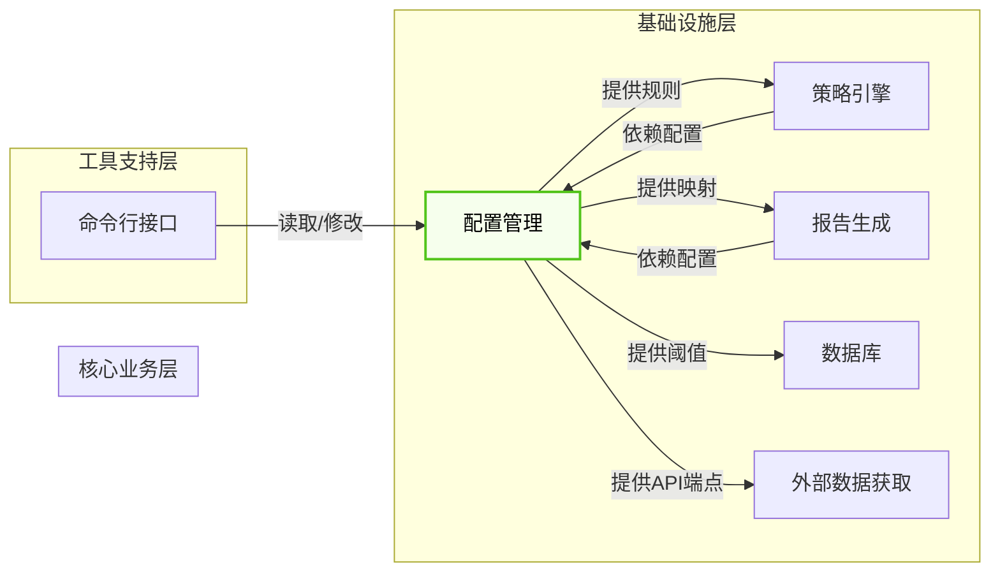
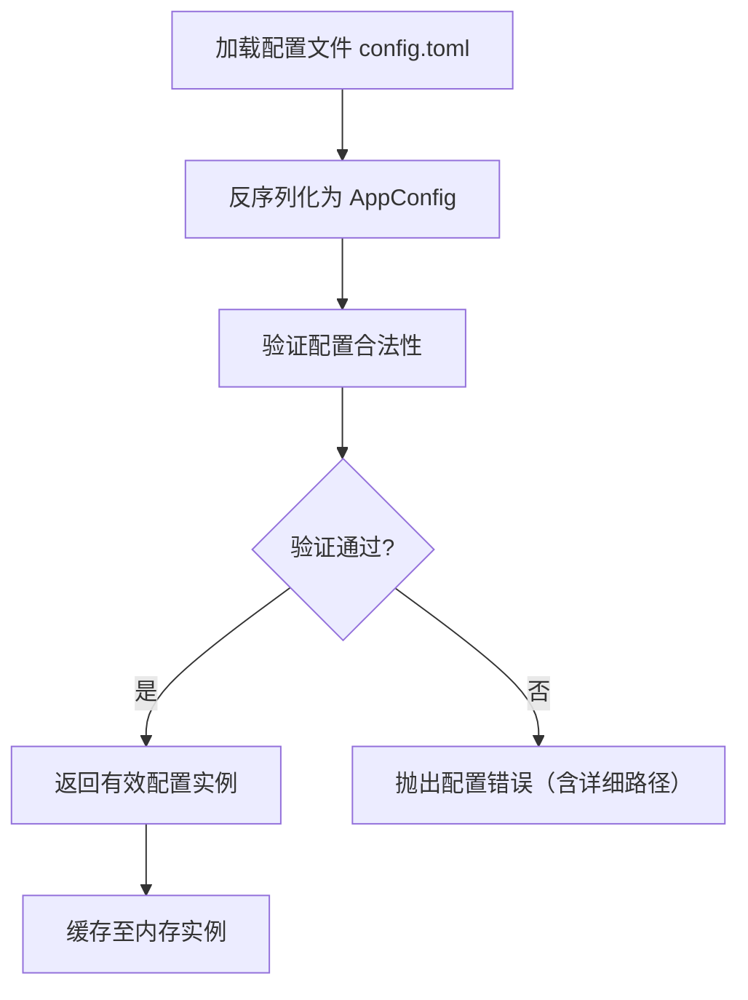

# 配置管理模块技术文档

> **文档版本**：1.0  
> **生成时间**：2026-04-19 15:36:16 (UTC)  
> **系统名称**：mns（Market Neutral Strategist）  
> **核心定位**：个人逆向投资自动化决策系统的统一配置中枢与策略决策引擎  

---

## 1. 概述

**配置管理模块**（Configuration Management Module）是 mns 系统的核心基础设施组件，承担着**系统参数的唯一权威源、动态策略规则的载体、运行时配置的访问入口**三大核心职责。该模块以单一 TOML 配置文件 `config.toml` 为唯一配置源，通过结构化 Rust 类型 `AppConfig` 实现配置的声明式定义、自动化反序列化、业务规则验证与运行时动态访问，将原本静态的参数配置升级为**可感知市场情绪、动态驱动交易策略的智能决策引擎**，真正实现“**配置即策略**”（Configuration as Strategy）的架构理念。

在 mns 系统四层架构中，配置管理模块属于**基础设施层**（Infrastructure Domain），被核心业务层（策略引擎、报告生成）与命令行接口模块深度依赖。其设计遵循高内聚、低耦合、强类型、可验证、可热更新（运行时）原则，是保障系统稳定性、可复现性与策略一致性的基石。

---

## 2. 架构设计

### 2.1 模块职责边界

| 职责类别 | 说明 |
|----------|------|
| **配置加载** | 从本地 `config.toml` 文件读取并反序列化为强类型结构体 `AppConfig` |
| **配置验证** | 强制校验业务规则（如资产总和=100%、阈值范围合法、API端点有效） |
| **配置持久化** | 支持运行时修改后将变更写回 `config.toml`，确保配置变更持久化 |
| **运行时访问** | 提供点路径（dot-notation）动态查询任意配置项（`get_value`） |
| **运行时修改** | 支持运行时动态修改配置项（`set_value`），自动类型解析与校验 |
| **策略映射** | 基于市场情绪评分（CNN Fear & Greed Index）动态计算买入/卖出比例与情绪区域 |
| **服务供给** | 为策略引擎、报告生成、数据库等模块提供统一、一致、可信赖的配置数据 |

> ✅ **关键设计原则**：  
> - **单一配置源**：杜绝多源配置，避免“配置漂移”  
> - **配置即代码**：TOML 格式可编辑、可版本控制、可审计  
> - **验证先行**：任何配置变更必须通过业务规则校验方可生效  
> - **动态耦合**：配置不仅是参数，更是策略逻辑的输入变量  

### 2.2 架构交互关系

根据系统架构图与模块依赖关系，配置管理模块在系统中扮演**核心枢纽**角色：



- **策略引擎**：依赖配置中的 `buy_ratio.fear`, `sell_ratio.greed`, `thresholds.fear` 等字段计算买卖建议。
- **报告生成**：依赖配置中的分配比例、情绪映射规则、阈值生成中文摘要。
- **数据库**：依赖配置中的 `min_holding_days` 等规则校验交易有效性。
- **外部数据获取**：依赖配置中的 `api_endpoint` 字段定位 CNN API 地址。
- **命令行接口**：提供 `config set`、`config get`、`init` 等子命令，直接操作本模块。

> ⚠️ **重要约束**：**所有模块不得直接读取或解析 `config.toml` 文件**，必须通过 `AppConfig` 实例访问，确保配置访问的一致性与可控性。

---

## 3. 技术实现详解

### 3.1 核心数据结构（Rust 结构体）

配置管理模块采用 **Rust 强类型系统 + serde 反序列化** 实现结构化配置管理。核心结构体 `AppConfig` 采用嵌套结构，清晰分层：

```rust
#[derive(Serialize, Deserialize, Debug)]
pub struct AppConfig {
    pub allocation: Allocation,
    pub thresholds: Thresholds,
    pub buy_ratio: BuyRatio,
    pub sell_ratio: SellRatio,
    pub api: ApiConfig,
    pub general: GeneralConfig,
}

#[derive(Serialize, Deserialize, Debug)]
pub struct Allocation {
    pub us_stocks: f64,      // 美股配置比例
    pub cn_stocks: f64,      // 中股配置比例
    pub counter_cycle: f64,  // 反周期资产比例
    pub cash: f64,           // 现金保留比例
}

#[derive(Serialize, Deserialize, Debug)]
pub struct Thresholds {
    pub fear: f64,           // 恐惧阈值（低于此值为“恐惧”区）
    pub greed: f64,          // 贪婪阈值（高于此值为“贪婪”区）
    pub min_holding_days: u32, // 最小持有天数（卖出前提）
    pub max_loss_threshold: f64, // 最大亏损阈值（触发风险预警）
}

#[derive(Serialize, Deserialize, Debug)]
pub struct BuyRatio {
    pub fear: f64,           // 恐惧时买入比例（%）
    pub neutral: f64,        // 中性时买入比例（%）
    pub greed: f64,          // 贪婪时买入比例（%）
}

#[derive(Serialize, Deserialize, Debug)]
pub struct SellRatio {
    pub fear: f64,           // 恐惧时卖出比例（%）
    pub neutral: f64,        // 中性时卖出比例（%）
    pub greed: f64,          // 贪婪时卖出比例（%）
}

#[derive(Serialize, Deserialize, Debug)]
pub struct ApiConfig {
    pub fear_greed_endpoint: String, // CNN API URL
}

#[derive(Serialize, Deserialize, Debug)]
pub struct GeneralConfig {
    pub report_dir: String,  // 报告保存目录
    pub db_path: String,     // 数据库路径
}
```

> ✅ **设计优势**：
> - **类型安全**：编译期校验字段是否存在、类型是否匹配
> - **零成本抽象**：Rust 的零开销抽象确保运行时无反射开销
> - **可序列化**：支持 `serde_json` / `serde_toml` 无缝持久化
> - **可测试**：结构体可独立实例化，便于单元测试

### 3.2 配置加载与验证流程

#### 流程图（Mermaid）



#### 实现逻辑

```rust
pub fn load_config(config_path: &Path) -> Result<AppConfig, ConfigError> {
    let config_str = fs::read_to_string(config_path)
        .map_err(|e| ConfigError::FileReadFailed(config_path.to_path_buf(), e))?;

    let mut config: AppConfig = toml::from_str(&config_str)
        .map_err(|e| ConfigError::DeserializeFailed(config_path.to_path_buf(), e))?;

    config.validate()?; // 关键：加载后立即验证

    Ok(config)
}
```

#### 验证规则（`validate()` 方法）

| 校验项 | 规则 | 错误类型 |
|--------|------|----------|
| 资产分配总和 | `allocation.us_stocks + cn_stocks + counter_cycle + cash == 100.0` | `AllocationSumMismatch` |
| 恐惧阈值 | `thresholds.fear >= 0.0 && thresholds.fear <= 100.0` | `InvalidThreshold` |
| 贪婪阈值 | `thresholds.greed >= thresholds.fear && thresholds.greed <= 100.0` | `InvalidThreshold` |
| 买入比例 | 所有 `buy_ratio.*` ∈ [0.0, 100.0] | `InvalidRatio` |
| 卖出比例 | 所有 `sell_ratio.*` ∈ [0.0, 100.0] | `InvalidRatio` |
| 最小持有天数 | `thresholds.min_holding_days >= 0` | `InvalidMinHoldingDays` |
| API端点 | `api.fear_greed_endpoint` 为有效 HTTP(S) URL | `InvalidApiEndpoint` |
| 数据库路径 | `general.db_path` 所在目录可写 | `DatabasePathUnwritable` |

> ✅ **验证策略**：**失败即中断**，错误信息包含**具体字段路径**（如 `allocation.us_stocks`），便于用户快速定位问题。

### 3.3 运行时动态访问与修改（核心能力）

#### 动态查询：`get_value(key: &str) -> Option<String>`

支持通过 **点路径（dot-notation）** 查询任意嵌套字段：

```rust
// 示例调用
config.get_value("allocation.us_stocks")  // 返回 Some("30.0")
config.get_value("thresholds.fear")       // 返回 Some("45.0")
config.get_value("buy_ratio.greed")       // 返回 Some("10.0")
config.get_value("api.fear_greed_endpoint") // 返回 Some("https://api.alphavantage.co/...")
config.get_value("nonexistent.field")     // 返回 None
```

**实现原理**：
- 使用 `serde_json::Value` 动态解析 `AppConfig` 序列化后的 JSON
- 按 `.` 分割路径，递归遍历嵌套结构
- 类型自动转换为 `String`，便于 CLI 层统一处理

```rust
pub fn get_value(&self, key: &str) -> Option<String> {
    let json_val = serde_json::to_value(self).ok()?;
    let path_parts: Vec<&str> = key.split('.').collect();
    let mut current = &json_val;
    for part in path_parts {
        current = current.get(part)?;
    }
    Some(current.to_string())
}
```

#### 动态修改：`set_value(key: &str, value: &str) -> Result<(), ConfigError>`

支持运行时修改任意字段，并自动类型解析与验证：

```rust
// 示例调用
config.set_value("allocation.us_stocks", "40")?;   // 修改美股比例为40%
config.set_value("thresholds.fear", "40.5")?;      // 修改恐惧阈值
config.set_value("buy_ratio.greed", "5.0")?;       // 修改贪婪时买入比例
```

**实现逻辑**：
1. 解析 `key` 路径，定位目标字段
2. 将 `value` 字符串根据目标字段类型（`f64`, `u32`, `String`）进行解析
3. **临时更新**内存中的 `AppConfig` 实例
4. **调用 `validate()`**：确保修改后仍满足所有业务规则
5. 若验证通过，**持久化写回** `config.toml`
6. 若验证失败，**回滚**变更并返回错误

```rust
pub fn set_value(&mut self, key: &str, value: &str) -> Result<(), ConfigError> {
    let mut temp_config = self.clone(); // 深拷贝临时实例
    self._set_value_internal(&mut temp_config, key, value)?; // 更新临时实例
    temp_config.validate()?; // 验证
    *self = temp_config; // 应用变更
    self.save()?; // 持久化
    Ok(())
}
```

> ✅ **关键设计**：**“先验证，后持久化”**，确保系统始终处于合法状态，避免因错误配置导致系统崩溃。

### 3.4 情绪-策略映射（核心业务逻辑集成）

配置管理模块不仅是参数容器，更是**策略决策的智能引擎**，内置三大核心业务方法：

#### 1. `sentiment_zone(score: f64) -> SentimentZone`

根据 CNN 恐惧与贪婪指数（0–100）映射情绪区域：

```rust
#[derive(Debug, Clone, Copy, PartialEq)]
pub enum SentimentZone {
    Fear,      // ≤ thresholds.fear
    Neutral,   // > fear && < greed
    Greed,     // ≥ thresholds.greed
}

pub fn sentiment_zone(&self, score: f64) -> SentimentZone {
    if score <= self.thresholds.fear {
        SentimentZone::Fear
    } else if score >= self.thresholds.greed {
        SentimentZone::Greed
    } else {
        SentimentZone::Neutral
    }
}
```

> 📌 **示例**：若 `thresholds.fear = 45.0`, `thresholds.greed = 70.0`，则：
> - `score=30` → `Fear`
> - `score=60` → `Neutral`
> - `score=80` → `Greed`

#### 2. `buy_ratio_for(score: f64) -> f64`

根据情绪区域动态返回买入比例：

```rust
pub fn buy_ratio_for(&self, score: f64) -> f64 {
    match self.sentiment_zone(score) {
        SentimentZone::Fear => self.buy_ratio.fear,
        SentimentZone::Neutral => self.buy_ratio.neutral,
        SentimentZone::Greed => self.buy_ratio.greed,
    }
}
```

> 💡 **逆向投资逻辑体现**：情绪越恐惧（低分），买入比例越高（如 Fear=40%），越贪婪（高分），买入比例越低（如 Greed=5%）。

#### 3. `sell_ratio_for(score: f64, annualized: f64) -> f64`

**复合决策逻辑**：结合市场情绪与资产年化收益率，动态调整卖出倾向：

```rust
pub fn sell_ratio_for(&self, score: f64, annualized: f64) -> f64 {
    let base_ratio = match self.sentiment_zone(score) {
        SentimentZone::Fear => self.sell_ratio.fear,
        SentimentZone::Neutral => self.sell_ratio.neutral,
        SentimentZone::Greed => self.sell_ratio.greed,
    };

    // 高收益资产（年化>15%）增加卖出倾向
    let yield_multiplier = if annualized > 15.0 {
        1.5
    } else if annualized > 10.0 {
        1.2
    } else {
        1.0
    };

    (base_ratio * yield_multiplier).min(100.0) // 上限100%
}
```

> 📌 **策略价值**：  
> - 情绪贪婪（高分）→ 倾向卖出  
> - 收益高（>15%）→ 进一步提高卖出比例  
> - 实现“**利润锁定 + 反向操作**”双重策略

---

## 4. 交互接口（对外暴露 API）

| 接口方法 | 参数 | 返回值 | 用途 | 是否影响状态 |
|----------|------|--------|------|--------------|
| `load_config(path: &Path)` | 配置文件路径 | `Result<AppConfig, ConfigError>` | 初始化配置实例 | ✅ 仅读取 |
| `get_value(key: &str)` | dot-path 字符串（如 `allocation.us_stocks`） | `Option<String>` | 查询配置值 | ❌ 只读 |
| `set_value(key: &str, value: &str)` | key, value 字符串 | `Result<(), ConfigError>` | 修改配置项 | ✅ 修改内存+持久化 |
| `save()` | 无 | `Result<(), std::io::Error>` | 手动持久化当前配置 | ✅ 写入文件 |
| `sentiment_zone(score: f64)` | 恐惧贪婪指数（0–100） | `SentimentZone` | 获取当前情绪区域 | ❌ 纯计算 |
| `buy_ratio_for(score: f64)` | 恐惧贪婪指数 | `f64` | 获取推荐买入比例（%） | ❌ 纯计算 |
| `sell_ratio_for(score: f64, annualized: f64)` | 恐惧贪婪指数 + 年化收益率 | `f64` | 获取推荐卖出比例（%） | ❌ 纯计算 |

> ✅ **所有方法均通过 `AppConfig` 实例调用**，保证接口一致性与封装性。

---

## 5. 典型使用场景与工作流集成

### 5.1 场景一：每日报告生成流程（核心价值路径）

```mermaid
sequenceDiagram
    participant CLI
    participant Config
    participant Strategy
    participant Report

    CLI->>Config: load_config("config.toml")
    Config-->>CLI: AppConfig实例
    CLI->>DB: fetch_cash_balance(), fetch_positions()
    CLI->>Sentiment: fetch_fear_greed() → 42.0
    CLI->>Strategy: calculate_buy